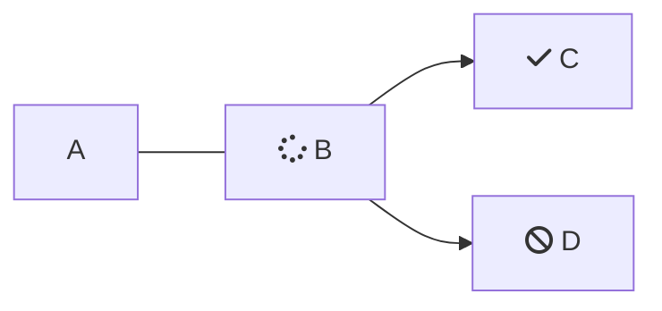

# GridLAB-D™

Is trademarked. Refer to it always as GridLAB-D™. Do not abbreviate to GLD.

# Clear, Concise, and Precise.

Get to the point quickly. Short sentences are just fine. Break complicated, multi-line sentences or instructions into digestible chunks. Talk like a person and avoid jargon where possible; if not, define. Avoid instruction by implication, instead, use precise language to describe what falls into the scope of a instruction.

> 👀 You may have noticed the use of the Oxford comma in that last header. In this documentation, and in the official [PNNL style guide](https://confluence.pnnl.gov/confluence/pages/viewpage.action?spaceKey=COMMSTEAM\&title=PNNL+Style+Guide), *we use the Oxford comma.*

## Revise "weak" writing

I'm reproducing this example from the Microsoft Style Guide directly.

**Replace this**: *You can access Office apps across your devices, and you get online file storage and sharing.*

**With this**: *Store files online, access them from all your devices, and share them with coworkers.*

## Voice

When referring to the user, use "**you**". No need to use gender-specific singular pronouns either. If you need to refer to a group of users, use "**they**".

**Example**: *To get started, first you'll need to install GridLAB-D™.*

A casual voice is welcoming and less intimidating, so use contractions and write like you'd actually explain things to a person. Also, write primarily using the present tense.

## Chunking

We want users to be empowered by our documentation. To do this, our documentation needs to be approachable and digestible. A key piece to that is visually chunking content into manageable sections. For example, this:

*"Lorem ipsum dolor sit amet, consectetur adipiscing elit, sed do eiusmod tempor incididunt ut labore et dolore magna aliqua. Ut enim ad minim veniam, quis nostrud exercitation ullamco laboris nisi ut aliquip ex ea commodo consequat. Duis aute irure dolor in reprehenderit in voluptate velit esse cillum dolore eu fugiat nulla pariatur. Excepteur sint occaecat cupidatat non proident, sunt in culpa qui officia deserunt mollit anim id est laborum. Lorem ipsum dolor sit amet, consectetur adipiscing elit, sed do eiusmod tempor incididunt ut labore et dolore magna aliqua. Ut enim ad minim veniam, quis nostrud exercitation ullamco laboris nisi ut aliquip ex ea commodo consequat. Duis aute irure dolor in reprehenderit in voluptate velit esse cillum dolore eu fugiat nulla pariatur. Excepteur sint occaecat cupidatat non proident, sunt in culpa qui officia deserunt mollit anim id est laborum. Lorem ipsum dolor sit amet, consectetur adipiscing elit, sed do eiusmod tempor incididunt ut labore et dolore magna aliqua. Ut enim ad minim veniam, quis nostrud exercitation ullamco laboris nisi ut aliquip ex ea commodo consequat. Duis aute irure dolor in reprehenderit in voluptate velit esse cillum dolore eu fugiat nulla pariatur. Excepteur sint occaecat cupidatat non proident, sunt in culpa qui officia deserunt mollit anim id est laborum. Lorem ipsum dolor sit amet, consectetur adipiscing elit, sed do eiusmod tempor incididunt ut labore et dolore magna aliqua. Ut enim ad minim veniam, quis nostrud exercitation ullamco laboris nisi ut aliquip ex ea commodo consequat. Duis aute irure dolor in reprehenderit in voluptate velit esse cillum dolore eu fugiat nulla pariatur. Excepteur sint occaecat cupidatat non proident, sunt in culpa qui officia deserunt mollit anim id est laborum."*

Looks overwhelming. Not the least of which because it's bad Latin. Instead, let's chunk this content. Consider adding sub-headings to allow readers to quickly navigate or scan the content. Graphics, equations, and code snippets are also incredibly valuable tools to improve comprehension. Let's try again:

### *Lorem ipsum dolor sit amet.*

*"Consectetur adipiscing elit, sed do eiusmod tempor incididunt ut labore et dolore magna aliqua. Ut enim ad minim veniam, quis nostrud exercitation ullamco laboris nisi ut aliquip ex ea commodo consequat. Duis aute irure dolor in reprehenderit in voluptate velit esse cillum dolore eu fugiat nulla pariatur."*


*"Excepteur sint occaecat cupidatat non proident, sunt in culpa qui officia deserunt mollit anim id est laborum. Lorem ipsum dolor sit amet, consectetur adipiscing elit, sed do eiusmod tempor incididunt ut labore et dolore magna aliqua. Ut enim ad minim veniam, quis nostrud exercitation ullamco laboris nisi ut aliquip ex ea commodo consequat. Duis aute irure dolor in reprehenderit in voluptate velit esse cillum dolore eu fugiat nulla pariatur. Excepteur sint occaecat cupidatat non proident, sunt in culpa qui officia deserunt mollit anim id est laborum. Lorem ipsum dolor sit amet, consectetur adipiscing elit, sed do eiusmod tempor incididunt ut labore et dolore magna aliqua."*

### *Ut enim ad minim veniam.*

*"Quis nostrud exercitation ullamco laboris nisi ut aliquip ex ea commodo consequat. Duis aute irure dolor in reprehenderit in voluptate velit esse cillum dolore eu fugiat nulla pariatur. Excepteur sint occaecat cupidatat non proident, sunt in culpa qui officia deserunt mollit anim id est laborum."*

```
#Let's add an example
print("Hello, world!)
```

*"Lorem ipsum dolor sit amet, consectetur adipiscing elit, sed do eiusmod tempor incididunt ut labore et dolore magna aliqua. Ut enim ad minim veniam, quis nostrud exercitation ullamco laboris nisi ut aliquip ex ea commodo consequat. Duis aute irure dolor in reprehenderit in voluptate velit esse cillum dolore eu fugiat nulla pariatur. Excepteur sint occaecat cupidatat non proident, sunt in culpa qui officia deserunt mollit anim id est laborum."*

Much better!

## Accessibility

There are some specific accessibility tips to note, below. But in general, remember who we are writing for. If they're reading this documentation, they're not an expert. They're learning.  Just as you once learned these things. The reader may not even be a user yet, they might just want to know what GridLAB-D™is in order to decide whether they should learn it. They might be a user, but this is their first experience performing distribution system modeling. They might have no coding experience at all. Keep the audience in mind while you write, and remember that we are here to teach. Other notes on accessibility:

**Spell out words** like and, plus, and about. Screen readers can misread or skip text that uses special characters like the plus sign (+) and tilde (\~). 

**Don’t force line breaks** (also known as hard returns) within sentences and paragraphs. They may not work well in resized windows or with enlarged text.

**Don’t use directional terms as the only clue to location**. Left, right, up, down, above, and below aren’t very useful for people who use screen-reading software. Instead, use specific language that conveys context, such as “the first item in the following list” or “on the toolbar.”

**All images require a descriptive caption**. Images are extremely powerful to help convey information, but an image without an explanation only creates confusion. Always provide a caption for an in-line image, and be as descriptive and specific as possible about what is pictured.

For example, when you add an image, add text for both the "Alt text" (this should be very brief) and the caption. Like so:

<Image align="center" alt="A diagram of a populated feeder model" border={false} caption="A diagram of the populated Copperplate Feeder model, composed of commercial buildings and distributed energy resources (DER) on a reduced feeder." src="https://files.readme.io/3a0e8652e725fcc533b615ce01cab5fe51346a8f08f8f301e2abf7d45b498146-Copperplate-Populated.png" />

# Avoid Biased Language

To maintain a welcoming learning environment, avoid biased language in writing. These seemingly small changes ensure that everyone has a seat at the table. Additionally, use of some of the more dated, biased terms that have largely left the zeitgeist can be jarring and pull people out of their learning immersion.

The most relevant example to this work is that GridLAB-D™uses **parent/child** relationships to describe object hierarchy. We use these terms specifically and consistently throughout all of GridLAB-D™, and not the more dated version historically used in electric work ([read more](https://www.acs.org/about/inclusion/inclusivity-style-guide/specific-subjects-of-study-or-work.html#information-technology-and-software-development)).

* Another easy switch is to use "**placeholder**" instead of "*dummy*" values.
* "*Sanity check*" is one that is still commonly used. "**Quick check**" or "**confidence check**" can be used in its place.
* **Address** a problem or issue rather than *combat* it.

The American Chemistry Society published a thorough Inclusivity Style Guide. If you are in doubt while writing, or something doesn't feel right, it's probably covered [here](https://www.acs.org/about/inclusion/inclusivity-style-guide/general-guidelines.html#involve-diverse-people-in-the-creative-process). Note that this is a bit of a rabbit hole, so try not to get lost.

## PNNL Style Requirements

The PNNL Style Guide is available [here](https://confluence.pnnl.gov/confluence/pages/viewpage.action?spaceKey=COMMSTEAM\&title=PNNL+Style+Guide). For our use case, little of this will be relevant. However there are a few things that may come up:

* **Resilience**, not resiliency.
* **Affect** or **Effect** in place of *impact*.
* **Address challenges** in place of *solve challenges*.

# Quick Markdown Reference

*Italic* or *Italic*

**Bold** or **Bold**

"# Heading 1"

"## Heading 2"

[Link](http://a.com)


> Blockquote

* List
* List
* List

or

* List
* List
* List

or

1. one
2. two
3. three

Horizontal rule:

***

or

***

`Inline code` with backticks

Code blocks and other useful features are added using the " / "

```
import numpy as np

np.random()
```

# Using MDX

Click the "edit" view above to see how each feature is implemented.

## Example with hidden answer (Accordian)

Who can you reach out to with a question about GridLAB-D™?

<Accordion title="Answer" icon="fa-info-circle">
  If you have questions or need support please email the GridLAB-D™ team at [gridlabd@pnnl.gov](mailto:gridlabd@pnnl.gov).
</Accordion>

## Reusable content.

Use " / " and then select *Reuse Content* and select *Contact* to insert the below text.

<Contact />

## Cards

<Cards columns={4}>
  <Card title="Home" href="https://gridlab-d.readme.io/#/" icon="fa-home" target="_blank">
    GridLAB-D™: A Unique Tool to Design the Smart Grid
  </Card>

  <Card title="Getting Started" href="https://gridlab-d.readme.io/docs/getting-started#/" icon="fa-user">
    Whether you're new to GridLAB-D™ or a seasoned developer, you're in the right place.
  </Card>

  <Card title="Walkthrough" href="https://gridlab-d.readme.io/docs/walkthrough#/" icon="fa-books">
    Follow along with these useful examples.
  </Card>

  <Card title="Source Documentation" href="https://gridlab-d.readme.io/docs/house-e#/" icon="fa-brackets-curly">
    GridLAB-D™ source documentation compiled from GitHub.
  </Card>
</Cards>

For a list of available icons, visit [font-awesome](https://fontawesome.com/search?p=2\&o=r\&s=regular\&ip=classic).

## In-Line Tabs

<Tabs>
  <Tab title="First Tab">
    Welcome to the content that you can only see inside the first Tab.
  </Tab>

  <Tab title="Second Tab">
    Here's content that's only inside the second Tab.
  </Tab>

  <Tab title="Third Tab">
    Here's content that's only inside the third Tab.
  </Tab>
</Tabs>

## Mermaid Diagram



# Local Image Reference


# Equations

* MDX Style:

<Latex>
  {`$x^n + y^n = z^n + P_{ref}$`}
</Latex>

<Latex>
  {`$x^n + y^n = z^n$`}
</Latex>

* Markdown Style:

In-line equation: $x^n + y^n = z^n$

or display equation:

$$x^n + y^n = z^n$$

A numbered display equation:

$$x^n + y^n = z^n \tag{1}$$

An example with both multi-letter subscripts and variable names with hyphens:

$P_{vent} = floor\_area (0.1 - 0.01\imath) $ VA/sf, and $Q_{vent}=0.2402 \times 0.0735 (T_{out}-T_{air}) V_{air} \times ventilation\_rate$

# References

Borrowing heavily from [Microsoft Writing Style Guide](https://learn.microsoft.com/en-us/style-guide/welcome/).