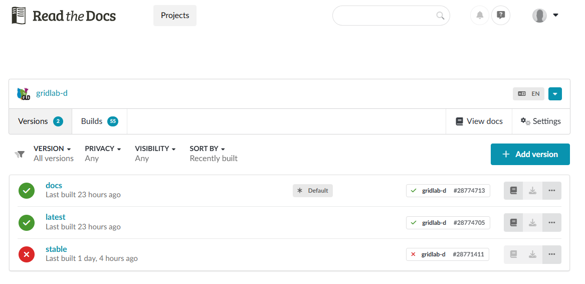
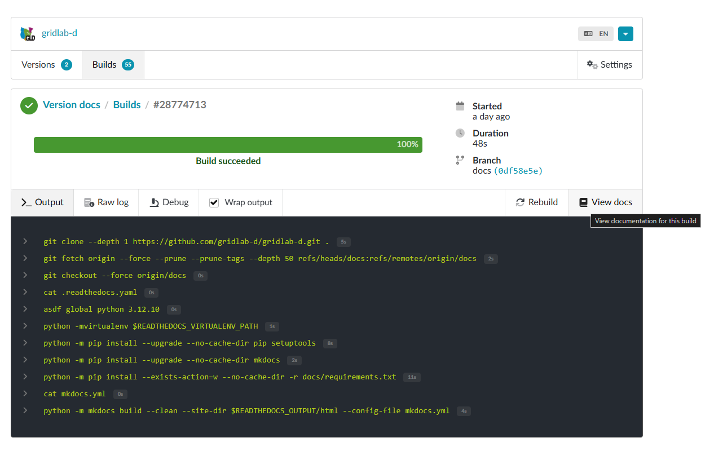
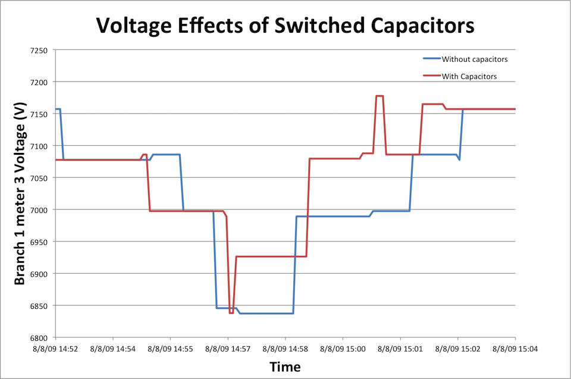
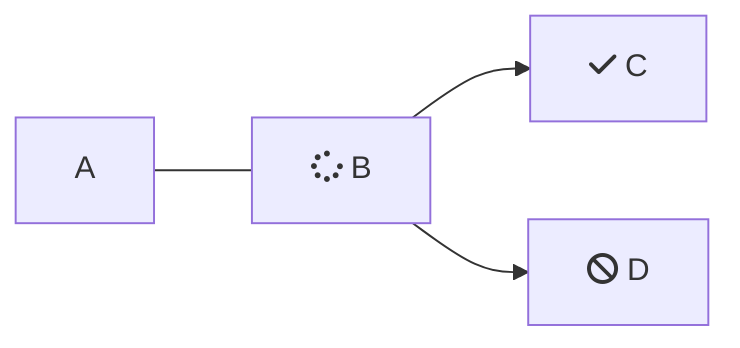

# Style Guide

This is a style guide for GridLAB-D™ Documentarians.

# Build Instructions

Instructions to build the documentation on the platform: readthedocs. 

Before you build, re-generate the navigation list/table of contents to tell `mkdocs.yml` what pages to include. Re-run `tree_to_toc.py` from the root folder. Copy and paste the output from `tree.txt` into the nav: section of mkdocs. Here is a sample:

      nav:
      - Home: index.md
      - 0.0 GridLAB-D™:
          - Contacts: docs/0.0 GridLAB-D™/Contacts_list.md
          - Announcements: docs/0.0 GridLAB-D™/Version History.md
          - projects: docs/0.0 GridLAB-D™/projects.md
          - publications: docs/0.0 GridLAB-D™/publications.md
          - Source: docs/0.0 GridLAB-D™/resources.md
          - Style Guide: docs/0.0 GridLAB-D™/style-guide.md
      - 1.0 Prospective Users:
        - Key Attributes of GridLAB-D™: docs/1.0 Prospective Users/GridLAB-D_Key_Attributes.md


Things to keep in mind when updating the nav: list
- "docs/" needs to be at the start of each path
- Docs will not build if there are empty folders in the nav. If it's a placeholder folder, remove it from the nav list until something is in it.
- Make sure the indentention follows the folder hierarchy
- Don't put special characters in title pages (first headers), ex: no "&"
- The order they are listed is the order they will display. Rearrange as needed.


## Local Build

Build locally to see how your changes look on readthedocs before you commit.
  * From the terminal: 

        mkdocs serve

  Sample output:

        WARNING -  mkdocs_autorefs: docs\7.0 References\Specs\Spec_Subsecond.md: Could not find cross-reference target 'CONSTANTP'
        WARNING -  mkdocs_autorefs: docs\7.0 References\Specs\Spec_sec_control.md: Could not find cross-reference target '3'
        WARNING -  mkdocs_autorefs: docs\7.0 References\Specs\Spec_sec_control.md: Could not find cross-reference target '3'
        INFO    -  Documentation built in 5.12 seconds
        INFO    -  [16:04:01] Watching paths for changes: 'docs', 'mkdocs.yml'
        INFO    -  [16:04:01] Serving on http://127.0.0.1:8000/

  Click or copy/paste into browswer the local host link. Note that this will continually update every time you make a change. You may want to `CTL + C` to abort the auto-rebuild.

### Doxygen Instructions

To enable the doxygen build, `pip install mkdoxy` and go to the doxygen [website](https://www.doxygen.nl/download.html) and install that locally on your desktop. Check that `C:\Program Files\doxygen\bin` or similar is added to PATH. 

## Build on readthedocs 

To build latest commit to be hosted publicly. Push your latest commit before building.

  * Navigate to our [docs](https://app.readthedocs.org/projects/gridlab-d/): `https://app.readthedocs.org/projects/gridlab-d/`



  * Click `docs`, then `Builds` and then click `Rebuild`:



  * Once complete, click `View docs`.


# Style Guide

This begins the style guide for GridLAB-D™ Documentarians.

## GridLAB-D™

Is trademarked. Refer to it always as GridLAB-D™. Do not abbreviate to GLD.

## In-Line Code and Proper Nouns

Mention of variables or code-snippbits within documentation text should contain back-ticks to signify that the item is a variable or bit of code. For example:

*Because GridLAB-D has a flat parameter list, it is not unusual for some device model parameters to only be used by the model if other parameters are set to certain values. For example, in the "house_e" model used to model single-zone structures, there are parameters for the `heating_setpoint` and `cooling_setpoint`. As you might be able to guess, when the HVAC system is in heating mode, changing the value of the `cooling_setpoint` has no impact on the devices simulated behavior.*

Note that "house_e" is the name of the model, but not a variable. To avoid confusion, it is placed in double-quotes. The parameters described in the model, `heating_setpoint` and `cooling_setpoint` are both in back-ticks. It is also acceptable to refer to the heating and cooling setpoint as you would in prose text; in that case, because the parameters are not referenced directly using their variable names, they do not get back-ticks.

# Clear, Concise, and Precise.

Get to the point quickly. Short sentences are just fine. Break complicated, multi-line sentences or instructions into digestible chunks. Talk like a person and avoid jargon where possible; if not, define. Avoid instruction by implication, instead, use precise language to describe what falls into the scope of a instruction.

> 👀 You may have noticed the use of the Oxford comma in that last header. In this documentation, and in the official [PNNL style guide](https://confluence.pnnl.gov/confluence/pages/viewpage.action?spaceKey=COMMSTEAM\&title=PNNL+Style+Guide), *we use the Oxford comma.*

## Revise "weak" writing

I'm reproducing this example from the Microsoft Style Guide directly.

**Replace this**: *You can access Office apps across your devices, and you get online file storage and sharing.*

**With this**: *Store files online, access them from all your devices, and share them with coworkers.*

## Voice

When referring to the user, use "**you**". No need to use gender-specific singular pronouns either. If you need to refer to a group of users, use "**they**".

**Example**: *To get started, first you'll need to install GridLAB-D™.*

A casual voice is welcoming and less intimidating, so use contractions and write like you'd actually explain things to a person. Also, write primarily using the present tense.

## Chunking

We want users to be empowered by our documentation. To do this, our documentation needs to be approachable and digestible. A key piece to that is visually chunking content into manageable sections. For example, this:

*"Lorem ipsum dolor sit amet, consectetur adipiscing elit, sed do eiusmod tempor incididunt ut labore et dolore magna aliqua. Ut enim ad minim veniam, quis nostrud exercitation ullamco laboris nisi ut aliquip ex ea commodo consequat. Duis aute irure dolor in reprehenderit in voluptate velit esse cillum dolore eu fugiat nulla pariatur. Excepteur sint occaecat cupidatat non proident, sunt in culpa qui officia deserunt mollit anim id est laborum. Lorem ipsum dolor sit amet, consectetur adipiscing elit, sed do eiusmod tempor incididunt ut labore et dolore magna aliqua. Ut enim ad minim veniam, quis nostrud exercitation ullamco laboris nisi ut aliquip ex ea commodo consequat. Duis aute irure dolor in reprehenderit in voluptate velit esse cillum dolore eu fugiat nulla pariatur. Excepteur sint occaecat cupidatat non proident, sunt in culpa qui officia deserunt mollit anim id est laborum. Lorem ipsum dolor sit amet, consectetur adipiscing elit, sed do eiusmod tempor incididunt ut labore et dolore magna aliqua. Ut enim ad minim veniam, quis nostrud exercitation ullamco laboris nisi ut aliquip ex ea commodo consequat. Duis aute irure dolor in reprehenderit in voluptate velit esse cillum dolore eu fugiat nulla pariatur. Excepteur sint occaecat cupidatat non proident, sunt in culpa qui officia deserunt mollit anim id est laborum. Lorem ipsum dolor sit amet, consectetur adipiscing elit, sed do eiusmod tempor incididunt ut labore et dolore magna aliqua. Ut enim ad minim veniam, quis nostrud exercitation ullamco laboris nisi ut aliquip ex ea commodo consequat. Duis aute irure dolor in reprehenderit in voluptate velit esse cillum dolore eu fugiat nulla pariatur. Excepteur sint occaecat cupidatat non proident, sunt in culpa qui officia deserunt mollit anim id est laborum."*

Looks overwhelming. Not the least of which because it's bad Latin. Instead, let's chunk this content. Consider adding sub-headings to allow readers to quickly navigate or scan the content. Graphics, equations, and code snippets are also incredibly valuable tools to improve comprehension. Let's try again:

### *Lorem ipsum dolor sit amet.*

*"Consectetur adipiscing elit, sed do eiusmod tempor incididunt ut labore et dolore magna aliqua. Ut enim ad minim veniam, quis nostrud exercitation ullamco laboris nisi ut aliquip ex ea commodo consequat. Duis aute irure dolor in reprehenderit in voluptate velit esse cillum dolore eu fugiat nulla pariatur."*


*"Excepteur sint occaecat cupidatat non proident, sunt in culpa qui officia deserunt mollit anim id est laborum. Lorem ipsum dolor sit amet, consectetur adipiscing elit, sed do eiusmod tempor incididunt ut labore et dolore magna aliqua. Ut enim ad minim veniam, quis nostrud exercitation ullamco laboris nisi ut aliquip ex ea commodo consequat. Duis aute irure dolor in reprehenderit in voluptate velit esse cillum dolore eu fugiat nulla pariatur. Excepteur sint occaecat cupidatat non proident, sunt in culpa qui officia deserunt mollit anim id est laborum. Lorem ipsum dolor sit amet, consectetur adipiscing elit, sed do eiusmod tempor incididunt ut labore et dolore magna aliqua."*

### *Ut enim ad minim veniam.*

*"Quis nostrud exercitation ullamco laboris nisi ut aliquip ex ea commodo consequat. Duis aute irure dolor in reprehenderit in voluptate velit esse cillum dolore eu fugiat nulla pariatur. Excepteur sint occaecat cupidatat non proident, sunt in culpa qui officia deserunt mollit anim id est laborum."*

```
#Let's add an example
print("Hello, world!)
```

*"Lorem ipsum dolor sit amet, consectetur adipiscing elit, sed do eiusmod tempor incididunt ut labore et dolore magna aliqua. Ut enim ad minim veniam, quis nostrud exercitation ullamco laboris nisi ut aliquip ex ea commodo consequat. Duis aute irure dolor in reprehenderit in voluptate velit esse cillum dolore eu fugiat nulla pariatur. Excepteur sint occaecat cupidatat non proident, sunt in culpa qui officia deserunt mollit anim id est laborum."*

Much better!

## Adding Images

We added an image in the chunking example, but here are a few more options for how to do that. Images can be either local (in the images folder), or refering an external url. See the below examples:


Another image (local) and resized


Not edited


# Local Image Reference



## Accessibility

There are some specific accessibility tips to note, below. But in general, remember who we are writing for. If they're reading this documentation, they're not an expert. They're learning.  Just as you once learned these things. The reader may not even be a user yet, they might just want to know what GridLAB-D™is in order to decide whether they should learn it. They might be a user, but this is their first experience performing distribution system modeling. They might have no coding experience at all. Keep the audience in mind while you write, and remember that we are here to teach. Other notes on accessibility:

**Spell out words** like and, plus, and about. Screen readers can misread or skip text that uses special characters like the plus sign (+) and tilde (\~). 

**Don’t force line breaks** (also known as hard returns) within sentences and paragraphs. They may not work well in resized windows or with enlarged text.

**Don’t use directional terms as the only clue to location**. Left, right, up, down, above, and below aren’t very useful for people who use screen-reading software. Instead, use specific language that conveys context, such as “the first item in the following list” or “on the toolbar.”

**All images require a descriptive caption**. Images are extremely powerful to help convey information, but an image without an explanation only creates confusion. Always provide a caption for an in-line image, and be as descriptive and specific as possible about what is pictured.

For example, when you add an image, add text for both the "Alt text" (this should be very brief) and the caption. Like so:

<Image align="center" alt="A diagram of a populated feeder model" border={false} caption="A diagram of the populated Copperplate Feeder model, composed of commercial buildings and distributed energy resources (DER) on a reduced feeder." src="https://files.readme.io/3a0e8652e725fcc533b615ce01cab5fe51346a8f08f8f301e2abf7d45b498146-Copperplate-Populated.png" />


# Avoid Biased Language

To maintain a welcoming learning environment, avoid biased language in writing. These seemingly small changes ensure that everyone has a seat at the table. Additionally, use of some of the more dated, biased terms that have largely left the zeitgeist can be jarring and pull people out of their learning immersion.

The most relevant example to this work is that GridLAB-D™uses **parent/child** relationships to describe object hierarchy. We use these terms specifically and consistently throughout all of GridLAB-D™, and not the more dated version historically used in electric work ([read more](https://www.acs.org/about/inclusion/inclusivity-style-guide/specific-subjects-of-study-or-work.html#information-technology-and-software-development)).

* Another easy switch is to use "**placeholder**" instead of "*dummy*" values.
* "*Sanity check*" is one that is still commonly used. "**Quick check**" or "**confidence check**" can be used in its place.
* **Address** a problem or issue rather than *combat* it.

The American Chemistry Society published a thorough Inclusivity Style Guide. If you are in doubt while writing, or something doesn't feel right, it's probably covered [here](https://www.acs.org/about/inclusion/inclusivity-style-guide/general-guidelines.html#involve-diverse-people-in-the-creative-process). Note that this is a bit of a rabbit hole, so try not to get lost.

## PNNL Style Requirements

The PNNL Style Guide is available [here](https://confluence.pnnl.gov/confluence/pages/viewpage.action?spaceKey=COMMSTEAM\&title=PNNL+Style+Guide). For our use case, little of this will be relevant. However there are a few things that may come up:

* **Resilience**, not resiliency.
* **Affect** or **Effect** in place of *impact*.
* **Address challenges** in place of *solve challenges*.

# Quick Markdown Reference

*Italic* or *Italic*

**Bold** or **Bold**

"# Heading 1"

"## Heading 2"

[Link](http://a.com)


> Blockquote

# Bulleted Lists

Below are a few options for making a list. All are acceptable options.

* List
* List
* List

or

- List
- List
- List

or

1. one
2. two
3. three

Note that longer descriptions may be placed on the subsequent line for ease of reading (on the .md page, the built docs will place the description immediately following the term). 

One should also bold the term in a list for ease of viewing. For example:

## DO:

* **Initialization** -
    The external application is started and if possible global variables, if any, are exported.

## DO NOT: 

The following will not display correctly as a bulleted list: 

* **Initialization** -

    The external application is started and if possible global variables, if any, are exported.

*Note that the line must directly follow the term (no extra line between) to show up correctly.*

or

Initialization
    The external application is started and if possible global variables, if any, are exported.

*Many wiki pages use this format for lists, it is our job to convert them into lists that render correctly.*


* **Initialization** -
    The external application is started and if possible global variables, if any, are exported.
**My next sentence is on a new line so it looks distinct, but without a line between, it gets absorbed into the bulleted list. Put an extra return after a list ends before continuing to write.** 


## There is no try.

When in doubt, build the docs and see if it looks right. If not, refer back to this style guide for advice.

# Quick Markdown Reference, Continued.

Horizontal rule:

***

or

***

`Inline code` with backticks

Code blocks and other useful features are added using the " / "

```
import numpy as np

np.random()
```

## Mermaid Diagram




# Equations

In-line equation: $x^n + y^n = z^n$

or display equation:

$$x^n + y^n = z^n$$

A numbered display equation:

$$x^n + y^n = z^n \tag{1}$$

An example with both multi-letter subscripts and variable names with hyphens:

$P_{vent} = floor\_area (0.1 - 0.01\imath)$ VA/sf, and $Q_{vent}=0.2402 \times 0.0735 (T_{out}-T_{air}) V_{air} \times ventilation\_rate$


Note that there cannot be spaces between the $ and the equation, on either side, to display correctly.

# References

Borrowing heavily from [Microsoft Writing Style Guide](https://learn.microsoft.com/en-us/style-guide/welcome/).