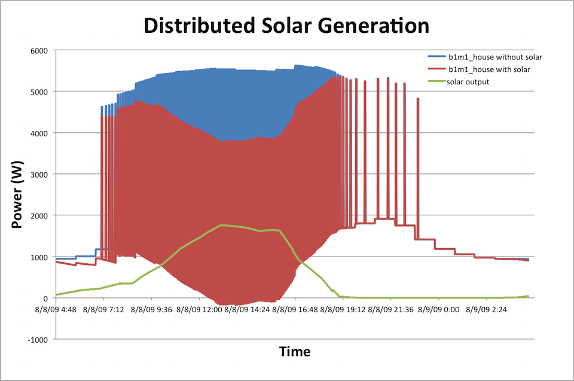
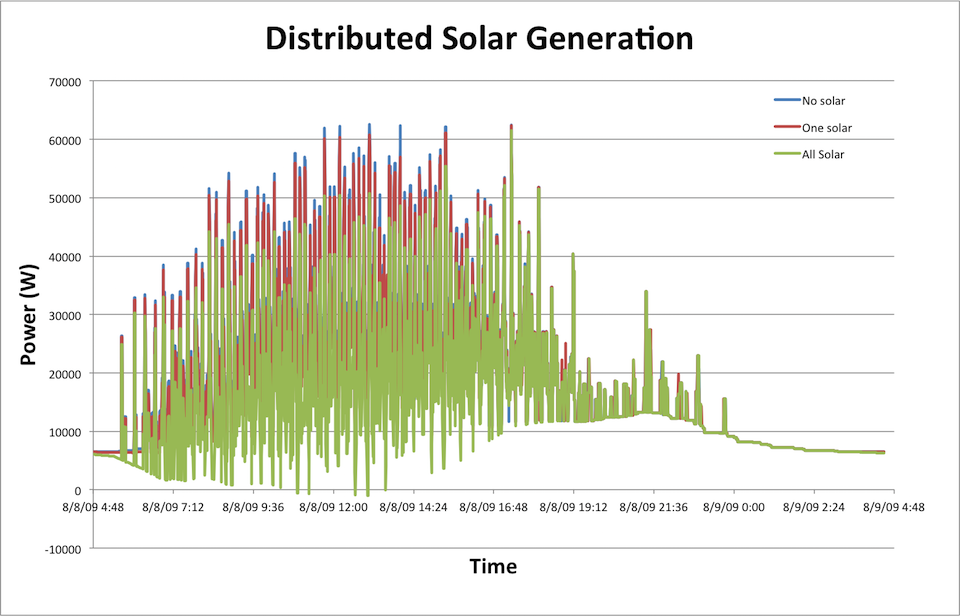
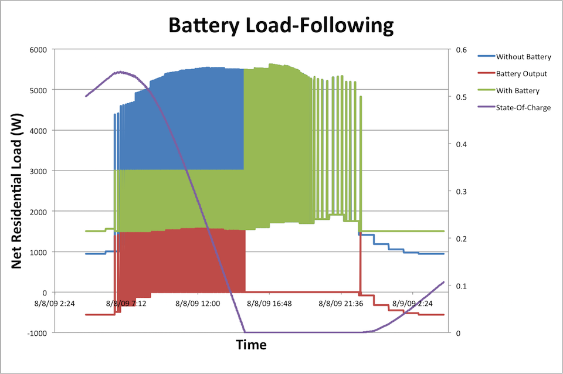
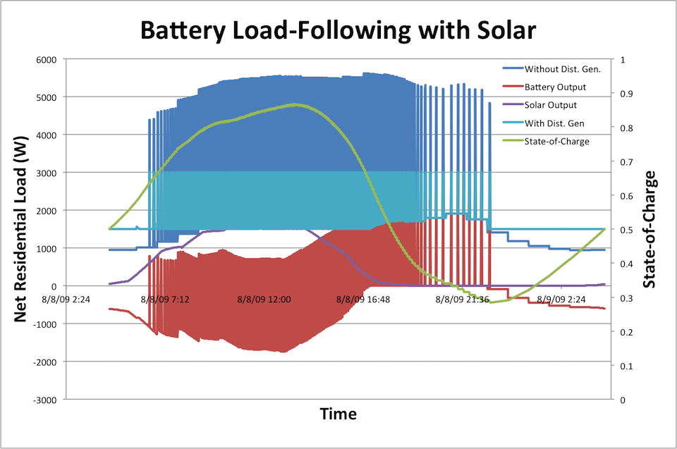
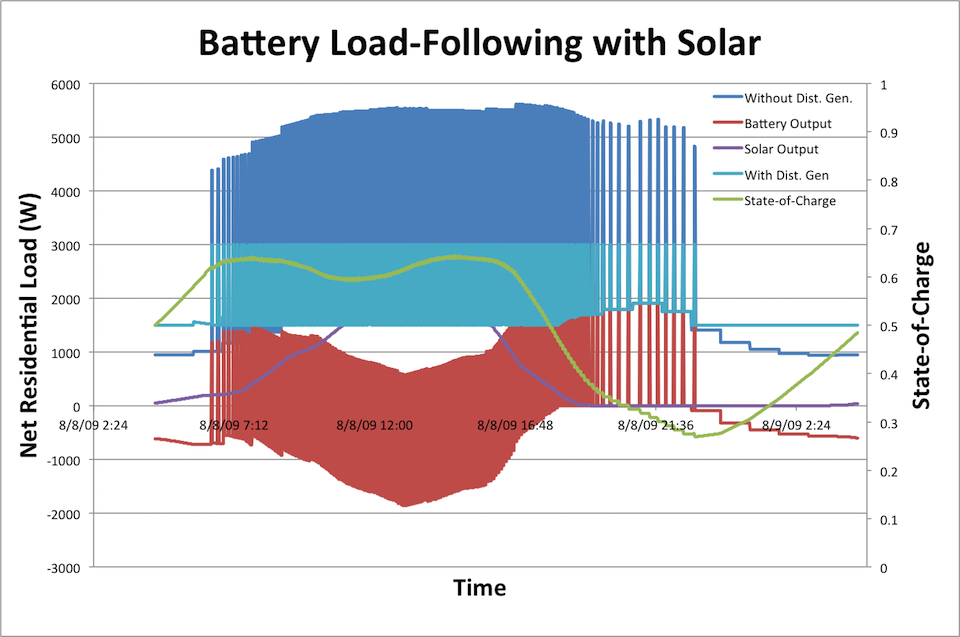
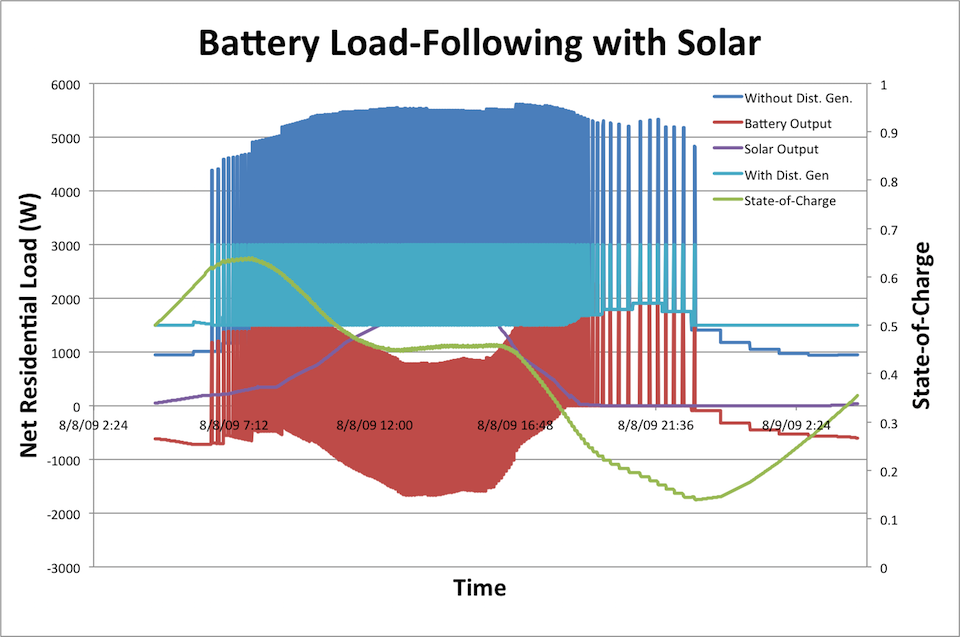
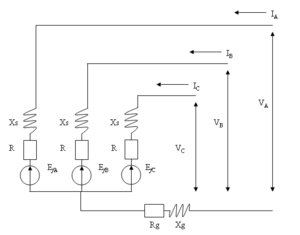
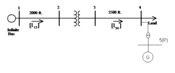

# Distributed Generation 

The generator, or DG, model within GridLAB-D has never been fully developed. The multitude of control algorithms, different technologies, and implementations available and the various levels of model complexity, make it difficult to fully represent the DG models that are available. Instead, the goal has been to create a very open environment, where users can create their own models, including their own controls and algorithms. Within the auspices of DOE, some models have been created for specific uses ( a simple solar model, a specific wind turbine model, various battery control models ), and should be thought of as examples in how DGs are modeled within GridLAB-D. 

Essentially, the DG models can be thought of as negative loads (or in the case of batteries that are charging, normal loads). They are connected to the powerflow solution through triplex meters or meters (or in some cases, in series through an inverter to a meter or triplex meter), and act as a load on the system using components of a ZIP model. The internal DG models are required to calculate their ZIP components as a function of the user's/model's desired inputs - ie solar panels use the system voltage and solar radiation. These components are then posted back to the powerflow solution via the meters as either a pure current injection or as a combinatorial ZIP model. As the generators are a separate module from powerflow, they are required to have the meter interface and must post their load information rather than being calculated directly within the powerflow solution (as would be with a load object). 

The following will describe the available models within GridLAB-D and how they interface with the powerflow module. Additionally, it will offer ideas/plans for future development. 

## Solar PV

The `solar PV` class in GridLAB-D ™  uses the solar parameters from the climate object in the model and the parameters specified in the object itself to generate a DC power value. To tie into the rest of the GridLAB-D™  simulation, this DC power needs to be converted to an AC value, either split phase as for a “house” object or three-phase for general distribution node. The solar PV class has parameters that are closer to first-principles than power engineers may be used to; instead of specifying a 5 kW installation the class asks for panel type, square-footage of the installation, efficiency, and normal operating cell temperature, among others.

Being so closely tied to the physics of the system, the model relies on three solar parameters to correctly calculate the effective solar radiation that is used by the panel to produce electrical energy. These values are defined in the climate object which must be included in the model (.glm); typically they are provided by TMY data though they could alternatively be defined with player files using an external data source.

There are two types of solar models used in GridLAB-D: a solar tilt model and a solar power model. The tilt model is used to calculate the amount of solar radiation striking the face of the solar panel. GridLAB-D™ has two models, the default (based on B. Y. H. Liu and R. C. Jordan, “The interrelationship and characteristic distribution of direct, diffuse and total solar radiation,” Solar Energy, vol. 4, no. 3, pp. 1–19, 1960.) and [SOLPOS](http://rredc.nrel.gov/solar/codesandalgorithms/solpos/); SOLPOS is used in NREL's [PVWatts](http://pvwatts.nrel.gov/), has been validated against it, and is the preferred model.

The solar power model takes the power generated in the tilt model and adjusts it based on the thermal parameters of the solar panel. There are two power models in GridLAB-D™ , the default and the `FLATPLATE`, the later contains a more complex thermal model and is the slightly preferred model to use because of this.

### Default Solar

A minimal model could be created via: 
    
    
    object solar {
        generator_mode SUPPLY_DRIVEN;
        generator_status ONLINE;
        panel_type SINGLE_CRYSTAL_SILICON;
        efficiency 0.2;
        parent inverter1;
        area 2500 sf;
    }

### Solar Parameters

Property Name  | Type  | Unit  | Description   
---|---|---|---  
generator_mode  |  enumeration  |  N/A  |  Only operational in SUPPLY_DRIVEN at this time.   - UNKNOWN   - CONSTANT_V   - CONSTANT_PQ   - CONSTANT_PF   - SUPPLY_DRIVEN  
generator_status  |  enumeration  |  N/A  |  Default is ONLINE. Allows a user to dropout a generator.   - OFFLINE   - ONLINE   
panel_type  |  enumeration  |  N/A  |  Uses pre-defined panel technologies. Defines efficiency, Pmax_temp_coeff, and Voc_temp_coeff.  SINGLE_CRYSTAL_SILICON (default)   - MULTI_CRYSTAL_SILICON   - AMORPHOUS_SILICON   - THIN_FILM_GA_AS (incomplete)   - CONCENTRATOR (incomplete)   
power_type  |  enumeration  |  N/A  |  Defines whether the connection is AC or DC. This variable is not currently used at this time as the connection method is determined from the connection device (meter vs. inverter).   - AC   - DC   
INSTALLATION_TYPE  |  enumeration  |  N/A  |  This variable is not currently used.   - ROOF_MOUNTED   - GROUND_MOUNTED   
NOCT  |  double  |  degF  |  Nominal operating cell temperature, typically designated by the manufacturer.   
Tmodule  |  double  |  degF  |  Calculated internal temperature of the PV module.   
Tambient  |  double  |  degF  |  Outside air temperature. Comes from a climate object, if available.   
wind_speed  |  double  |  mph  |  Outside wind speed. Comes from a climate object, if available.   
Insolation  |  double  |  W/sf  |  Solar radiation incident upon the solar panel. Comes from a climate object, if available.   
Rinternal  |  double  |  Ohm  |  Not currently used.   
Rated_Insolation  |  double  |  W/sf  |  Insolation level at which the cell is rated for. It is assumed that at rated insolation, power output will be at the rated maximum power output.   
Pmax_temp_coeff  |  double  |  |  Coefficient for the effects of temperature changes on the actual power output. This is explained in further documentation.   
Voc_temp_coeff  |  double  |  |  Coefficient for the effects of temperature changes on the DC terminal voltage. This is explained in further documentation.   
V_Max  |  complex  |  V (DC)  |  Defines the max operating voltage of the PV module. This is used for de-rating purposes and is not currently used as a generator cutoff.   
Voc_Max  |  complex  |  V (DC)  |  Not needed and needs to be removed   
Voc  |  complex  |  V (DC)  |  Defines the open circuit voltage as specified by the PV manufacturer. It occurs when there is no current flowing throught the PV cell   
efficiency  |  double  |  unit  |  Defines the efficiency of power conversion from the solar insolation to DC power. Defines maximum power output.   
area  |  double  |  sf  |  Defines the surface area of the solar module. Defines maximum power output.   
Rated_kVA  |  complex  |  kVA  |  Not currently used.   
P_Out  |  complex  |  kW  |  Not currently used.   
V_Out  |  complex  |  V  |  DC voltage passed to the inverter object.   
I_Out  |  complex  |  A  |  DC current passed to the inverter object.   
VA_Out  |  complex  |  VA  |  Actual power delivered to the inverter.   
FF  |  double  |  None  |  The Fill Factor (FF) is essentially a measure of quality of the solar cell. It is calculated by comparing the maximum power to the theoretical power that would be output at both the open circuit voltage and short circuit current together. This variable is currently not implemented.  

### Solar State of Development

This model is considered experimental and may not work as designed. 

## Inverters

Since a solar PV installation is inherently DC and the electrical grid is AC, an inverter is needed to connect the two. The inverter is assumed to provide ideal maximum power-point tracking, able to convert the maximum power from the solar installation that is supported by the conditions at a given point in time. When the inverter is commanded to produce less than this power it is assumed the solar PV panel is loaded in such a way as to provide this power and the potential power output of the panel is not fully realized.

As of the time of this writing, the [inverter model]("/wiki/Inverter") is a mix of older legacy code that will likely be deprecated in the near future and newer, active development and maintenance code. The most up-to-date model sets the `inverter_type` to `FOUR_QUADRANT`; though this model has several different control modes, most don't work properly with solar panels. Leaving the `four_quadrant_control_mode` parameter unspecified (that is, not including it in the parameter definitions for that object), will default to an operating mode that transfers the maximum real energy possible from the solar panel at all times. We'll discuss some of the other operating modes of the inverter when we cover energy storage later on in this chapter.

## inverter Model

A minimal model could be defined by: 
    
    
    object inverter {
        phases AS;
        generator_mode CONSTANT_PF;
        generator_status ONLINE;
        inverter_type PWM;
        power_factor 1.0;
        parent triplex_meter2;
        << implied child that provides a DC power input >>
    }

### Default Inverter

Property Name | Type | Unit | Description   
---|---|---|---  
inverter_type  |  enumeration  |  N/A  |  Defines the type of inverter technology and the efficiency of the unit. NOTE: efficiency needs to be made a variable.   - TWO_PULSE   - SIX_PULSE   - TWELVE_PULSE   - PWM  
generator_status  |  enumeration  |  N/A  |  Allows user to define when the generator is in operation or not.   - ONLINE   - OFFLINE  
generator_mode  |  enumeration  |  N/A  |  Defines the control mode of the inverter. Only CONSTANT_PF has been validated to any degree and allows the user to adjust the power factor (and therefore the Q output) under the constraints of the rated output.   - UNKNOWN   - CONSTANT_V   - CONSTANT_PQ   - CONSTANT_PF   - SUPPLY_DRIVEN 
V_In  |  complex  |  V  |  DC voltage passed in by the DC object (e.g. solar panel or battery)   
I_In  |  complex  |  A  |  DC current passed in by the DC object (e.g. solar panel or battery)   
VA_In  |  complex  |  VA  |  VA_In = V_In * I_In   
Vdc  |  complex  |  V  |  Not used at this time.   
phaseA_V_Out phaseB_V_Out phaseC_V_Out  |  complex  |  V  |  AC voltage coming from the interconnection point. This is not a user-definable variable, but is assigned by the powerflow node. In the case of a “meter”, this can be 1-, 2-, or 3-phase. In the case of a “triplex_meter”, phaseA_V_Out is used to hold the 240V phase voltage; B & C are not used in this case.   
phaseA_I_Out phaseB_I_Out phaseC_I_Out  |  complex  |  A  |  AC current being delivered to the interconnection point. This is not a user-definable variable, but is calculated by the inverter/DC object. In the case of a “meter”, this can be 1-, 2-, or 3-phase. In the case of a “triplex_meter”, phaseA_I_Out is used to hold the 240V phase voltage; B & C are not used in this case.   
power_A power_B power_C  |  complex  |  VA  |  Calculation of power delivered to interconnection node (e.g. power_A = phaseA_V_Out * ~phaseA_I_Out).   
P_Out  |  double  |  VA  |  Not used as this time.   
Q_Out  |  double  |  VAr  |  Not used as this time.   
power_factor  |  double  |  unit  |  Defines the desired power factor in CONSTANT_PF mode.   
phases  |  set  |  N/A  |  Not used at this time – phases are assumed from the interconnection point.  inherited from power electronics – NOTE: Many of the PE capabilities are not currently fully functional.   
Rated_kV  |  double  |  kV  |  Used as the nominal voltage when no interconnection point is designated.   
efficiency  |  double  |  unit  |  Efficiency of the inverter. This is assigned by inverter_type and cannot be overridden at this time.   

### Inverter State of Development

This model is considered experimental and may not work as designed. 

### Example - Basic Solar PV Installation

The file [`dist_gen_solar_single.glm`]("https://github.com/gridlab-d/course/blob/master/Tutorial/Chapter%206%20-%20Distributed%20Generation/Distributed%20Generation%20-%20Solar/dist_gen_solar_single\[1]) contains the feeder model we've been using up to this point with a single added solar installation. Measuring the net power flow at `b1m1_house_node`, upstream of both the solar PV installation, its inverter, and the house load itself, we can see that the impact that the solar PV installation has on the total residential load. During some portion of the day, when the air-conditioner is off the solar power output is greater than the house load, leading to reverse power flow back into the distribution system.

### Example - Large Solar PV Installation and Impact on Feeder

The file [`dist_gen_solar_all.glm`]("https://github.com/gridlab-d/course/blob/master/Tutorial/Chapter%206%20-%20Distributed%20Generation/Distributed%20Generation%20-%20Solar/dist_gen_solar_all\[2]) takes uses the same architecture and adds solar PV installations to all the houses on our small feeder model. Looking at the total power flow up at the feeder head, we can see that adding solar power to each of the houses dramatically reduces the total feeder load during the sunny part of the day, again leading to a few moments where the total feeder power is negative. During these times the feeder is effectively acting as a generator and feeder power back to the bulk power system as a whole (which we haven't included in our model).

## Battery Energy Storage

Confusingly, GridLAB-D™ contains two classes that both look like they could be used for adding energy storage to a GridLAB-D™ model: `energy_storage` and `battery`. A quick look at the `energy_storage` \["/wiki/Generator\_Module\_Guide#Energy\_Storage\_Model" >wiki page] and source code reveals that this class type is not fully implemented forcing us to use the `battery` class instead. The battery object is in a state of flux, containing some legacy models and some new models. In early versions of GridLAB-D (pre-v3.0), it was assumed that the model included both the battery and the inverter; the battery was connected directly to a meter (or triplex_meter) object. Post-v3.0, the inverter model has been separated from the battery object. In this case, the battery is connected as a child of an inverter object and the inverter is then connected to the meter object. This may cause some confusion - development of new models will focus on a full separation of the inverter and battery models, but legacy code still exists for those that are still using it. 

The battery model does not explicitly represent a specific battery chemistry, but rather is a generic energy storage device; the parameters can be set to represent a fairly simplistic representation of a wide variety of chemistries and technologies.  Unfortunately, like the `inverter` class, there is a mix of legacy and modern code and models. The most modern and maintained branch of this class sets `use_internal_battery_model` to `TRUE`. This enables a simple battery model with only a few parameters such as efficiency and energy and power ratings.

The bulk of the capability when using the battery model comes from the inverter that is paired with it. Again, just like we did with the solar panel, setting `inverter_type` to `FOUR_QUADRANT` uses the most current model and unlike with a solar PV installation, the `four_quadrant_control_mode` parameter is fully functional and opens up a wide variety of control modes.

*CONSTANT\_PQ* Sets the output of the battery to the specified constant real and reactive power levels. This mode in particular lends itself to using player files or schedules to control the battery, allowing the charge and discharge time to be scheduled.

*CONSTANT\_PF* This is the default controller mode with the power factor set to unity. With a solar panel installation this works wonderfully as the inverter will generate as much real power as the panel provides. (xxxxxxx Can charging and discharging be controlled? It doesn't look like it based on the code.)

*VOLT\_VAR* Uses the reactive power capability of the inverter to regulate the voltage at the point of common coupling. This mode allows the user to input a voltage vs reactive power curve to define how aggressively the inverter attempts to regulate the voltage.

*LOAD\_FOLLOWING* Allows the inverter to use the energy from the battery to regulate the load at a user-definable point on the feeder. The user defines a charge/discharge hysteresis curve to dictate how the battery/inverter combination will operate.

### Default Battery

Because of the multiple models and wide variety of parameters, there is no "default" battery.

### Battery Parameters

Property Name | Type | Unit | Description   
---|---|---|---  
generator_status  |  enumeration  |  N/A  |  Allows user to define when the generator is in operation or not.   - ONLINE   - OFFLINE
generator_mode  |  enumeration  |  N/A  |  Defines the control mode of the inverter. Only CONSTANT_PF has been validated to any degree and allows the user to adjust the power factor (and therefore the Q output) under the constraints of the rated output. Do not set when using the internal battery model.   - UNKNOWN   - CONSTANT_V   - CONSTANT_PQ   - CONSTANT_PF   - SUPPLY_DRIVEN
use_internal_battery_model  |  Boolean  |  N/A  |  A boolean to use the internal battery model which is used when the battery's parent is an inverter. Default is FALSE.   
battery_type  |  enumeration  |  N/A  |  The battery type applies a voltage vs. SOC performance curve for the internal battery model to use. Default is UNKNOWN.   - UNKNOWON   - LI_ION   - LEAD_ACID  
nominal_voltage  |  double  |  V  |  The nominal open circuit dc voltage for the battery. Used by the internal battery model. Default is blah.   
rated_power  |  double  |  W  |  The rated output power of the battery. It is used by the internal battery model. The rated_output is set by the parent inverter's power rating and efficiency. Default is blah.   
battery_capacity  |  double  |  Wh  |  The rated capacity of the battery. It is used by the internal battery model. Default is blah.   
round_trip_efficiency  |  double  |  pu  |  The round trip efficiency of the battery used by the internal battery model. Defualt is blah.   
state_of_charge  |  double  |  pu  |  The state of charge of the battery used by the internal battery model. Default is blah.   
reserve_state_of_charge  |  double  |  pu  |  The reserve state of charge that the battery is not allowed to go below. It is used by the internal battery model and is used by the parent inverter. Default is 0.   
battery_load  |  double  |  W  |  The current output power of the battery. It is set by the parent inverter and used in the internal battery model.   
rfb_size  |  enumeration  |  N/A  |  Presets for batter ratings and capacity.   -  HOUSEHOLD:   &nbsp; - nominal_voltage = 260 V   &nbsp; - rated_power = 3.6 kW   &nbsp; - battery_capacity = 23.4 kWh   &nbsp; - round_trip_efficiency = 0.9   SMALL:    &nbsp; - nominal_voltage = 75.2 V   &nbsp; - rated_power = 18.8 kW   &nbsp; - battery_capacity = 160 kWh   &nbsp; - round_trip_efficiency = 0.7   - MED_COMMERCIAL:   &nbsp; - nominal_voltage = 115 V   &nbsp; - rated_power = 50 kW   &nbsp; - battery_capacity = 175 kWh   &nbsp; - round_trip_efficiency = 0.8   - MED_HIGH_ENERGY:   &nbsp; - nominal_voltage = 115 V   &nbsp; - rated_power = 50 kW   &nbsp; - battery_capacity = 400 kWh   &nbsp; - round_trip_efficiency = 0.8   - LARGE:   &nbsp; - nominal_voltage = 8 kV   &nbsp; - rated_power = 240 kW   &nbsp; - battery_capacity = 5.76 MWh   &nbsp; - round_trip_efficiency = 0.9

### Battery State of Development

This model has only been tested when using the internal battery model. All other modes are considered experimental and may not work as designed. An example of setting up the inverter and battery for load following is shown below. The load following control mode currently only operates at unit power factor. A similar control mode for reactive load following is slated for 3.2 release in summer of 2015. 
    
    
    object inverter {
        name load_follow_inverter;
        inverter_type FOUR_QUADRANT; //Must be in FOUR_QUADRANT to use the load following control scheme.
        four_quadrant_control_mode LOAD_FOLLOWING; //The only mode that works with the battery object.
        parent meter1; //parent must be a triplex_meter or meter object.
        sense_object substation_transformer; //the sense_object must be a meter, triplex_meter, or transformer.
        rated_power 3000.0; //The per phase power output rating of the inverter in VA.
        inverter_efficiency 0.95;
        charge_on_threshold 5.0 kW; //when the load at the sense_object drops below this value the inverter starts to charge the battery.
        charge_off_threshold 7.0 kW; //when the battery is charging and the load at the sense_object rises above this value the inverter stops charging the battery.
        discharge_off_threshold 7.5 kW; //when the battery is discharging and the load at the sense_object drops below this value the inverter stops discharging the battery.
        discharge_on_threshold 9.0 kW; //when the load at the sense_object rises above this value the inverter starts to discharge the battery.
        max_discharge_rate 1 kW; //The maximum power output to demand from the battery when discharging.
        max_charge_rate 1 kW; //The maximum power input to the battery when charging.
    }
    
    object battery {
        name batt_test;
        parent load_follow_inverter;
        use_internal_battery_model true;
        battery_type LI_ION;
        battery_capacity 20.0 kWh;
        round_trip_efficiency 1.0;
        state_of_charge 0.5;
        generator_mode SUPPLY_DRIVEN;
    }

### Example - Load-Following for a Single Residence

As an example of how to use a battery in GridLAB-D™, we are going to demonstrate how to use the inverter load-following mode, a mode that uses an energy storage device to peak-shave and valley-fill the load at a specified point in the distribution feeder. The model file is [`dist_gen_load_following.glm`]("https://github.com/gridlab-d/course/blob/master/Tutorial/Chapter%206%20-%20Distributed%20Generation/Distributed%20Generation%20-%20Load-Following/dist_gen_load_following\[3]) and it has been changed by:

* Adding `module generators` to the list of specific modules GridLAB-D™ needs to load as a part of running a simulation of this model.

* Installing a separate triplex line and meter on `b1m1` so that the energy from the battery can be uniquely measured and not conflated with the load from the house.

* Installing the inverter and battery on downstream of the new triplex line and meter.

* To support the `LOAD_FOLLOWING` mode on the inverter we need to define a node upstream of the inverter and house that will be used as a reference point. We already had a `node` (`b1m1_house_node`) and changing it to a `meter` will open up some measurement parameters that will be convenient to use.

With the new objects added to the model, the only tricky part now is setting up the `LOAD_FOLLOWING` mode correctly in the object parameter list. `LOAD_FOLLOWING` works by charging when the reference load is low enough and discharging when that load is too high.  To add extra flexibility, hysteresis is included; for example, `charge_on_threshold` is power below which the inverter will begin to charge the battery and `charge_off_threshold` is the power above which the inverter will stop charging the battery. Since this is a hysteresis operation, `charge_on_threshold` must be lower than `charge_off_threshold`. A similar definition exists for the discharge operation when the load gets too high.

The power levels that the inverter will reference in making these control decisions are defined by the `sense_object` parameter. This object must be upstream of the inverter; that is, the power produced by the inverter must flow through this meter for `LOAD_FOLLOWING` to work. Lastly, a pause time in seconds between the end of the charge and discharge operation (`charge_lockout_time` and `discharge_lockout_time `, respectively) can also be defined.

Running this simulation produces a few warnings (not errors, which would halt the simulation). The first is a reminder that in `LOAD_FOLLOWING`, the `sense_object` must be upstream, as previously discussed.

Looking at the file [`b1h1_house_data.csv`]("https://github.com/gridlab-d/course/blob/master/Tutorial/Chapter%206%20-%20Distributed%20Generation/Distributed%20Generation%20-%20Solar/b1m1_house_data.csv">\[4]) and comparing it to how the system behaved prior to the installation of the battery and inverter, we can see that the load-following is set-up correctly to fill the low points in the residential load and shave the peaks when that load gets too high.

Except not all the time. Towards the end of the day we can see that the state-of-charge of the battery reaches zero, at which point it is no longer able to discharge, eliminating its ability to shave the peak. The battery stays in this depleted state until the load at the reference meter falls below the `charge_on_threshold` value of 1.5 kW, at which point the battery begins to charge, partially restoring the state of charge. Compared to where the battery started the day though, the ending state-of-charge is pretty low and its easy to see that attempts to shave the peak on the following day probably will also fall short, perhaps even earlier in the day.

### Example - Solar PV and Battery Combination

Combining solar PV and energy storage can create an effective solution for regulating the load. The model defined in the file [`dist_gen_battery_solar.glm`]("https://github.com/gridlab-d/course/blob/master/Tutorial/Chapter%206%20-%20Distributed%20Generation/Distributed%20Generation%20-%20Battery%20and%20Solar/dist_gen_battery_solar\[5]) has such an example. To the same house that already had energy storage installed, a solar PV installation was added. As before, it is the inverter that controls the power flow from the solar panels and the control mode chosen `CONSTANT_PF` defaults to only producing real power, passing all the available energy generated by the solar PV installation onto the grid.

You'll also notice that the solar PV installation has its own triplex line, meter and inverter. Despite the fact that it generally possible to connect solar panels and batteries to the same inverter in real-world installations, GridLAB-D™ has no solver for DC powerflow and thus requires separate AC connections through inverters. This doesn't mean that the solar panels won't charge the batteries, we'll see that they do in a moment. Rather, it means that the energy flows through the AC network and as a consequence, is available for separate metering.

Looking at the definition of the `solar` object, you'll see that the parameters provided are derived from a physics-level perspective. Area of solar panel installation, efficiency, panel type, panel orientation, power production models (among others), all are used to define how this installation will generate energy as the solar conditions change throughout the day (and year). This particular installation produces more than 1 kW during peak solar conditions.

Running this simulation and looking at the data in the file [`b1h1_house_data.csv`]("https://github.com/gridlab-d/course/blob/master/Tutorial/Chapter%206%20-%20Distributed%20Generation/Distributed%20Generation%20-%20Battery%20and%20Solar/b1m1_house_data.csv">\[6]) shows that the addition of solar greatly increases the effectively of the peak-shaving. Not only does the battery get close to full capacity before called-on mid-morning, the battery is far from empty when the end of the peak-shaving activity for the day is over, using only a third of its capacity. By having the energy storage work in parallel with the solar PV installation, the early morning solar energy production is effectively stored for use later in the day when it is needed to limit the demand of this residential load.

If we wanted to try to align the peak of the solar generation better with the peak of the residential load we can change the orientation of the solar PV panels so that they are pointed more southwest, rather than directly south. Change the `orientation_azimuth` to `230` and re-run the simulation.

Adjusting the angle again so the panels face directly west produces the following:

A few important notes from this:

* Total solar energy output - 14.1 kWh generated when facing southwest vs 14.4 kWh when facing directly south and 12.9 kWh when facing directly west.

* Total net battery energy transacted - 1.5 kWh of net load when facing southwest vs 1.9 kWh when facing directly south and 0.25 kWh when facing directly west.

As the panel points more and more westward, the total solar energy production goes down and its ability to recharge the battery is reduced. The big advantage of facing somewhat westward, though, is that it tends to line up the load on the system as air-conditioners run heavily in the late afternoon and early evening. This is particularly beneficial for residential customers that pay different rates during different times of the day but that gets into the economics of energy and that we won't get into that right now.

## Wind Turbine DG Model

A minimal model could be created via: 
    
    
    object windturb_dg {
        parent my_meter1;
        phases ABCN;
        name windturb1;
        Rated_VA 10000;
        turbine_height 40;
    }
    

or using one of the generic turbines: 
    
    
    object windturb_dg {
        parent my_meter1;
        phases ABCN;
        name windturb1;
        Turbine_Model GEN_TURB_POW_CURVE_1_5MW;
    }

### Default Wind Turbine

When unspecified, turbine_height and Rated_VA default to the following: 

* Default Rated_VA: 100,000 W 
* Default turbine_height: 37 m 

These defaults are loaded when the wind turbine is defined without specifying the minimally required parameters. For example: 
    
    
    object windturb_dg {
        parent my_meter1;
        phases ABCN;
        name windturb1;
    }
    

The wind turbine object is allowed to have the following parents: 
* Meter 
* Triplex meter 
* Inverter (for power curve-based implementation only) 

### Wind Turbine Parameters

Property Name  | Type  | Unit  | Description   
---|---|---|---  
air_density  |  double  |  kg/m^3  |  Estimated air density. Used in COEFF_OF_PERFORMANCE implementation.   
blade_diam  |  double  |  meters  |  Specifies the diameter of the blades. Used in COEFF_OF_PERFORMANCE implementation.   
cut_in_ws  |  double  |  m/sec  |  Minimum wind speed for generator operation. Used in COEFF_OF_PERFORMANCE implementation.   
cut_out_ws  |  double  |  m/sec  |  Maximum wind speed for generator operation. Used in COEFF_OF_PERFORMANCE implementation.   
Cp_max  |  double  |  p.u.  |  Maximum coefficient of performance. Used in COEFF_OF_PERFORMANCE implementation.   
Cp_rated  |  double  |  p.u.  |  Rated coefficient of performance. Used in COEFF_OF_PERFORMANCE implementation.   
Cp  |  double  |  p.u.  |  Calculated coefficient of performance. Used in COEFF_OF_PERFORMANCE implementation.   
Gen_mode  |  enumeration  |  N/A  |  Control mode that is used for the generator output. Used in COEFF_OF_PERFORMANCE implementation. Default is CONSTANTP.   - CONSTANTE   - CONSTANTP   - CONSTANTPQ  
Gen_status  |  enumeration  |  N/A  |  Allows a user to dropout a generator. Default is ONLINE.   - OFFLINE   - ONLINE   
Gen_type  |  enumeration  |  N/A  |  Allows the user to specify the type of generator. Used in COEFF_OF_PERFORMANCE based implementation.   - INDUCTION   - SYNCHRONOUS 
Max_Vrotor  |  double  |  (p.u.)*V  |  Induction generator maximum induced rotor voltage in p.u., e.g. 1.2. Used in COEFF_OF_PERFORMANCE based implementation.   
Min_Vrotor  |  double  |  (p.u.)*V  |  Induction generator minimum induced rotor voltage in p.u., e.g. 0.8. Used in COEFF_OF_PERFORMANCE based implementation.   
Max_Ef  |  double  |  (p.u.)*V  |  Synchronous generator maximum induced rotor voltage in p.u., e.g. 1.2. Used in COEFF_OF_PERFORMANCE based implementation.   
Min_Ef  |  double  |  (p.u.)*V  |  Synchronous generator minimum induced rotor voltage in p.u., e.g. 0.8. Used in COEFF_OF_PERFORMANCE based implementation.   
power_curve_csv  |  string  |  N/A  |  Specifies the name of .csv file containing user defined power curve   
power_curve_pu  |  Boolean  |  N/A  |  A Boolean when set to TRUE indicates that the user provided power curve has power values in p.u. Default is FALSE.   
pf  |  double  |  p.u.  |  Desired power factor in CONSTANTP mode. Used in COEFF_OF_PERFORMANCE based implementation.   
phases  |  set  |  N/A  |  Specifies which phases to connect to. Triplex mode is only supported for the POWER_CURVE implementation.   - ABCN   - AS   - BS   - CS  
R_stator  |  double  |  (p.u.)*Ohm  |  Induction generator primary stator resistance in p.u. Used in COEFF_OF_PERFORMANCE based implementation.   
R_rotor  |  double  |  (p.u.)*Ohm  |  Induction generator primary rotor resistance in p.u. Used in COEFF_OF_PERFORMANCE based implementation.   
R_core  |  double  |  (p.u.)*Ohm  |  Induction generator primary core resistance in p.u. Used in COEFF_OF_PERFORMANCE based implementation.   
Rated_V  |  double  |  V  |  Rated generator terminal voltage. Used in COEFF_OF_PERFORMANCE based implementation.   
Rated_VA  |  double  |  VA  |  Rated wind turbine generator power output. Default is 100 kW.   
roughness_length_factor  |  double  |  N/A  |  European Wind Atlas unitless correction factor for adjusting wind speed at various heights above ground and terrain types, default=0.055.   
Rs  |  double  |  (p.u.)*Ohm  |  Synchronous generator primary stator resistance in p.u. Used in COEFF_OF_PERFORMANCE based implementation.   
Rg  |  double  |  (p.u.)*Ohm  |  Synchronous generator grounding resistance in p.u. Used in COEFF_OF_PERFORMANCE based implementation.   
turbine_height  |  double  |  meters  |  Specifies the height of the wind turbine hub above the ground. Default is 37 m.   
Turbine_Model  |  enumeration  |  N/A  |  Allows the use of one of the pre-defined generic turbines. Default is GENERIC_DEFAULT.   - GENERIC_DEFAULT   - GENERIC_SYNCH_SMALL   - GENERIC_SYNCH_MID   - GENERIC_SYNCH_LARGE   - GENERIC_IND_SMALL   - GENERIC_IND_MID   - GENERIC_IND_LARGE   - VESTAS_V82   - GE_25MW   - BERGEY_10kW   - GEN_TURB_POW_CURVE_2_4KW   - GEN_TURB_POW_CURVE_10KW   - GEN_TURB_POW_CURVE_100KW   - GEN_TURB_POW_CURVE_1_5MW  
Turbine_implementation  |  enumeration  |  N/A  |  Allows the user to specify the type of implementation for the wind turbine model. Default is POWER_CURVE.   - POWER_CURVE   - COEFF_OF_PERFORMANCE  
Wind_speed_source  |  enumeration  |  N/A  |  Allows the user to specify the source of wind speed. Default is BUILT_IN where a wind speed of 8 m/s (at 5-15m level) is used.   - BUILT_IN   - WIND_SPEED   - CLIMATE_DATA   
WSadj  |  double  |  m/sec  |  Speed of wind at hub height. This is an output.   
Wind_Speed  |  double  |  m/sec  |  Wind speed at 5-15m level (typical measurement height). This is an output.   
wind_speed_hub_ht  |  double  |  m/sec  |  User-specified wind speed at hub height with a default value of 10 m/s. This is an input. Requires setting the parameter Wind_speed_source to WIND_SPEED.   
ws_rated  |  double  |  m/sec  |  Rated wind speed for generator operation. Used in COEFF_OF_PERFORMANCE implementation.   
ws_maxcp  |  double  |  m/sec  |  Wind speed at which generator reaches maximum Cp. Used in COEFF_OF_PERFORMANCE implementation.   
X_stator  |  double  |  (p.u.)*Ohm  |  Induction generator primary stator reactance in p.u. Used in COEFF_OF_PERFORMANCE based implementation.   
X_rotor  |  double  |  (p.u.)*Ohm  |  Induction generator primary rotor reactance in p.u. Used in COEFF_OF_PERFORMANCE based implementation.   
X_magnetic  |  double  |  (p.u.)*Ohm  |  Induction generator primary core reactance in p.u. Used in COEFF_OF_PERFORMANCE based implementation.   
Xs  |  double  |  (p.u.)*Ohm  |  Synchronous generator primary stator reactance in p.u. Used in COEFF_OF_PERFORMANCE based implementation.   
Xg  |  double  |  (p.u.)*Ohm  |  Synchronous generator grounding reactance in p.u. Used in COEFF_OF_PERFORMANCE based implementation.   
  
### Wind Turbine State of Development

The power curve-based implementation is included in the GridLAB-D v4.3 Release. The previous versions only support the coefficient of performance based model. This model is considered experimental and may not work as designed. 

## Diesel DG Model

Figure 1 - Generator internal electrical model

The three phase synchronous generator is with classical model for power flow computation. In which, $\bar E_f$ is induced voltage of generator; $\bar V$ is terminal bus voltage; $\bar I$ is terminal bus current. $\bar E_f$, $\bar V$ and $\bar I$ are denoted as complex numbers. They satisfy: 

$$\begin{align} \bar E_{f_A} & = \bar V_A - \left ( R + j X_S \right ) \bar I_A - \left ( R_g + j X_g \right ) \left ( \bar I_A + \bar I_B + \bar I_C \right ) \\\ \bar E_{f_B} & = \bar V_B - \left ( R + j X_S \right ) \bar I_B - \left ( R_g + j X_g \right ) \left ( \bar I_A + \bar I_B + \bar I_C \right ) \\\ \bar E_{f_C} & = \bar V_C - \left ( R + j X_S \right ) \bar I_C - \left ( R_g + j X_g \right ) \left ( \bar I_A + \bar I_B + \bar I_C \right ) \end{align} 
$$

### Diesel State of Development

This model is considered experimental and may not work as designed.

## Model testing

Figure 2 - Generator testing model

Note - 
    The matlab code is ready but is waiting for Generator data.