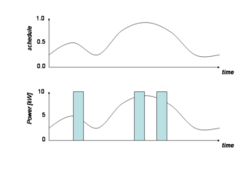
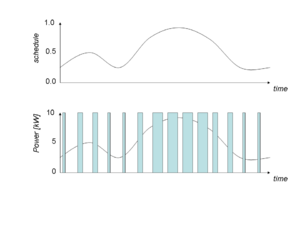
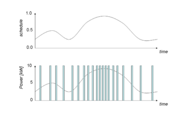
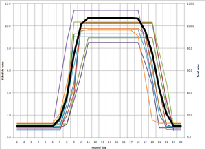

# Built-in Schedules and Loadshapes

Modelers can create schedules for built-in loadshapes using the **schedule** directive. Each schedule item creates a reusable named schedule that can be referenced later by built-in loadshapes. A schedule can either be a binary or analog series of values that vary according to time. The format for schedules is highly analogous to the _crontab_ format used to schedule jobs in Unix and Linux (see [Wikipedia for cron](http://en.wikipedia.org/wiki/Cron#Fields)). 

# Schedules

Schedules provide an alternative means of defining the behavior of objects in the model. While player files allow for unique values to be defined at arbitrary times in the simulation, schedules use a more compact format that allow the definition of values that follow patterns based on the simulated time. For example, a schedule could be useful to define an increase in load every winter weekday morning to replicate the effects of office buildings turning on their heat in preparation for the workday.

Schedules are defined using a format similar to that of cron, a scheduling tool common in the Unix/Linux world. As in the player files, schedules are used in the model files to play values into object parameters. The format consists of five fields used to specify the times in which the sixth field, the value, will be active. The fields are, in order, minutes, hours, days, months, and days of the week. Ranges of values are acceptable for each of these fields (for example, 8-20 in the hours field indicates 8am to 8pm) and any field whose value is unnecessary in defining the schedule is so designated with a “*”. Schedules are typically defined inside a model file but may also be defined in an external file and included with a `#include filename.txt` statement (where "filename.txt" is file containing the schedule).

Schedules are used to defined a value that changes over time in a pre-defined manner. All times in schedules are considered in local time, including timezone offset and daylight-saving/summer time offsets. Schedules are used by [loadshapes] and by [transforms] to apply the current value to other [built-in types]. 

The general form of a simple schedule is 
    
    
     schedule my_schedule {
       minutes hours days months weekdays value // normal GLM comments
       minutes hours days months weekdays value # schedule-specific comments
       minutes hours days months weekdays value; minutes hours days months weekdays value // semicolon or line delimited
     }

The schedule directive can contain either a simple schedule, such as 
    
    
     schedule officehours {
       * 8-17 * * 1-5 # M-F 8a to 5p
     }
    

or a complex schedule with multiple blocks, such as 
    
    
     schedule officehours {
       weekdays {
         * 8-16 * * 1-5 # Monday through Friday, 8am to 5pm
       }
       weekends {
         * 9-11,13-15 * * 6 # Saturdays, 9am-noon and 1pm to 4pm
       }
     }
    

If you want to provide values for each time interval, they can be listed after the time specification, such as 
    
    
     schedule tou_price {
        * 21-8 * * 1-5 35 # weekdays 9pm-9am, $35
        * 9-20 * * 1-5 135 # weekdays 9am-9pm, $135
        * * * * 6-0 35 # weekends, $35
     }
    

Omitted values on schedule items take on the default value of 1. Omitted times in the schedule take on the default value of 0. 

# Generic Schedule Object

The Schedule object stems from the separate schedule methods present in several objects in GridLAB-D ~ after observing that the same basic system was in place in three different objects, the conclusion was made that the Schedule should be turned into a stand-alone class that can be used by many different classes with a minimum of effort. 

# Schedules

When the Schedule initializes, it parses its schedule definition into a data structure that can be quickly traversed in order to determine the most desired value for the current time. This may be specific to the minute of the hour, to the hour of the day, to the day of the week, to the day of the month, and to the month of the year. Multiple fields may be used to narrow the particular field as desired. When the given time has been isolated, its value will be cached, and possibly pushed onto any subscribers. The schedule will then determine when it will change its value, and cache that timestamp for future use. If the schedule is called to synchronize when it does not need to determine its next value, it will short-circuit without pushing its value and without re-traversing its schedule. 

## Schedule format

The Schedule object will use the same formatting as the POSIX crontab utility. Absent scale values will be assumed to be 1.0. 

Examples: 
    
    
     * * * * * 1.0           # the value 1.0 all the time
     0-30 * * * * 1.0        # the value 1.0 for the first half of every hour
     * 8-17 * * * 0.5        # the value 0.5 from 8am to 5pm every day
     * 17-8 * * * 0.5        # the value 0.5 from 5pm to 8am every day
     * 8-12,1-17 * * * 0.5   # the value 0.5 from 8am to noon and from 1pm to 5 pm every day
     0 0 1,15 * *  0.2       # the value 0.2 at midnight on the 1st and 15th of every month
     0 12 1 * 1,7 * 0.3      # the value 0.3 at noon on the 1st of January and July
     0 12 1-7 * 1 0.4        # the value 0.4 on the first Monday of every month
    

Schedule objects may not contain more than four blocks of time values, and no block may have more than 63 unique nonzero values. All schedules implicitly use zero as the first value for their dynamic value range. 

## Schedule properties

The schedule includes the following properties: 

  * a schedule definition string
  * the current value
  * the current timestamp the current value is valid until
  * the default value to use if the current time is not defined by the schedule
## Schedule methods

The schedule has public functions... 

  * to subscribe to the automatic updating of the schedule's scalar
  * to unsubscribe to the schedule's updating
## Schedule state variables

To define a generic bimodal schedule machine, the follow variables must be defined: 

  * $s = {on,off}$ is the mode
  * $E$ is the energy (in kWh) used during the _on_ mode;
  * $V$ is the supply voltage;
  * $I_{constant}$ is the current of the constant current during the _on_ mode (in amps);
  * $Z_{constant}$ is the impedance of the constant impedance during the _on_ mode (in ohms);
  * $P_{constant}$ is the power of the constant power during the _on_ mode (in kW);
  * $P = P_{constant} + V I_{constant} + V^2 / Z_{constant}$ is the power (in kW) used during the _on_ mode;
  * $\epsilon_{t_{on}}$ is the random variation in the _on_ time (in seconds);
  * $\epsilon_{t_{off}}$ is the random variation in the _off_ time (in seconds);
  * $t_{on} = E / P + \epsilon_{t_{on}}$ is the _on_ time (in seconds);
  * $\phi = t_{on} + t_{off} + \epsilon_{t_{off}}$is the period of _on_ plus _off_ time (in seconds);
  * $\theta = t_{on} / \phi$ is the duty cycle (unitless);
  * $t_{off} = t_{on} / \theta - t_{on}$ is the duration of the _off_ time;
  * $q$ is the value of the internal state variable (unitless)
  * $\delta_{on} + \epsilon_{\delta_{t_{on}}}$ is the threshold value of $q$ at which the mode becomes _on_ ;
  * $\delta_{off} + \epsilon_{\delta_{t_{off}}}$ is the threshold value of $q$ at which the mode becomes _off_ ;
  * $r_{on} = ( \delta_{off} - \delta_{on} ) / t_{on}$ is the rate at which $q$ approaches $\delta_{off}$;
  * $r_{off} = ( \delta_{on} - \delta_{off} ) / t_{off}$ is the rate at which $q$ approaches $\delta_{on}$;
  * $q_0 = Uniform(\delta_{on},\delta_{off})$ is the initial value of the internal state variable
  * $q_{t+dt} = q_t + r_s dt$ is the value of the internal state variable at $dt$ seconds have elapsed
  * 
  $$s =\begin{cases} s_t=on: & \begin{cases}    
       q_t \ge \delta_{t_{off}}: & off \\
       q_t < \delta_{t_{off}}: & on 
     \end{cases} \\
s=off: & \begin{cases} 
       q_t \le \delta_{t_{on}}: & on \\
       q_t > \delta_{t_{on}}: & off 
     \end{cases}
\end{cases} $$

## Schedule Caveats

The use of schedules should be moderated due to their size of about 15MB apiece. If large numbers of objects take linearly related schedule input data, schedule transforms should be considered. 

### Example - Scheduling Values Directly

There are several ways to use schedule and the most obvious is to define the scheduled values as the values to be directly used. Open up the [Players/Schedules/Direct/schedules-directschedules-direct.glm](https://github.com/gridlab-d/course/blob/master/Tutorial/Chapter%204%20-%20Recorders%20and%20) file and you'll see that there are two schedules that only change based on the minute value in the current simulation time. Running this simulation and looking at the "overhead_line_losses.csv" files shows the following:

```
property.. timestamp sum(power_losses_A.real) std(power_losses_A.real)
2009-01-01 00:01:00 PST 44.961 8.76247
2009-01-01 00:02:00 PST 44.961 8.76247
2009-01-01 00:03:00 PST 44.961 8.76247
2009-01-01 00:04:00 PST 44.961 8.76247
...
2009-01-01 00:12:00 PST 44.961 8.76247
2009-01-01 00:13:00 PST 44.961 8.76247
2009-01-01 00:14:00 PST 44.961 8.76247
2009-01-01 00:15:00 PST 66.0219 18.7422
...
2009-01-01 00:27:00 PST 66.0219 18.7422
2009-01-01 00:28:00 PST 66.0219 18.7422
2009-01-01 00:29:00 PST 66.0219 18.7422
2009-01-01 00:30:00 PST 127.063 25.2421
2009-01-01 00:31:00 PST 127.063 25.2421
...
```

We can clearly see the values changing every fifteen minutes as the load changes. If the simulation is extended in duration to run from midnight to 2am, the values will repeat each hour since the "hour" field in the schedule definitions was left "*" indicating it is valid for all hours. Go ahead and adjust the simulation to run until 2am and also change the hour fields in both schedules to "0". This will only make the schedules only applicable during the times when the hour is 00 (from midnight to 1am). Re-running the simulation shows the following:

```
property.. timestamp sum(power_losses_A.real) std(power_losses_A.real) 2009-01-01 00:01:00 PST 44.961 8.76247
2009-01-01 00:02:00 PST 44.961 8.76247
2009-01-01 00:03:00 PST 44.961 8.76247
2009-01-01 00:04:00 PST 44.961 8.76247
...
2009-01-01 00:12:00 PST 44.961 8.76247
2009-01-01 00:13:00 PST 44.961 8.76247
2009-01-01 00:14:00 PST 44.961 8.76247
2009-01-01 00:15:00 PST 66.0219 18.7422
...
2009-01-01 00:27:00 PST 66.0219 18.7422
2009-01-01 00:28:00 PST 66.0219 18.7422
2009-01-01 00:29:00 PST 66.0219 18.7422
2009-01-01 00:30:00 PST 127.063 25.2421
2009-01-01 00:31:00 PST 127.063 25.2421
2009-01-01 00:32:00 PST 127.063 25.2421
...
2009-01-01 00:42:00 PST 127.063 25.2421
2009-01-01 00:43:00 PST 127.063 25.2421
2009-01-01 00:44:00 PST 127.063 25.2421
2009-01-01 00:45:00 PST 96.0241 13.2564
2009-01-01 00:46:00 PST 96.0241 13.2564
...
2009-01-01 00:58:00 PST 96.0241 13.2564
2009-01-01 00:59:00 PST 96.0241 13.2564
2009-01-01 01:00:00 PST 1.14E-24 4.42E-25
2009-01-01 01:01:00 PST 5.79E-24 2.35E-24
2009-01-01 01:02:00 PST 1.06E-24 3.91E-25
2009-01-01 01:03:00 PST 5.79E-24 2.38E-24
...
```

As you can see, the results for the first hour match that of our previous simulation. Starting at 1am, when our schedules are no longer valid, the losses go to zero, implying that the loads are no longer being applied to the system. This is in contrast to player files where the last defined value is retained by GridLAB-D™and used for any undefined period.

### Example - Schedules as Modifiers

An alternative application for schedulers is to use them to modify existing values rather than defining them directly. This allows schedules to be used to scale all of a given value in a system (load, voltage, etc) by a linear amount while allowing unique specific quantities for each object. Without this capability, getting equivalent functionality would require unique schedules for each object and it would not be obvious from examining the model file that they were all being scaled together.

Open "schedules-modify.glm" to see how this can be implemented. As we can see right away, the schedules in this model have been defined in an external file and are associated with the main model by using "#include". Opening up the referenced file "schedules.glm" we can see the two schedules used in the previous example with new values being applied.

Back in the main file, down where the loads are declared, you can see the load has been declared slightly differently with the real and reactive components as separate parameters of the object; we'll discuss why that is shortly. For each of these components the name of a schedule object is referenced multiplied by a constant value representing a baseline load level. Running this model produces the following from the "underground_line_losses.csv"

```
property.. timestamp sum(power_losses_A.real) std(power_losses_A.real)
2009-01-01 00:01:00 PST 331.432 130.199
2009-01-01 00:02:00 PST 331.432 130.199
...
2009-01-01 00:13:00 PST 331.432 130.199
2009-01-01 00:14:00 PST 331.432 130.199
2009-01-01 00:15:00 PST 548.136 215.328
2009-01-01 00:16:00 PST 548.136 215.328
2009-01-01 00:17:00 PST 548.136 215.328
...
2009-01-01 00:26:00 PST 548.136 215.328
2009-01-01 00:27:00 PST 548.136 215.328
2009-01-01 00:28:00 PST 548.136 215.328
2009-01-01 00:29:00 PST 548.136 215.328
2009-01-01 00:30:00 PST 1347.87 529.494
2009-01-01 00:31:00 PST 1347.87 529.494
...
2009-01-01 00:42:00 PST 1347.87 529.494
2009-01-01 00:43:00 PST 1347.87 529.494
2009-01-01 00:44:00 PST 1347.87 529.494
2009-01-01 00:45:00 PST 832.959 327.217
2009-01-01 00:46:00 PST 832.959 327.217
...
2009-01-01 00:57:00 PST 832.959 327.217
2009-01-01 00:58:00 PST 832.959 327.217
2009-01-01 00:59:00 PST 832.959 327.217
```

As in the previous example, the load changes every fifteen minutes as expected.

Using schedules in this way (called ["/wiki/Transform">"schedule transforms"]) comes with some non-intuitive restrictions.
* Schedule transforms don't support the complex-to-scalar operations, only scalar-to-scalar operations. For example, the following will result in an error message from GridLAB-D:
  
  * `constant_power_A_real load_schedule_2*(20000+5000j);`

* Schedule transforms don't support the use of external units such as kV,MVA,mA, etc. GridLAB-D™assumes all values are the base units even if you do something like:

  * `constant_power_A_real load_schedule_2*20 kVA;`

GridLAB-D™ will not throw an error but simply assumes the load is 20 Watts and compute the powerflow accordingly.
* Schedule transform statements must have the schedule name as the first operand. This will throw an error:

  * `constant_power_A_real 20000*load_schedule_2;`

Because of this, it is not possible to have a schedule transform where both operands are schedules.
* Schedule transform statements don't support the division operation (but do support multiplication by a fraction).

Given these restrictions, the reasoning behind the separation of  the loads in the model into real and reactive components becomes clear. Because schedule transforms don't allow for multiplication between a complex and scalar values, a complex load must be split into its real and reactive components and each one independently modified by the schedule. As was seen in the example above, this was done by appending the load values with `_real` and `_reac`.

## Limitations

There may be no more than 4 blocks, and each block may not contain more than 63 _distinct_ non-zero values. Although you may have more than 64 schedule entries in a block, the number of distinct values cannot exceed 64, and zero is always a value. If you have defined more than 63 distinct values, you can either limit the resolution over the dynamic range, or you can use a orphaned player (i.e., having no parent) as a source instead.

## Normalization

Some schedules need to be normalized before they are used, depending on the application (e.g., loadshapes). When normalization takes place it is done separately over each block. The (optionally weighted) sum of the values given within the block is the normalization coefficient — each value in the block is divided by the sum of all the values in the block. Some applications may need the signed sum and others may use the sum of the absolute values. 

When weighting is used it is based on the fraction of minutes over which the value applies with respect to the total minutes over which the block applies. Only minutes that are explicitly listed in the block are count—omitted times (which are associated with the value 0.0) are ignored. If you wish to have the value 0 counted in the weighting, you must include the times for which it applies as well. 

Normalization is controlled using the following options 

* **normal**
    enables normalization so that all values in each block are divided by the sum of the values in the block.
* **absolute**
    normalization sums uses absolute values instead signed values. Its inclusion implies **normal**.
* **weighted**
    normalization sums uses time-weighted values instead of simple values. Its inclusion implies **normal**.

Normalization options should be provided in-line, such as 
    
    
     schedule demand {
        weighted; 
        * 21-8 * * 1-5 1.2 # weekdays 9pm-9am, weeknights
        * 9-20 * * 1-5 1.5 # weekdays 9am-9pm, weekdays
        * * * * 6-0    0.8 # weekends, weekends
     }
    

which enables normalization using time-weighted values. 

### Nonzero

The `nonzero` flag can be used to ensure that the schedule does not contain any undefined or zero values: 
    
    
     schedule demand {
        nonzero; 
        * 21-8 * * 1-5 1.2 # weekdays 9pm-9am, weeknights
        * 9-20 * * 1-5 1.5 # weekdays 9am-9pm, weekdays
        * * * * 6-0    0.8 # weekends, holidays
     }
    

### Positive

The `positive` flag can be used to ensure that the schedule does not contain any negative values: 
    
    
     schedule demand {
        positive; 
        * 21-8 * * 1-5 1.2 # weekdays 9pm-9am, weeknights
        * 9-20 * * 1-5 1.5 # weekdays 9am-9pm, weekdays
        * * * * 6-0    0.8 # weekends, holidays
     }
    

### Boolean

The `boolean` flag can be used to ensure that the schedule contains on 0 or 1 values: 
    
    
     schedule demand {
        boolean; 
        * 21-8 * * 1-5 1 # weekdays 9pm-9am, weeknights
        * 9-20 * * 1-5 1 # weekdays 9am-9pm, weekdays
        * * * * 6-0    0 # weekends, holidays
     }
    

### Absolute

The `absolute` flag can be used to ensure that the schedule normalization uses only positive magnitudes: 
    
    
     schedule demand {
        absolute; 
        * 21-8 * * 1-5 1.2 # weekdays 9pm-9am, weeknights
        * 9-20 * * 1-5 1.5 # weekdays 9am-9pm, weekdays
        * * * * 6-0    0.8 # weekends, holidays
     }
    
## Schedule transforms

Any _double_ property can be driven from a schedule using a _schedule transform_. Schedule transforms are linear functions that convert a schedule-driven value to a property of an object. A schedule transform can be define by simply describing the function when the property is set, as in 
    
    
     schedule occupancy_schedule {
       * 8-16 * * 1-5
     }
     object small_building {
       n_occupants 10*occupancy_schedule;
     }
     object large_building {
       n_occupancy 100*occupancy_schedule+1;
     }
    

The value of the property is updated before the _presync_ pass, immediately after the schedules are updated. 

As of [Grizzly (Version 2.3)]
    Any property with an underlying numeric value may be driven by a transform. This includes double, complex, bool, [int16], int32, [int64], set, enumeration, [timestamp], [loadshape], and [enduse]. In cases where the underlying data type is compatible, the value will be cast according to the C/C++ type-casting rules.

As of [Hassayampa (Version 3.0)]
    A transform may also link a variable to an external function defined using the [extern] directive.

## Caveats

There are some notable differences from the _cron_ syntax: 

  1. The alternate use of _day_ and _weekday_ is not supported. If both day and weekday are not *, they are considered as _day_ AND _weekday_ rather than OR.
  2. The _step by_ syntax (using /) is not supported.
  3. The special keywords (e.g., @hourly, @daily) are not supported.
  4. The weekday 7 refers to holidays, which can occur any day of the week. Holidays are not supported yet, but will be someday.

Because all times are considered in local time, there is a possibility that scheduled changes during on the daylight-savings/summer time (DST) shifts could result in a missing or duplicate value. For example, scheduling an event at 2am the night DST ends may result in a duplicate value. The solution is to schedule the event either before or after am so the ambiguity is resolved internally as appropriate. Similarly, scheduling an event at 2am the night DST starts could result in a gap in the schedule, a problem also resolved by scheduling the event either before or after 2am so the gap is automatically filled by the schedule compiler. 


# Load shapes

The **loadshape** property is a finite-state machine that takes on the value of a complex power when synchronized. A loadshape is associated with a schedule, and requires a number of parameters to define its behavior. There are 4 types of loadshape, and each has a difference set of parameters that define it. 

## Analog loadshapes

The present value in the raw load shape is copied to the property directly. If the energy is non-zero, then $power = value \times energy / interval$. 

The power of the load is the average energy computed above divided by the load shape interval. Typically, this is 1 hour, so the power in (kW) is equal to the energy/duration in (kWh/h). Do not assume that this is always true. 


Figure 1 - Example of an analog loadshape

Table 1 - Analog load shape parameters  Parameter | Unit | Default | Source | Description   
---|---|---|---|---  
raw_value | kWh/h | 0.0 | load shape | The value of the load shape for the end-use at the given time   
value | pu.kWh/h | 0.0 | load shape | The raw load shape value / the total area of the load shape   
energy | kWh | 1.0 | load shape | The magnitude of the complete load shape (i.e., the area under the curve)   
interval | s | 3600 | load shape | The time over which the load shape value prevails 

Analog loadshapes directly compute the power from the values in the schedule. An analog loadshape is defined using the following terms: 
    
    
     class example {
       loadshape myshape;
     }
     object fixed-energy {
       myshape "type: analog; schedule: _schedule-name_ ; energy: _value_ kWh";
     }
     object scaled-power {
       myshape "type: analog; schedule: _schedule-name_ ; power: _value_ kW";
     }
     object unscaled {
       myshape "type: analog; schedule: _schedule-name_ ";
     }
    

  
The _schedule_ parameter specifies which schedule is to be used. When the _energy_ is given, the schedule is used to create a shape that consumes the specified energy in each schedule block. The power required is based on the fraction of energy allocated to each time interval. 

When the _power_ scale is given, the scheduled value is multiplied by the _power_. 

When neither _energy_ nor _power_ is given, the schedule value is used directly as the power. 

A standard deviation on the _energy_ or _power_ value can be given, in which case each instance of the loadshape that is generated will use an error drawn from the triangle distribution from -3 to +3, such that 

_value_ ← _value_ \+ _stdev_ * Triangle[-3,3]

The _stdev_ term can be given units and it will be scaled accordingly, e.g., 
    
    
     object stdev-power {
       myshape "type: analog; schedule: _schedule-name_ ; power: _value_ kW; stdev _error_ W";
     }
    

## Pulsed loadshapes

The probability of a pulse being generated is proportional to the value multiplied by the scalar: $Prob\\{on\\} = value \times scalar$. 

The energy is the energy of entire load shape. If the duration of the pulse is non-zero, then the end-use power is the energy divided by the duration: $power = energy / duration$. 

If the constant power, current, and/or impedance of the pulse is non-zero, then the duration of the pulse is the energy divided by the actual power: $duration = energy / power$. 

Either power or duration must be specified. If neither is specified, it is an error. 

There can be no more than one pulse per interval. 



Figure 2 - Example of a pulsed loadshape

Table 1 - Random pulse load shape parameters  Parameter | Unit | Default | Source | Description   
---|---|---|---|---  
raw_value | kWh/h | 0.0 | load shape | The value of the load shape for the end-use at the given time   
value | pu.kWh/h | 0.0 | load shape | The raw load shape value / the total area of the load shape   
scalar | pu | 1.0 | load shape | The number of random pulses generated per load shape   
energy | kWh | 1.0 | load shape | The energy of complete load shape (i.e., the area under the curve)   
interval | s | 3600 | load shape | The time over which the load shape value prevails   
duration | s | 0 | load shape | The duration of the pulse, if constant   
power | kW | 0 | load shape | The nominal power of the pulse, if constant   

Pulsed loadshapes emit 1 or more pulsed at random times such that the total energy is accumulated over the period of the loadshape. A pulsed loadshape is defined using the following terms: 
    
    
     class example {
       loadshape myshape;
     }
     object sample {
       myshape "type: pulsed; schedule: _schedule-name_ ; energy: _value_ kWh; count: _value_ ; duration: _value_ s";
     }
    

or 
    
    
     class example {
       loadshape myshape;
     }
     object sample {
       myshape "type: pulsed; schedule: _schedule-name_ ; energy: _value_ kWh; count: _value_ ; power: _value_ kW";
     }
    

The first form define a series of pulses with constant duration, and the second form defines a series of pulses with constant power. When the duration is constant, the power will vary in response to changes in voltage such that the amount of energy used during a loadshape block is as specified. When the power is constant, the duration will vary in response to changes in voltage such that the amount of energy used is constant. Only one of the two may be specified, and at least one must be specified. 

The **count** parameter determine how many pulses will be generated during a loadshape block. The value is optional and the default value is 1.0. 

A standard deviation on the _duration_ or _power_ value can be given, in which case each instance of the loadshape that is generated will use an error drawn from the triangle distribution from -3 to +3, such that 

_value_ ← _value_ \+ _stdev_ * Triangle[-3,3]

The _stdev_ term can be given units and it will be scaled accordingly, e.g., 
    
    
     object stdev-power {
       myshape "type: analog; schedule: _schedule-name_ ; power: _value_ kW; stdev _error_ W";
     }
    

## Modulated loadshapes

The loadshape value is the energy of a series of pulse generated during the interval and is equal to the shape value multiplied by the scalar: $ count = value \times scalar$. 

The energy specifies the total energy used during a complete load shape. The period is interval divided by the loadshape value: $period = interval / value / scalar$. 

If the power of a pulse is non-zero, then the duration is the energy divided by the power divided by the loadshape value: $duration = energy / power / scalar$. 

If the power is not specified (i.e., power is zero), then the duration must be specified. The power is energy divided by the duration divided by the scalar: $power = energy / duration / scalar$. 


Figure 2a - Example of a amplitude modulated loadshapes



Figure 2b - Example of a pulse-width modulated loadshapes



Figure 2c - Example of a frequency modulated loadshapes

Table 1 - Random pulse load shape parameters  Parameter | Unit | Default | Source | Description   
---|---|---|---|---  
raw_value | kWh/h | 0.0 | load shape | The value of the load shape for the end-use at the given time   
value | pu.kWh/h | 0.0 | load shape | The raw load shape value / the total area of the load shape   
scalar | pu | 1.0 | load shape | The count of pulses during a complete load shape.   
interval | s | 3600 | load shape | The time over which the load shape value prevails   
energy | kWh | 1.0 | load shape | The energy of complete load shape (i.e., the area under the curve)   
duration | s | 0 | load shape | The duration of the pulse, if constant   
power | kW | 0 | load shape | The nominal power of the pulse, if constant   

Modulated loadshapes emit a continuous sequence of modulated pulses with either constant period and duty-cycle(**amplitude**), or constant power and off-time (**pulsewidth**), or constant power and on-time (**frequency**). A modulated loadshape is defined using the following terms: 
    
    
     class example {
       loadshape myshape;
     }
     object sample {
       myshape "type: modulated; modulation: _modulation_ ; schedule: _schedule-name_ ; energy: _value_ kWh; count: _value_ ; period: _value_ s";
     }
    

or 
    
    
     class example {
       loadshape myshape;
     }
     object sample {
       myshape  "type: modulated; modulation: _modulation_ ; schedule: _schedule-name_ ; energy: _value_ kWh; count: _value_ ; power: _value_ kW";
     }
    

A standard deviation on the _duration_ or _power_ value can be given, in which case each instance of the loadshape that is generated will use an error drawn from the triangle distribution from -3 to +3, such that 

_value_ ← _value_ \+ _stdev_ * Triangle[-3,3]

The _stdev_ term can be given units and it will be scaled accordingly, e.g., 
    
    
     object stdev-power {
       myshape "type: analog; schedule: _schedule-name_ ; power: _value_ kW; stdev _error_ W";
     }
    
### Amplitude Modulation


Figure 1 - Example of an amplitude modulated loadshape

Modulated loadshapes where the power varies as a function of load have fixed duty cycle and period have amplitude modulation. AM is indicated by _modulation_ = MMT_AMPLITUDE, and 
    
    
     period[s/pulse] = duration[s/event] / pulsecount[pulse/event]
     MPT_TIME:  duty_cycle[1] = pulsevalue[s/pulse] / period[s/pulse]
     MPT_POWER: duty_cycle[1] = energy[kWh/event] / pulsevalue[kW] / duration[s/event] * 3600[s/h] 
     power[kW] = schedulevalue[kWh/h/event] * scalar[/event]
     ton[s/pulse] = duty_cycle[1]* period[s/pulse]
     toff[s/pulse] = period[s/pulse] - ton[s/pulse]
    

### Pulse-width Modulation

[](/wiki/File:Pw_modulated_loadshape.png)

Figure 2b - Example of a pulse-width modulated loadshapes

Modulated loadshapes where the power is fixed and the period is fixed have pulse-width modulation. PWM is indicated by _modulation_ = MMT_PULSEWIDTH, and 
    
    
     MPT_TIME: power[kW] = energy[kWh/h] / pulsevalue[s/pulse]
     MPT_POWER: power[kW] = pulsevalue[kW]
     pulsecount[cycle] = energy[kWh] / power[kW] * duration[s] / 3600[s/h]
     period[s/cycle] = duration[s] / pulsecount[cycle]
     ton[s] = schedulevalue[kWh/h] * scalar[kW/cycle] / energy[kWh] / pulsecount[/cycle]
     toff[s] = period[s/cycle] * 1[unit] - ton[s]
     duty_cycle[cycle] = ton[s] / period[s/cycle]
    

### Frequency Modulation

Modulated loadshapes where the power is fixed and the on-time is fixed have frequency modulation. FM is indicated by _modulation_ = MMT_FREQUENCY, and 
    
    
     MPT_TIME: 
       ton[s/pulse] = pulsevalue[s/pulse]
       power[kW] = pulseenergy[kWh/pulse] / ton[s/pulse] * 3600[s/h]
     MPT_POWER: 
       power[kW] = pulsevalue[kW]
       ton[s/pulse] = pulseenergy[kWh/pulse] / power[kW] * 3600[s/h]
     dutycycle = energy[kWh/event] / schedulevalue[kWh/event] / scalar
     period[s/pulse] = ton[s/pulse] / dutycycle
     toff[s] = period[s/pulse] - ton[s/pulse]

## Queued loadshapes

The normalized load shape value multiplied by the energy divided by the interval is the accrual rate $r_{off} = value \times scalar / interval $. The queue must be initialized to a random value between $q_{on}$ and $q_{off}$, which are specified in the load shape. 

If the power is non-zero, then when the load is on, the accrual rate also includes the power, e.g., $r_{on} = r_{off} - power / energy$. The queue is incremented by the accrual rate times the timestep $q += r_x dt$. When the queue exceeds $q_{on}$, the state of the machine switches to _on_ , and the load is calculated accordinately (see below). When the queue falls below $q_{off}$, the state of the machine switches to _off_. The duration of a pulse is the time taken to move from $q_{on}$ to $q_{off}$ at the rate $r_{on}$. 

If the duration is non-zero, then it must be set to the time required to decrement the queue by 1 unit and $power = r_{off} - (q_{on} - q_{off}) / duration$. 

When the load is on, the on-power (including on-current and on-impedance fractions) is applied to the target end-use load and when the load is off, the off-power (including off-current and off-impedance) is is applied to the target end-use load. 

Table 1 - Random pulse load shape parameters  Parameter | Unit | Default | Source | Description   
---|---|---|---|---  
raw_value | kWh/h | 0.0 | load shape | The value of the load shape for the end-use at the given time   
value | pu.kWh/h | 0.0 | load shape | The raw load shape value / the total area of the load shape   
interval | s | 3600 | load shape | The time over which the load shape value prevails   
energy | kWh | 1.0 | load shape | The energy of complete load shape (i.e., the area under the curve)   
duration | s | 0 | load shape | The duration of the pulse, if constant   
power | kW | 0 | load shape | The nominal power of the pulse, if constant   
scalar | pu | 1 | load shape | The total accrual on the queue for one complete load shape   
q_on | pu | 1 | load shape | The queue accrual value at which the machine turns on   
q_off | pu | 0 | load shape | The queu accrual value at which the machine turns off 


Figure 2 - Example of a queued loadshape

Queued loadshapes emit random pulses whenever a queue accrued from the loadshape reaches an on threshold and continues emitting pulses until the queue reaches an off threshold. A queued loadshape is defined using the following terms: 
    
    
     class example {
       loadshape myshape;
     }
     object sample {
       myshape  "type: pulsed; schedule: _schedule-name_ ; energy: _value_ kWh; count: _value_ ; duration: _value_ s; q_on: _value_ ; q_off: _value_ ";
     }
    

or 
    
    
     class example {
       loadshape myshape;
     }
     object sample {
       myshape  "type: pulsed; schedule: _schedule-name_ ; energy: _value_ kWh; count: _value_ ; power: _value_ kW; q_on: _value_ ; q_off: _value_ ";
     }
    

The values of _q_on_ and _q_off_ are in the same units as the integrals of the normalized loadshape and _q_on_ must be greater than _q_off_. 

A standard deviation on the _duration_ or _power_ value can be given, in which case each instance of the loadshape that is generated will use an error drawn from the triangle distribution from -3 to +3, such that 

_value_ ← _value_ \+ _stdev_ * Triangle[-3,3]

The _stdev_ term can be given units and it will be scaled accordingly, e.g., 
    
    
     object stdev-power {
       myshape "type: analog; schedule: _schedule-name_ ; power: _value_ kW; stdev _error_ W";
     }
    

## Scheduled loadshapes



A scheduled loadshape is defined for a population of objects and the aggregate value (heavy black) diversity is built in.

A schedule-based loadshape syntax available from Version 2.1 on has a number of important advantages. 

  1. The definition syntax of the schedule is simpler and more intuitive.
  2. The definition incorporates diversity characteristics that are common in populations of buildings.
For example 
    
    
     class example {
       loadshape myshape;
     }
     object sample {
       myshape  "type: scheduled; weekdays: MTWRF; on-time: 6<8~1<10; off-time: 15<16~1<18; on-ramp: 0.5<1~0.5<1.5; off-ramp: 1<2~1<3; low: 1<2~1<3high: 10<15~2<20 kW;
     }
    

will generate a randomized ramped 8-hour pulse at roughly 10 kW Monday through Friday. Weekdays are defined as 

  * U=sunday,
  * M=monday,
  * T=tuesday,
  * W=wednesday,
  * R=thursday,
  * F=friday,
  * S=saturday, and
  * H=holiday.

Values are provided in the format 

     _min_ <_mean_ ~_stdev_ <_max_
    

If the min or the max are omitted, then 3 σ is used. If the stdev is omitted, then 0 is used (meaning the value is invariant). 

The syntax for varying values (mean~stdev) allows the same definition to be used for multiple objects, e.g., 
    
    
     #define SCHEDULE_1="weekdays: MTWRF; on-time: 8~1; off-time: 16~1; on-ramp: 1~0.5; off-ramp: 2~1;"
     object sample {
       myshape  "type: scheduled; SCHEDULE_1; power: 15~2 kW;
     }
    

# Reading loads

Loadshapes publish their characteristics when output through a string (say to XML, GLM, or a stream) so to read the actual load at any given time it is necessary to use an alias to access the end-use load. Currently, aliases are not supported in runtime classes, but a module may publish the load alias using the following form 
    
    
     ..., 
     PT_loadshape, "plugshape", &plugs, 
       PT_double, "plugload[kW]", &(plugs.load), 
     ...
    

# Enduse data

Objects should use load data as a part of **enduse** properties. The **enduse** property encapsulates information about how a load is converted to a power, accumulated to an energy and heat gain. The structure is 
    
    
    typedef struct s_enduse {
           loadshape *shape; /* reference to the loadshape from which _load_ is read
           set config; /* enduse configuration (i.e., IS220) */    
           complex total; /* total power (sum of 
           complex admittance; /* constant impedance portion of load in kW) */
           complex current; /* constant current portion of load in kW) */
           complex power; /* value of power in kW */
           complex energy; /* accumulated energy in kWh */
           complex demand; /* peak power observed (can be periodically reset) */
           double impedance_fraction; /* fraction of load that is constant impedance */
           double current_fraction; /* fraction of load that is constant current */
           double power_fraction; /* fraction of load that is constant power */
           double power_factor; /* power factor of load */
           complex voltage_factor; /* voltage in pu */
           double heatgain; /* internal heat from load */
           double heatgain_fraction; /* fraction of power that goes to internal heat */
    } enduse;
    

End-use power fractions are update differently depending on whether the end-use is driven from a loadshape or driven externally. 

When driven from a loadshape, the power, current, and impedance fraction are updated first, along with the total power and they are used to calculate the constant power, current, and admittance portion of the total power. 

When driven externally, the constant power, current, and admittance portion of the total power are update first, and the fractions and total power are calculated from them. 

When _enduse_recalc_ is called, the following calculations are made, depending on the update requested. When a _presync_ update is requested the energy is calculated as a function of the power and time given, i.e., 
    
    
     enduse_recalc(int PC_PRESYNC, double dt)
    

$$energy = power \times dt$$

Important - 
    The _presync_ update is done automatically by the main executive and should not be called explicitly by the object's _presync_ implementation, if any.

When a sync update is requested the power is calculated as a function load, and the heat is updated as a function of power, i.e., 
    
    
    enduse_recalc(int PC_SYNC)
    

$$power = set\_power\_factor(shape_{load},power\_factor) \left ( power\_fraction + \frac{current\_fraction}{voltage} + \frac{impedance\_fraction}{voltage^2} \right ) $$

$$heatgain = power_{real} \times heatgain\_fraction$$

Important -
    The **enduse** _sync_ update is not performed automatically and must be called by the _sync_ operation of the object that implements the **enduse**. This is done using the _gl_enduse_sync_ call:
    
    
    TIMESTAMP myclass::sync(TIMESTAMP t0, TIMESTAMP t1)
    {
        TIMESTAMP t2 = TS_NEVER;
    
        /* ... my calcs before enduse sync */
    
        /* synchronize my enduse property */
        TIMESTAMP t3 = gl_enduse_sync(myenduse,t1);
        if (t3<t2) t2=t3;
        /* power and heatgain are now set based on loadshape */
    
        /* continue with calcs ... */
    
        return t2;
    }
    

The limitation is for performance reasons — there is at present no efficient way to determine which **enduse** blocks belong to which objects and consequently the _sync_ operation in the core cannot know when each block needs to be updated. Furthermore, depending on the implementation of the object's _sync_ function, the synchronization of the **enduse** block may need to occur in the middle of the object _sync_. For these reasons, the **enduse** _sync_ must be called explicitly during the object _sync_ at the appropriate time. 

# Module integration

There are two ways to use schedules, loadshapes, and enduses in modules. The first is to directly drive the enduse from the loadshape. This is done by including the statement 
    
    
     load.shape = &shape;
    

which in the case of residential enduses is done in `residential_enduse::create()`. In this case, the total power is calculated based on the load and the enduse fraction, e.g., 

_total r_ = _load_ ( _f V_ ( _f V Zf_ \+ _I f_ ) + _P f_ )   
_total i_ = Sgn(_pf_) _total r_ (_pf_ -2 -1)1/2

The second way separates the loadshape from the enduse so that a model of how the load converts to power can be explicitly given. In this case, the above statement is omitted, leaving `load.shape` null. 

Now you must provide the ZIP components as actual real and reactive quantities and the total power is computed, e.g., 

_total r_ = _f V_ ( _f V Zr_ \+ _I r_ ) + _P r_   
_total i_ = _f V_ ( _f V Zi_ \+ _I i_ ) + _P i_  

In addition, the enduse load is named using a statement like, 
    
     load.name = oclass->name;
    

so that the convention of naming the enduse the same as the class that implements it is observed. 

# Caveats

Modules that implement defaults in the style commonly used in Version 1 of GridLAB-D will find that this is no longer possible. The following changes are required to use loadshapes and enduses. 

  1. You can rely on _object_create_single_ to both clear memory and properly create and initialize both _loadshape_ properties and _enduse_ properties.

  2. All other object property defaults must be done in _create_.
