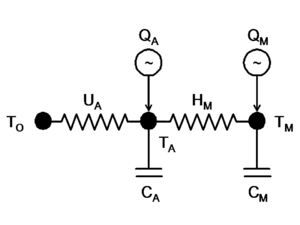

# ETP closed form solution
TODO: Check equation numbering for consistency

Note, this documentation was converted from a Word document and Excel spreadsheet implementation. The methodology described is the same as used in the GridLAB-D code base (see [Caveats] below), although, over time additions have been made to allow for greater flexibility. Additionally modifications have been made to speed up the solution process as implemented in code. The solution methodology, as described here and implemented in GridLAB-D was validated against the referenced spreadsheet. 

## Synopsis

The solution for the indoor air temperature and mass temperatures of the ETP model shown in Figure 1 is given. 

Figure 1. Equivalent Thermal Parameters Circuit Modeled by House-e.

## General Solution to ETP model

Given at the time $t$: 

$T_A$ is the indoor air temperature, and
$T_M$ is the building mass temperature

and the constant values 

$T_O$ is the outdoor air temperature,
$Q_A$ is the heat added to the indoor air,
$Q_M$ is the heat added to the building mass,
$U_A$ is the building envelop conductivity to the indoor air,
$C_A$ is the heat capacity of the indoor air,
$H_M$ is the building mass conductivity to the indoor air, and
$C_M$ is the heat capacity of the building mass.

The heat balance on $T_A$ is 

$$
    0 = Q_A - U_A ( T_A - T_O ) - H_M ( T_A - T_M ) - C_A \frac{d}{dt}T_A
    \qquad (1)
$$
    

Rearranging (1) in the form for solving a differential equation: 

$$
    0 = Q_A - ( U_A + H_M ) T_A + U_A T_O + H_M T_M - C_A \frac{d}{dt}T_A
    \qquad (1.1)
$$
    

$$
    \frac{d}{dt}T_A +\frac {U_A+H_M} {C_A} T_A - \frac {H_M} {C_A} T_M - \frac {U_A} {C_A} T_O - \frac {Q_A} {C_A} = 0
    \qquad (1.2)
$$
    

The heat balance on $T_M$ is 

$$
    0 = Q_M - H_M ( T_M - T_A ) - C_M \frac{d}{dt}T_M
    \qquad (2)
$$
    

### Derivation of ETP second-order ODE

Solving (2) for $T_A$ gives: 

$$
    0 = Q_M - H_M T_M + H_M T_A - C_M \frac{d}{dt}T_M
    \qquad (2.1)
$$
    

$$
    T_A = \frac {C_M} {H_M} \frac{d}{dt}T_M + T_M - \frac {Q_M} {H_M}
    \qquad (2.2)
$$
    

Differentiating (2.2): 

$$
    \frac{d}{dt}T_A = \frac {C_M} {H_M} \frac{d^2}{dt^2}T_M + \frac{d}{dt}T_M
    \qquad (2.3)
$$
    

Solving (1.2) for $T_M$ gives: 

$$
    T_M = \frac {C_A} {H_M} \frac{d}{dt}T_A + \frac {U_A+H_M} {H_M} T_A - \frac {U_A} {H_M} T_O - \frac {Q_A} {H_M}
    \qquad (1.3) $$
    

Differentiating (1.3): 

$$
    \frac{d}{dt}T_M = \frac {C_A}{H_M} \frac{d^2}{dt^2}T_A + \frac {U_A+H_M} {H_M} \frac {d}{dt}T_A 
    \qquad (1.4)
$$
    

Rearranging (2.1): 

$$
    0 = C_M \frac{d}{dt}T_M + H_M T_M - Q_M - H_M T_A
    \qquad (2.4)
$$
    

Substituting (1.3) and (1.4) into (2.4) gives: 

$$
    0 = \left [ \frac {C_M C_A} {H_M} \frac{d^2}{dt^2}T_A + \frac {C_M(U_A+H_M)} {H_M} \frac{d}{dt}T_A \right ]
    + \left [ C_A \frac{d}{dt}T_A + (U_A + H_M) T_A - U_A T_O - Q_A \right ]
    - Q_M - H_M T_A
    \qquad (2.5)
$$
    

Rearranging into the form of a differential equation gives: 

$$
    \frac {C_M C_A} {H_M} \frac{d^2}{dt^2}T_A + \left [ \frac {C_M(U_A+H_M)} {H_M} + C_A \right ] \frac{d}{dt}T_A + U_A T_A = Q_M + Q_A + U_A T_0
    \qquad (3)
$$
    

or 

$$
    \frac {C_M C_A} {H_M} \frac{d^2}{dt^2}T_A + \left [ C_M \frac {U_A} {H_M} + C_M + C_A \right ] \frac{d}{dt}T_A + U_A T_A = Q_M + Q_A + U_A T_0
    \qquad (3.1)
$$
    

or 

$$
    a \frac{d^2}{dt^2}T_A + b \frac{d}{dt}T_A + c T_A = d
    \qquad (3.2)
$$
    

with 

$$
    a = \frac {C_M C_A} {H_M}
    \qquad (3.3a)
$$
    

$$
    b = C_M \frac {U_A} {H_M} + C_M + C_A = \frac {C_M(U_A+H_M)} {H_M} + C_A
    \qquad (3.3b)
$$
    

$$
    c = U_A
    \qquad (3.3c)
$$
    

$$
    d = Q_M + Q_A + U_A T_0
    \qquad (3.3d)
$$
    

## Indoor air temperature

The indoor air temperature is found by solving equation (3.2). A different solution method is used depending on whether $d$ is constant with time. 

### Fixed conditions

Let $T_A = e^{r t}$. Then: 

$$
    \frac{d}{dt}T_A = r e^{r t}
$$
    

$$
    \frac{d^2}{dt^2}T_A = r^2 e^{r t}
$$

, and
    

$$
    a r^2 e^{r t} + b r e^{r t} + c e^{r t} = d
    \qquad (3.4)
$$
    

The homogeneous (d=0) solution to (3.4) is 

$$
    a r^2 + b r + c = 0
    \qquad
$$
    

so 

$$
    r = \frac {-b \pm \sqrt{b^2-4ac}} {2a}
$$
    

$$
    r_1 = \frac {-b +\sqrt{b^2-4ac}} {2a}
    \qquad (3.4.1)
$$
    

$$
    r_2 = \frac {-b - \sqrt{b^2-4ac}} {2a}
    \qquad (3.4.2)
$$
    

From (3.3b): 

$$
    \begin{alignat}{2}
    b^2 & = \left [ \frac {C_M(U_A+H_M)} {H_M} + C_A \right ]^2 \\
        & = C_M^2 \left ( 1+\frac{U_A}{H_M} \right )^2 + 2 C_M \left ( 1+\frac{U_A}{H_M} \right ) C_A + C_A^2 \\
        & = C_M^2 + 2 C_M^2 \frac{U_A}{H_M} + C_M^2 \frac{U_A^2}{H_M^2} + 2 C_M C_A + 2 C_M \frac{U_A}{H_M} C_A + C_A^2
    \end{alignat} 
$$
    

From (3.3a) and (3.3c): 

$$
    4ac = 4 \left ( \frac {C_M C_A} {H_M}\right ) U_A
$$
    

So 

$$
    \begin{alignat}{2}
    b^2-4ac & = C_M^2 + 2 C_M^2 \frac{U_A}{H_M} + C_M^2 \frac{U_A^2}{H_M^2} + 2 C_M C_A + 2 C_M \frac{U_A}{H_M} C_A + C_A^2 - 4 \left ( \frac {C_M C_A} {H_M}\right ) U_A \\
    & = C_M^2 \left [ 1 + 2\frac{U_A}{H_M}+ \frac{U_A^2}{H_M^2} + \frac{C_A}{C_M} + 2\frac{U_A}{H_M} \frac{C_A}{C_M} + \frac{C_A^2}{C_M^2} - 4 \frac{U_A}{H_M} \frac{C_A}{C_M} \right ] \\
    & = C_M^2 \left [ 1 + 2\frac{U_A}{H_M} + 2\frac{C_A}{C_M} \right ] + C_M^2 \left [ \frac{U_A^2}{H_M^2} - 2\frac{U_A}{H_M} \frac{C_A}{C_M} + \frac{C_A^2}{C_M^2}  \right ] \\
    & = C_M^2 \left [ 1 + 2\frac{U_A}{H_M} + 2\frac{C_A}{C_M} \right ] + C_M^2 \left [ \frac{U_A}{H_M} - \frac{C_A}{C_M}  \right ]^2 \\
    & > 0
    \end{alignat} 
$$
    

which guarantees that $r_1$ and $r_2$ are real and distinct numbers. 

Then we have 

$$
    (T_A)_C = A_1 e^{r_1 t} + A_2 e^{r_2 t}
    \qquad (3.5)
$$
    

and 

$$
    T_A = (T_A)_C + (T_A)_P = A_1 e^{r_1 t} + A_2 e^{r_2 t} + (T_A)_P
    \qquad (3.6)
$$
    

$$
    \frac{d}{dt}T_A = A_1 r_1 e^{r_1 t} + A_2 r_2 e^{r_2 t}
    \qquad (3.6.1)
$$
    

$$
    \frac{d^2}{dt^2}T_A = A_1 r_1^2 e^{r_1 t} + A_2 r_2^2 e^{r_2 t}
    \qquad (3.6.2)
$$ 
    

Substituting into (3.2) 

$$
    a A_1 r_1^2 e^{r_1 t} + a A_2 r_2^2 e^{r_2 t} +
    b A_1 r_1 e^{r_1 t} + b A_2 r_2 e^{r_2 t} +
    c A_1 e^{r_1 t} + c A_2 e^{r_2 t} = d
    \qquad (3.7)
$$
    

$$
    A_1 e^{r_1 t} \underbrace{(a r_1^2+b r_1+c)}_{0} + A_2 e^{r_2 t} \underbrace{(a r_2^2+b r_2+c)}_{0}
    + c(T_A)_P=d
$$
    

$$
    (T_A)_P = \frac{d}{c}
    \qquad (3.7.1)
$$
    

The general solution is: 

$$
    T_A = A_1 e^{r_1 t} + A_2 e^{r_2 t} + \frac{d}{c}
    \qquad (3.8)
$$
    

$$
    T_A = A_1 e^{r_1 t} + A_2 e^{r_2 t} + \frac{Q_A+Q_M}{U_A} + T_O
    \qquad (3.8.1)
$$
    

With the known boundary conditions at $ t=0$, $T_A(0)$ and $\frac{d}{dt}T_A(0)$

$$
    T_A(0) = A_1 + A_2 + \frac{d}{c}
    \qquad (4)
$$
    

$$
    0 = A_1 + A_2 + \left ( \frac{d}{c} - T_A(0) \right )
    \qquad (4.1)
$$
    

$$
    \frac{d}{dt}T_A(0) = A_1 r_1 + A_2 r_2
    \qquad (5)
$$
    

$$
    0 = A_1 r_1 + A_2 r_2 - \frac{d}{dt}T_A(0)
    \qquad (5.1)
$$
    

Then $A_1$ and $A_2$ can be found by subtracting (5) from (4) to eliminate $A_2$: 

$$
    \begin{alignat}{2}
    r_2 T_A(0) - \frac{d}{dt}T_A(0) & = r_2 A_1 + r_2 A_2 + r_2 \frac{d}{c} - r_1 A_1 - r_2 A_2 \\
    & = (r_2 - r_1) A_1 + r_2 \frac{d}{c}
    \end{alignat}
    \qquad (6)
$$
    

$$
    A_1 = \frac {r_2 T_A(0) - \frac{d}{dt}T_A(0) - r_2 \frac{d}{c} } {r_2 - r_1}
    \qquad (6.1)
$$
    

From (6.1) and (4) 

$$
    A_2 = T_A(0) - \frac{d}{c} - \frac { r_2 T_A(0) - \frac{d}{dt}T_A(0) - r_2 \frac{d}{c} } {r_2 - r_1}
    \qquad (7)
$$
    

$$
    A_2  = T_A(0) \left ( 1 + \frac{r_2}{r_2-r_1} \right ) + \frac{d}{c} \left ( \frac{r_2}{r_2-r_1} - 1 \right ) - \left ( \frac{1}{r_2-r_1} \right) \frac{d}{dt}T_A(0)
    \qquad (7.1)
$$
    

### Forced conditions

Given at the time $t$: 

$T_A(t)$ is the indoor air temperature, and
$T_M(t)$ is the building mass temperature
$T_O(t)$ is the outdoor air temperature,
$Q_A(t)$ is the heat added to the indoor air,
$Q_M(t)$ is the heat added to the building mass,

and the constant values 

$U_A$ is the building envelop conductivity to the indoor air,
$C_A$ is the heat capacity of the indoor air,
$H_M$ is the building mass conductivity to the indoor air, and
$C_M$ is the heat capacity of the building mass.

The heat balance on $T_A$ is 

$$
    0 = Q_A(t) - U_A ( T_A(t) - T_O(t) ) - H_M ( T_A(t) - T_M(t) ) - C_A \frac{d}{dt}T_A(t)
    \qquad (1a)
$$
    

$$
    0 = Q_M(t) - H_M ( T_M(t) - T_A(t) ) - C_M \frac{d}{dt}T_M(t)
    \qquad (2a)
$$
    
Rearranging (1a) and (2a) in the form for solving a differential equation: 

$$
    \frac{d}{dt}T_A(t) - \frac{H_M}{C_A}T_M(t) - \frac{U_A}{C_A}T_O(t) = \frac{1}{C_A}Q_A(t) - \frac{U_A+H_M}{C_A} T_A(t)
    \qquad (1.5)
$$
    

$$
    \frac{d}{dt}T_M(t) + \frac{H_M}{C_M}T_M(t) - \frac{H_M}{C_M}T_A(t) = \frac{1}{C_M}Q_M(t)
    \qquad (2.5)
$$
    

From above the second-order ODE is 

$$
    a \ddot x + b \dot x + c x = g(t) + h(t)
    \qquad (8)
$$
    

where 

$$\begin{alignat}{2}

    x &= T_A(t)-f_0/c \\
    \dot x &= \frac{d}{dt}T_A(t) \\
    \ddot x &= \frac{d^2}{dt^2}T_A(t) \\
    a &= \frac {C_M C_A} {H_M} & \qquad (3.3a) \\
    b &= C_M \frac {U_A} {H_M} + C_M + C_A = \frac {C_M(U_A+H_M)} {H_M} + C_A & \qquad (3.3b) \\
    c &= U_A & \qquad (3.3c) \\
    g(t) &= U_A T_O(t) + \frac{C_M U_A}{H_M} \frac{d}{dt} T_O(t) & \qquad (3.3e) \\
    h(t) &= Q_A(t) + Q_M(t) + \frac{C_M}{H_M} \frac{d}{dt} Q_A(t) & \qquad (3.3f)
    \end{alignat}
$$
    

Separate (3.3e) into a constant and a linear function of time 

$$
    g(t) = g_0 + \Delta g \left ( t + \frac{C_M}{H_M} \right )
    \qquad (3.3g)
$$
    

where 

$ g_0 = U_A T_O(0) + \Delta g \frac{C_M}{H_M} \,$
$ \Delta g = U_A \frac{T_O(\Delta t)-T_O(0)}{\Delta t}$

and $T_O(0)$ and $T_O(\Delta t)$ are the outdoor air temperatures at time $t=0$ and time $t=\Delta t$, respectively. 

Separate (3.3e) into a constant, a step $u(t)$, and an impulse $\delta(t)$ at time 0 

$$
    h(t) = h_0 + \Delta h \ u(t) + \frac{C_M}{H_M} \delta(t)
    \qquad (3.3h)
$$
    

where 

$$
    \Delta h = Q_A(0^+) - Q_A(0^-) + Q_H(0^+) - Q_H(0^-) \,
$$
    

Define the initial constant 

$$\begin{alignat}{2}
    
    f_0 = g_0 + h_0 = U_A T_O(0) + \frac{C_M}{H_M} \Delta g + Q_A(0^-) + Q_H(0^-)
    & \qquad (3.3i)
    \end{alignat}
$$
    

We define the initial indoor air temperature conditions as 

$x_0 = T_A(0) - \frac{1}{U_A}f_0$ and $\dot x_0 = \frac{d}{dt}T_A(0)$

Use Laplace transforms convert equation (8) to $s$-domain 

$$a [ s^2 X(s) - s x_0 - \dot x_0 ] + b [ s X(s) - x_0 ] + c X(s) 
= \frac{1}{s} \Delta h + \frac{1}{s^2}\Delta g + \frac{C_M}{H_M}$$
    

Rearrange to solve for $X(s)$

$$\begin{alignat}{2}  
    X(s) = \mathcal{L}[x(t)] 
        &= \frac{ax_0 + bx_0 + a\dot x_0 + \frac{C_M}{H_M} + \frac{\Delta h}{s} + \frac{\Delta g}{s^2}}{as^2+bs+c} \\
        &= \frac{ax_0s^3 + (bx_0+a\dot x_0+\frac{C_M}{H_M})s^2 + \Delta h\ s +\Delta g}{s^2(as^2+bs+c)} & \qquad (9)
    \end{alignat}$$
    

Expand the partial fractions to get 

$$\begin{alignat}{2}
    X(s) &= A\frac{s}{as^2+bs+c} + B\frac{1}{as^2+bs+c} + C\frac{1}{s} + D\frac{1}{s^2} \\
            &= \frac{As^3 + Bs^2 + Cs(as^2+bs+c) + D(as^2+bs+c)}{s^2(as^2+bs+c)} \\
            &= \frac{(A+Ca)s^3 + (B+Cb+Da)s^2 + (Cc+Db)s + Dc}{s^2(as^2+bs+c)} & \qquad (9.1) 
    \end{alignat}$$
    

Match the terms in equations (9) and (9.1) 

$$ \begin{alignat}{2}
    a x_0 &= A + C a & \qquad (9.1a) \\
    b x_0 + a \dot x_0 + \frac{C_M}{H_M} &= B + C b + D a  & \qquad (9.1b) \\
    \Delta h &= C c + D b  & \qquad (9.1c) \\
    \Delta g &= D c & \qquad (9.1d) 
    \end{alignat}$$
    

Solve for $A$, $B$, $C$, and $D$

$$\begin{alignat}{2}   
    (9.1a) & \rarr A = a x_0 - C a \\
    (9.1d) & \rarr D = \Delta g / c \\
    (9.1b) & \rarr B = b x_0 + a \dot x_0 + \frac{C_M}{H_M} - C b - a \Delta g / c \\
    (9.1c) & \rarr C = \Delta h / c - b \Delta g / c^2 \\
           & \rarr A = a x_0 - a \Delta h / c + a b / c^2 \Delta g \\
           & \rarr B = b x_0 + a \dot x_0 + \frac{C_M}{H_M} - b \Delta h / c + (b^2/c^2-a/c) \Delta g
    \end{alignat}$$
    

So we have 

$A = a x_0 - \frac{a}{c}\Delta h + \frac{ab}{c^2}\Delta g$
$B = b x_0 + a \dot x_0 + \frac{C_M}{H_M} - \frac{b}{c}\Delta h + \left ( \frac{b^2}{c^2} - \frac{a}{c} \right ) \Delta g$
$C = \frac{1}{c}\Delta h - \frac{b}{c^2}\Delta g$
$D = \frac{1}{c}\Delta g$

From above we know the quantity $(b^2-4ac)>0$ so we factor 

$$as^2+bs+c = (s+p)(s+q)
    \qquad$$
    

with 

$$p,q = -\frac{-b \pm \sqrt{b^2-4ac}}{2a}$$
    

and use inverse Laplace transforms on (9.1) to get 

$$\begin{alignat}{2}    
    T_A(t) = \mathcal{L}^{-1}[X(s)] &= \mathcal{L}^{-1} \left[ A \frac{s}{(s+p)(s+q)} \right ] \\
      &+ \mathcal{L}^{-1} \left[ B \frac{1}{(s+p)(s+q)} \right ] \\
      &+ \mathcal{L}^{-1} \left[ C \frac{1}{s} \right ] \\
      &+ \mathcal{L}^{-1} \left[ D \frac{1}{s^2} \right ] \\
      &+ \frac{1}{U_A}f_0 \\
      &= A \frac{1}{q-p} \left( q e^{-qt} - p e^{-pt} \right) +
         B \frac{1}{q-p} \left( e^{-pt} - e^{-qt} \right) +
         C +
         Dt + \frac{1}{U_A}f_0
    \end{alignat}$$
    

which simplifies to 

$$T_A(t) = \frac{Ap-B}{p-q}e^{-pt} - \frac{Aq-B}{p-q}e^{-qt} + C + Dt + T_O(0) + \frac{C_M}{H_M U_A} \Delta g + \frac{Q_A(0^-) + Q_H(0^-)}{U_A}
    \qquad (10)$$
    

where 

$$\begin{alignat}{2}    
    A &= \frac {C_M C_A} {H_M} \left [ T_A(0) - \frac{1}{U_A} f_0 \right ] - \frac {C_M C_A} {H_M U_A}\Delta h + \frac {C_M C_A \left( C_M \frac {U_A} {H_M} + C_M + C_A \right)} {H_M U_A^2} \Delta g \\
    B &= \left( C_M \frac {U_A} {H_M} + C_M + C_A \right) \left [ T_A(0) - \frac{1}{U_A} f_0 \right ] + \frac {C_M C_A} {H_M} \frac{d}{dt} T_A(0) + \frac{C_M}{H_M} \\
      & - \frac{\left( C_M \frac {U_A} {H_M} + C_M + C_A \right)}{U_A} \Delta h 
       + \left [ \frac{\left( C_M \frac {U_A} {H_M} + C_M + C_A \right)^2}{U_A^2} -\frac{C_M C_A}{H_M U_A} \right ] \Delta g \\
    C &= \frac{1}{U_A} \Delta h - \frac{\left( C_M \frac {U_A} {H_M} + C_M + C_A \right)}{U_A^2} \Delta g \\
    D &= \frac{1}{U_A} \Delta g \\
    p &= -r_2=\frac{C_M \frac {U_A} {H_M} + C_M + C_A+\sqrt{ C_M^2 \left[ 1 + 2\frac{U_A}{H_M} + \frac{C_A}{C_M} \right] + C_M^2 \left [ \frac{U_A}{H_M} - \frac{C_A}{C_M}  \right ]^2}}{2\frac {C_M C_A} {H_M}} \\
    q &= -r_1=\frac{C_M \frac {U_A} {H_M} + C_M + C_A-\sqrt{ C_M^2 \left[ 1 + 2\frac{U_A}{H_M} + \frac{C_A}{C_M} \right] + C_M^2 \left [ \frac{U_A}{H_M} - \frac{C_A}{C_M}  \right ]^2}}{2\frac {C_M C_A} {H_M}}
    \end{alignat}$$
    

## Mass temperature

The mass temperature is found by solving equation (1.3) after the air temperature is determine. A different solution method is used depending on whether $d$ is constant with time. 

### Fixed conditions

Solving (1.2) for $T_M$ at any time gives 

$$T_M = \frac{C_A}{H_M} \frac{d}{dt}T_A + \frac{U_A+H_M}{H_M} T_A - \frac{U_A}{H_M}T_O - \frac{Q_A}{H_M}
    \qquad (1.5)$$
    

Substituting (3.8) and (3.6.1) for $T_A$ and $dT_A/dt$ gives 

$$T_M = \frac{C_A}{H_M} \left ( A_1r_1e^{r_1t} + A_2r_2e^{r_2t} \right )
        + \frac{U_A+H_M}{H_M} \left ( A_1r_1e^{r_1t} + A_2r_2e^{r_2t} + \frac{Q_M+Q_A+U_AT_O}{U_A} \right )
        - \frac{U_A}{H_M}T_O - \frac{Q_A}{H_M}
    \qquad (1.5.1)$$
    

Rearranging and simplifying 

$$T_M = A_1 \left ( \frac{C_A}{H_M}r_1 + \frac{U_A+H_M}{H_M} \right ) e^{r_1t}
        + A_2 \left ( \frac{C_A}{H_M}r_2 + \frac{U_A+H_M}{H_M} \right ) e^{r_2t}
        + \frac{Q_M}{H_M} + \frac{Q_M}{U_A} + \frac{Q_A}{U_A} + T_O
    \qquad (1.5.2)$$
    

Let 

$$T_M = A_1 A_3 e^{r_1t} + A_2 A_4 e^{r_2t} + \frac{Q_M}{H_M} + \frac{Q_M}{U_A} + \frac{Q_A}{U_A} + T_O
    \qquad (1.5.3)$$
    

where 

$$A_3 \equiv \frac{C_A}{H_M}r_1 + \frac{U_A+H_M}{H_M}
    \qquad (1.5.3a)$$
    

$$A_4 \equiv \frac{C_A}{H_M}r_2 + \frac{U_A+H_M}{H_M}
    \qquad (1.5.3b)$$    

(1.5.2) gives $T_M$ for the next time step, i.e., at $t = t_0 + \Delta t$. Note the solution is discontinuous at any time $t_s$ when $Q_M$, $Q_A$ or $T_O$ change. So at the time $t_s^+$ immediately after a change (1.3) must be solved for 

$$\frac{d}{dt}T_A|_{t_s^+}
    = \frac{H_M}{C_A}T_{M_{t_s}} 
    - \frac{U_A+H_M}{H_M}T_{A_{t_s}}
    + \frac{U_A}{C_A}T_{O_{t_s}}
    + \frac{Q_{A_{t_s}}}{C_A}
    \qquad (1.5.4)$$
    

### Forced conditions

Substituting (3.3g) and (3.3h) into (1.5) with $ f_0=g_0+h_0$

$$\begin{alignat}{2}
    T_M(t) &= \frac{C_A}{C_M} \frac{d}{dt}T_A(t) + \frac{U_A+H_M}{H_M} T_A(t) - \frac{1}{H_M} \left ( f_0 + \Delta h + t \Delta g \right )
    & \qquad (11)
    \end{alignat}$$
    

From (10) we have 

$$\frac{d}{dt}T_A(t) = -p \frac{Ap-B}{p-q} e^{-pt} + q \frac{Aq-B}{p-q} e^{-qt} + D$$
    

Substitute this and (10) into (11) 

$$\begin{alignat}{2}
    T_M(t) &= \frac{C_A}{C_M} \left [ -p \frac{Ap-B}{p-q} e^{-pt} + q \frac{Aq-B}{p-q} e^{-qt} + D \right ] \\
           &+ \frac{U_A+H_M}{H_M} \left [ \frac{Ap-B}{p-q} e^{-pt} - \frac{Aq-B}{p-q} e^{-qt} + C + D t \right ] \\
           &- \frac{1}{H_M} \left ( f_0 + \Delta h + t \Delta g \right )
    \end{alignat}$$
    

Rearrange this to get 

$$ \begin{alignat}{2}
    T_M(t) &= \left ( \frac{U_A+H_M}{H_M} - p \frac{C_A}{C_M} \right ) \frac{Ap-B}{p-q} e^{-pt} 
           - \left ( \frac{U_A+H_M}{H_M} - q \frac{C_A}{C_M} \right ) \frac{Aq-B}{p-q} e^{-qt}
           - \frac{1}{H_M} \left ( f_0 + \Delta h + t \Delta g \right )
    & \qquad (11.1)
    \end{alignat}$$
    

## Implementation Notes

### Initial conditions

The initial indoor air temperature condition $T_A(0)$ is available from the initial values given in the GLM model. However, the initial derivative of the indoor air temperature is not usually given. The value of $dT_A/dt(0)$ can be computed based on the initial state of the HVAC system by solving the equation (1.3) for $dT_A/dt$ at time $t=0$: 

$$\frac{d}{dt} T_A(0) = \frac{H_M}{C_A}T_M(0) + \frac{U_A}{C_A}T_O(0) + \frac{1}{C_A}Q_A(0) - \frac{U_A+H_M}{C_A} T_A(0)$$
    
where the conditions $T_M(0)$, $T_O(0)$, and $Q_A(0)$ are all known states of the ETP model at the end of the last time increment. 

### Solving for time

Solving equation (10) for time must be done using a numerical solver that implements Newton's method. GridLAB-D has an ETP solver function built-in for this purpose. See [Solvers API] for details. 

## Caveats

Only the indoor air and mass temperature solution for fixed outdoor air and heat gain condition is currently implemented in GridLAB-D. This requires that outdoor condition and heat gain conditions be linearized for each solution and can lead to small errors when integrating over variable timesteps (which GridLAB-D does quite often). This can introduce discrepancies when comparing simulations where the timing of solution updates differ for otherwise identical temperature and heat gain conditions. This problem could be largely remedied by using the forced condition solution, but as noted above the derivation of this solution appears to be incorrect and cannot be implemented at this time. 

## Sources

  * [RG Pratt, **ETP Solution** , _PNNL Engineering Worksheet_ , 5/27/2008](https://github.com/gridlab-d/design/blob/master/ETP/ETP%20Closed-Form%20Solution%205-27-08.pdf)

  * [RG Pratt, **ETP Solution** , _Excel Workbook_ , 5/27/2008 (edited later)](https://github.com/gridlab-d/design/blob/master/ETP/)
