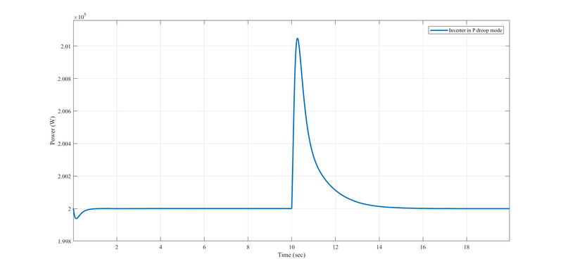

# Droop inverter

**Source URL:** https://gridlab-d.shoutwiki.com/wiki/Droop_inverter

## Overview

This document describes GridLAB-D implementation of the CONSTANT_PQ mode inverter with droops. The implementation is based on the existing inverter CONSTANT_PQ mode source codes. In the original CONSTANT_PQ mode inverter, during event mode simulation, the inverter current outputs are computed based on the reference power values and the terminal voltage values; During delta mode simulation, the inverter real and reactive power outputs are compared with the reference values in each delta time step, and a PI controller is connected after the comparison, for the calculation of the updated current injection _Iout_ from inverter. 

With the droop mode inverter implemented inside the CONSTANT_PQ mode inverter, the reference power values will be updated by checking the measured feeder frequency and the inverter terminal voltage with the droop curve setpoints. 

The capability to run in delta mode is implemented in battery object. The battery can be attached to the droop inverter. 

## GridLAB-D implementation

### PQ constant mode inverter with droop curves example

This inverter object is a CONSTANT_PQ mode inverter with droop curves. The inverter is implemented under the inverter type four_quadrant_control_mode. The CONSTANT_PQ mode is chosen by selecting four_quadrant_control_mode as CONSTANT_PQ. The droop curves are implemented only when dynamic_model_mode is selected as PI. The droops are by default not selected for the CONSTANT_PQ mode inverter, user has to set inverter_droop_fp as true for p/f droop, and set inverter_droop_vq as true for q/v droop. The delay time are by default the same as the delta time step defined, user can define the delay time with larger values.   
  
In this example, the delay time of seeing the measured frequency and terminal voltage is set as 0.01 s. The droop of f/p curve is set as 0.000001, and the droop of v/q curve is set as 0.005. 
    
    
    module generators;
    object inverter {
         parent 1370;
         name const_pq_inv1;
         inverter_type FOUR_QUADRANT;
         use_multipoint_efficiency FALSE;
         four_quadrant_control_mode CONSTANT_PQ;
         generator_status ONLINE;
         inverter_efficiency 0.99;
         rated_power 300 kVA;
         P_Out 200000;
         Q_Out 100000;
         V_In 1000+0j;
         I_In 1000+0j;
         flags DELTAMODE;
         dynamic_model_mode PI; 
         inverter_convergence_criterion 0.001;
         // PI controller parameters
         kpd 0.001;
         kid 0.09;
         kpq 0.001;
         kiq 0.09;
         // Droop curve parameters
         inverter_droop_fp true;
         Tfreq_delay 0.01;
         R_fp 0.000001;
         inverter_droop_vq false;
         Tvol_delay 0.01;
         R_vq 0.005;
    }
    

## Properties

This table lists the properties related to VSI implementation. Some parameters used by other types of inverters can be found in the inverter wiki page. 

Property name | Type | Unit | Description   
---|---|---|---  
inverter_type | enumeration | none | Defines type of inverter technology and efficiency of the unit (FOUR_QUADRANT , PWM, TWELVE_PULSE, SIX_PULSE, TWO_PULSE).   
Should choose FOUR_QUADRANT for VSI object.   
four_quadrant_control_mode | enumeration | none | Control mode of the inverter when FOUR_QUADRANT (NONE, CONSTANT_PQ, CONSTANT_PF, CONSTANT_V, VOLT_VAR, VOLTAGE_SOURCE).  
Should choose VOLTAGE_SOURCE for VSI object.   
use_multipoint_efficiency | bool | none | A boolean flag to toggle using Sandia National Laboratory's multipoint efficiency model   
generator_status | enumeration | none | Defines if generator is in operation or not (ONLINE, OFFLINE)   
inverter_efficiency | double | none | four_quadrant_control_mode:The efficiency of the inverter  
rated_power | double | #1 | four_quadrant_control_mode:The per phase rated power of the inverter  
P_Out | double | VA | Value to output in four quadrant control mode CONSTANT_PQ and VOLTAGE_SOURCE  
Q_Out | double | VAr | Value to output in four quadrant control mode CONSTANT_PQ and VOLTAGE_SOURCE  
V_In | complex | V | DC voltage passed in by the DC object (e.g. solar panel or battery)   
I_In | complex | A | DC current passed in by the DC object (e.g. solar panel or battery)   
flags | unit32 | none | Object flag to be used for indication of delta mode inclusion   
dynamic_model_mode | enumeration | none | DELTAMODE: Underlying model to use for deltamode control   
inverter_convergence_criterion | double | none | The maximum change in error threshold for exiting deltamode   
kpd | double | none | DELTAMODE: The d-axis proportional gain for the current modulation PI controller   
kpq | double | none | DELTAMODE: The q-axis proportional gain for the current modulation PI controller   
kid | double | none | DELTAMODE: The d-axis integration gain for the current modulation PI controller   
kiq | double | none | DELTAMODE: The q-axis integration gain for the current modulation PI controller   

Parameters related to droop curve settings   

Property name | Type | Unit | Description   
---|---|---|---  
inverter_droop_fp | bool | none | DELTAMODE: Boolean used to indicate whether inverter f/p droop is included or not. False by default   
Tfreq_delay | double | s | DELTAMODE: The time constant for delayed frequency seen by the inverter. If not defined in glm file, it will be the same as the delta time step value   
inverter_droop_vq | bool | none | DELTAMODE: Boolean used to indicate whether inverter q/v droop is included or not. False by default   
Tvol_delay | double | s | DELTAMODE: The time constant for delayed voltage seen by the inverter. If not defined in glm file, it will be the same as the delta time step value   
R_fp | double | none | DELTAMODE: The droop parameter of the f/p droop.   
R_vq | double | none | DELTAMODE: The droop parameter of the v/q droop.   
  
## Test cases

In IEEE 123-bus feeder, one diesel generator of isochronous mode is placed at the swing bus, and one inverter of p/f droop and constant_Q mode is placed at node 54.

At 2001-08-01 12:00:10.001 PST, three-phase load 49 increases based on the given players. The diesel generator increases its power to maintain the feeder frequency. Although there is f/p droop enabled in the inverter, since no speed change is detected, inverter real power outputs are kept the same as the reference value after transient.   

To run this case, please find in the autotest in GridLAB-D generator module. 

## See Also

  * [Modules]
    * generators
      * inverter
        * [Voltage source inverter (VSI)]

