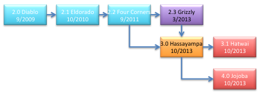

# History

**Source URL:** https://gridlab-d.shoutwiki.com/wiki/History
## Contents

  * 1 Navajo (trunk)
  * 2 Lugo (Version 4.1)
  * 3 Keeler (Version 4.0)
  * 4 Jojoba (Version 3.2)
  * 5 Hatwai (Version 3.1)
  * 6 Hassayampa (Version 3.0)
  * 7 Grizzly (Version 2.3)
  * 8 Four Corners (Version 2.2)
  * 9 Template:VERSION21
  * 10 Diablo (Version 2.0)
  * 11 Coyote (Version 1.3)
  * 12 Coulee (Version 1.2)
  * 13 Buckley (Version 1.1)
  * 14 Allston (Version 1.0)
  * 15 Version 0.2
  * 16 Version 0.1
For the sake of posterity we're keeping track of the major versions and releases of GridLAB-D. 

  
Figure 1: GridLAB-D Family Tree (Source: [[1]](https://github.com/gridlab-d/gridlab-ddesign/GridLAB-D_Family_Tree.pptx)) 

## [Navajo (trunk)]

The trunk is currently identified as [Navajo (trunk)] and will be branched soon. 

## [Lugo (Version 4.1)]

[Lugo (Version 4.1)] is currently in release candidate stage, and is set for a full release in October 2018. 

## [Keeler (Version 4.0)]

[Keeler (Version 4.0)] was released in June 2017. 

## [Jojoba (Version 3.2)]

The current plan is to release [Jojoba (Version 3.2)] in late 2014 or early 2015. 

## [Hatwai (Version 3.1)]

The current plan is to release [Hatwai (Version 3.1)] in September 2014. 

## [Hassayampa (Version 3.0)]

Updated 10/2/2013. 

Version 3.0 Release Candidate 1 - released 8/22/2013. 

Version 3.0 Release Candidate 2 - released 9/25/2013. 

Version 3.0 Release Candidate 3 - released 10/3/2013. 

Version 3.0 Release Candidate 4 - released 10/24/2013. 

Version 3.0 - released 12/10/2013. 

**Added Features (new features since v2.3):**

  * Added "linkage" capability for linking with external software (e.g., MATLAB).
  * Enhanced internal C++ Module API.
  * Enhanced streaming and realtime server modes.
  * Enhanced HTML/GUI support.
  * Added master/slave or multirun capability.
  * Improved speed performance, both in core functions and at module level.
  * Added simulation connection to Powerworld via SimAuto.
  * Added numerous command line functions (e.g., "--example" and "--pcontrol"). Types can be viewed via "--help".
  * Created internal validation ("--validate") and test ("--test") command line calls.
  * Added job/batch processor support ("--job").
  * Random numbers are seedable and reproducable on different OS.
  * External transforms are supported.
  * Added precommit, finalize, and notify callbacks.
  * Init() is no longer order dependent, but object oriented.
  * Added multi-thread support (some classes are not yet compliant).
  * Added support for mingw 64-bit.
  * Enhanced timezone support for international usage and automatic configuration with location.
  * Overhauled Linux and MacOS make files.
  * Added support for model sanitization.
  * Upgraded to Xerces v3.1.1.
  * Added a general solver library.
  * Created a script directive.
  * Added configuration script for Windows builds.
  * Added parameter expansion of global variables.
  * Added module level classes: pw_model, pw_load, pw_recorder, load_tracker, group_recorder, evcharger_det, and triplex_load (NOTE: some of these may have been simultaneously added to v2.3).
**Bug Fixes (since trunk branching on 12/6/2011):**

  * Ticket 591: Sync time determination restructured
  * Ticket 612: glmjava and module_load load process corrected
  * Ticket 621: Corrected error in solar direct calculation when using quadratic interpolation
  * Ticket 628: loader processes directives before next macro is processed
  * Ticket 629: Corrected line number errors when using macros
  * Ticket 640: Moved climate data to shared directory
  * Ticket 642: Added % progress to --pcontrol screen
  * Ticket 645: Added DST support for CSV reader
  * Ticket 646: Group recorder is now printing units properly
  * Ticket 648: Corrected error in implicit enduses causing simulation to continously run
  * Ticket 658: Corrected "rogue" pointer behavior with models that did not include DST
  * Ticket 660: Harmonized build numbers
  * Ticket 670: Updated and corrected clock block to be "object" oriented
  * Ticket 675: Updated build dependency in Windows
  * Ticket 679: Added "entropy" to random seed in globals and randomvar
  * Ticket 680: Updated troubleshooting documentation to correctly populate online site
  * Ticket 688: Added check for property size during initialization to prevent memory errors
  * Ticket 698: Added a ranking structure to commit or a post commit for recorders and assert objects
  * Ticket 701: Collectors support unit conversions
  * Ticket 707: Upgraded climate module for use in southern hemisphere
  * Ticket 709: COllapsed NR solver to a single pass
  * Ticket 721: Set "better" defaults for starttime and stoptime
  * Ticket 728: Fixed return calls in exec.c used where throws should be used
  * Ticket 729: Corrected memory leaks in Linux
  * Ticket 731: Corrected CC, DL, CCFLAGS environment variables are not set up correctly
  * Ticket 737: Upgraded classes to use deferred init
  * Ticket 739: Upgraded make tools to more current versions
  * Ticket 744: Corrected transforms sometimes cause loader null pointer errors
  * Ticket 747: Enhanced wind turbine functionality
  * Ticket 755: Added error catches to numerous DG models
  * Ticket 756: Added error catches to numerous DG models
  * Ticket 763: Upgraded histogram to use new API functions
  * Ticket 764: Corrected errors in random number generation in Linux
  * Ticket 774: Corrected architecture printing
  * r4094: Out of time step error corrected in water heater
## [Grizzly (Version 2.3)]

(branched November 2011) (released March 2013) 

This is an extension of [Four Corners (Version 2.2)] to support microgrid and advanced controls analysis for the US DOE. 

  * Development of simulation capabilities within GridLAB-D loosely designed around microgrid development concepts. 
    * Introduced machine dynamics. 
      * Sub-second simulations capabilities were introduced as DELTA-mode.
      * Generator excitor and governor controls (diesel_dg).
  * Updated the PV solar model and validated in cooperation with NREL using SAM model. 
    * Updated solar model to SOLPOS.
    * Included fixed axis and multi-point efficiency.
    * Updated inverter model for four-quadrant controls and a volt/var control method.
  * Extended weather and time zone models to southern and eastern hemispheres.
  * Added "load_tracker" object in powerflow to ease calibration to substation SCADA data (AusGrid).
  * Parallelized server mode to allow multiple simultaneous HTTP socket connections (AusGrid).
  * Updated thermostat DR controls and auction models to incorporate "lessons learned" from AEP gridSMART design and specifications for real-time double-auction market.
  * Added a "group_recorder" object to collect a single variable from a group of objects over time (i.e., voltage of every node object every 15 minutes).
  * Added deterministic EV charger model to better represent individual device charging.
  * Added basic optimization functionality (particle swarm optimization, gradient search, etc.).
  * Added generator controller to market module to simulate behavior of generator bidding in the Olympic Peninsula Demonstration Project.
  * Windows 7 and XP 64- and 32-bit, Linux Red Hat v4 and v5, Ubuntu v11, and Mac OS X fully supported.
  * Added basic support for VS2010.
  * Extensive bug fixes from v2.2.
## [Four Corners (Version 2.2)]

(September 2011) 

Four Corners was developed to support analysis of the US DOE's ARRA SGIG projects. The following are improvement made in this release. 

  * Added _generator_controller_ to **market** module to allow generators to bid into a wholesale/retail market, including fixed rates, fuel costs, and start up and shut down costs. Tested but not validated.
  * Added a limited emissions support to **powerflow** module, which attempts to estimate the generated emissions of a feeder by giving it a predefined dispatch order and capacity limit. Limited capabilities are tested but not validated.
  * Added optional parasitic power draws and multiple billing strategies (fixed, tiered, time of use, and real time) to _meter_ and _triplex_meter_ classes. Additionally, a _billdump_ class was added to collect all customer bills into a single file at the end of each simulated month.
  * Diesel distributed generation model was enhanced to include fuel costs/usage, efficiencies, and heat transfer rates. This is in preparation for future CHP models.
  * Added a current and voltage “dump” feature in **powerflow** that allows the user to specify a time, then all current or voltage measurements are dumped to a single output file.
  * Updated troubleshooting documentation. Now is fully linked on Sourceforge site to internal troubleshooting code.
  * Added a stub bidder object to the **market** module to allow users to create a “fake” bidder, with enhanced flexibility on the bidding rules.
  * Market module, including auction, controller, and passive controller updated, with major bugs removed. Module is tested and validated to the extent that it is used for SGIG analysis for US DOE ARRA projects.
  * The solar panel and inverter models were “cleaned up” for analysis. Test and partially validation.
  * A thermal energy storage model added to **residential** module. Similar to Ice Bear technology, it converts electricity to ice, which is then used to cool the house object during peak load periods. Validated against available data.
  * Multiple economic elasticity models were added to the **market** module, including daily and substitution values. Only linear 2- and 3-tier TOU and TOU/CPP models have been validated. A non-linear version has been included but it is not fully validated.
  * Direct load control and demand response capabilities have been added to the **market** module. These include controls for HVAC cycling, water heater cycling and shutoff, and pool pump cycling and shutoff. These models have been validated to the extent they were used for analysis, but have not been fully tested.
  * A duty cycle mode was added to the _zipload_ class in the **residential** module. Originally intended to represent pool pump cycling, it can also be used to represent anything with a simple duty cycle.
  * The Newton-Raphson (NR) powerflow solver method was “cleaned up” to increase performance. Additionally, code was added to assist in replacing the SuperLU solver with external solvers, such as the KLU solver, resulting in additional performance enhancement. However, due the licensing restrictions, only the capability to include KLU is provided, not KLU itself. (The external KLU solver can be downloaded from a separate folder on SourceForge.)
  * Extended the capabilities of the reliability module to support more classes, such as fuses and switches, and provide IEEE 1366 metrics assessment.
  * Initial enhancements were made to include detailed short circuit analysis. These capabilities are still in the testing and development phase.
  * Added scripts compatible with version 2.2 and the taxonomy feeders have been added to the open source repository. These Matlab based scripts were used to convert standard utility feeder models to models fully populated with residential and commercial buildings and loads representative of different regions within the United States in support of the 2011 SGIG analysis of US DOE ARRA projects.
## [Template:VERSION21]

(November 2010) 

  * Linux support include (RH/Fedora, Ubuntu)
  * Mac OS X support
  * Windows 64 bit support (w/o runtime classes)
  * Support for schedule skews
  * Improvements to markets and controllers
  * Direct impedance value (as opposed to geometric specification) capability added to powerflow.
  * Overhaul and full specification of market module begins.
  * Overhaul of taxonomy feeders, including population with residential, thermal loads, limited automation, and shunt transformer losses for DOE studies.
  * Multi-object recorder added as a function within recorders (records multiple variables from multiple objects).
  * Secondary power and current calculations finished for all objects in powerflow.
  * Presented paper on voltage regulation devices and time series analysis for the IEEE 8500 Node Test System at the 2010 PES T&D Conference and Exposition.
  * Functionality of scheduled loadshapes significantly increased.
  * Majority of feeder restoration completed and added (by ISU).
  * Volt-Var control object added to control capacitors and regulators in concert for voltage reduction.
  * Presentation on voltage reduction concepts at 2010 Distributech.
  * Major auto-validation is started on residential model.
  * Tree searching structure added to restoration in power flow (for ISU).
  * Visited University of Washington for two days to present and teach applications of GridLAB-D.
  * Passive controller object added to markets for non-bidding appliance responses.
  * Double controller object added to solve conflicting thermostatic set points (clashes between cooling and heating during low prices).
  * SuperLU-MT (multi-thread) replaced standard SuperLU in build.
  * Bill dump object added to powerflow, which allows user to collect all customer bills into a single file.
  * A number of error checks in powerflow added to prevent singularities in NR method.
  * House_e ETP model numerical instabilities fixed.
  * More flexible support for house_e heating AUX mode.
  * Basic motor models added into HVAC model, including shunt losses important for CVR analysis.
  * Additional controls enabled on some appliances.
  * Measured values for certain ZIP loads applied to defaults.
  * Stub auction object added to create a passive (non-bidding) market signal.
  * Frequency response implemented in powerflow.
  * Initial fault checking object added to powerflow in preparation of ISU additions.
  * Multiple customer billing modes added to triplex meters.
  * A rudimentary restoration object for reconfiguration studies is added to power flow module.
  * Multiple heating and cooling systems added to house_e model, including tighter coupling between powerflow and HVAC loads.
  * Included a mode to incorporate weather data other than tmy2.
  * Release version 2.0 RC of GridLAB-D is separated and released.
  * The first phase of house_e development is completed.
  * A series reactor object is added to power flow.
  * A ZIP load object (impedance, current, and power fraction) is added to residential to simplify some of the secondary system loads.
  * The 2009 D.O.E. Use Cases are released to showcase the abilities and uses of GridLAB-D.
## [Diablo (Version 2.0)]

(September 2009) 

  * Trans-active, market controller added to market module. Major development of Olypen model started.
  * Implicit end-use load shapes are implemented for all residential end-uses. 
    * Analog driven load shapes are completed.
    * Dishwasher, range, hot water heaters, and evcharger completed as demand driven models.
  * Installer gets updates to include TMY2 data, and other options, when installing.
  * Three-phase Newton-Raphson power flow method finished and validated for all objects within the power flow solver.
  * Voltage dump object added to power flow to extract all voltages from the system into a single file.
  * Default house model is switched from house_a (ASHRAE model) to house_e (ETP model). 
    * House_a model becomes deprecated.
  * Major components of validation system are added.
  * A short course for GridLAB-D users is first taught.
  * Functionality of loader was greatly increased, including larger buffer sizes, ability to “include” multiple input files through a single input, and inclusion of schedules.
  * Schedule and load shape objects added in preparation for implementation of residential end-use schedule driven loads. 
    * Schedule is later developed to be used for all object inputs and a schedule linear transformation is created.
  * Major work begins on Equivalent Thermal Parameter (ETP) house model.
  * The SuperLU, single-thread, open-source solver added to build for Newton-Raphson solver.
  * Independent, automatic control algorithms for capacitor and regulator objects are added.
  * Commit “timestep” added to sync order for eventual speed-up in calculation time. Allows for final values to be calculated at end of cycles, instead of repeatedly.
  * Macro “minimum_timestep” implemented to force the system to jump ahead a certain amount of time, instead of being driven by the model. 
    * While this function is highly useful and seems to work well, it has not been fully tested to see how much it affects simulation results.
  * A validation program, the assert module, and auto-test files created to begin continuously self-validating GridLAB-D modules and notify developers of unintended consequences of updates.
  * PQ load is created to represent complex loads without using a state driven model.
  * Gauss-Seidel power flow solver deemed a failed experiment. 
    * Implementation of a three-phase Newton-Raphson solver started.
  * Style sheets are opened for user defined xml format style sheets for data output.
  * Overhaul of phase tests in power flow solver in preparation of Newton-Raphson solver implemention.
  * Troubleshooting documentation function added, so that all error messages have a troubleshooting explanation attached to them and are automatically available on the Sourceforge Wiki site.
  * Reliability module overhauled.
  * Histogram plots added to tape module.
  * Completed migration of build to Sourceforge from local PNNL SVN site.
  * “Smart grid” module removed from build.
  * Implementation of a three-phase Gauss-Seidel power flow solver started.
  * Migration to Sourceforge SVN initiated.
  * Initial one-line network solver completed.
  * Matlab was removed from build.
  * HVAC and end-use loads separated into different loads on the house panel in preparation for more explicit modeling of residential end-use loads. 
    * Drier, freezer, and clothes washer state models added to residential module.
  * Electric Vehicle and charger state model added to residential module.
  * Minimal GNU plot and functions for plotting simulation data added to build.
  * Major overhaul of power flow solver in preparation for Gauss-Seidel implementation.
[Diablo (Version 2.0)] was begun in August 2008. This version was expected to include preliminary support for 

  * Distributed generation
  * Runtime classes (compiling code in models)
  * Support for **gdb** and **msvc** debuggers
  * Support for **gnuplot** output using **tape** module
  * 3 phase unbalanced power flow solution using Gauss-Seidel method
Considered, but not implemented capabilities available: 

  * Multispeak
  * Integration with EPRI's OpenDSS (this is a long shot for this version)
## [Coyote (Version 1.3)]

(Never released) 

This version was begun in May 2008 and never released. This developer-only version included preliminary support for 

  * Distribution reliability metrics calculations
  * Power markets
  * Commercial multi-zone office modeling
  * Distribution automation
  * Control network modeling
  * Java runtime modules
  * KML support (Google Earth data files)
  * XSD, XSL, and CSS support (XML stylesheets)
## [Coulee (Version 1.2)]

(May 2008) 

This was a second general release of GridLAB-D that included a number of cross-platform enhancements not available in Version 1.1. 

## [Buckley (Version 1.1)]

(April 2008) 

This version was the first general release of GridLAB-D made available to the public. This version includes additional support for 

  * Commercial single-zone office buildings
  * General balanced 3-phase transmission network flow calculations (experimental)
## [Allston (Version 1.0)]

(January 2008) 

This version was the first limited release of GridLAB-D made available to the partners who expressed interest in collaborating with PNNL during 2008 to assist in getting the tool ready for open source distribution by early 2009. This version includes support for 

  * Windows 32bit and 64 bit platforms (XP only tested)
  * Linux 32bit platforms (not all variants tested)
  * Unbalanced 3-phase distribution powerflow calculations
  * Residential single-family home and appliance modeling
  * XML and KML support
## Version 0.2

(2004) 

This was the last version called PDSS. It was a special build designed to support the market operations of load-serving entities. It was also the last version to require the use of Matlab. 

## Version 0.1

(2003) 

This was the official version of PDSS that was use by PNNL in the early years of the GridWise program. It was developed under LDRD (a special type of DOE research funding that is managed by the Laboratory) during 2002-2003. It required the use of Matlab and was very limited in the capabilities. However, it demonstrated many of the important characteristics that came to be essential to GridLAB-D. 

