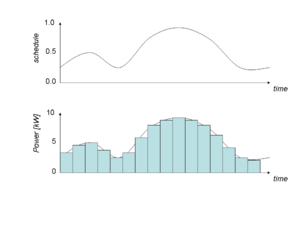
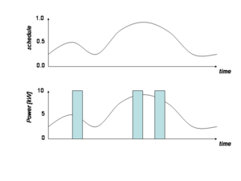
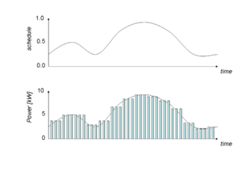
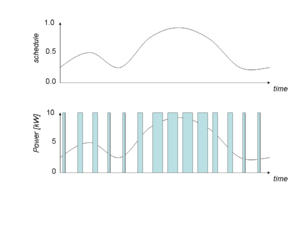
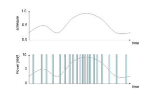
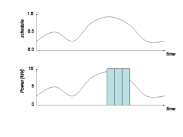
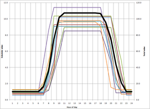

# Loadshape

**Source URL:** https://gridlab-d.shoutwiki.com/wiki/Loadshape
## Contents

  * 1 Analog
  * 2 Pulsed
  * 3 Modulated
  * 4 Queued
  * 5 Scheduled
  * 6 See also
The loadshape [built-in data type] is used to represent a finite-state machine that takes on the value of a complex power when synchronized. A loadshape is associated with a [schedule], and requires a number of parameters to define its behavior. There are five types of loadshapes, and each has a difference set of parameters that define it: 

Analog
    Analog load shapes directly compute the power from the values in the [schedule].

Pulsed
    Pulsed load shapes emit one or more pulses at random such that the specified energy is accumulated over the period of the load shape.

Modulated
    Modulated load shapes emit a sequence of modulated pulses of either constant period and duty-cycle (amplitude) or constant power and off-time (pulse width) or constant power and on-time (frequency).

Queued
    Queued load shapes emit random pulses whenever a queue accrued from the load shape reaches an on threshold and continues emitting pulses until the queue reaches an off threshold.

Scheduled
    Scheduled load shapes emit values based on a [schedule] in a way that incorporates diversity.

## Analog

Figure 1 - Example of an analog loadshape

Analog loadshapes directly compute the power from the values in the schedule. An analog loadshape is defined using the following terms: 
    
    
     class example {
       loadshape myshape;
     }
     object fixed-energy {
       myshape "type: analog; schedule: _schedule-name_ ; energy: _value_ kWh";
     }
     object scaled-power {
       myshape "type: analog; schedule: _schedule-name_ ; power: _value_ kW";
     }
     object unscaled {
       myshape "type: analog; schedule: _schedule-name_ ";
     }
    

  
The _schedule_ parameter specifies which schedule is to be used. When the _energy_ is given, the schedule is used to create a shape that consumes the specified energy in each schedule block. The power required is based on the fraction of energy allocated to each time interval by the schedule. 

When the _power_ scale is given, the scheduled value is multiplied by the _power_ value. 

When neither _energy_ nor _power_ is given, the schedule value is used directly as the power. 

A standard deviation on the _energy_ or _power_ value can be given, in which case each instance of the loadshape that is generated will use an error drawn from the triangle distribution from -3 to +3, such that 

_value_ ← _value_ \+ _stdev_ * Triangle[-3,3]

The _stdev_ term can be given units and it will be scaled accordingly, e.g., 
    
    
     object stdev-power {
       myshape "type: analog; schedule: _schedule-name_ ; power: _value_ kW; stdev _error_ W";
     }
    

## Pulsed

Figure 2 - Example of a pulsed loadshape

Pulsed loadshapes emit 1 or more pulses at random times such that the total energy specified is accumulated over the period of the loadshape. A pulsed loadshape is defined using the following terms: 
    
    
     class example {
       loadshape myshape;
     }
     object sample {
       myshape "type: pulsed; schedule: _schedule-name_ ; energy: _value_ kWh; count: _value_ ; duration: _value_ s";
     }
    

or 
    
    
     class example {
       loadshape myshape;
     }
     object sample {
       myshape "type: pulsed; schedule: _schedule-name_ ; energy: _value_ kWh; count: _value_ ; power: _value_ kW";
     }
    

The first form defines a series of pulses with constant duration, and the second form defines a series of pulses with constant power. When the duration is constant, the power will vary in response to changes in voltage such that the amount of energy used during a loadshape block is as specified. When the power is constant, the duration will vary in response to changes in voltage such that the amount of energy used is constant. Only one of the two may be specified, and at least one must be specified. 

The **count** parameter determines how many pulses will be generated during a loadshape block. The value is optional and the default value is 1.0. 

A standard deviation on the _duration_ or _power_ value (as specified by the unit) can be given, in which case each instance of the loadshape that is generated will use an error drawn from the triangle distribution from -3 to +3, such that 

_value_ ← _value_ \+ _stdev_ * Triangle[-3,3]

The _stdev_ term can be given units and it will be scaled accordingly, e.g., 
    
    
     object stdev-power {
       myshape "type: analog; schedule: _schedule-name_ ; power: _value_ kW; stdev _error_ W";
     }
    

or 
    
    
     object stdev-power {
       myshape "type: analog; schedule: _schedule-name_ ; power: _value_ kW; stdev _error_ s";
     }
    

  

## Modulated

Figure 2a - Example of a amplitude modulated loadshapes

Figure 2b - Example of a pulse-width modulated loadshapes

Figure 2c - Example of a frequency modulated loadshapes

Modulated loadshapes emit a continuous sequence of modulated pulses with either constant period and duty-cycle (**amplitude**), constant power and off-time (**pulsewidth**), or constant power and on-time (**frequency**). A modulated loadshape is defined using the following terms: 
    
    
     class example {
       loadshape myshape;
     }
     object sample {
       myshape "type: modulated; modulation: _modulation_ ; schedule: _schedule-name_ ; energy: _value_ kWh; count: _value_ ; period: _value_ s";
     }
    

or 
    
    
     class example {
       loadshape myshape;
     }
     object sample {
       myshape  "type: modulated; modulation: _modulation_ ; schedule: _schedule-name_ ; energy: _value_ kWh; count: _value_ ; power: _value_ kW";
     }
    

A standard deviation on the _duration_ or _power_ value can be given, in which case each instance of the loadshape that is generated will use an error drawn from the triangle distribution from -3 to +3, such that 

_value_ ← _value_ \+ _stdev_ * Triangle[-3,3]

The _stdev_ term can be given units and it will be scaled accordingly, e.g., 
    
    
     object stdev-power {
       myshape "type: analog; schedule: _schedule-name_ ; power: _value_ kW; stdev _error_ W";
     }
    

## Queued

[]

Figure 2 - Example of a queued loadshape

Queued loadshapes emit random pulses whenever a queue accrued from the loadshape reaches an on threshold and continues emitting pulses until the queue reaches an off threshold. A queued loadshape is defined using the following terms: 
    
    
     class example {
       loadshape myshape;
     }
     object sample {
       myshape  "type: pulsed; schedule: _schedule-name_ ; energy: _value_ kWh; count: _value_ ; duration: _value_ s; q_on: _value_ ; q_off: _value_ ";
     }
    

or 
    
    
     class example {
       loadshape myshape;
     }
     object sample {
       myshape  "type: pulsed; schedule: _schedule-name_ ; energy: _value_ kWh; count: _value_ ; power: _value_ kW; q_on: _value_ ; q_off: _value_ ";
     }
    

The values of _q_on_ and _q_off_ are in the same units as the integrals of the normalized loadshape and _q_on_ must be greater than _q_off_. 

A standard deviation on the _duration_ or _power_ value can be given, in which case each instance of the loadshape that is generated will use an error drawn from the triangle distribution from -3 to +3, such that 

_value_ ← _value_ \+ _stdev_ * Triangle[-3,3]

The _stdev_ term can be given units and it will be scaled accordingly, e.g., 
    
    
     object stdev-power {
       myshape "type: analog; schedule: _schedule-name_ ; power: _value_ kW; stdev _error_ W";
     }
    

## Scheduled

Scheduled loadshapes control the diversity of a population of objects and affect the aggregate value (heavy black).

Schedule-based loadshapes are provided to enable a simpler and more intuitive way of defining aggregate loadshapes that incorporates diversity. For example: 
    
    
     class example {
       loadshape myshape;
     }
     object sample {
       myshape  "type: scheduled; weekdays: MTWRF; on-time: 6<8~1<10; off-time: 15<16~1<18; on-ramp: 0.5<1~0.5<1.5; off-ramp: 1<2~1<3; low: 1<2~1<3high: 10<15~2<20 kW;
     }
    

will generate a randomized ramped 8-hour pulse at roughly 10 kW Monday through Friday. Weekdays are defined as 

  * U=sunday,
  * M=monday,
  * T=tuesday,
  * W=wednesday,
  * R=thursday,
  * F=friday,
  * S=saturday, and
  * H=holiday.
Values are provided in the format 
    
    
     _min_ <_mean_ ~_stdev_ <_max_
    

If the min or the max are omitted, then 3 σ is used. If the stdev is omitted, then 0 is used (meaning the value is invariant). 

The syntax for varying values (mean~stdev) allows the same definition to be used for multiple objects, e.g., 
    
    
     #define SCHEDULE_1="weekdays: MTWRF; on-time: 8~1; off-time: 16~1; on-ramp: 1~0.5; off-ramp: 2~1;"
     object sample {
       myshape  "type: scheduled; SCHEDULE_1; power: 15~2 kW;
     }
    

## See also

  * [Built-in types]
  * [Enduse]
  * [Schedule]
  * [Units]
  * Loadshape
    * [Requirements]
    * [Specifications]
    * [Technical support]
    * [Implementation]

