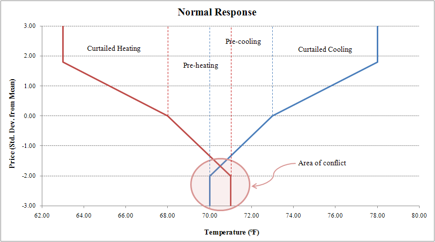

# Transactive Controller

The transactive controller is based upon the design used in the Olympic Peninsula Project1. This controller provides price-responsive controls to individual objects, typically appliances, within GridLAB-D. The controller compares the current price signal to the average market price, each delivered by the auction object, and bids the appliance’s current demand as a function of price back into the auction. After the market clears all bids within the system and determines the next market price, the controller modifies the appliance’s set points to reflect operation at the new current price, often related to the standard deviation from the average set point. The set point that is modified depends upon the object to which the controller is modifying. At this time, only devices with continuous temperature set points may be used with the controller object. 

## Controller Inputs

 _**Property**_ | **Unit** | **Description**  
---|---|---  
_market_ | name | This references the market that provides the price signal to the controller, and generates the rolling average and standard deviations seen by the object. This is also the object into which the controller will bid its price. It is typically specified as an auction or stubauction object, and is typically referenced by the name of the object.   
_parent_ | name | This is the object that is being affected by the controller object. To operate with a controller object, the parent object must have a set point that can be monitored and modified by the controller. Since the controller is modifying set points, the parent object should be designed as a state machine, with the ability to determine its load at certain operating conditions. At this time, only the HVAC system (house_e) and the hot water heater object can be used with the controller object.   
_period_ | seconds | The period of time for which the controller operates. This signals how often the controller will update the state of the set point and how often the controller will bid into the market. Ideally, this should be identical to, or a multiple of, the auction object’s time period. While this is not required, if the supply bid and demand bids do not coincide, odd behavior may occur. Must be a positive, non-zero value.   
_setpoint_ | property | The name of the set point to be modified by the controller object. Within the HVAC system, this would include heating_setpoint or cooling_setpoint. No limit to value.   
_target_ | property | This determines the property within the parent object that is observed by the controller, and in conjunction with the set point property, is used to determine the bid of the parent object. Within the HVAC system, this would be the air_temperature.   
_base_setpoint_ | - | This is the temperature set point of the system were there no controller present, or the original set point prior to the controller's input. Future implementations will allow this to control set points other than the temperature. No limit to value.   
_control_mode_ | name | This specifies between the various control modes available. These will be further described later. Available controls are _ramp_ and _double_ramp_.   
_resolve_mode_ | name | In certain control modes, multiple set points are controlled simultaneously. This specifies how to resolve a conflict between multiple control modes. This will be described in more detail, but will include _deadband_ and _sliding_ resolution modes. When multiple control set points are controlled, typically variables such as range and ramp will need to be specified multiple times, independent of each other.   
_range_low_ _range_high_ | - | These are the maximum bounds of variability allowed by the controller. For example, the heating_setpoint may vary +/- 5 degrees, but no more. These are relative to the base_setpoint (+5 F), not absolute (72 F). Range_high must be zero or greater and range_low must be zero or less.   
_ramp_low_ _ramp_high_ | - | This specifies the slope of the linear control algorithm as a function of the average price, the current price, and the standard deviation from the average, and determines the controllers operation and bid. This will be further discussed later. No limit to value.   
_demand_ | property | The property name within the parent object that specifies the amount of power demanded by the controllable object at that time. For HVAC systems, this is heating_demand or cooling_demand.   
_load_ | property | The property name within the parent object that specifies the amount of power actually being used by the controllable object at the specified time. For HVAC systems, this is hvac_load.   
_state_ | property | The property name within the parent object that specifies the current conditional state of the controllable object. For the HVAC system, this signifies on or off, however, future implementations may include multi-state objects.   
_total_ | property | The property name within the parent object that specifies, if any, all uncontrollable loads within that object in addition to the controllable load. For the HVAC model, this includes such things as circulation fan power or standby power settings, and is specified with total_load. It does not include additional panel demand from other appliances.   
_bid_price_ | $/kWh | This specifies the bidding price for the controller at the given operating points. Must be between negative and positive price cap.   
_bid_quantity_ | kW | This specifies the amount of power demanded by the object at the determined bid_price. Must be a non-zero positive number.   
_set_temperature_ | F | This specifies the final determined temperature of the controlled set point after the market has been cleared. Future implementations will allow for multi-state objects to be controlled.   
_average_target_ | property | This value points to the property within the auction object which will be used to provide the rolling average price. This is usually determined by a rolling 24 hour average (avg24), a rolling 3-day (avg72), or a rolling week (avg168). Future implementations will allow this rolling average to be determined at any window length. Future implementations will also include the ability to look at variables other than average price and standard deviation.   
_standard_deviation_target_ | property | Similar to average_target, but specifies the rolling standard deviation.   
_simple_mode_ | name | This will set all of the default parameters for the controller object to automatically control certain pre-defined objects (HOUSE_HEAT, HOUSE_COOL, HOUSE_PREHEAT, HOUSE_PRECOOL, WATERHEATER). When using this function, only the properties pertaining to the auction object will need to be set.   
_slider_setting_heat_ _slider_setting_cool_ | double | This is a pre-set slider setting, that allows the user to set all of the range and ramp settings with a single setting. The equations governing this are shown in Table 3. This value ranges between (and includes) 0 - 1, where 1 signifies greater participation, while 0 indicates no participation in the market. Heating and cooling ramps may be set independently.   
_time_delay_ | seconds | This value will allow the user to set a time delay within the sliding resolution mode. It will determine how long the controller stores the previous state when transitions only occur between HEAT/COOL and OFF. At the end of the time delay, the controller will update to the current system mode. If a transition occurs between HEAT <-> COOL (directly or indirectly), then the resolution should be updated to the current state and the time delay re-set.   
  
## Description of Operation

The transactive controller refers broadly to a set of market-based building control systems, originally coined contract nets by Smith2. Consumers participating in the real-time market submit power demand and price bids into a two-way market system. Bids are made for both the controllable and un-controllable loads, where uncontrollable loads are bid at the market maximum price (typically $9999/kWh, or essentially infinite in the market system). The transactive controller should be able to bid either portion of the supply and demand curve, where a negative quantity represents generation. 

### Transactive Thermostatic Control (ramp)

As implemented now, the transactive controller is specifically designed to control thermostatic set points. By using market inputs, the heating and/or cooling set points can be explicitly controlled by the controller object to fit along the supply and demand curves of the system. While the Olympic Peninsula Project used 24 hour means and standard deviations, with five minute market clearing, within GridLAB-D, these values may be set to any length of time. However, in any designed case, the rolling average price, the rolling standard deviation, and the current market price will be used to determine the operational set point of the controller object. Future implementations should allow for other varieties, and will be described in greater detail later. 

As an actual thermostat user, only a few parameters must be set. The first are the range_low and range_high settings, which determines the comfort zone the participant is willing to use. When referring to cooling set points, range_high determines how much higher the participant is willing to allow the temperature to climb before it becomes too hot for comfort, while range_low indicates the amount of pre-cooling allowed. For heating set points, these are reversed. The second setting is the slope of the piece-wise linear function that controls the coupling between the thermostat set points and the price (ramp_low and ramp_high or kT_L and kT_h in the Olympic Peninsula Project documentation). Essentially, this slope describes the participant’s willingness to participate in the market, and how willing they are to adjust their temperature settings as a function of the market price. While this is the background implementation within GridLAB-D, on an actual thermostat this might map onto a more user-friendly system, such as ‘money saver’ versus ‘keep it comfortable’. Figure 1 more fully demonstrates this operation and the operational set points for Figure 1 are shown in Table 2. 

**Table 2: Settings used in Figure 1.** 
ramp_low  | 0.667   
---|---  
ramp_high  | 0.360   
range_low  | -3.00   
range_high  | 5.00   
base_setpoint (cooling)  | 72.0   
air_temperature  | 75.1   
  

Figure 1: Illustration of Bid and Response of Transactive Controller.

Figure 1 provides an example of cooling set points with the transactive controller. For heating, the slope would be negative, but operation would be similar. The portion left of the base set point in Figure 1 indicates a pre-cooling state due to low market prices, while the area to the right indicates a condition that allows the temperature to rise slightly due to high prices. It shows that the participant is willing to allow the temperature to climb by 5 degrees during high prices, and pre-cool by -3 degrees during times of low market prices. 

The current bid of the controller object is determined by where the current air temperature falls upon the bid curve, and is determined by 

$$bid price = avg price + \frac{(T_{current} - T_{desired})*ramp_{high/low}*standard deviation}{|range_{high/low}|}\tag{1}$$ 

Average price and standard deviation are determined by the auction object associated with the controller; current temperature is a property of the house object imported by the controller; and ramp_high or ramp_low, range_high or range_low, and base set point are controller inputs. Ramp and range values are determined by which side of the base set point the current temperature presides during the bidding phase. If the current temperature is outside of the maximum or minimum range of the controller, the controller returns an “infinite” bid ($9999/kWh). After the controller object’s bid is determined, it is posted to the auction object, where in conjunction with all other market objects in the system the final cleared price is determined. How this price is determined is described in the auction object. 

After the auction object has returned a cleared price, the adjusted thermostatic set point is determined by once again placing it on the bid curve through 

$$
T_{set} =
\begin{cases}
    T_{desired} + ( \text{cleared price} - \text{avg price} ) \cdot \frac{|range_{high}|}{ramp_{high} \cdot \text{standard deviation}}, & \text{if } \text{standard deviation} \neq 0 \\
    T_{desired}, & \text{if } \text{standard deviation} = 0
\end{cases}\tag{2}
$$

$T_{set}$ is now the thermostat’s adjusted set point. If the current temperature is higher than the adjusted set point plus the thermostat’s deadband, then cooling will occur. This will occur every time the controller objects cycles a length of time equal to the period. Future implementations may include adjustments for deadband regions when bidding and responding to price signals, or may instead override one side of a deadband region and force the thermostat to respond when this occurs. This is an area of on-going research, and some of these concerns are addressed in the double_controller object. 

In addition to the bid price, the controller object must be able to pass demand and load information back to the auction object, if required. Controllable, and in some cases, uncontrollable load must be accounted for, depending on the settings used within the market system or auction object. These are used by the auction object to resolve the amount of uncontrollable and controllable load on the entire system and then determine the amount of flexibility within the system to reduce or increase the load using a price signal. The uncontrollable load should only pertain to the actual object being controlled. When controlling HVAC, the uncontrollable load would be the continuous base load of the HVAC system that cannot be affected. This might include a circulation fan that is on at all times, or power drawn by the thermostat, but should not include other appliances within the house. The controller must also deliver the controllable load or the demand of the HVAC system if it was to turn on. The total of the controllable and uncontrollable loads of an object should equal the rated capacity of the object; however, in multiple state objects, the sum of the actual used load may be less than rated capacity. Additionally, the controller object needs to pass the current state of the object. For example, with an HVAC system, this may be a simple on/off statement, but with more complex systems, this will need to include auxiliary versus regular heating modes, different fan speed settings, etc., as these affect the amount of power being drawn by the appliance. 

Any thermostatic set point should be controllable by this object. This can be applied to the heating or cooling set points within the house, or the tank set point within the water heater. Heating bid curves can be designed by using a negative slope. Future implementations will include the ability to generate more generic control functions, allowing for non-linear functions and functions that are not necessarily dependent upon the average or standard deviations of the system. Additionally, functions for non-thermostatic controls will be included. 

Simple settings will also be developed for easy connections to standard objects. This is loosely described as _simple_mode_ in Table 1, and as more objects are added with connections to the transactive controller, additional pre-built connections should be created. Additionally, a simple user interface for the _ramp_high_ , _ramp_low_ , _range_high_ , and _range_low_ settings will be included. This will be based on a simple slider setting that varies between 0% and 100%, where 100% represents maximum participation in the market ("save money"), while 0% represents no participation ("keep my temperature"). Heating and cooling sliders will be set independently, and will default to cooling ranges of -3 to 5 and heating ranges of -5 to 3, unless a _simple_mode_ is chosen which limits those ranges or a range_high or range_low is chosen by the user. The range and ramp settings are given by Table 3. 

**Table 3: Easy to use slider settings.

  Range_low/high-limit is not a new variable, but is the maximum range defined by the user (or default) if slider were at 100%.** | **Cooling Settings** (x = _slider_setting_cool_)  | **Heating Settings** (y = _slider_setting_heat_)   
---|---|---  
| $range_{high}$          | $= range_{high-limit} - range_{high-limit} \cdot (1 - x)$                 | $= \begin{cases} \text{range}_{high-limit} - \text{range}_{high-limit} \cdot (1 - y), & \text{if pre-heating is desired} \\ 0, & \text{if a mode without pre-heating is chosen} \end{cases}$ |
| $range_{low}$           | $= \begin{cases} \text{range}_{low-limit} - \text{range}_{low-limit} \cdot (1 - x), & \text{if pre-cooling is desired} \\ 0, & \text{if a mode without pre-cooling is chosen} \end{cases}$ | $= \text{range}_{low-limit} - \text{range}_{low-limit} \cdot (1 - y)$ |
| $ramp_{high}$           | $= \begin{cases} 2 + (1 - x), & \text{if } x \neq 0 \\ 0, & \text{if } x = 0 \end{cases}$ | $= \begin{cases} -2 - (1 - y), & \text{if } y \neq 0 \\ 0, & \text{if } y = 0 \end{cases}$ |
| $ramp_{low}$            | $= \begin{cases} -2 - (1 - x), & \text{if } x \neq 0 \\ 0, & \text{if } x = 0 \end{cases}$ | $= \begin{cases} 2 + (1 - y), & \text{if } y \neq 0 \\ 0, & \text{if } y = 0 \end{cases}$ |
  
### Double Control (double_ramp)

Double control attempts to resolve conflicts between heating and cooling set points, and is only designed to work with an HVAC system. When double_ramp is selected, appropriate checks and connections should be made to connect it with the parent house. 

There are two specified modes within double_ramp which resolves clashes between the two set points during low price signals. Often, heating and cooling set points are close enough together, that if both pre-cool and pre-heat are allowed during low prices, a conflict may occur where both operations are requested. This is shown in Figure 2. In either operational mode (deadband or sliding), if the pre-cooling set point plus the deadband overlaps the heating set point, or vice versa for the pre-heating set point, a _warning_ should be thrown and the pre-heating or pre-cooling setpoint reduced to a point where it no longer overlaps the user cooling or heating setpoint. This should be done as a real time check, not as an initialization. For example, if the cooling setpoint were 70F and the heating setpoint 67F with a deadband of 2F and a pre-cooling of -3F, the pre-cooling setpoint would try to move to as much as 67F. However, the pre-cooling setpoint should be limited to the heating setpoint + deadband (67F + 2F = 69F). 

Deadband operation resolves the set point conflict by taking the average of the base cooling and base heating set points to determine a midpoint and then sets the cooling and heating set points equidistant from the midpoint. The distance from the midpoint is equal to one-half the deadband setting. This operation is shown in Figure 3. This guarantees that there is no overlap of the deadbands between the cooling and heating set points; however, maximum pre-cooling and pre-heating will not be achieved if the set points are too close together, so some benefits are lost. Bids to the auction object are determined by which regime the current air temperature falls within, and follow equations 1 and 2. 

  

Figure 2: Normal operation with overlapping pre-heat and pre-cool settings.

Figure 3: Deadband resolve_mode.

  
Sliding mode tries to maximize the amount of pre-cooling and pre-heating performed, while still resolving the collision. In sliding mode, the previous active mode of the HVAC system is stored. The active modes include heating or cooling, and not on or off. If the previous HVAC mode were to be cooling, then the pre-cooling mode would dominate the pre-heating mode. This assumes that if the HVAC were previously cooling, then the user would desire it to continue cooling and not switch to a heating mode. The pre-cooling region will extend to its defined range, while the pre-heating range will be reduced to the pre-cooling range minus the deadband. This operation is shown in Figure 4. If the previous HVAC mode were to be heating, then the pre-heating range would dominate and pre-cooling range would be reduced. Again, the bid price is determined by the regime in which the current air temperature falls and follows equations 1 and 2. Additionally, a time delay setting should be included. This time delay lets the user specify how long the "last mode" is stored before it re-checks the current operational mode - this only applies when moving between COOL and OFF or HEAT and OFF. If the HVAC system transitions from COOL to HEAT (this may be in the series of COOL to OFF to HEAT), this should reset the time delay. Time delay should default to 0 seconds (no time delay and the controller perfectly tracks the HVAC system mode in real time). 

Figure 4: Sliding resolve_mode.

## Testing Specifications

Specific tests must be designed to ensure that the operation of the controller is correct. This section will loosely describe the tests that should be designed to ensure proper operation of the controller device. These tests will be implemented as part of the auto-test features within GridLAB-D, and are tested on a continuous basis to ensure continuously proper operation of the objects. These tests are designed only to verify the correct operation of the controller object, not the auction object. Since a controller object cannot operate on its own, it is understood that a number of the tests designed will test not only the operation of the controller object, but also the auction object or house object. However, this list should specify the minimum requirements of the controller object itself. 

* Does the controller object receive the correct values at the correct time? In this case, correct does not imply that the values are correct, as this is the responsibility of the auction or parent object, but that the controller is receiving the signal produced by the objects at the correct time.
    

  1. Design a simple market signal and verify that the controller receives the correct average price and standard deviation signals at the correct time when using an inelastic market (bids back into the market do not affect the price signal). This should be tested for various time periods, including those that do not match with the time period specified in the auction object. If the time periods do not synchronize, then the controller object should still be able to receive the correct signal.
  2. Design a simple market signal that is not static, but varies with the bid of the controller. Whether the cleared price or the bid of the controller is correct or not, the controller should still receive the price signals provided by the auction object as it varies with time. Synchronized and unsynchronized periods should be tested.
  3. Design a simple system that tests whether the controller appropriately gathers information from the parent object. All objects that are specified as being able to work with a controller should be tested. The gathered information should include demand, controllable and uncontrollable load, current conditions (e.g. air temperature), current state of the object (e.g. on/off), set point and target properties. It should be verified that these signals are being updated at the correct time intervals.
        * Does the controller supply the auction object with the correct bidding information?
    

  1. Design a simple market signal that does not vary over time and is inelastic. Verify with a variety of controller settings (modify ramp high and low, temperature minimum and maximum, base set point, etc.) that bid price is correctly calculated according to equation 1, and that bid quantity accurately represents the controllable load at that price via equation 2. This will be especially important with multi-state objects, as each state will need to be tested individually.
  2. Design a simple market signal that varies over time, but is still inelastic. Again verify with a variety of controller settings that bid prices and quantities are being correctly calculated according to equations 1 and 2.
        * Does the controller and parent object correctly respond to the returned market signal? This will be highly dependent upon the parent object of the controller, so only general tests will be described.
    

  1. Design a constant, inflexible market signal. Verify that the controller, attached to all available objects, correctly modifies the object set point. For the transactive and double control modes, this means that equation 2 is correctly calculated, then posted to the parent object. Additionally, for the double control, the resolution of the conflicted region must be correctly handled.

# Passive Controller (non-bidding controller)

This controller is similar to the transactive controller, except without the capability to bid back into the auction object. It is designed as a passive demand response controller, which only receives price signals from the market and responds accordingly. Additionally, it is used as a test bed for future transactive controller strategies, as it is easier to implement a passive response than an active bidding market. This style of controller is more likely to be used with Time-of-Use (TOU) or Critical Peak Price (CPP) market, rather than a Real Time Price (RTP) market. The passive_controller object will be able to attach to either an auction or stubauction object, where the stubauction allows the user to create a market that is not capable of receiving bids and only delivers a taped average and standard deviation. While a number of strategies exist within passive_controller, only the major modes will be defined here and are selected with the variable `_control_mode_`. 

## Description of Operation

### Ramp

The _RAMP_ control_mode is similar in action to the original Olympic Peninsula transactive controller, minus the ability to bid into the market. It is also a generic version of the transactive controller, allowing the user to control the set point using parameters other than average price or temperature, such as frequency or an artificial demand signal. It uses a piece-wise linear function to adjust the set point as a function of a defined parameter and standard deviation from the defined parameter. Required variables are shown in Table 3. 

**Table 3: Ramp control mode required parameters.**

_**Property**_ | **Unit** | **Description**  
---|---|---  
_control_mode_ | RAMP | This defines the control to be used.   
_range_high_ _range_low_ | - | This defines the upper and low limits that the participant will allow the temperature swing. Similar to the transactive controller, this is relative to the base set point (+/- 5). Range_high must be zero or greater and range_low must be zero or less.   
_ramp_high_ _ramp_low_ | - | Similar to the transactive controller, this defines the slope of the piece-wise linear function controlling the relationship between expected and observed set points. No limits to values.   
_period_ | seconds | Defines how often the controller will update the thermostat and receive information from the market. Must be a positive, non-zero value.   
_setpoint_ | property | Defines the property to be modified by the controller.   
_base_setpoint_ | value | This is the value of the set point were the controller not to exist, or the original set point prior to the controller's input. No limit to value.   
_expectation_object_ _expectation_property_ | name property | This is the property of the defined object that the observed property is compared against. In the transactive controller, this would be the average price of the market, while for a frequency control this might be 60 Hz.   
_observation_object_ _observation_property_ _stdev_observation_property_ | name property property | The observed object requires that a current value and a standard deviation from the expected value be compared. Observation property is the value compared against the expected value, while the standard deviation is the number of deviations away from the expectation property the observation property is currently. This would be the cleared price and the standard deviation of price in the transactive controller.   
_state_property_ | property | Tracks the current state of the object that is being affected.   
  
  

### Probabilistic Off (prob_off)

Probabilistic off is similar in nature to the Olympic Peninsula Project application to the hot water heater. As a typical water heater does not typically have a temperature measurement, implementation of a temperature vs. price signal is difficult. Essentially, the appliance will operate normally during a low or average price event. During a high price event, if the appliance desires to turn on or stay on, then the appliance applies a probabilistic curve to determine if it will shut off or perform as normal. A participation level was determined by the user through a comfort setting. A randomly drawn number from 

$$r = k_w * (N(P_{clear}, P_{avg}, P_{std})-0.5), r \ge 0\tag{3}$$

where 

$$N(P_{clear},P_{avg},P_{std}) = \frac{1}{\sqrt{2\pi}P_{std}} \int_{-\infty}^{P_{clear}} e^{-\frac{(P_{avg}-x)^2}{(2P_{std}^2)}}dx\$$

was chosen. If r <= 0, then the device will operate normally. A cutoff is then chosen from a randomly drawn uniform distribution. If r is greater than the chosen cutoff number, then the water heater is turned off, otherwise it operates normally. 

Future implementations of this device should include distributions other than a cumulative normal distribution functions, especially uniform and exponential. Additionally, implementation should include multi-state abilities. For example, the water heater could contain two heating coils, each of 2 kW. At a higher price, there would be a strong possibility of one of the coils cutting out, while the second coil has a much lower probability of cutting out. This is only an example, but the controller object should be built to handle this type of configuration. 

**Table 4: Probabilistic control mode required parameters.**

_**Property**_ | **Unit** | **Description**  
---|---|---  
_control_mode_ | PROBABILITY_OFF | This defines the control to be used.   
_distribution_type_ | enumeration | Defines which distribution function to used (NORMAL, EXPONENTIAL, UNIFORM).   
_comfort_level_ | double | Defines how willing the customer is to participate in the market – a higher value represents an increased willingness to curtail. This is $k_w$ in equation 3. Must be a positive or zero value.   
_period_ | seconds | Defines how often the controller will receive updates from the market.   
_setpoint_ | property | Defines the property to be modified by the controller.   
_expectation_object_ _expectation_property_ | name property | This is the property of the defined object that the observed property is compared against. In this case, it may be _avg24_ of a stubauction and is $P_{avg}$ in equation 3.   
_observation_object_ _observation_property_ _stdev_observation_property_ | name property property | The observed object requires that a current value and a standard deviation from the expected value be compared. Observation property is the value compared against the expected value, while the standard deviation is the number of deviations away from the expectation property the observation property is currently. This may be the current price ($P_{clear}$) and standard deviation ($P_{std}$) of a stubauction object. _stdev_observation_property_ may not be used depending upon the distribution.   
_state_property_ | property | Tracks the current state of the object that is being affected.   
  
  
Additional cumulative distribution functions: 

Exponential: 
$$r = k_w * (1-e^{-\frac{P_{clear}}{P_{avg}}}) , r \ge 0 \tag{4}$$ 

Uniform: 
$$r = k_w * ( \frac{P_{clear}-P_{avg}}{P_{avg}}) , r \ge 0 \tag{5}$$

### Duty Cycle (duty_cycle)

Duty cycle mode will look at modifying the duty cycle as a function of price (or some other control signal). At an average price or below, the duty cycle would be 100% of the appliance’s normal operation (the duty cycle at this time may be 100% or lower, depending on the appliance). As price increases, the duty cycle of the appliance will decrease the overall amount of energy used during the time period by modifying the number of pulses delivered. For example, this could be applied to a drier unit. At the average price or below, the drier heating coil operates normally, say with an 80% duty cycle at 4.5 kW. As price increases, this duty cycle may fall to 60% or 40%, but still maintains the 4.5 kW demand at each pulse. Over a large, diverse population of units, this provides a reduction in demand. This mode will be highly dependent upon the type of appliance it is applied to, but the basic functionality shall be similar to the ramp control using a linear function to control the duty cycle. Additionally, for appliances that have only a limited number of duty cycles available, a discrete version should be created, where the appliance stays at one duty cycle until a cutoff (say of 1.5 standard deviations) is reached, and then it transitions to its next state. 

**Table 5: Duty cycle control mode required parameters.**

_**Property**_ | **Unit** | **Description**  
---|---|---  
_control_mode_ | DUTY_CYCLE | This defines the control to be used.   
_range_high_ _range_low_ | - | This defines the upper and low limits that the participant will allow the duty cycle to swing. This is in percentage relative to the base_setpoint (+/- 0.10 = 10% faster or slower duty cycle). Range_high must be zero or greater and range_low must be zero or less.   
_ramp_high_ _ramp_low_ | - | Similar to the transactive controller, this defines the slope of the piece-wise linear function controlling the relationship between expected and observed set points. No limit to values.   
_period_ | seconds | Defines how often the controller will update the thermostat and receive information from the market. Must be a positive, non-zero value.   
_setpoint_ | property | Defines the property to be modified by the controller. Will more than likely be a duty cycle variable in this mode.   
_base_setpoint_ | value | This is the value of the set point were the controller not to exist, or the original set point prior to the controller's input. In this case, the desired duty cycle percentage. No limit to value.   
_expectation_object_ _expectation_property_ | name property | This is the property of the defined object that the observed property is compared against. In the transactive controller, this would be the average price of the market, while for a frequency control this might be 60 Hz.   
_observation_object_ _observation_property_ _stdev_observation_property_ | name property property | The observed object requires that a current value and a standard deviation from the expected value be compared. Observation property is the value compared against the expected value, while the standard deviation is the number of deviations away from the expectation property the observation property is currently. This would be the cleared price and the standard deviation of price in the transactive controller.   
_state_property_ | property | Tracks the current state of the object that is being affected.   
  
### ELASTICITY_MODEL

The `ELASTICITY_MODEL` control mode can be used to analyze the effects different Time of Use (TOU) and/or Critical Peak (CPP) pricing schemes have on certain loads. These loads are the non-HVAC, non-Water heater, price elastic loads like dryers, dishwashers, clothes washers etc. The `ELASTICITY_MODEL` control mode gives a method to analyze the 'price-elasticity' of these loads given a TOU/CPP pricing scheme. Loads which cannot be controlled without special appliance mechanisms are not to be considered with this model. 

The elasticity model in Gridlab-d makes a decision on the 'price elasticity' of the load at a particular instant. For this it takes into account two price elasticity coefficients before making the decision - the Daily Elasticity Coefficient and Substitution Elasticity Coefficient. 

The Daily Elasticity Coefficient is the proportionality constant between the log of the daily average energy usage and the log of the daily average price as shown below 
    
$$\log(Q_{ave})=\alpha \log(P_{ave})$$
    

The Substitution Elasticity Coefficient is the proportionality constant between the log of the ratio of the peak/off-peak average energy usage and the log of the ratio of the peak/off-peak average price as shown below 
    
$$\log(\frac{Q_{ave-Peak}}{Q_{ave-offPeak}})=\sigma \log(\frac{P_{ave-peak}}{P_{ave-offPeak}})$$
    

It can further be broken down into two different Substitution Elasticity Coefficients. The first relates the ratio of the Critical Peak and Off-Peak Energy to the ratio of the Critical Peak and Off-Peak Price values. The second relates ratio of the Peak and Off Peak Energy to the ratio of the Peak and Off Peak Price. 

They are as shown below 
    
$$\log(\frac{Q_{ave-criticalPeak}}{Q_{ave-offpeak}})=\sigma_{criticalPeak/offPeak} \log(\frac{P_{ave-criticalPeak}}{P_{ave-offpeak}})$$
    

and 
    
$$\log(\frac{Q_{ave-Peak}}{Q_{ave-offpeak}})=\sigma_{Peak/offPeak} \log(\frac{P_{ave-Peak}}{P_{ave-offpeak}})$$
    
At the present moment, the `ELASTICITY_MODEL` control mode can only be used with the ZIPload object as the parent of the passive controller. It can handle both 2-tier and 3-tier pricing schemes. It can also handle both Critical (Event Day) Peak Pricing and Non-Event Day pricing schemes. 

To use the ELASTICITY_MODEL control mode of the passive controller successfully with ZIPload object, the 'multiplier' property of the ZIPload should be specified as the state_property of the passive controller. The state_property should be specified as shown below. 

## Testing Specifications

As the controllers are similar, many of these tests will be similar to the tests used in the transactive controller, without the need to bid back into the auction object. In most cases, these tests should be performed using a stubauction object as opposed to an auction object. 

  * Does the passive_controller object receive the correct values at the correct time? In this case, correct does not imply that the values are correct, as this is the responsibility of the auction or parent object, but that the controller is receiving the signal produced by the objects at the correct time.
    

  1. Design a simple market signal and verify that the passive_controller receives the correct average price and standard deviation signals at the correct time when using both the auction and stubaction objects. This should be tested for various time periods, including those that do not match with the time period specified in the auction object. If the time periods do not synchronize, then the passive_controller object should still be able to receive the correct signal.
  2. Design a simple market signal that is not static, but varies with the bid of another passive_controller. Verify that as the auction object signal changes with the bid of the active controller, the passive_controller is still receiving the correct signal at the correct time. Synchronized and unsynchronized periods should be tested.
  3. Design a simple system that tests whether the passive_controller appropriately gathers information from the parent object. All objects that are specified as being able to work with a passive_controller should be tested. It should be verified that these signals are being updated at the correct time intervals.
        * Does the passive_controller and parent object correctly respond to the returned market signal? This will be highly dependent upon the parent object of the passive_controller, so only general tests will be described.
    

  1. Design a constant, inflexible market signal. Verify that the passive_controller, attached to all available objects, correctly modifies the object set point. Test in all modes of operation.

### References

Hammerstrom, D. J. et. al., "Pacific Northwest GridWiseTM Testbed Demonstration Projects: Part I. Olympic Peninsula Project," Pacific Northwest National Laboratory, Richland, WA, Final Report, PNNL-17167, Oct. 2007. 

Smith, R. G., "The Contract Net Protocol: High-Level Communication and Control in Distributed Problem Solver," _IEEE Transactions on Computers_ , vol. C-29, issue 12, pp. 1104-1113, Dec. 1980. 

# See also

[Market_User_Guide]

[Market_module]

[Market Specifications]

[Wholesale_Markets]

# Transactive Controller 
A member of the Market module, the Transactive Controller provides price-responsive appliance control within GridLAB-D. By comparing the current price against the average daily price, the controller determines the current monetary demand by the appliance for power to run. The controller bids this value to an [ auction] object, waits for the market to clear, retrieves the current price of power, and updates the appliance's setpoint using that price. 

## Controller Actors
Parent Appliance

The parent object of the transactive controller is the object where the setpoint, demand, and target properties will be found. Any control actions will be done to the properties pointed at in the parent object. 
Associated Market

The market referenced by the 'market' property is where the price signals are taken from, for the set point calculations, and is the destination for any energy purchase bids. 

## Behavior

The transactive controller is designed to modify a specific set point property based on a combination of ramp settings and the difference between the current and average price of (generally) energy. 

When the simulation starts, the controller first identifies five properties: the set point property, the observation property, the power demand property, the load power property, and the total power property. The set point property is used as the finite output component from the controller's bid strategy, which is controlled with the T and ramp properties. 

The basic strategy of the transactive controller is to allow the setpoint to be automatically increased or decreased by a specified range, in degrees Fahrenheit, based on the controller's input average market price and current market price. As the current price increases in comparison to the average price, the controller will adjust the setpoint to use less power. As the price decreases compared to the average price, the controller will adjust the setpoint to use more power. The propensity of the controller to increase or decrease the setpoint is based on the ramp values, and can be different between the rate at which the setpoint will change as the price goes above the average, and the rate at which the setpoint will change as the price goes below the average. 

Under no circumstances will the setpoint stray outside the boundary ranges imposed with Tmin and Tmax. If the observation extents above or below these values, the system will either shut off or turn on, regardless of the current price of power. 

## Properties

Property Name | Description   
---|---|
ramp_low & ramp_high | The ramp value represents the number of standard deviations that the controller will vary its bids by to reach its maximum and minimum bid points, with the 'low' ramp being the limit as the thermostat pushes the setpoint below its base temperature, and the 'high' ramp as the base thermostat setpoint goes up. 
Tmin & Tmax | The absolute values for the temperature variability from the base setpoint, in degrees. Tmin must be negative and Tmax must be positive. 
target | The name of the property in the parent to observe and use with the setpoint property to determine appropriate bid prices. 
setpoint | The name of the property that both contains the base setpoint and should be used to update the thermostat's current, controlled set point. 
demand | The name of the property that contains the power load currently demanded by the controlled appliance. 
load | The name of the property with the currently controllable power load within the parent. 
total | The name of the property with the currently uncontrollable power load within the parent. Needed for bidding reasons. 
market | The market object the controller uses for price signals and energy market bids. 
bid_price | Output value. The bidding price used by this controller in the last timestep. 
bid_quant | Output value. The bidding quantity used by this controller in the last timestep. 
set_temp | Output value. The current result for the finite output calculation. 
base_setpoint | The base setpoint to use for the controller. Effectively overrides the use of the property pointed to with "setpoint". Players should point to this value instead of the parent's setpoint. 
simple_mode | "Simple mode" is meant to provide a quick way to set up the transactive controller for particular applications when attached to the HVAC system of a house object. 
NONE | This instructs the controller to use the values read in from the model file. This is the default value, since 'simple mode' is meant to be easily overridden. 
HOUSE_HEAT | This will point the components of the controller to the air heating properties of a house and allow the thermostat to slip up to five degrees cooler until the price reaches two standard deviations above average. 
HOUSE_COOL | Similar to the house heating mode, this will connect the controller to the air cooling properties and allow the thermostat to slip up to five degrees warmer over two standard deviations. 
HOUSE_PREHEAT | The house preheat mode observes the heating system of the house, and will adjust the thermostat three degrees warmer or five degrees cooler as the price signal fluctuates across two standard deviations above or below the average price. 
HOUSE_PRECOOL | The house precool mode will move the thermostat setpoint to cool three degrees lower or to five degrees warmer as the current price varies from two standard deviations below average to two standard deviations above. 

  
