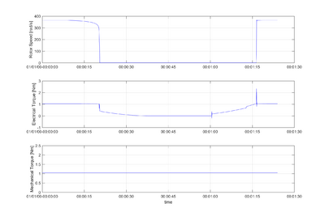
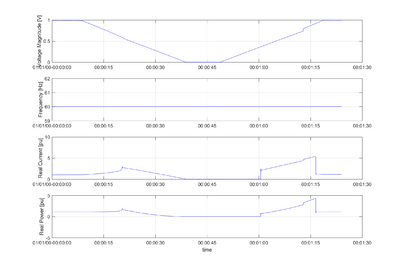

# Tech:DeltaSPIM

**Source URL:** https://gridlab-d.shoutwiki.com/wiki/Tech:DeltaSPIM
## Contents

  * 1 Overview
  * 2 Dynamic Phasor Model
  * 3 GridLAB-D Implementation
    * 3.1 motor object
    * 3.2 Motor Parameters
    * 3.3 Motor Model Verification
    * 3.4 Motor State of Development
  * 4 References
# Overview

This page describes the implementation of a single phase induction motor model using dynamic phasors. The model was first presented in [1]. The model is created to represents the impact of residential single phase induction motor, (air-conditioners, compressors, etc.) on power system dynamic performance. Our particular interest is in modeling the impact on dynamic voltage stability and oscillation damping. The model is expected to: 

  * Accurately capture the sensitivities of motor real and reactive power requirements as a function of its voltage and frequency
  * Reasonably predict the stalling phenomenon, as well as accurately represent motor current, real and reactive power during the stalled state
# Dynamic Phasor Model

Variable | Unit | Definition   
---|---|---  
$V_{qs}$ | V | Stator q axis voltage   
$V_{ds}$ | V | Stator d-axis voltage   
$r_{ds}$ | ohm | Stator d axis resistance   
$r_{qs}$ | ohm | Stator q axis resistance   
$r_{r}$ | ohm | Rotor resistance   
$X_{r}$ | ohm | Rotor reactance   
$X_{ds}^{'}$ | ohm | Rotor reactance   
$X_{qs}^{'}$ | ohm | Rotor reactance   
$X_{m}$ | ohm | Magnetizing reactance   
$X_{c}$ | ohm | Starting capacitor reactance   
$\omega_{r}$ | rad/sec | Rotor mechanical speed   
$\omega_{s}$ | rad/sec | System speed   
$\omega_{b}$ | rad/sec | Base speed   
$\psi_{f}^{R} + j\psi_{f}^{I}$ | Wb | Forward flux   
$\psi_{b}^{R} + j\psi_{b}^{I}$ | Wb | Backward flux   
$\psi_{dr}^{R} + j\psi_{dr}^{I}$ | Wb | Rotor d axis flux   
$\psi_{qr}^{R} + j\psi_{qr}^{I}$ | Wb | Rotor q axis flux   
$I_{f}^{R} + jI_{f}^{I}$ | A | Forward current   
$I_{b}^{R} + jI_{b}^{I}$ | A | Backward current   
$I_{qs}^{R} + jI_{qs}^{I}$ | A | Stator d axis current   
$I_{ds}^{R} + jI_{ds}^{I}$ | A | Stator q axis current   
$I_{S} $ | A | System current   
$\phi $ | rad | Voltage phasor angle   
$T_{0}^{'} $ | sec | Rotor time constant   
$H $ | Nm | Moment of inertia   
$T_{mech} $ | pu | Mechanical torque   
  
$$|V_{s}| = ( r_{ds} + j \frac{\omega_{s}}{\omega_{b}} X_{ds}^{'} ) (I_{ds}^{R} + jI_{ds}^{I}) + j ( \frac{\omega_{s}}{\omega_{b}} ) \frac{X_{m}}{X_{r}} (\psi_{dr}^{R} + j\psi _{dr}^{I})$$

$$|V_{s}| = ( r_{qs} + j \frac{\omega_{s}}{\omega_{b}} X_{qs}^{'} + j \frac{\omega_{b}}{\omega_{s}} X_{c} ) (I_{qs}^{R} + jI_{qs}^{I}) + j ( \frac{\omega_{s}}{\omega_{b}} ) \frac{n X_{m}}{X_{r}} (\psi_{qr}^{R} + j\psi _{qr}^{I})$$

$$T_{0}^{'} \frac{d}{dt} (\psi _{f}^{R} + j\psi _{f}^{I}) = X_{m} (I _{f}^{R}+ jI _{f}^{I} ) - ( sat(\psi_{f},\psi_{b}) + j (\omega_{s} - \omega_{r}) T_{0}^{'} ) (\psi _{f}^{R} + j\psi _{f}^{I})$$

$$(\psi_{b}^{R} + j \psi_{b}^{I}) = \frac{X_{m} (I_{b}^{R} + jI_{b}^{I}) }{(sat(\psi_{f},\psi_{b}) + j (\omega_{s} + \omega_{r}) T_{0}^{'} )}$$

$$\frac{2H}{\omega_{b}} \frac{d}{dt} \omega_{r} = \frac{X_{m}}{X_{r}} ({I_{f}^{I} \psi_{f}^{R} - I_{f}^{R} \psi_{f}^{I} - I_{b}^{I} \psi_{b}^{R} + I_{b}^{R} \psi_{b}^{I}} ) - T_{mech}$$

$$I_{S} = ( (I_{ds}^{R} + jI_{ds}^{I}) + (I_{qs}^{R} + jI_{qs}^{I}) ) e^{j \phi }$$

$$\begin{bmatrix} \psi_{f}^{R} + j \psi_{f}^{I} \\\\\ psi_{b}^{R} + j \psi_{b}^{I} \end{bmatrix} = \frac{1}{2} \begin{bmatrix}1 & -j \\\ 1 & j \end{bmatrix} \begin{bmatrix}\psi_{dr}^{R} + j \psi_{dr}^{I} \\\ \psi_{qr}^{R} + j \psi _{qr}^{I} \\\\\end{bmatrix}$$

$$\begin{bmatrix} \psi_{dr}^{R} + j \psi_{dr}^{I} \\\\\ psi_{qr}^{R} + j \psi_{qr}^{I} \end{bmatrix} = \begin{bmatrix}1 & 1 \\\ j & -j \end{bmatrix} \begin{bmatrix}\psi_{f}^{R} + j \psi_{f}^{I} \\\ \psi_{b}^{R} + j \psi _{b}^{I} \\\\\end{bmatrix}$$

$$\begin{bmatrix}I_{f}^{R} + j I_{f}^{I} \\\ I_{b}^{R} + j I_{b}^{I} \end{bmatrix} = \frac{1}{2} \begin{bmatrix} 1 & -jn \\\ 1 & jn \end{bmatrix} \begin{bmatrix} I_{ds}^{R} + j I_{ds}^{I} \\\ I_{qs}^{R} + j I_{qs}^{I} \\\\\end{bmatrix}$$

$$\begin{bmatrix}I_{ds}^{R} + j I_{ds}^{I} \\\ I_{qs}^{R} + j I_{qs}^{I} \end{bmatrix} = \begin{bmatrix} 1 & 1 \\\ \frac{j}{n} & -\frac{j}{n} \end{bmatrix} \begin{bmatrix} I_{f}^{R} + j I_{f}^{I} \\\ I_{f}^{R} + j I_{f}^{I} \\\\\end{bmatrix}$$

# GridLAB-D Implementation

## motor object

The motor model is divided into two portions, a steady state model and a delta mode model. Both models are obtained from the above mentioned equations. The steady state model is an iterative model solving the dynamic phasor equation at each time step. This model is valid for time steps greater than 0.3 milliseconds. The delta mode model also uses the dynamic phasor equations and is valid for time steps below 0.3 milliseconds. Switching between the model is handled by user specified settings for the speed and voltage of the motor. These properties can be found below. A minimalist motor could be created with 
    
    
       object motor {
           name MotorOne;
    	phases AN;
    	nominal_voltage 240.0;
       }
    

which is the same as specifying 
    
    
       object motor {
           name MotorOne;
           phases AN;
           nominal_voltage 240.0;
           base_power 3500;
           n 1.22;
           Rds 0.0365;
           Rqs 0.0729;
           Rr 0.0486;
           Xm 2.28;
           Xr 2.33;
           Xc_run -2.779;
           Xc_start -0.7;
           Xd_prime 0.1033;
           Xq_prime 0.1489;
           A_sat 0.7212;
           b_sat 5.6;
           H 0.04;
           To_prime 0.1212;
           capacitor_speed 50;
           trip_time 10;
           reconnect_time 300;
           mechanical_torque 1.0448;
           iteration_count 1000;
           delta_mode_voltage_trigger 80;
           delta_mode_rotor_speed_trigger 80;
           delta_mode_voltage_exit 95;
           delta_mode_rotor_speed_exit 95;
           maximum_speed_error 1e-10;
           motor_status RUNNING;
           motor_override ON;
       }
    

## Motor Parameters

As with all powerflow objects, `phases` and `nominal_voltage` are inherently part of `node`. 

Property Name  | Type  | Unit  | Description   
---|---|---|---  
base_power  | double  | Watts  | The base power of the motor.   
n  | double  | N/A  | Ratio of stator auxiliary windings to stator main windings.   
Rds  | double  | Ohm  | The resistance of the d-axis.   
Rqs  | double  | Ohm  | The resistance of the q-axis.   
Rr  | double  | Ohm  | The rotor resistance.   
Xm  | double  | Ohm  | The magnetizing reactance of the motor.   
Xr  | double  | Ohm  | The reactance of the rotor.   
Xc_run  | double  | Ohm  | The reactance of the running capacitor.   
Xc_start  | double  | Ohm  | The reactance of the starting capacitor.   
Xd_prime  | double  | Ohm  | The reactance of the d-axis.   
Xq_prime  | double  | Ohm  | The reactance of the q-axis.   
A_sat  | double  | N/A  | Flux saturation parameter, A.   
b_sat  | double  | N/A  | Flux saturation parameter, b.   
H  | double  | Nm  | The moment of inertia for the motor.   
capacitor_speed  | double  | Percent  | Percentage speed of nominal when starting capacitor kicks in.   
trip_time  | double  | Seconds  | The time a motor can stay stalled before it trips off.   
reconnect_time  | double  | Seconds  | The time before a tripped motor tries to reconnect.   
mechanical_torque  | double  | Pu  | The mechanical torque applied to the motor.   
iteration_count  | double  | N/A  | Maximum number of iterations for the steady state model.   
delta_mode_voltage_trigger  | double  | Percent  | Percentage voltage of nominal when delta mode is triggered.   
delta_mode_rotor_speed_trigger  | double  | Percent  | Percentage speed of nominal when delta mode is triggered.   
delta_mode_rotor_speed_exit  | double  | Percent  | Percentage speed of nominal to exit delta mode.   
delta_mode_voltage_exit  | double  | Percent  | Percentage voltage of nominal to exit delta mode.   
maximum_speed_error  | double  | N/A  | Variable to set the maximum speed error in the steady state model.   
wr  | double  | rad/sec  | The speed of the rotor.   
motor_status  | enumeration  | N/A  | The current status of the motor. 

  * `RUNNING`, the motor is running
  * `STALLED`, the motor is stalled
  * `TRIPPED`, the motor is tripped
  * `OFF`, the motor is off

  
motor_override  | enumeration  | N/A  | The current status of the motor. 

  * `ON`, the motor is turned ON
  * `OFF`, the motor is turned OFF

  
  
## Motor Model Verification

In order to verify that the motor model works as intended it was subjected to a voltage ramp signal as seen in Fig. 1. It is expected, as the voltage magnitude drops below ~0.6 pu, that the motor will stall, as it does in this simulation. From the data it can also be verified that the object switches into delta mode in order to capture the stall and out again when the motor is running with nominal voltage and rotor speed. After the motor is stalled it trips of at ~38 seconds due to thermal overload. The motor tries to reconnect again at ~58 seconds. The motor remains stalled until ~77 seconds where the voltage has recovered enough for the motor to start. The full simulation can be seen in Fig. 1 and 2. 

Figure 1. Top plot is the rotor speed of the motor. Middle plot is the electrical torque on the motor, and the bottom plot is the mechanical torque applied to the motor.

Figure 2. Top plot is voltage magnitude applied to the motor. Next plot is frequency at the motor. Next plot is real current drawn by the motor and last is the real power drawn by the motor

## Motor State of Development

Motor is considered a experimental model. 

# References

  1. Bernard Lesieutre, Dmitry Kosterev, John Undrill, "Phasor Modeling Approach for Single Phase A/C Motors," _IEEE Power and Energy Society General Meeting_ , 2008.

