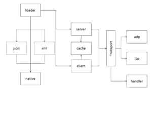
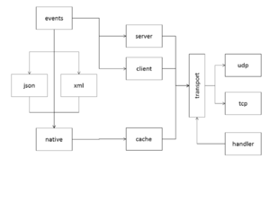

# Dev:connection

**Source URL:** https://gridlab-d.shoutwiki.com/wiki/Dev:connection
PROPOSED FOR 3.1 

## Contents

  * 1 Sequence of operations
    * 1.1 Loader processing
    * 1.2 Event handling
    * 1.3 Caveat
  * 2 See also
Dev:connection \- [Connection] module developer documentation 

The [connection] module implements a general data exchange method for GridLAB-D to co-simulate with other tools. The module is design to be agnostic about the type of application that it is exchanging data with. Anticipated remote apps include the following. 

GridLAB-D
    Connections to other GridLAB-D instances would be supported using the [native] class (although it should work with any matched protocol client/server pair).

Hardware-in-the-loop
    Connections to hardware devices can be support using the available protocols. In addition, the [Module API] should allow easy implementation of additional protocols.

Co-simulation
    Connections to other simulation tools, e.g., [ns3], [matlab], [Energy+] should be possible either by creating a server or client wrapper for GridLAB-D in the connection module.

## Sequence of operations

object load (native or derived xml, json, etc...)

  * create (GLM loader) 
    * server/client setup 
      * cache setup
      * transport setup 
        * handler setup (server)
    * varmap (link pseudo-property)
core event (module exports)

  * varmap loop 
    * connection hand-off (server,client) 
      * cache update
      * transport dispatch (client) 
        * response handling
### Loader processing

Figure 1: Create hierarchy (Source: SVN/connection/connection.pptx)

The objects that are encountered by the loader are [native], [xml], and [json]. These objects handle all the input parameters and creation callbacks. The [native] object sets up the variable maps for all the supports events (see below). During creation the object must determine whether the connection mode is [server] or [client]. The connection mode also sets up the [cache]. 

The transport type [tcp] or [udp] is passed to the connection when it is created. When the transport is setup the incoming and outgoing message handling threads are create. 

### Event handling

Figure 2: Event hierarchy (Source: SVN/connection/connection.pptx)

The message format of native messages is GridLAB-D's [internal type] conversion formats. The [xml] and [json] support different message formats by converting to and frmo the native format. 

The following events are supported and message maps may be created for each using the [link] object pseudo-property: 

INIT
    Variables in INIT map are exchanged during initialization process
PRECOMMIT
    Variables in PRECOMMIT map are exchanged during pre-commit process
PRESYNC
    Variables in PRESYNC map are exchanged during pre-sync process (see below)
SYNC
    Variables in SYNC map are exchanged during sync process (see below)
POSTSYNC
    Variables in POSTSYNC map are exchanged during post-sync process (see below)
COMMIT
    Variables in COMMIT map are exchanged during commit process
PRENOTITY
    Variables in PRENOTIFY are exchanged during prenotify process
POSTNOTIFY
    Variables in POSTNOTIFY map are exchanged during postnotify process
FINALIZE
    Variables in FINALIZE map are exchanged during finalize process
PLC
    Variables in PLC map are exchanged during plc process (if plc override is active)
TERM
    Variables in TERM map are exchange when simulation terminates

### Caveat

The rank of the exchange object determines when the variable map is processed in relation to the other objects in the model. Modelers must take care to set the rank appropriately with respect to the events during which exchange occurs. This is particularly critical during *SYNC events. 

## See also

  * [Connection] classes 
    * [xml]
    * [json]
    * [native]
    * [volttron]
    * [matlab]
  * [Connection] variables 
    * [security]
    * [lockout]
  * [Connection] documentation 
    * [Requirements]
    * [Specifications]
    * [Validation]
    * Developer docs

