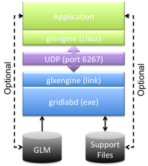
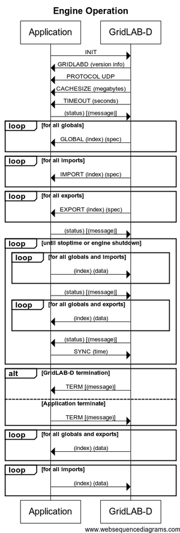

# Glengine

**Source URL:** https://gridlab-d.shoutwiki.com/wiki/Glengine
# Glengine

**_Proposed for review_**

## Contents

  * 1 Description
    * 1.1 glengine
    * 1.2 ~glengine
    * 1.3 connect
    * 1.4 shutdown
    * 1.5 restart
    * 1.6 signal
    * 1.7 send
    * 1.8 recv
    * 1.9 sync
  * 2 Example
  * 3 Version
  * 4 See also
glengine \- GridLAB-D engine library 
    
    
    class glengine {
    public:
      glengine(void)
      ~glengine(void);
      int connect(const char *command, ...);
      int shutdown(int code);
      int restart(void};
      int signal(int sig);
      int send(const char *name, const char *value);
      int recv(const char *name, const char *buffer, int maxlen);
      int sync(const char *time);
    public:
      void set_debug_level(int n);
      int get_debug_level(void);
    public:
      void set_timeout(int n);
      int get_timeout(void);
    public:
      void set_window(bool b);
      bool get_window(void);
    public:
      pthread_t get_pid(void);
    public:
      void set_addr(unsigned long addr);
      void set_addr(unsigned char a, unsigned char b, unsigned char c, unsigned char d);
      unsigned long get_addr(unsigned int part);
    public:
      void set_port(unsigned short n);
      unsigned short get_port(void);
    public:
      int get_errorcode(void);
      const char *get_errormsg(int code);
    }
    

## Description

Figure 1: Structure of an engine-based application

The GridLAB-D Engine is a C++ class library that allows developers to link synchronously with GridLAB-D's core using the [Engine link]. The GLM file must be listed among the command line arguments. The GLM file must include a [link] directive to enable data exchange between the application and GridLAB-D. The structure of an engine-based application is shown in Figure 1. 

### glengine

Figure 2: UML sequence of operation of the GridLAB-D Engine

    Constructs an instance of GridLAB-D asynchronously using the command line provided. If the command is included, connect is called before returning. If an error occurs an exception is thrown.

### ~glengine

    Destroys an instance of GridLAB-D.

### connect

The call will return once the link is established. Error result reasons include 

    
Timeout
    The link was not successfully established before the timeout.
Bad command
    The command line was not valid.
Shell error
    The shell could not be started.

### shutdown

    Shuts down an instance of GridLAB-D but retains the data buffers.

### restart

    Restarts an instance of GridLAB-D. If the instance is not shutdown, it is shutdown first and then restarted.

### signal

    Send a signal to a GridLAB-D instance. See [signal] for details.

### send

    Send a data element to a GridLAB-D instance. The data element must be listed in the [link] directive in the GLM file loaded.

### recv

    Receives a data element from a GridLAB-D instance. The data element must be listed in the [link] directive in the GLM file loaded.

### sync

    Send a clock synchronization message to GridLAB-D.

## Example

The following example illustrates how the glengine class is used to open a link to a new gridlabd instance, synchronize with the simulation, receive and send data to the instance. 

example.cpp
    
    
    #include <stdio.h>
    #include "glengine.h"
    
    int main(int argc, char *argv[])
    {
    	// prepare to catch exceptions from engine calls
    	try {
    		// connect to a gridlabd instance running the model in 'engine.glm'
    		glengine::set_initial_debug_level(9);
    		glengine engine("gridlabd","-W .","--verbose --debug","example.glm",NULL);
     
    		// prepare a buffer to handle the timestamp
    		// NEVER used to indicate no return time is desired
    		char timestamp[64] = "NEVER"; 
     
    		// run until sync fails
    		while ( engine.sync(timestamp,sizeof(timestamp)) )
    		{	
    			// prepare a buffer to receive the value
    			char buffer[1024];
     
    			// request the value 'y0'
    			if ( !engine.recv("y0",buffer,sizeof(buffer)) )
    				throw "recv failed";
     
    			// send the value for 'x0'
    			if ( !engine.send("x0","12.34") )
    				throw "send failed";
    		}
    	} 
    	catch (const char *msg)
    	{
    		fprintf(stderr,"example: %s\n",msg);
    	}
    }
    

example.glm
    
    
    link example.link;
    //  **TODO**:  fill in the rest of the model
    

Link file
    
    
    target engine
    //  **TODO**:  fill in the rest of the link directives
    

## Version

The glengine class was introduced in [Hatwai]. 

## See also

  * glengine
  * [engine link]
  * [engine protocol]
