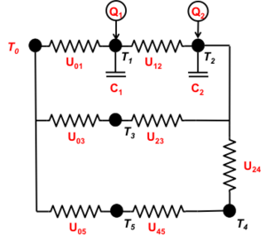
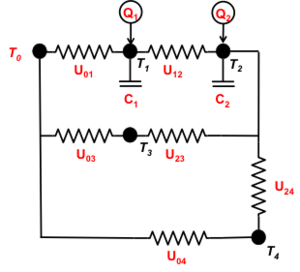
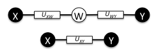
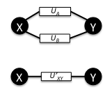

# Tech:Multizone ETP Linearization

**Source URL:** https://gridlab-d.shoutwiki.com/wiki/Tech:Multizone_ETP_Linearization
*** WORKING DRAFT ***   
**Please review, edit and[comment] as necessary**.

* * *

## Contents

  * 1 Introduction
    * 1.1 Nomenclature
  * 2 Methodology
    * 2.1 Step 1: Compute temperatures of all massive nodes
    * 2.2 Step 2: Compute temperatures of all massless nodes
      * 2.2.1 Series massless nodes configurations
      * 2.2.2 Parallel massless nodes configurations
      * 2.2.3 Delta massless nodes configurations
      * 2.2.4 Special Case for "Bang-Bang" HVAC Control
      * 2.2.5 Special case for Proportional-Differential (PD) HVAC Control
    * 2.3 Step 3: Compute temperatures of reduced nodes
  * 3 Validation
  * 4 Authors
  * 5 See also
Tech:Multizone_ETP_Linearization \- Linearized solution of the Equivalent Thermal Parameters method for modeling multizone commercial buildings 

## Introduction

**TODO**:  Describe purpose of multizone ETP solver and reason for linearization. 

### Nomenclature

$C_n$
    The heat capacity of $n$th node (Btu/degF).
$\Delta t$
    The time-step taken for the next iteration (h).
$\Delta T_n$
    The difference between the observed temperature and the setpoint temperature of the $n$th node, if controlled.
$k$
    The proportional control gain of the HVAC control system (unitless).
$N$
    The number of nodes in a thermal network (integer).
$n$
    A reference to the $n$th of $N$ nodes (integer).
$m$
    A reference to the $m$th of $N$ nodes (integer).
$Mode_n$
    The HVAC mode of the system interacting with the $n$th zone (_heat_ , _cool_ , etc.).
$Q_n$
    The HVAC heat flow into (positive for heating) or out of (negative for cooling) the $n$th node, if controlled (Btu/h).
$Q_{nm}$
    The heat flow from the $n$th to $m$th nodes (Btu/h).
$Q_{mode-cap,n}$
    The heating (positive) or cooling (negative) capacity of the HVAC system interacting with the $n$th node, if controlled (Btu/h).
$T_n$
    The temperature of the $n$th node (degF).
$T_{cool,n}$
    The cooling setpoint temperature of the $n$th node, if controlled (degF).
$T_{heat,n}$
    The heating setpoint temperature of the $n$th node, if controlled (degF).
$U_{nm}$
    The thermal conductance of the path from the $n$th and $m$th nodes (Btu/degF/h).

## Methodology

Figure 1. 6-Node Thermal Network

Known parameter values and boundary conditions are shown in red. Illustrated in Figure 1 is an arbitrary six-node thermal network. Note that the top horizontal branch is the original ETP circuit model, where $T_0$ is the outdoor air temperature (known boundary condition), $T_1$ is the indoor air temperature, and $T_2$ is the mass temperature. Node 3 might represent an unconditioned atrium space. Nodes 4 and 5 are present to illustrate series solutions of massless nodes, and might also represent an atrium with an additional buffer space to the outdoors. 

Two additional massless paths are added to illustrate additional circumstances. A node n is characterized by its temperature Tn, its mass $C_n$ (which can be zero), and an exogenous heat gain $Q_n$ (from solar, internal, and/or HVAC, which is a boundary condition that can also be zero). 

Nodes $m$ and $n$ are connected by conductance’s $U_{mn}$. A conductance might represent the UA of a building, an air flow rate between two nodes, or the product of a convective surface heat transfer coefficient and the surface area, for example. 

To solve this circuit explicitly, the heat flow from any node $m$ through the conductance to any other node $n$ at the time $t$is denoted as $Q_{mn}(t)$. Thus 

$$Q_{mn}(t)=U_{mn}\left[T_m(t)-T_n(t)\right]\tag{1}$$

Note that this implies a sign convention for heat flow into a node as positive. Thus, by definition, $Q_{mn}=-Q_{nm}$. 

Assume a "small" time step $\Delta t$ during which all temperatures change by a "small" amount relative to the temperature differences between the nodes, i.e. $Q_{mn}$ can be considered a constant. This is the linearizing assumption. The maximum time-step $\Delta t$ permissible that satisfies the linearizing assumption is limited by two considerations: 

(1) How long until an HVAC $Mode_n$ changes or internal gains $Q_n$ change?
    This is determined by the time to the next expected change in mode, which can be estimated for each node based on the type of control (bang-bang or proportional).

(2) How long until the change in the temperature difference between a two nodes $n$ and $m$ exceeds a preset limit?
    This is determined by computing the rate of change of the temperature difference and estimating the time until that rate of change exceeds a preset limit.

### Step 1: Compute temperatures of all massive nodes

Then the heat balance on a massive node $n$, i.e., $C_n >0$, from a set of connected nodes $m=1$ to $M$, from time $t$ to time $t+\Delta t$ is: 

$$ Q_n(t)+\sum_{m=1}^M Q_{mn}(t)=\frac{C_n\left[T_n(t+\Delta t)-T_n(t) \right]}{\Delta t}\tag{2}$$

where $Q_n(t)$ is assumed to be constant boundary condition over the interval. 

Solving this for the temperature of the node at the next time step: 

$$ \frac{C_n T_n(t+\Delta t)}{\Delta t} = Q_n(t)+\sum_{m=1}^M Q_{nm}(t)+\frac{C_n T_n(t)}{\Delta t}\tag{3}$$

$$ T_n(t+\Delta t) = \frac{\Delta t}{C_n} \left[Q_n(t)+\sum_{m=1}^M Q_{nm}(t)\right] + T_n(t)\tag{4}$$

Substituting the definition for $Q_{nm}$ from Equation (1): 

$$ T_n(t+\Delta t) = \frac{\Delta t}{C_n} \left[Q_n(t)+\sum_{m=1}^M U_{mn}\left[T_m(t)-T_n(t)\right]\right] + T_n (t)\tag{5}$$

or 

$$ T_n(t+\Delta t) = \frac{\Delta t}{C_n} Q_n(t) + \frac{\Delta t}{C_n} \sum_{m=1}^M U_{mn} T_m(t) + T_n(t) \left[1-\frac{\Delta t}{C_n}\sum_{m=1}^M U_{mn}\right]\tag{6}$$

### Step 2: Compute temperatures of all massless nodes

If node $n$ is massless, i.e., $C_n = 0$, then it must be in thermal equilibrium with all adjacent nodes at any time. For massless nodes, Equation (2) reduces to 

$$ Q_n(t)+\sum_{m=1}^M Q_{nm}(t+\Delta t)=0\tag{7}$$

where over the time interval from $t$ to $t+\Delta t$ $Qn$ is a constant boundary condition. 

Substituting the definition for $Q_{mn}$ from Equation (1): 

$$ Q_n(t)+\sum_{m=1}^M U_{mn} \left[ T_m(t+\Delta t)-T_n(t+\Delta t) \right]=0\tag{8}$$

Solving for the temperature of the node at time t+Δt: 

$$ T_n(t+\Delta t)=\frac{Q_n(t)+\sum_{m=1}^M U_{mn}T_m(t+\Delta t)}{\sum_{m=1}^M U_{mn}}\tag{9}$$

Figure 2. Reduced equivalent of 6-node thermal network

Computing the temperature of massless nodes in the thermal network assumes all temperatures of adjacent nodes are known at the end of a time-step, either as boundary conditions, or because they are massive and have had their temperatures computed in Step 1. 

The simplest way to resolve this is to reduce the network to an equivalent network when massless nodes are in series, parallel, or "wye" configuration. 

#### Series massless nodes configurations

Figure 3a - Series massless node reduction

A series configuration of two nodes, such as the thermal network in Figure 1, can be reduced as shown in Figure 2, where Node 5 is eliminated and the equivalent series conductance from Node 0 to Node 4 is 

$$ U_{xy} = \frac{U_{xw} + U_{wy}}{U_{xw} U_{wy}}\tag{10a}$$

#### Parallel massless nodes configurations

Figure 3b - Parallel thermal path reduction

A parallel configuration of two nodes can be reduced to a single node thus: 

$$ U_{xy} = U_{A} + U_{B} \\!\tag{10b}$$

#### Delta massless nodes configurations

A "delta" configuration of 3 nodes $(x, y, z)$ can be transformed to a "wye" configuration of four nodes $(x,y,z,w)$ as follows: 

$$\begin{align}

U_{xw} &= U_{xy}U_{xz}\left[ \frac{1}{U_{xy}} + \frac{1}{U_{yz}} + \frac{1}{U_{xz}} \right] \\\ U_{yw} &= U_{xy}U_{yz}\left[ \frac{1}{U_{xy}} + \frac{1}{U_{yz}} + \frac{1}{U_{xz}} \right] \\\ U_{zw} &= U_{xz}U_{yz}\left[ \frac{1}{U_{xy}} + \frac{1}{U_{yz}} + \frac{1}{U_{xz}} \right] 

\end{align}\tag{10c}$$

(10c)

Note that for the general "star-mesh" case, the transformation is: 

$$ U_{ij} = U_iw U_jw \sum_{n=1}^N \frac{1}{U_n} \tag{10d}$$

where $N=1$ is the dangling node case (which eliminates the node), $N=2$ is the series node case (see above) and $N=3$ is the "delta-wye" transformation case. The "star-mesh" transformation has no general inverse without additional constraints, so all mesh configurations must be simplified using a series of appropriate wye-delta transformations. 

In such all cases, the temperature of the new node, $w$ is calculated as follows: 

$$T_w = \frac{\sum_{n=1}^N U_{nw} T_n}{\sum_{n=1}^N U_{nw}} \tag{10e}$$

#### Special Case for "Bang-Bang" HVAC Control

Nodes whose temperature is used to control $Q_n$ (typically heating or cooling from the HVAC system) must have a modified calculation procedure, because $Q_n$ is no longer a boundary condition but rather a function of the node temperature, $T_n$, and the thermostat setpoints $T_{cool,n}$ and $T_{heat,n}$. 

Define $Q_n$ as the sum of the HVAC energy input (heating positive, cooling negative), and the sum of internal heat gains and solar heat gains, to Node $n$: 

$$ Q_n = Q_{hvac,n}+Q_{gains,n} \quad\tag{11}$$

Let $Q_{cool-cap,n}$ and $Q_{heat-cap,n}$ be the net cooling and heating capacity available to supply the zone, respectively (net of the fan power). Let $Q_{fan,n}$ be the fan power when the HVAC is off (i.e. if the fan runs continually then $Q_{fan,n} > 0$). 

Assume a heating and cooling thermostat with setpoints centered in a deadband with range $+\Delta T_n$ on either side of the setpoint. Note that setpoints must not overlap: 

$$ T_{cool,n} - \Delta T_n > T_{heat,n} + \Delta T_n \quad\tag{12}$$

The thermostat sets $ Q_{hvac,n} $, which persists in subsequent time steps until changed by the thermostat: 

When $  T_n < T_{heat,n} - \Delta T_n $

$$ Mode_n = On \quad ; \quad Q_{hvac,n} = Q_{heat-cap,n} \tag{13}$$

When $  T_n > T_{cool,n} + \Delta T_n $

$$ Mode_n = On \quad ; \quad Q_{hvac,n} = Q_{cool-cap,n} \tag{14}$$

When $  Mode_n=On $ and $ T_{heat,n}+ \Delta T_n $ ≤ $ T_n $ ≤ $ T_{cool,n} - \Delta T_n $

$$ Mode_n = Off \quad ; \quad Q_{hvac,n} = Q_{fan,n} \tag{15}$$

Then the node temperature at time $t+\Delta t$ can be calculated from Equation (6). Note that all HVAC control nodes with On/Off control must be massive. If one were massless, Equation (9) indicates there is no way to maintain a setpoint without proportional control of $Q_{hvac,n}$. 

#### Special case for Proportional-Differential (PD) HVAC Control

In the case of proportional control for $Q_{hvac,n}$, then a proportional-differential control scheme: 

When $  T_{heat,n} - \Delta T_n < T_n(t) < T_{heat,n} + \Delta T_n \quad$

$$ Q_{hvac,n}(t) = Q_{heat-cap,n}(t) \left[ \frac{T_{heat,n}+\Delta T_n-T_n(t)}{2\Delta T_n} - \frac{k}{2\Delta T_n} \left[ T_n(t)-T_n(t-\Delta t)\right]\right]\tag{16}$$

When $  T_{cool,n} - \Delta T_n < T_n(t) < T_{cool,n} + \Delta T_n \quad$

$$ Q_{hvac,n}(t) = Q_{cool-cap,n}(t) \left[ \frac{T_n(t) - T_{cool,n} + \Delta T_n}{2 ∆T_n} - \frac{k}{2\Delta T_n} \left[ T_n(t-\Delta t)-T_n(t) \right] \right]\tag{17}$$

When $  T_{heat,n} + \Delta T_n \le T_n(t) \le T_{cool,n} - \Delta T_n$

$$Q_{hvac,n}(t) = Q_{fan,n} \quad\tag{18}$$

where $k$ is the proportional gain for the controller. 

### Step 3: Compute temperatures of reduced nodes

Massless nodes that have been reduced from the network are unnecessary to the simulation model of the network if 

  1. the temperature of the node does not affect some non-linear aspect such as a thermostatic control, and
  2. the temperature is not needed as an output variable for some purpose.
In general, it may be best to assume that if the user specified “unneeded” nodes, that there was some purpose in mind, and their temperatures should be computed from Equation (9) as a final step. 

## Validation

**TODO**:  Describe how to validate a numerical implementation of this method. 

## Authors

This method was developed by Robert G. Pratt and Lucy Huang at Pacific Northwest National Laboratory 

## See also

  * [User's manuals]
    * [Commercial module]
    * Building types 
      * [Office]
      * [Large office] **TODO**: 
      * [Small office] **TODO**: 
      * [Retail] **TODO**: 
      * [Grocery] **TODO**: 
      * [Food_service] **TODO**: 
      * [Lodging] **TODO**: 
      * [School] **TODO**: 
      * [Health] **TODO**: 
  * Technical documents 
    * [Requirements]
    * [Specifications]
    * [Technical support document]
    * [Developer's guide]
    * [Validation]
  * [Residential]
  * [Modules]

