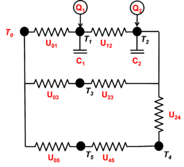

# Spec:Commercial

**Source URL:** https://gridlab-d.shoutwiki.com/wiki/Spec:Commercial
## Contents

  * 1 Explicit Solution
    * 1.1 Massive node temperature
    * 1.2 Massless node reduction
    * 1.3 Massless node temperature
    * 1.4 Bang-bang HVAC controls
    * 1.5 PID HVAC controls
  * 2 See also
Spec:Commercial \- Specifications for commercial building models 

[]

Fig. 1: An example of a 6-node commercial building model. The branch from node 0 to node 2 is the original ETP model such as is used by the [residential] module. Node 3 represents an unconditioned space, while nodes 4 and 5 represent a series of massless nodes between the indoor spaces and the outdoor.

Large multizone commercial buildings are simulated using a linearized _N_ -node ETP model, such as the one illustrated in Fig. 1. Because large buildings are separated into multiple control zones, each control zone must be associated with exactly one thermal node. Other thermal nodes may be defined as needed. 

Each thermal node is characterized by its temperature $ T_n $, its thermal mass $ C_n $, and an exogenous heat gain (or loss) $ Q_n $ from solar, internal, and/or HVAC boundary conditions (and which may be zero). 

Two nodes $ n $ and $ m $ are connected by the conductance $U_{nm}$, which represents the combined effect of the _UA_ of the surfaces separating the two zones, the associated convective surface heat transfers, and the air exchange between the zones. 

## Explicit Solution

To solve this thermal circuit explicitly, the heat flow from the node $ n $ to the node $ m $ is computed as 

$Q_{nm} = U_{nm} \left ( T_n - T_m \right )$

where $T_n$ is the temperature of the node $n$. Note that the sign convention for $ Q $ is positive for heat flowing into a node. Thus by definition $ Q_{nm} = -Q_{mn} $. 

### Massive node temperature

Assuming a "small" time step, $dt$ during which all temperature changes are "small" enough relative to the differences between the node temperatures that all the quantities $ Q_{nm} $ can be considered constant. This is the linearization assumption. 

The heat balance for a massive node $n$ (i.e., $C_n > 0$ with respect to all nodes $ m \in {1,M} $ over the time interval from $t$ to $ t + \Delta t $ is 

$  Q_n(t) + \sum_{m=1}^M Q_{mn}(t) = \frac { C_n \left [ T_n(t+\Delta t)-T_n(t) \right ] } { \Delta t } $

where $ Q_n(t) $ is a boundary condition assumed to be constant over the interval $t$ to $ t + \Delta t $. The explicit solution to this equation is 

$  T_n(t+\Delta t) = \frac { \Delta t } { C_n } Q_n(t) + \frac { \Delta t } { C_n } \sum_{m=1}^M U_{mn} T_m(t) + T_n(t) \left ( 1 - \frac { \Delta t } { C_n } \sum_{m=1}^M U_mn \right ) $

### Massless node reduction

Before computing the temperatures of the massless nodes, all those in series must be reduced until all the adjacent nodes are massive. Most often series reductions are sufficient: 

$ U_ik = \left ( \frac{1}{U_{ij}} + \frac{1}{U_{jk}} \right )^{-1} $.

In some cases a parallel reduction over $ K $ paths is necessary 

$ U_{ij_k} = \sum_{k=1}^K U_{ij_k} $.

More generally, all "star" configurations of massless nodes must be reduced to "mesh" configuration by eliminating the node $ k $ for all other pairs of nodes $ i,j $ using 

$ U_{ij} = z_{ik} z_{jk} \sum z^{-1} $.

### Massless node temperature

Each massless node (i.e., $ C_n = 0 $) must be in thermal equilibrium with all connected nodes. So the above heat balance equation reduces to 

$  Q_n(t) + \sum_{m=1}^M Q_{nm}(t+\Delta t) = 0 $

the explicit solution of which is 

$  T_n(t+\Delta t) = \frac { Q_n(t) + \sum_{m=1}^M U_{mn} T_m(t+\Delta t) } { \sum_{m=1}^M U_{mn} } $

Massless node temperatures can be left uncomputed when a) the node temperature is not used in any non-linear portion of the simulation (e.g., thermostat input), and b) the node temperature is not use as an output variable. 

In general, if the modeler has created a massless node, it should be presumed necessary for some reason and its temperature should be calculated. 

### Bang-bang HVAC controls

Only massive nodes may have "bang-bang" HVAC controls applied to them. The total heat contribution from the HVAC systems is 

$  Q_{HVAC} = Q_{heat} - Q_{cool} + Q_{fan} $

where 

  * $ Q_{heat} $ is the plant heating contribution to the zone (if any)
  * $ Q_{cool} $ is the plant cooling contribution to the zone (if any)
  * $ Q_{reheat} $ is the terminate reheat contribution to the zone (if any)
  * $ Q_{fan} $ is the heat from the circulation fan (if running)
The thermostat in the zone $  n $ controls the heating/cooling/ventilation by operating in one of four modes, $Mode_n$

  * $ OFF $ \- the fan is off (no heating or cooling)
  * $ VENT $ \- the fan is on without heating or cooling
  * $ HEAT $ \- the fan is on for heating
  * $ COOL $ \- the fan is on for cooling
Each zone thermostat has two set-points, a deadband, and minimum separation: 

  * $ T_{heat} $ \- the heating set-point
  * $ T_{cool} $ \- the cooling set-point
  * $ T_{dead} $ \- the deadband width around each set-point (half above and half below)
  * $ T_{sep} $ \- the minimum separation between the heating and cooling set-points
The following constraints exists for the thermostats parameters: 

$  T_{heat} < T_{cool} - T_{sep} $
$  T_{sep} < 2*T_{dead} $
$  T_{dead} > 0.0 $

The ventilation schedule for each zone must be specified as weekly schedule of days and hours when minimum ventilation must be maintained: 

  * $ V_{min} $ \- the minimum % of air that must be replaced each hour (value between 0.0 and 1.0)
The thermostat modes persist in time until changed as follows: 

  * When no ventilation is scheduled: 
    * $( Mode_n \ne HEAT )  \land ( T_n < T_{heat_n} - \frac{1}{2} T_{dead_n} ) \implies Mode_n \larr HEAT$
    * $  ( Mode_n = HEAT )  \land ( T_n > T_{heat_n} + \frac{1}{2} T_{dead_n}) \implies Mode_n \larr OFF $
    * $  ( Mode_n \ne COOL )  \land ( T_n > T_{cool_n} + \frac{1}{2} T_{dead_n} ) \implies Mode_n \larr COOL $
    * $  ( Mode_n = COOL )  \land ( T_n < T_{cool_n} - \frac{1}{2} T_{dead_n}) \implies Mode_n \larr OFF $
  * When ventilation is scheduled: 
    * $  ( Mode_n \ne HEAT )  \land ( T_n < T_{heat_n} - \frac{1}{2} T_{dead_n} ) \implies Mode_n \larr HEAT $
    * $  ( Mode_n = HEAT )  \land ( T_n > T_{heat_n} + \frac{1}{2} T_{dead_n} ) \implies Mode_n \larr VENT $
    * $  ( Mode_n \ne COOL )  \land ( T_n > T_{cool_n} + \frac{1}{2} T_{dead_n} ) \implies Mode_n \larr COOL $
    * $  ( Mode_n = COOL )  \land ( T_n < T_{cool_n} - \frac{1}{2} T_{dead_n} ) \implies Mode_n \larr VENT $
The thermostat modes are locked for a minimum time duration during which time no change in the mode is permitted: 

  * $ T_{lock} $ \- the minimum lock time (default is 2 minutes)
The heats are computed as follows: 

$  Mode_n=OFF \implies Q_{heat} \larr 0.0  \land Q_{cool} \larr 0.0  \land Q_{fan} \larr 0.0 $

$  Mode_n=VENT \implies Q_{heat} \larr 0.0  \land Q_{cool} \larr 0.0  \land Q_{fan} \larr Q_{fan_{low}} $

$  Mode_n=HEAT \implies Q_{heat} \larr Q_{heat_{cap_n}}  \land Q_{cool_n} \larr 0.0  \land Q_{fan} \larr Q_{fan_{high}} $

$  Mode_n=COOL \implies Q_{heat} \larr 0.0 \land Q_{cool} \larr Q_{cool_{cap_n}} \land Q_{fan} \larr Q_{fan_{high}} $

where 

  * $  Q_{heat_{cap_n}} $ is the heating capacity of the heating system for node $ n $
  * $  Q_{cool_{cap_n}} $ is the cooling capacity of the heating system for node $ n $
  * $ Q_{fan_{low_n}} $ is heat from the fan when running at low power
  * $ Q_{fan_{high_n}} $ is heat from the fan when running at high power
The time until the next mode change is 

$  \Delta t = \frac { C_n [ T_{target_n}(t) - T_n(t) ] } { Q_n(t) + \sum_{m=1}^M U_{mn} [ T_m(t) - T_n(t) ] } $

where the target temperature is determined as follows 

$  Mode_n=HEAT \implies T_{target_n} \larr T_{heat_n} + \frac{1}{2} T_{dead_n}$

$  Mode_n=COOL \implies T_{target_n} \larr T_{cool_n} - \frac{1}{2} T_{dead_n} $

$  ( Mode_n=OFF \lor Mode_n=VENT ) \land ( \Delta T_n < 0 ) \implies T_{target_n} \larr T_{heat_n} - \frac{1}{2} T_{dead_n} $

$  ( Mode_n=OFF \lor Mode_n=VENT ) \land ( \Delta T_n > 0 ) \implies T_{target_n} \larr T_{cool_n} + \frac{1}{2} T_{dead_n} $

where $ \Delta T_n = T_n(t-\Delta t)-T_n(t) $. 

In the rare event that $ T_{target_n}(t) = T_n(t) $ the mode should remain unchanged. 

The time $ \Delta t $ must not to exceed 5 minutes. There is no practical minimum for the $ \Delta t $. 

### PID HVAC controls

When proportional (optionally with integral and/or differential) control is used for a zone, the following is used 

  * When $  T_n(t) < T_{heat_n}(t) $

**TODO**: Figure out how these equatinos are supposed to display:

$ Q_{heat_n}(t) = Q_{heat_{cap_n}}(t) \underset {0.0} \overset {1.0} {\Big [}
    
    
  $$ k_{P_{heat}} \left [ T_n(t)-T_{heat_n}(t) \right ] 
  + k_{I_{heat}} \sum_{\tau=t_{reset}}^t T_n(\tau) \Delta t_\tau 
  + k_{D_{heat}} \frac { T_n(t) - T_n(t-\Delta t) } { \Delta t }  
  {\Big ]} $$
    

$  Q_{cool_n}(t) = 0 $
$  Q_{fan_n}(t) = Q_{fan_{high_n}} $

  * When $  T_n > T_{cool_n} $

$  Q_{heat_n}(t) = 0.0 $
$ Q_{cool_n}(t) = Q_{cool_{cap_n}}(t) \underset {0.0} \overset {1.0} {\Big [}
    
    
  $$ k_{P_{cool}} \left [ T_n(t)-T_{cool_n}(t) \right ] 
  + k_{I_{cool}} \sum_{\tau=t_{reset}}^t T_n(\tau) \Delta t_\tau 
  + k_{D_{cool}} \frac { T_n(t) - T_n(t-\Delta t) } { \Delta t }  
  {\Big ]} $$
    

$  Q_{fan_n}(t) = Q_{fan_{high_n}} $

  * When $  T_{heat_n} \le T_n \le T_{cool_n} $
$  Q_{cool_n} = Q_{heat_n} = 0.0 $

  * When ventilation is scheduled
$  Q_{fan_n} = Q_{fan_{low_n}} $

  * When ventilation is not scheduled
$  Q_{fan_n} = 0.0 $

where 

  * $ t_{reset} $ is the time of the last set-point reset
  * $ k_P $ is the proportional control gain
  * $ k_I $ is the integral control gain (set to zero to disable integral control)
  * $ k_D $ is the differential control gain (set to zero to disable differential control)
## See also

  * [User's manuals]
    * [Commercial module]
    * Building types 
      * [Office]
      * [Large office] **TODO**: 
      * [Small office] **TODO**: 
      * [Retail] **TODO**: 
      * [Grocery] **TODO**: 
      * [Food_service] **TODO**: 
      * [Lodging] **TODO**: 
      * [School] **TODO**: 
      * [Health] **TODO**: 
  * Technical documents 
    * [Requirements]
    * Specifications
    * [Technical support document]
    * [Developer's guide]
    * [Validation]
  * [Residential]
  * [Modules]

