# Spec:Market

**Source URL:** https://gridlab-d.shoutwiki.com/wiki/Spec:Market
# Spec:Market

## Contents

  * 1 Market Module Overview - Auction
  * 2 Overall Specifications
  * 3 Inputs and Outputs
    * 3.1 Inputs
    * 3.2 Outputs
  * 4 Bid Acceptance
  * 5 Market Clearing
    * 5.1 Further Examples
  * 6 Testing
    * 6.1 Bidding and Clearing Functionality
    * 6.2 Market Timing Functionality
    * 6.3 Scalability
    * 6.4 Advanced Features
  * 7 Future Functionality
  * 8 See also
## Market Module Overview - Auction

The market module is defined primarily by the bidding market capability it creates on the system. The actual market is created inside the `auction` object. The `auction` object is an object within the [ Market module ]. The `auction` object accepts bids from supply and demand devices within a system (sellers and buyers). After a set interval, the auction will resolve the supply and demand quantities and prices in a double-auction style to clear the market. This price will become the relevant cleared price after a specified latency interval. 

## Overall Specifications

The `auction` provides a means for different objects within the GridLAB-D program to base their supply or demand on a dynamic or real time price. The market implemented in the `auction` object is implemented as a double-auction market. A double-auction market is one where suppliers and demanders (sellers and bidders) submit their bids of desired price for a set quantity simultaneously. Bidding is handled in the manner outlined by [ Bid Acceptance] below. Once the bidding submission period ends, the market "clears" by selecting the intersection point of the supply and demand curves. Six different clearing scenarios can occur. These different scenarios are outlined in the [ Market Clearing] section below. After the market clears and the relevant latency interval expires, the market price becomes active. At this point, devices that bid into the market will respond appropriately based on internal logic comparing their bid price to the market clearing price. The `auction` object does not provide any book-keeping or enforcement of the market, it simply provides a central market for buyers and sellers to bid their respective prices and quantities. 

At this time, the market only supports single-market bidding. For example, suppose the market is a day ahead energy market. Objects bid into this market one day in advance, but they must do this every hour. Rather than submitting all 24 bids into an hourly market for the next 24-hour period at once (block bidding), the market for 1 AM Tuesday will begin bidding at 1 AM Monday and end at 2 AM, the market for 2 AM Tuesday will begin bidding at 2 AM Monday and end at 3 AM, and so on and so forth. 

## Inputs and Outputs

The `auction` object will accept specified inputs and provide the market results on predetermined outputs. Input and output quantities will only include general properties of the `auction` in the GridLAB-D environment. This will not include the bidding function, which will be defined below. 

### Inputs

The `auction` is a fairly simple GridLAB-D object and only requires a few inputs. The inputs, as well as their quantities and descriptions, are outlined below: 

Input Name  | Quantity type  | Description   
---|---|---  
period  | seconds  | Defines the time between market clearings. This is also the valid bidding period for the market.   
latency  | seconds  | Defines the time between the market clearing and the price becoming active. For example, if the latency was set to 300 seconds (5 minutes), once the market clears, the current price would be "active" 5 minutes later.   
auction_mode  | `DOUBLE_BLIND`, `SINGLE_SELLERS_ONLY`, or `SINGLE_BUYERS_ONLY` | Enables different market type modes. The default, `DOUBLE_BLIND`, is the normal double-blind auction scenario. With `SINGLE_SELLERS_ONLY` set, the market assumes no buyers will bid into the market and uses a fixed price or quantity (defined by `fixed_price` or `fixed_quantity` below) for the buyer's market. This is implemented as a single-blind auction scenario. `SINGLE_BUYERS_ONLY` is the converse scenario with the assumption that not sellers are on the system. The seller's market is then defined by the `fixed_price` or `fixed_quantity` inputs. As with the `SINGLE_SELLERS_ONLY` type, this is implemented as a single-blind auction scenario. In a single-sided market scenario (`SINGLE_SELLERS_ONLY` or `SINGLE_BUYERS_ONLY` selected), only the `fixed_price` or the `fixed_quantity` parameter needs to be specified. If both are specified, only `fixed_price` will be used.   
fixed_price  | currency  | Defines the fixed price for special market bids. If `auction_mode` is defined as something other than `DOUBLE_BLIND`, the market will use this price as the bidding price of the absent party (buyer or seller) for all market clearing scenarios. If specified in the `DOUBLE_BLIND` configuration (normal operation), this input will generate a warning, but the value will be ignored by the `auction` object.   
fixed_quantity  | units  | Defines the fixed quantity for special market bids. If `auction_mode` is defined as something other than `DOUBLE_BLIND`, the market will use this quantity as the bidding quantity of the absent party (buyer or seller) for all market clearing scenarios. As with the `fixed_price` input, if the `auction_mode` is set to `DOUBLE_BLIND`, specifying this value will generate a warning, but the value will be ignored by the market process.   
capacity_reference_object  | object  | Defines an object in the current system that contains a cumulative "units" property. This property represents the total demand on the market and is to be used to help estimate unresponsive buyers on the system. The secondary variable, `capacity_reference_property` is the specific property of the object use. In a power system market, `capacity_reference_object` would be the feeder-level transformer object, and `capacity_reference_property` would be a property like `power_in`.   
capacity_reference_property  | property  | Defines the property of an object in the current system that contains a cumulative "units" value. This value represents the total demand on the market and is to be used to help estimate unresponsive buyers on the system. This property is read from the object specified in `capacity_reference_object`. In a power system market, `capacity_reference_object` would be the feeder-level transformer object, and `capacity_reference_property` would be a property like `power_in`.   
price_cap  | currency  | Defines a maximum allowable bid price on the system. This bid effectively represents an infinite bid (this buyer must be satisfied first, or this seller must only be used as a last resort). Any bids above the amount will be truncated to this value and generate a warning message.   
init_price  | currency  | Defines the initial value to populate the market statistic buffer with. This will result in a mean of `init_price` for all starting intervals. For example, if `init_price` is 5.0, then `current_mean_1d` would be 5.0. The calculated means will immediately become "valid" and slowly update toward the actual mean as the initial buffer is fully populated with clearing prices.   
init_stdev  | currency  | Defines the initial value for populating any uninitialized standard deviations. If the standard deviation is not initialized on `auction` creation, it will revert to this value until the statistics interval is valid. For example, with a 1-hour market period, `current_stdev_1d` would remain at `init_stdev` until 24 market clearing prices are obtained. At this point, the `current_stdev_1d` value will represent the calculated standard deviation, not the value in `init_stdev`. This value **must** be specified, or the explicit `past_stdev_`_xx_ or `current_stdev_`_xx_ **must** be initialized to a user specified value. If unspecified, the `auction` will refuse to start and return an error.   
verbose  | `ON` or `OFF` | Enables verbose output of the market. This will output all individual bid submissions, as well as information about the market clearing. Useful for debugging market interactions, or getting a more thorough view of the market proceedings   
  
Note that the period and latency values do not have to be equal. The `auction` object should be able to handle storing intermediate markets until they become valid. i.e., if the period is 1 hour and the latency is 24 hours (a day-ahead-type market), the `auction` object should be able to store the cleared value for 23 hours before making it active. 

Also note that a poor selection of `init_price` or `init_stdev` could result in undesired behavior on your system for the first few periods, or after a standard deviation calculation becomes "active" (i.e., the calculation becomes the sample standard deviation, rather than `init_stdev`). 

Additional inputs are provided at the module level. These will be specified (if necessary) as: 
    
    
    module market {
    	bid_offset 0.01;
    	}
    

These inputs are: 

Input Name  | Quantity type  | Description   
---|---|---  
bid_offset  | currency  | Defines the small offset to apply to a bid price necessary to maintain clearing criteria (e.g., bid slightly under a seller bid to ensure no inappropriate sellers are activated at market clear). This term defines the "slight" offset explained for Figure 4 below.   
  
### Outputs

Outputs will be used to publish `auction` results, including the clearing prices and quantities of the last market and current market. The outputs should cover the three time intervals of a typical market: the past market, the currently market, and the next market. Each of these intervals should have a structured output with the following fields: 

Field Name  | Quantity type  | Description   
---|---|---  
start_time  | time  | Represents the time this market becomes active   
end_time  | time  | Represents the time this market becomes inactive   
clearing_price  | currency  | Represents this market's clearing price   
clearing_quantity  | units  | Represents this market's clearing quantity   
clearing_type  | `MARGINAL_SELLER`, `MARGINAL_BUYER`, `MARGINAL_PRICE`, `EXACT`, `FAILURE`, and `NULL` | Represent the type of clearing situation that has occurred in the current market. `MARGINAL_SELLER` indicates a marginal seller condition (Figure 1 below); `MARGINAL_BUYER` indicates a marginal buyer condition (Figure 2 below); `MARGINAL_PRICE` indicates the clearing quantities align, but the prices are mismatched (Figure 3 below); `EXACT` indicates the clearing price and quantities both align (Figure 6 below); `FAILURE` indicates a condition in which the market was unable to clear due to insufficient seller quantities (Figure 7 below); and `NULL` indicates a condition in which the market is unable to clear due to no intersection point of the buyer and seller curves (Figure 8 below).   
marginal_quantity  | units  | Represents the marginal quantity of this market. Useful for debugging, as well as providing information for marginal buyers and sellers to handle proportional responses.   
seller_total_quantity  | units  | Represents the cumulative quantity of all sellers in the seller curve, corresponding to the upper right corner   
buyer_total_quantity  | units  | Represents the cumulative quantity of all buyers in the buyer curve, corresponding to the lower right corner   
seller_min_price  | currency  | Represents the price of the lowest seller in the market   
  
This basic structure will be needed to store all markets of interest for this `auction` object. This overall storage structure will be implemented in an array to track all markets. The size of this array will be $Array_{size} = \frac{latency}{period} + 1$ where the "+1" is needed to retain the last active market's information as well. Three elements of the larger, structure array will be directly accessible from the `auction` object. These outputs, as well as other necessary outputs of the object, are: 

Output Name  | Quantity type  | Description   
---|---|---  
past_market  | Market structure above  | Represents the market information for the previously active, cleared market.   
current_market  | Market structure above  | Represents the market information for the active, cleared market.   
next_market  | Market structure above  | Represents the market information for the market activating after the `current_market` expires.   
_yyyy_ _price_mean__x_ | currency  | Represents the average price associated with the _x_ interval defined previously (defined as a module global or a through a property scanning list). _yyyy_ represents the interval of this statistic, `current` or `past`. For example, if _x_ was "1d" and _yyyy_ was "current", `current_price_mean_1d` would represent the mean clearing price of the market for the last 24 hour period.   
_yyyy_ _price_stdev__x_ | currency  | Represents the standard deviation associated with the _x_ interval defined previously (defined as a module global or a through a property scanning list). _yyyy_ represents the interval of this statistic, `current` or `past`. For example, if _x_ was "1d" and _yyyy_ was "current", `current_price_stdev_1d` would represent the standard deviation of the clearing price of the market for the last 24 hour period.   
  
It is important to note that the statistical calculations (_yyyy_` _price_mean_`_x_ and _yyyy_` _price_stdev_`_x_) only exist for the explicitly defined values. For example, if `past_mean_1d` is specified, it does not automatically indicate that `past_stdev_1d` exists, nor `current_mean_1d`, nor `current_stdev_1d`. Only one value for each statistic type and interval is published. In other words, in a 1-hour bidding period market, `current_price_mean_1d` only represents the average for the 23 past markets and the current market. This value is not part of the market structure output defined earlier, so advanced statistics on the `next_market` and any future markets need to be computed independent of the `auction` object. 

## Bid Acceptance

Bid acceptance for the currently clearing market will fall into two categories. Most bidding will be accomplished through a simple bidding function. This function will submit a desired price and quantity into the market and obtain any unique information about the bidding process. The unique information should be unique to the bid and to the current market. If the same identifier is used in a subsequent bidding period, it should be detectable and rejected. The unique bid identifier may be associated with the bidding object, be the bid number submitted into the currently clearing market, or some other unique identifier for that bidding period. The auction should also have the capability to receive bids with the current status of the bidder. That is, it should include whether the bidder is currently active, or in a standby mode. If a bid omits this information, it will not be accumulated into the associated total quantity accumulators (`seller_max_quantity` or `buyer_max_quantity`). 

Bids into the auction will need to be classified as buyer or seller bids. This may be accomplished via a sign convention. i.e., buyers may be bid as positive quantities and sellers may be bid as negative quantities (or vice versa). This functionality may also be imposed via a flag, two different bidding functions, or through some other means as well. However, "role reversal" must be supported. That is, a bid should be shifted to the opposite curve if applicable. The preferred method is through a sign convention, which is identical to the conventions used in the `powerflow` module. 

As a power systems example of "role reversal", consider a battery. When charging, the battery would bid into the market as a buyer, with a positive quantity. However, if the battery determined it would be available for discharge as well, it may desire to bid into the market as a seller. For ease of implementation, this would be accomplished by bidding in a quantity of the negative convention to normal. That is, the battery would still bid in as a buyer, but with a negative quantity. The auction will recognize this instance and shift the bid to the sellers' market. 

Negative price quantities should also be accepted into the bidding structure. Unlike negative quantities (or "role reversed" quantities), negative prices will not have any role swapping connotations. A negative price will simply be an option for influencing how a quantity will be made available. In the case of a negative price seller, it will be among the first bid quantities in the sorted seller curve. For a negative price buyer, the bid quantity will be near the end of the sorted buyer curve. 

Again referring to a power systems example, consider a generator on a system. This generator will bid into the market as a seller. Consider this generator to be a simplified wind turbine. In this contrived scenario, there is no way to turn the turbine off, so it is always generating power. To avoid damage to the system, the operator must sell all of the power it produces. In order to ensure this power is consumed, the wind power is bid into the market as a negative price. Effectively, the operator is paying people to take power from them. While this scenario may not be terribly realistic, it does illustrate the connotations of a negative priced seller. 

The analog holds for a negative priced buyer within power systems. Rather than a buyer paying for a desired quantity, the buyer would actually be paid to consume the bid quantity. Obviously, this conditions shifts the bid to the upper quantity end of all market clearing curves, so this would represent some emergency consumption device or contingency on the system. 

The secondary functionality of bidder status will be useful on systems where not all objects are playing the market, or where losses in the system may make up a significant component. In terms of power systems, the bid status can be useful for estimating the "base, non-responsive" load on the system. Knowing this "hidden" quantity on the system can allow the market to be adjusted to factor in things like transmission constraints or other thermal constraints of a system. 

## Market Clearing

[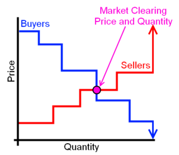](/wiki/File:SimpleMarket-Marginal_Sell.png)

[]

Figure 1. Marginal seller clearing scenario

[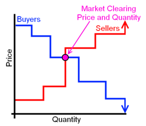](/wiki/File:SimpleMarket-Marginal_Buy.png)

Figure 2. Marginal buyer clearing scenario

[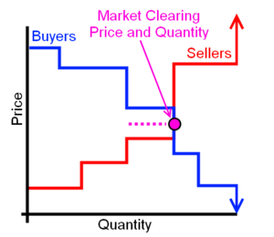](/wiki/File:SimpleMarket-Both_Marg.png)

Figure 3. Buyer and seller clearing quantities equal

[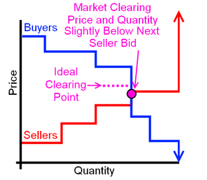](/wiki/File:SimpleMarket-Both_Marg_NextSell.png)

Figure 4. Buyer and seller clearing quantities equal, close next seller bid

Figure 5. Buyer and seller clearing quantities equal, close next buyer bid

[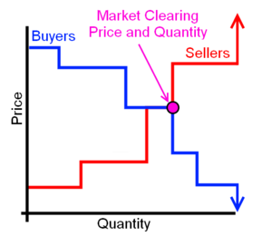](/wiki/File:SimpleMarket-Both.png)

Figure 6. Buyer and seller clearing quantities and clearing prices equal

[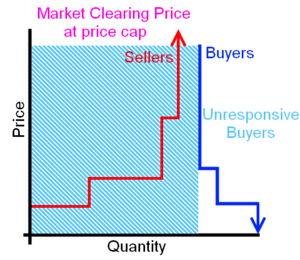](/wiki/File:SimpleMarket-Failure.png)

Figure 7. Failure for market to clear

[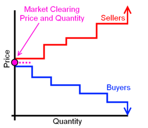](/wiki/File:SimpleMarket-Null.png)

Figure 8. Null market clearing scenario

[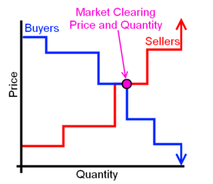](/wiki/File:SimpleMarket-PriceMargSeller.png)

Figure 9. Equal clearing price, but marginal seller clearing scenario

[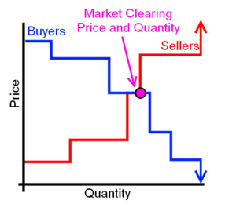](/wiki/File:SimpleMarket-PriceMargBuyer.png)

Figure 10. Equal clearing price, but marginal buyer clearing scenario

[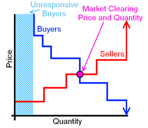](/wiki/File:SimpleMarket-Marginal_Base.png)

Figure 11. Unresponsive buyers in marginal seller clearing scenario

[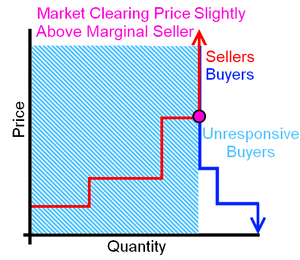](/wiki/File:SimpleMarket-MarginalUnresponse.png)

Figure 12. Unresponsive buyers in equal quantity clearing scenario

Market clearing begins with the sorting of both buying and selling components. Buyers are sorted from highest price to lowest price. Sellers are sorted from lowest price to highest price. Buyer and seller curves are then created by the cumulative sum of the quantities associated with these sorted prices. These two, sorted curves are then overlaid. It is important to note that each curve is considered to move from one extreme in price to the other. i.e., the buyer curve will traverse from $+\infty$ price to $-\infty$ price, and the seller curve will traverse from $-\infty$ price to $+\infty$ price. In all of the figures in this section, these extremes occur at the zero-quantity location and after all seller or bidder quantities are bid (right edge of the bidding curve). 

In general, the market clears at the intersection of the buying and selling curves of the market. For a discrete bidding scenario, four distinct, valid clearing situations should be supported. The resulting clearing price and quantity are slightly different for each scenario and will need to be handled appropriately. Two more invalid, or failure scenarios are also possible. For each scenarios presented, buyers are represented in blue, sellers in red, and the final market clearing point in magenta. There are five distinct buyers and four distinct sellers in each of the four, valid market clearing examples. The two other clearing scenarios (failure and null) follow the same color convention, but may have different numbers of buyers and sellers. 

The first market clearing scenario is shown in Figure 1. The buyer bids have been sorted by descending price, and the seller bids have been sorted by ascending price. In this scenario, the intersection point of the buying and selling bid lines is at the edge of a buyer quantity, but not at the edge of a seller quantity. When this happens, the partially accepted seller is considered the marginal seller. The clearing price of the market is this marginal seller's bid price. The clearing quantity is the sum of all of the buyers' quantities for which the bid was higher than the marginal seller's bid price. 

In the market clearing portrayed in Figure 1, three buyers submitted bids at or above the clearing price. Three sellers submitted bids at or below the clearing price. The three buyers accept the market clearing price and purchase their desired quantities from the market at the clearing price. The two lowest cost sellers sell their bid quantities into the market at the clearing price. The third seller becomes the marginal seller. It gets the price of the market, but the market only needs part of its bid quantity. The marginal seller will only produce a partial output, and may need to track the specific requirements of the system. 

In a power systems example, the marginal seller would be the marginal generator. As the load varies a little bit over the current market interval, the marginal generator will adjust its output to match the demand of the system. Utilizing frequency as the metric for tracking, the generator would adjust its output appropriately. If the load increased, the frequency would decrease and the marginal generator would need to increase its output. If the load decreases, the frequency will increase and the marginal generator needs to reduce its output. 

The second market clearing scenario is shown in Figure 2. This scenario is the converse of the first scenario. Here, the buyer and seller curves intersect at an edge of a seller curve, but not at the edge of a buyer quantity. Similar to the marginal seller condition, the buyer is now referred to as the marginal buyer. The market clearing price is set at the bid price of this marginal buyer. The market clearing quantity is set to the sum of the quantities of the sellers whose bids are less than the marginal buyer's price. 

As with the previous example, three buyers submitted bids at or above the clearing price. However, only two sellers submitted bids at or below the clearing price. In this example, the two sellers accept the clearing price of the market, and both sell their full quantities for the market clearing price. The first two buyers are satisfied with the market, so they buy their full desired quantity at the clearing price. The third buyer gets the price of the market, but there is not enough supply to meet its demand. As a result, a proportional response (or no response) will be necessary to meet the clearing criterion. 

In a power systems example, there are a couple ways of handling the marginal buyer quantity. The first method is to consider the marginal buyer to be a device capable of proportional output, like a battery charger. Rather than requiring a 100% charging rate, it will provide a proportional amount of that rate. Unfortunately, this method only works if the marginal quantity is a single object. If the marginal quantity is actually made up of several buyers (at the same price), this strategy becomes difficult. 

An alternative is to use a method similar to the marginal generator. The marginal loads will all monitor the system's frequency. Utilizing a [Grid Friendly Appliance Controller](http://gridwise.pnl.gov/technologies/transactive_controls.stm), loads will adjust accordingly. If the frequency drops, it means the marginal load is too great, so each marginal load would reduce its output. If the frequency increases, the marginal load is too small and needs to increase to balance out the fixed generation. Marginally load controlled by a Grid-Friendly-Appliance controller is basically the converse of the generator case. 

A variation on the second marginal buyer in power systems method still utilizes a device like the Grid Friendly Appliance Controller (GFA). However, rather than only the marginal load arming the GFA functionality, all GFAs in the system are armed. The regulation price of the system is set to the marginal clearing price. Any device that exercises its GFA functionality during this time will receive compensation at the regulation price. This method helps increase the pool of marginal load since devices below the clearing threshold may still elect to participate in this regulation market. 

Figure 3 represents the third market clearing scenario. Here, the intersection of buyer and seller curves is at the same quantity, but at different prices. The intersection point occurs on an edge of both the buyer and seller quantity curves. In this case, the quantity is obviously set to the intersection point of the two curves. This quantity is either the sum of all sellers' quantities with a bid less than the "marginal" seller bid, or the sum of all buyers' quantities with a bid higher than the "marginal" buyer bid. However, the price is ideally taken as the average price of the two intersecting bids. The ideal clearing price is determined as 

$$Price_{Clear} = \frac{\left(Bid_{Seller} + Bid_{Buyer}\right)}{2}$$ 

In the market scenario of Figure 3, three buyers submitted bids at or above the clearing price of the market, and three sellers submitted bids at or below the clearing price. In this case, all three buyers' and all three sellers' bidding quantities are met (since the cumulative sum of the cleared bids is the same for both buyers and sellers). Due to the unique nature of this clearing condition, a compromise is made between the lowest cleared buyer bid and highest cleared seller bid. The final clearing price is not set to either of their values, as was the case with the marginal buyer or marginal seller scenarios above. Rather, the clearing price is set as the average of the cleared buyer and seller bids. This allows both lower bid sellers and higher bid buyers to respond. However, it prevents the subsequent buyer and seller quantities from meeting the clearing price. 

Unfortunately, the scenario of Figure 3 is not always as straight forward. Figure 4 shows a scenario where the next seller bid also meets the ideal clearing point. Figure 5 shows the same scenario from a buyer perspective. In order to ensure the proper bidders respond to the cleared market, the clearing price must be adjusted accordingly. The final clearing price will be further constrained by the next buying and selling sorted bids. The final clearing price will be selected as the point that is closest to the ideal clearing price, but ensures the subsequent buyer and seller bids are not valid clearing conditions of the market. The maximum and minimum of this further constraint are determined by the specific bidding scenario. 

In Figure 4, the next seller bid does not exceed the ideal clearing price. To ensure proper operation and that this device does not activate, the price associated with this bid must be above the final clearing price. This "next" bid price serves as a non-inclusive maximum for the clearing price. Therefore, the clearing price will have to be slightly below this "next" seller bid. Typically, this will be $0.01 below the next seller bid price. 

Figure 5 shows a similar behavior with buyer bids. The next buyer bid does not fall below the ideal clearing price. Therefore, this device would assume it was the marginal quantity and activate. To prevent this, the final clearing price must be set slightly higher that this bid. In a manner similar to the previous seller curve example, the "next" buyer bid serves as a limit for the clearing price. However in this scenario, the "next" buyer bid serves as a non-inclusive lower limit for the market clearing price. The final clearing price of the market must then be slightly above this "next" buyer bid. Again, this may be something as trivial as a $0.01 increase above the next buyer bid. 

The final, valid scenario is actually a variation on the third scenario. Figure 6 show the situation when both the buyer and seller clearing quantities and clearing prices match exactly. In this case, the clearing price is obviously the intersecting price (common for both buyer and seller). The clearing quantity is the sum of all buyers with bid prices equal to or greater than the clearing price, or the sum of all sellers with bid bid prices equal to or lower than the clearing price. Approaching the clearing point from either the seller or buyer curves should yield identical results. 

As indicated, the final, valid scenario is a variation on the third market. Three buyers and three sellers are satisfied by the market clearing criterion. The clearing buyer and seller both agree on an exact price, so the clearing price is easy to determine. The cumulative sum of all buyers whose bid was greater than or equal to the clearing price is equivalent to the cumulative sum of all sellers whose bid was less than or equal to the clearing price. 

The fifth scenario for the market is for the market to fail to clear. This will happen when there is insufficient supply to meet the highest bid-price buyer. Figure 7 provides a common example of this condition. In the full market scenario, there may be buyers on the system that are not participating in the market. These "unresponsive buyers" need to be satisfied before any bidding buyers are handled. In the market, the quantity needed by these devices (estimated or known) is bid into the market at the price cap. This ensures it is met by the seller curve before any responsive loads are considered. In a power systems example, these unresponsive buyers would be end-use devices that are not submitting bids into the market, or losses on the distribution system. The market must cover and serve the unresponsive loads and losses before it can handle responsive devices. 

In the scenario of Figure 7, all seller quantities fail to meet the highest buyer bid requirements (typically due to an unresponsive buyer). In such a scenario, the market simply fails to clear. The intersection point of this market will occur at the total seller quantity and the price cap. This is effectively a marginal buyer condition of Figure 2. The `current_clear_type` output for this market needs to be set to `FAILURE`. The output quantity would be set to the total seller quantities, and the price would be set to the `price_cap` value (the bid value of the unresponsive buyers). 

The final clearing scenario is in a similar category to the market failure of Figure 7. On the other end of the spectrum, suppose the buyers and sellers just don't agree on a bid price at all. Figure 8 shows this scenario, the Null market clearing scenario (`current_clear_type` will be set to `NULL`). As the buyer and seller curves demonstrate, there is no intersection point for an agreeable price and quantity. The lowest priced seller is higher than the highest priced buyer. 

In the null market scenario, the price poses a problem. If set to the price cap, no buyers would activate, but all sellers would activate. If set to 0 or the negative price cap, all buyers would activate, but no sellers would be present to meet the demand. A price signal to keep both parties from responding is right in the middle. A variation on the equation from scenario 3 above to compute an average price, given as 

$$Price_{Clear} = \frac{\left(Bid_{Lowest Seller} + Bid_{Highest Buyer}\right)}{2}$$

The resulting price is higher than any buyer, so no buyers will be activated. The price is lower than any seller, so none of the sellers will be activated. Obviously, the `current_clear_type` flag should be an overall indicator of market clearing failure. However, by setting the price to a value that satisfies neither buyers nor sellers in the market, responses to a failed market should be mitigated. 

### Further Examples

It is important to note that the market can only clear in one of these scenarios. Some confusing clearing situations can occur, but they are always related to these base cases. Figure 9 demonstrates a variation on the marginal seller case of Figure 1. Despite the intersecting bids having the same price, this scenario is identical to Figure 1. The three highest buyer bids are satisfied by the market and these buyers purchase their desired quantities. Two sellers are below the clearing price, so they accept the market price and sell their full quantities into the system. The third seller is at the clearing price, but its full quantity is not needed. This seller gets the clearing price and acts as the marginal seller in the market. It will only provide part of its full output, and may need to track the buyer demand around that output point. 

Figure 10 shows a similar example where the clearing price is again very clear. However, the quantities once again do not properly align. This case is merely a special case of the scenario presented in Figure 2, or a marginal buyer scenario. The clearing price of the market is obvious. Only the sellers with bids at or below the clearing price accept the market clearing value, and only buyers with bids at or higher than the clearing price accept the cleared market. Unfortunately, there is more demand from the buyers than there is supply from the sellers. As such, the buyer with the market clearing bid will not be able to have their full bid quantity satisfied. This buyer must consume only the appropriate portion of their bid quantity. 

If the capability for unresponsive buyers is included, that scenario must factor into the market clearing as well. Once the unresponsive load quantity is know or estimated, it is bid into the market as a buyer quantity with an impossibly large price (set to the `price_cap` input). Figure 11 shows how unresponsive buyers fit into the "five bidder, four seller" example for the four valid market clearing scenarios. The unresponsive buyers effectively become a bidding quantity that is always met first. Only once the needs of these unresponsive buyers are satisfied, will responsive buyer devices be able to interact with the market. If the needs of the unresponsive buyers are greater than the seller supply, the market failure case of Figure 7 will occur. 

A variation on Figure 11 and Figure 7 occurs right between the two conditions. What if the available seller quantities only meets the unresponsive bidder demand? Such a case is shown in Figure 12. Ideally, the clearing price in this scenario would be the price cap of the system. This would enable all of the seller quantities, and only the unresponsive bidder quantity. However, such a "price cap bid" is typically significantly larger than other bids on the system (e.g., $9999 in a market consisting of sub-dollar bids). Under such a scenario, this bid would severely skew the output statistics on the market. To prevent this large skew, the clearing price is adjusted slightly. Similar to the conditions in Figure 4 and Figure 5, the final clearing price must still ensure all sellers are producing, but only the unresponsive buyers are consuming. As such, the marginal seller's price becomes the non-inclusive lower limit of the clearing price. The clearing price will then be set slightly above this price. This will ensure that all sellers on the system are activated, but no responsive buyers meet the price criterion. 

## Testing

Validation of the `auction` object and its corresponding market should occur on four different levels: bidding and clearing functionality, market timing functionality, scalability, and advanced features. Advanced features will test more complicated implementations of the `auction` object. For example, if the non-bidding state capability is included in the auction, a fourth test round would include proper operation of the market with "non-bidding, uncontrollable" buyers in the market. 

### Bidding and Clearing Functionality

The first, and possibly most important, testing that needs to occur is on the `auction` object's ability to receive bids and clear the resultant market. To test these items, perform the following tasks: 

  1. Design a simple market with equal buyers and sellers to test bid submission capabilities. Three of each is a good start. Enable the "verbosity" of the `auction` and have each object submit bids into the market. Ensure the market is seeing the proper bid for both price and quantity for each object.
  2. Design a market to test clearing functionality. Set the period and latency of the market to some reasonable number (such as 1 minute) and submit bids into the market again. The market should clear to an expected value. Adjust the bidding values to replicate each of the six scenarios outlined in the [ Market Clearing] section: marginal seller, marginal buyer, quantity alignment, price and quantity alignment, failure to clear, and the null market. Ensure the marginal output and clearing mode are properly set for the cleared market.
  3. Design a market to test equal bidding scenarios. Implement two bidders (do for both buyers and sellers, individually) that submit bids of equal parameters. These will be equal price, equal quantity, and equal price and quantity. Ensure the market clears to the correct final value. Adjust the buyer and seller curves so a clearing point occurs on one of these duplicated bid quantities. Ensure the market resolves to the correct final values.
  4. Design a market to try different permutations of bidding to see if any faults occur. For example, try a round of bidding with a seller first, with a buyer first, with all sellers first, with all bidders first, etc. Try bidding everyone simultaneously (assuming this hadn't been done in the prior example), try staggering the bids, and other methods of adjusting the bidding process.
  5. Design a market to examine re-bidding before the market closes. When an object submits a bid, it should receive a unique identifier for the bid received (unique to that bid in that market). If another bid is submitted using that same unique identifier, the previous bid should be stricken from the record and replaced with the new bid. Ensure the new bid is accepted, and that the market clears to a proper value associated with the updated market, not the initial bids.
  6. Design a market to examine unbalanced bidding. Create a test with unequal buyers and sellers, such as one seller and three buyers and vice versa. Ensure the market still clears to a reasonable value.
  7. Design a market to examine negative price submissions. Ensure the market clears to a proper value and that all bids sort correctly. Replication of the previous testing will be necessary with negative price bids incorporated.
  8. Design a market to examine "reverse roles." Submit bids with quantities opposite to the conventional amount (e.g., if a buyer is always a positive quantity, submit a negative quantity). Ensure the bid falls into the appropriate bidding market (buyer or seller curve), and ensure the market clears to a proper value. Again, replication of all previous testing will be necessary with "reverse role" bidding.
  9. Design a market to fail clearing. This may be closely associated with the previous example. Design a market such that the buyer and seller curves will not cross, and the market is unable to clear. Design a market with no bidders or no sellers (but still operate the `auction` in standard functionality). Ensure price and quantity go to representative values (e.g., INF for the price and 0 for the quantity) and the clearing flag is properly set.
### Market Timing Functionality

This section tests the `auction` object's ability to clear on proper period intervals, delay markets for proper latencies, and function after a market has cleared. 

  1. Design a market to test the bidding period, latency, and market identifier of the `auction` object. Use equal period and latency values for this first test. Submit bids into the system throughout the bidding period. Ensure the market is closing bidding and clearing on the proper timing interval. Once this market has cleared, ensure it does not become active (in the current outputs) until the latency period has expired.
  2. Design a market to test "market result" progressions. This market will need to have a latency of at least one period after the current market. Ensure the results of a cleared market successfully transition through the `next_market`, `current_market`, and `past_market` outputs.
  3. Design a market to test "after closing submissions". Utilizing the unique bid identifier, attempt to refine an object's bid after the relevant market has cleared. Ensure this bid is rejected outright (not accepted as a bid in the new market), and returns an appropriate response to the device (some form of flag indicating an invalid bid).
  4. Design a market with unbalanced period and latency settings. Try setting the period larger than the latency and vice-versa. Ensure the market clears at the correct interval and is becoming active at the proper time. Ensure that highly delayed markets (latency much larger than the period) are stored properly, and that the correct cleared market becomes active at the proper time. Also ensure the `past_market`, `current_market`, and `next_market` quantities are being properly updated through these transitions. Include tests of 0 latency (cleared market immediately becomes the current market).
  5. Design a market to test the simple statistics functionality. Utilize combinations of the prior markets and different statistic intervals. Ensure the mean and standard deviation are correct for the statistic interval. Adjust the statistic interval to be non-integer multiples of market period and latencies, and ensure the expected behavior is occurring. Vary the number of statistics being calculated and ensure "active" statistic values are properly computed. If a cap on the number of statistics is enacted, ensure this cap is enforced and an appropriate error/warning is generated when it is exceeded.
### Scalability

This section tests the `auction` object's ability to operate the market for large numbers of objects. 

  1. Design a large, balanced market (equal buyers and sellers) to test the `auction` object's ability to resolve large systems. Ensure the proper clearing scenario is met. Duplicate the testing for all four desired clearing points. Ensure proper clearing periods and latencies are still followed.
  2. Design a large, unbalanced market (unequal buyers and sellers) to continue testing large scale systems. Ensure proper clearing scenarios are met.
  3. Design a large, unresolvable market. Test both market failures and null market scenarios. Ensure the market fails to clear and produces appropriate outputs. Extend this testing to the extremes (no buyers or no sellers) to ensure proper outputs are produced.
  4. Design a large, unbalanced market to test large scale system bid resubmission capabilities. Have multiple objects submit new bits into an uncleared market and ensure the relevant bid is updated. Ensure the market clears to the proper point under the updated market. Extend this testing to resubmission of bids after the market has cleared. Ensure the bid is rejected and returns an appropriate response.
### Advanced Features

This section tests advanced functionality of the `auction` object. Much of this functionality should build off of the basic tests performed above, but should just add new capabilities. 

  1. Design a market to test the `SINGLE_SELLERS_ONLY` and `SINGLE_BUYERS_ONLY` special operation modes. Ensure the market automatically submits a bid using the `fixed_price` or `fixed_quantity` parameters. Ensure the market clears to an appropriate value, including an unresolvable condition (i.e., if the market can't clear, ensure it doesn't and returns appropriate outputs).
  2. Design a market to test the `auction` object's ability to compensate for non-bidding consumers (buyers) on the system. If implemented, ensure the inclusion of bidder state functions as intended. In conjunction with the `total_quantity` value, ensure the system is properly estimating unresponsive buyers on the system. Some form of logic or time averaging will likely be necessary in this estimation. Ensure the algorithm implemented is providing reasonable results. Ensure the market is properly prioritizing this information and automatically bidding a non-conforming consumer section (e.g., large price and the expected quantity so it clears before bidding objects in the market do). As a power system example, these non-conforming consumers would be non-bidding loads, or passive-response demand response loads.
## Future Functionality

The above testing and specifications should cover all initial functionality required for the `auction` object to create a bidding market in a GridLAB-D system. However, if time permits or needs require them, additional functionality may need to be implemented. Below are some immediate examples of future functionality. 

  * Improve the characterization of non-conforming consumers. In a powerflow sense, attempt to characterize the "base load" of a system into pure non-demand response loads, and passive demand response loads. Separate these into two separate base bids into the market and price appropriately. i.e., non-demand response loads would get an infinitely high price to ensure they are resolved first in the market. Passive demand response loads could still inadvertently play the market with a pricing signal based on the moving average, time of day, or other relevant constraints.
  * Implement the ability for market overrides in critical conditions. In a powerflow sense, this would be an emergency or critical pricing structure. e.g., a market may clear and become active once an hour, but there may be need to update market constraints and clear it 20 minutes into the bidding process to accommodate higher than expected feeder loads.
  * Implement more advanced types of markets than the double auction, such as multiple auction clearings in a single period.
  * Implement "block-bidding" capabilities for multiple periods at once. e.g., submitting all 24 1-hour bids once the day in advance for the day-ahead market, not in 1-hour intervals.
# 

See also

[Market_User_Guide]

[Market_module]

[Controller Specifications]

[Wholesale_Markets]

  
