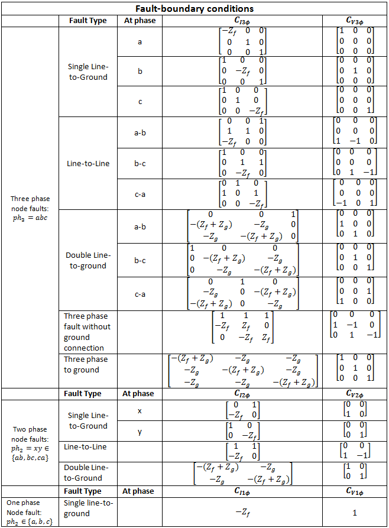
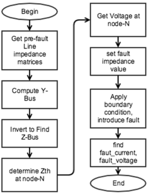
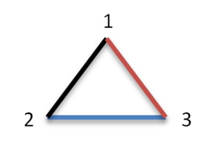
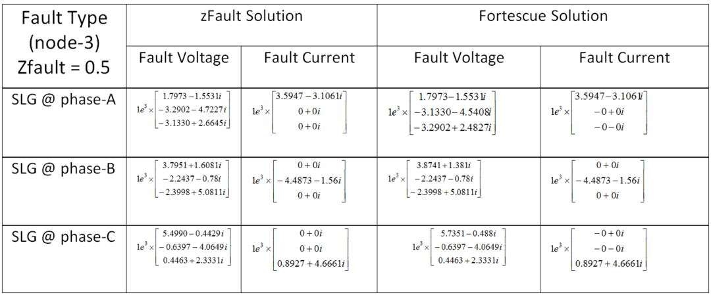

# Spec:Mesh Fault Current

**Source URL:** https://gridlab-d.shoutwiki.com/wiki/Spec:Mesh_Fault_Current
# Spec:Mesh Fault Current

TODO: The numbering on this page is all out of sorts

Approval item:  When approved remove this tag. 

## Contents

  * 1 Overview
  * 2 Variable Definitions and Equations
    * 2.1 Equations
  * 3 Methodology
    * 3.1 Instructions
    * 3.2 Flow Chart
    * 3.3 Example
  * 4 Validation
  * 5 References
  * 6 See also
# 

Overview

Mesh Fault analysis (zFault method) capability in GridLAB-D will be implemented to perform fault studies for unbalanced mesh systems. These simulations will calculate Fault current and Fault voltage at a particular node where a certain type of fault is introduced at a node or a line. 

# Variable Definitions and Equations

Important equations and definitions that are relevant to Mesh Fault implementation in GridLAB-D: 

Table 1 - Important Variable Definitions  Variable | Definition   
---|---  
$\displaystyle{}Y_{ph_3}$ | Three phase primitive admittance matrix   
$\displaystyle{}Y_{ph_2}$ | Two phase primitive admittance matrix   
$\displaystyle{}Y_{ph_1}$ | One phase primitive admittance matrix   
$\displaystyle{}Y$ | Y-bus   
$\displaystyle{}Z$ | Z-bus   
$\displaystyle{}Y_s$ | Self admittance   
$\displaystyle{}Y_m$ | Mutual admittance   
$\displaystyle{}V{^s_{Th}}$ | Thevenin's equivalent Voltage at Swing node   
$\displaystyle{}Z{^N_{Th}}$ | Thevenin's equivalent impedance at node N   
$\displaystyle{}C_{I3\phi}$ | Three phase Current Fault Boundary Conditions   
$\displaystyle{}C_{I2\phi}$ | Two phase Current Fault Boundary Conditions   
$\displaystyle{}C_{I1\phi}$ | One phase Current Fault Boundary Conditions   
$\displaystyle{}C_{V3\phi}$ | Three phase Voltage Fault Boundary Conditions   
$\displaystyle{}C_{V2\phi}$ | Two phase Voltage Fault Boundary Conditions   
$\displaystyle{}C_{V1\phi}$ | One phase Voltage Fault Boundary Conditions   
$\displaystyle{}I{^N_{Fault}}$ | Fault Current at Node-N   
$\displaystyle{}V{^N_{Fault}}$ | Fault Voltage at Node-N   
$\displaystyle{}Z_f$ | Fault impedance   
$\displaystyle{}Z_g$ | Impedance between fault impedance and ground   
$\displaystyle{}I_{3x3}=\begin{bmatrix} 1 & 0 & 0\\\ 0 & 1 & 0\\\ 0 & 0 & 1 \end{bmatrix}$ || 3x3 Identity Matrix   
$\displaystyle{}I_{3x3}=\begin{bmatrix} 1 & 0\\\ 0 & 1 \end{bmatrix}$ || 2x2 Identity Matrix   
  
## Equations

This section describes some of the important equations used in drafting out this algorithm. The flow is along the lines of the algorithm design itself i.e., the equations of Y and Z bus; fault equations; fault-boundary conditions extracted from [[2]]

1. Primitive admittance matrices: 

1. Three Phase ($\displaystyle{}Y_{ph_3}$): 

$$\begin{bmatrix}
\displaystyle{}Y_s & \displaystyle{}Y_m & \displaystyle{}Y_m\\\ \displaystyle{}Y_m & \displaystyle{}Y_s & \displaystyle{}Y_m\\\ \displaystyle{}Y_m & \displaystyle{}Y_m & \displaystyle{}Y_s \end{bmatrix} $$

1. Two Phase ($\displaystyle{}Y_{ph_2}$): 

$$\begin{bmatrix}
\displaystyle{}Y_s & \displaystyle{}Y_m\\\ \displaystyle{}Y_m & \displaystyle{}Y_s \end{bmatrix} $$

1. One Phase ($\displaystyle{}Y_{ph_1}$): 

$$\begin{bmatrix}
\displaystyle{}Y_s \end{bmatrix} $$

1.Y-Bus: 

$$\begin{bmatrix}
\displaystyle{}Y_{11} & \displaystyle{}Y_{12} & \cdots & \displaystyle{}Y_{1M}\\\ \displaystyle{}Y_{12} & \displaystyle{}Y_{22} & \cdots & \displaystyle{}Y_{2M}\\\ \vdots & \vdots & & \vdots\\\ \displaystyle{}Y_{M1} & \displaystyle{}Y_{M2} & \cdots & \displaystyle{}Y_{MM} \end{bmatrix} $$

1.Invert Y-bus to get Z-bus: 

$$ \displaystyle{}Z=(Y^{-1})$$
  2. Fault Equations: 
   1.Three phase fault at node-N: 

$$\begin{bmatrix}
\displaystyle{}Z{^N_{Th}} & \displaystyle{}I_{3x3}\\\ \displaystyle{}C_{I3\phi} & \displaystyle{}C_{V3\phi} \end{bmatrix} \begin{bmatrix} \displaystyle{}I{^N_{Fault}}\\\ \displaystyle{}V{^N_{Fault}} \end{bmatrix} = \begin{bmatrix} \displaystyle{}V{^S_{Th}}\\\ 0 \end{bmatrix} $$

1. Two phase fault at node-N: 

$$\begin{bmatrix}
\displaystyle{}Z{^N_{Th}} & \displaystyle{}I_{2x2}\\\ \displaystyle{}C_{I2\phi} & \displaystyle{}C_{V2\phi} \end{bmatrix} \begin{bmatrix} \displaystyle{}I{^N_{Fault}}\\\ \displaystyle{}V{^N_{Fault}} \end{bmatrix} = \begin{bmatrix} \displaystyle{}V{^S_{Th}}\\\ 0 \end{bmatrix} $$

1. One phase fault at node-N: 

$$\begin{bmatrix}
\displaystyle{}Z{^N_{Th}} & 1\\\ \displaystyle{}C_{I1\phi} & \displaystyle{}C_{V1\phi} \end{bmatrix} \begin{bmatrix} \displaystyle{}I{^N_{Fault}}\\\ \displaystyle{}V{^N_{Fault}} \end{bmatrix} = \begin{bmatrix} \displaystyle{}V{^S_{Th}}\\\ 0 \end{bmatrix} $$

1. Refer below for $\displaystyle{}C_{I_{phase}\phi}$ and $\displaystyle{}C_{V_{phase}\phi}$matrices: 

# Methodology

The step-by-step description below can be used a pseudo-code while implementing this in GridLAB-D. First part of this section focuses on step-by-step instructions and associated notes that is required to program this in GridLAB-D; Second part of this section is the flow-chart which is a direct sequential representation of the pseudo-code; Third part of this section is an example worked out in MATLAB. The results of this example were compared against the results generated by Fortescue algorithm described in [2]

## Instructions

1.Extract voltage at swing node ($\displaystyle{}V{^s_{Th}}$) from GridLAB-D
  2. Extract Z-bus. Then extract Thevenin's impedance matrix at node-N ($\displaystyle{}Z{^N_{Th}}$) and use it in "4. Fault Equations" in Equations section. For explicit extraction, see the optional steps below: 
   1.Extract Y-bus (Y) from GridLAB-D
     2. Replace $\displaystyle{}1^{st}$ element of the matrix i.e., Row-1, Column-1 with identity matrix (I). It can be 3x3 or 2x2 or 1x1 depending up on the phase of swing node)
     3. Replace remaining elements of Row-1 with zero matrices with the same order of above identity matrix. 

    After the above modifications, for a 3-phase swing node the Y-bus looks like:

$$\begin{bmatrix}
\displaystyle{}I_{3x3} & \displaystyle{}0_{3x3} & \cdots & \displaystyle{}0_{3x3}\\\ \displaystyle{}Y_{12} & \displaystyle{}Y_{22} & \cdots & \displaystyle{}Y_{2M}\\\ \vdots & \vdots & & \vdots\\\ \displaystyle{}Y_{M1} & \displaystyle{}Y_{M2} & \cdots & \displaystyle{}Y_{MM} \end{bmatrix} $$

1. Invert Y-bus to get Z-bus
     2. Extract Thevenin's impedance matrix at node-N: 

$$ \displaystyle{}Z{^N_{Th}}=Z(\displaystyle{}N{^{start}_{row}}:\displaystyle{}N{^{end}_{row}},\displaystyle{}N{^{start}_{column}}:\displaystyle{}N{^{end}_{column}})$$

3. Use the above $\displaystyle{}Z{^N_{Th}}$ in "4. Fault Equations" in Equations section
  2. Extract the phase information of the node where the fault is to be introduced. Based on that information, introduce fault boundary conditions in “4. Fault Equations” based on the table in Equations section
  3. Define fault impedance ($\displaystyle{}Z_{f}$) in "4. Fault Equations" in Equations section
  4. Introduce Swing bus voltage ($\displaystyle{}V{^s_{Th}}$) in "4. Fault Equations" in Equations section
  5. Calculate Fault Current ($\displaystyle{}I{^N_{Fault}}$) and Fault Voltage ($\displaystyle{}V{^N_{Fault}}$)

## Flow Chart

This sub-section is the translated form of Instructions sub-section. Information in below flow-chart is phrased along the lines of Instructions. 

## Example

Two simple systems are constructed in MATLAB: 

1.Three phase three node three line mesh system
  2. Three phase three node two line radial system.

Fault analysis was performed on these systems by using both zFault method and Fortescue [2] method and the results are compared. The tests were performed for Single Line to Ground (SLG) Fault at A, B, C and for Line to Line (LL) Fault between A-B, B-C, C-A and results from both the methods matched for SLG and LL faults i.e., both the algorithms are tested for six types of faults. There is no change in the overall algorithm except that you use a different Y-bus for different system - In step.4 below, two Y-bus matrices are shown (first Y-bus matrix is for the mesh system example model and the second Y-bus matrix that is shown under "Note" in step.4 is for the radial system example model). This code can be used as is in MATLAB to test the results. 

1.For a mesh system that looks like below (all the three lines are ABCN phase) where node-1 is the swing node. For the sake of this example, the voltage at Swing node is 4160V. 

    

Figure 3. Three node Three phase Three line mesh system

  2. Obtain the line impedance matrices ($\displaystyle{}z_{12},\displaystyle{}z_{23},\displaystyle{}z_{13}$) from GridLAB-D. Example: 

$$\displaystyle{}z_{12}=\begin{bmatrix}
0.152 + 0.535i & 0.036 + 0.323i & 0.036 + 0.275i\\\ 0.036 + 0.323i & 0.152 + 0.535i & 0.036 + 0.296i\\\ 0.036 + 0.275i & 0.036 + 0.296i & 0.152 + 0.535i \end{bmatrix}$$

1.$$\displaystyle{}z_{23}=\begin{bmatrix}
0.266 + 0.937i & 0.063 + 0.564i & 0.063 + 0.482i\\\ 0.063 + 0.564i & 0.266 + 0.937i & 0.063 + 0.517i\\\ 0.063 + 0.482i & 0.063 + 0.517i & 0.266 + 0.937i \end{bmatrix}$$

1.$$\displaystyle{}z_{13}=\begin{bmatrix}
0.266 + 0.937i & 0.063 + 0.564i & 0.063 + 0.482i\\\ 0.063 + 0.564i & 0.266 + 0.937i & 0.063 + 0.517i\\\ 0.063 + 0.482i & 0.063 + 0.517i & 0.266 + 0.937i \end{bmatrix}$$

1.Invert the above line impedance matrices to primitive admittance matrices ($\displaystyle{}y_{12},\displaystyle{}y_{23},\displaystyle{}y_{13}$): 

$$ \displaystyle{}y_{12}=inv(\displaystyle{}z_{12})$$
$$ \displaystyle{}y_{23}=inv(\displaystyle{}z_{23})$$
$$ \displaystyle{}y_{13}=inv(\displaystyle{}z_{13})$$
  2. Obtain Y-bus (see Figure.3 for Mesh system): 

$$\displaystyle{}Y=\begin{bmatrix}
\displaystyle{}I_{3x3} & \displaystyle{}0_{3x3} & \displaystyle{}0_{3x3}\\\ \displaystyle{}-y_{12} & \displaystyle{}y_{12}+\displaystyle{}y_{23} & \displaystyle{}-y_{23}\\\ \displaystyle{}-y_{13} & \displaystyle{}-y_{23} & \displaystyle{}y_{13}+\displaystyle{}y_{23} \end{bmatrix}$$

1. **NOTE:** If we have a radial system that looks like in Figure.4, the Y-bus looks like this:

    

 

Figure 4. Three node Three phase Two line radial system

$$\displaystyle{}Y=\begin{bmatrix}
\displaystyle{}I_{3x3} & \displaystyle{}0_{3x3} & \displaystyle{}0_{3x3}\\\ \displaystyle{}-y_{12} & \displaystyle{}y_{12}+\displaystyle{}y_{23} & \displaystyle{}-y_{23}\\\ \displaystyle{}0_{3x3} & \displaystyle{}-y_{23} & \displaystyle{}y_{23} \end{bmatrix}$$

1.Obtain pre-fault voltage at swing node from GridLAB-D. For the sake of this example, we are defining the voltage as 4160V: 

$$ \theta=\frac{2\pi{}}{3}$$

$$\displaystyle{}V{^s_{Th}}=\begin{bmatrix}
4160\\\ 4160\cos(-\theta)+4160\sin(-\theta)\\\ 4160\cos(\theta)+4160\sin(\theta) \end{bmatrix}$$

1.Since all the nodes and lines in our system are 3-phase, each element in the Y-bus is a 3x3 matrix. Therefore the size of Y-bus is a 9x9 matrix. All the diagonal elements represent self-admittance matrices (Example: $\displaystyle{}y_{11}$ that represents Y(1:3,1:3) is for node-1, $\displaystyle{}y_{22}$ that represents Y(4:6,4:6) is for node-2, $\displaystyle{}y_{33}$ that represents Y(7:9,7:9) is for node-3. The non-diagonal 3x3 matrix-elements in Y such as $\displaystyle{}y_{12}$ that represents Y(1:3,4:6) etc are mutual admittance matrix-elements). In this example, we are going to introduce fault at node-3. Therefore to obtain the impedance at node-3 which is $\displaystyle{}Z_{33}$: 
   1.Invert Y-bus to find Z-bus: 

$$Z=inv(Y)$$
     2. Extract the impedance matrix at node-3 i.e., Z(7:9,7:9) which is self-impedance matrix at node-3: 

$$ \displaystyle{}Z{^3_{Th}}=Z(7:9,7:9)$$

  2. Set the fault impedance ($\displaystyle{}Z_f$) and find Fault current at node-3 ($\displaystyle{}I{^3_{Fault}}$); Fault voltage at node-3 ($\displaystyle{}V{^3_{Fault}}$). 
   1.Set the fault impedance ($\displaystyle{}Z_f$), swing bus voltage ($\displaystyle{}V{^s_{Th}}$), "Fault-boundary conditions" in “4. Fault Equations” in Equations section. In this example, we introduce Single Line to Ground (SLG) fault at node-3 at phase-C: 
      1.Define Fault impedance ($\displaystyle{}Z_f$): 

$$ \displaystyle{}Z_f=0$$
2. Define Fault-boundary conditions matrices: 

$$\displaystyle{}C_{I3\phi}=\begin{bmatrix}
1 & 0 & 0\\\ 0 & 1 & 0\\\ 0 & 0 & \displaystyle{}-Z_f \end{bmatrix} $$

$$\displaystyle{}C_{V3\phi}=\begin{bmatrix}
0 & 0 & 0\\\ 0 & 0 & 0\\\ 0 & 0 & 1 \end{bmatrix} $$

1.Compute the first matrix on LHS of "4. Fault Equations" in Equations section: 

$$\displaystyle{}C_F=\begin{bmatrix}
\displaystyle{}Z{^3_{Th}} & \displaystyle{}I_{3x3}\\\ \displaystyle{}C_{I3\phi} & \displaystyle{}C_{V3\phi} \end{bmatrix} $$

1.Compute RHS of "4. Fault Equations" in Equations section: 

$$\displaystyle{}V{^F_{RHS}}=\begin{bmatrix}
\displaystyle{}V{^s_{Th}}\\\ \displaystyle{}0_{3x1} \end{bmatrix} $$

1.Multiply the inverse of $\displaystyle{}C_F$ with $\displaystyle{}V{^F_{RHS}}$: 

$$ \displaystyle{}currIvoltV_{Fault}=inv(\displaystyle{}C_F)*\displaystyle{}V{^F_{RHS}}$$

2. Obtain Fault current at node-3 ($\displaystyle{}I{^3_{Fault}}$): 

$$ \displaystyle{}I{^3_{Fault}}=\displaystyle{}currIvoltV_{Fault}(1:3)$$

3. Obtain Fault voltage at node-3 ($\displaystyle{}V{^3_{Fault}}$): 

$$ \displaystyle{}V{^3_{Fault}}=\displaystyle{}currIvoltV_{Fault}(4:6)$$

# Validation

1.Our validation results shown below are from MATLAB and the Fortescue approach [[2]], with a MATLAB implementation for initial feasibility testing. Line impedance matrices (and Y-bus) from Example is used to perform zFault and Fortescue Test results.
  2. Actual validation will be against the GridLAB-D-implemented model to make sure it matches.
  3. Results from initial MATLAB validation tests:

 

# References

1.P.A.N. Garcia, J.L.R. Pereira, M.P.Vinagre, E.J.Oliveira, “Fault Analysis Using Continuation Power Flow and Phase Coordinates”
  2. Rabih A. Jabr, Izudin Dzafic, “A Fortescue Approach for Real-Time Short Circuit Computation in Multiphase Distribution Networks” 
   1.If you want to learn more about the background information and Fortescue approach related details, please grab [1], [20], [21]. They have in-depth information about the method.
   
# See also

  * [Requirements]
  * [User's Manual]
  * [Keeler (Version 4.0)]
