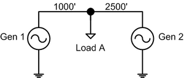
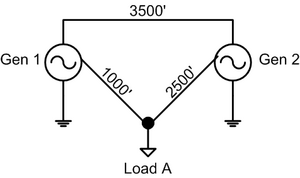
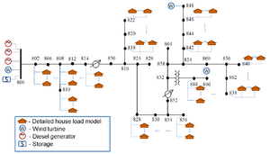

# Spec:Microgrids

**Source URL:** https://gridlab-d.shoutwiki.com/wiki/Spec:Microgrids
Approval item:  When approved remove this tag. 

## Contents

  * 1 Overview
  * 2 Equations
    * 2.1 Frequency
    * 2.2 Classic synchronous machine
      * 2.2.1 Traditional Transmission-level Implementation Comparison
    * 2.3 Speed control
      * 2.3.1 Isochronous governor
      * 2.3.2 Speed-droop governor
    * 2.4 Exciters
      * 2.4.1 DC Exciter
      * 2.4.2 Thyristor Rectifier Exciter
  * 3 Solver
    * 3.1 Interfacing Overview
      * 3.1.1 Object inclusion
      * 3.1.2 Solver published inputs
      * 3.1.3 Solver published outputs
      * 3.1.4 Solver data structure
      * 3.1.5 Solver external functions
    * 3.2 Solver timing
      * 3.2.1 Solver Passes
      * 3.2.2 Solution Timesteps
      * 3.2.3 Solver Call Timing
  * 4 Testing and Validation
    * 4.1 Single machine, infinite bus system
    * 4.2 Two machine, single line system
    * 4.3 Two machine, three line system
    * 4.4 Adapted IEEE 34-bus test feeder
  * 5 References
  * 6 See also
# Overview

The [microgrids] capability in GridLAB-D will be implemented to allow islanded, smaller power system simulations. These simulations will examine sub-second influences on parameters like frequency and voltage. The final capability will allow the examination of transients in the voltage and frequency associated with microgrid operations. 

# Equations

The primary basis for the implementation of the [microgrids] capability will involve modeling the relevant components with accurate equation models. At this time, these models are expected to operate down to a 1-millisecond time step. 

Equations are taken from Reference 1 and 2 below. Equation notation will follow: 

Table 1 - Equation Notation  Variable | Definition   
---|---  
$\displaystyle{}\Delta{}P$ | Imbalance between generation and load of the system   
$\displaystyle{}\omega{}$ | Synchronous frequency of the system   
$\displaystyle{}H$ | Inertial constant of the system   
$\displaystyle{}K_D$ | Damping factor of system   
$\displaystyle{}e_x$ | Instantaneous stator phase to neutral voltage for phase or axis $\displaystyle{}x$  
$\displaystyle{}i_x$ | Instantaneous stator current for phase or axis $\displaystyle{}x$  
$\displaystyle{}e_{fd}$ | Field voltage   
$\displaystyle{}i_{fd}$ | Field current   
$\displaystyle{}i_{kd}, i_{kq}$ | Amortisseur currents   
$\displaystyle{}\theta$ | Angle between direct axis of rotor and phase $a$ of the stator (mechanical angle of the rotor)   
$\displaystyle{}\delta$ | Rotor angle - angle between voltage and current   
$\displaystyle{}S_d$ | $\displaystyle{}d$-axis component (direct axis) of $dq0$ transformation, or its inverse   
$\displaystyle{}S_q$ | $\displaystyle{}q$-axis component (quadrature axis) of $dq0$ transformation, or its inverse   
$\displaystyle{}S_0$ | $\displaystyle{}0$-axis (imbalance) component of $dq0$ transformation, or its inverse   
$\displaystyle{}S_a$ | $\displaystyle{}a$-axis component of $dq0$ transformation, or its inverse   
$\displaystyle{}S_b$ | $\displaystyle{}b$-axis component of $dq0$ transformation, or its inverse   
$\displaystyle{}S_c$ | $\displaystyle{}c$-axis component of $dq0$ transformation, or its inverse   
$\displaystyle{}R_x$ | Armature resistance for an individual phase   
$\displaystyle{}R_{fd}$ | Field circuit resistance   
$\displaystyle{}R_{kd}, R_{kq}$ | Amortisseur resistances   
$\displaystyle{}L_{xy0}$ | Mean value of varying inductance between phase or axis $x$ and $y$ \- see page 65 of [1]  
$\displaystyle{}L_{xy2}$ | Amplitude of sinusoidal variation in inductance between phase or axis $x$ and $y$ \- see page 65 of [1]  
$\displaystyle{}L_{xfd}$ | Mutual inductance between stator of phase $x$ and field winding   
$\displaystyle{}L_{fkd}$ | Mutual inductance between amortisseur and field winding   
$\displaystyle{}L_{ffd}$ | Self inductance of field winding   
$\displaystyle{}L_{xkd},L_{xkq}$ | Mutual inductance between stator of phase $x$ and amortisseur circuit   
$\displaystyle{}L_{kkd},L_{kkq}$ | Self inductance of amortisseur circuit on $dq0$-axis   
$\displaystyle{}\omega_{elec}$ | Current electrical speed (radians per second) of synchronous mechanical devices on system (current grid frequency)   
$\displaystyle{}\omega_{ref}$ | Reference rotation speed (radians per second) of synchronous machines on system (nominal frequency, e.g., $\displaystyle{}2\pi60$)   
$\displaystyle{}\omega_{mech}$ | Mechanical rotor speed (radians per second) of machine   
$\displaystyle{}\omega_{mech0}$ | Rated mechanical speed (radians per second) of the machine   
$\displaystyle{}J$ | Moment of inertia of the machine   
$\displaystyle{}P_t$ | Power at the terminals (stator) of the generator   
$\displaystyle{}T_m$ | Mechanical torque of the generator   
$\displaystyle{}T_e$ | Electrical torque of the generator   
$\displaystyle{}VA_{m}$ | Machine rated power output   
$\displaystyle{}p$ | Differential with time ($\displaystyle{}\frac{d}{dt}$)   
$\displaystyle{}P_{mech}$ | Current mechanical power output of generator   
$\displaystyle{}P_{mech\_prev}$ | Previous mechanical power output of generator   
$\displaystyle{}K$ | Governor scalar relating frequency change and power output change   
$\displaystyle{}R$ | Governor speed regulation (droop) parameter   
$\displaystyle{}V_{FB}$ | Voltage associated with stabilizing loop on exciter control   
$\displaystyle{}V_R$ | Voltage associated with regulator output on exciter control   
$\displaystyle{}V_A$ | Voltage associated with amplifier and lead-lag compensator output on exciter control   
$\displaystyle{}V_{Comp}$ | Voltage associated with load compensator model output (if it exists)   
$\displaystyle{}R_{Comp}$ | Exciter load compensator resistance value   
$\displaystyle{}X_{Comp}$ | Exciter load compensator inductance value   
$\displaystyle{}V_{PSS}$ | Voltage output from PSS device   
$\displaystyle{}K_E$ | Exciter gain   
$\displaystyle{}T_E$ | Exciter time constant   
$\displaystyle{}K_F$ | Exciter stabilizer gain   
$\displaystyle{}T_F$ | Exciter stabilizer time constant   
$\displaystyle{}T_B$ | Exciter lead lag numerator time constant   
$\displaystyle{}T_C$ | Exciter lead lag denominator time constant   
$\displaystyle{}T_A$ | Exciter regulator time constant   
$\displaystyle{}K_A$ | Exciter regulator gain   
$\displaystyle{}K_C$ | Exciter rectifier regulation limitations on output   
$\displaystyle{}A_{EX}$ | Exciter saturation function gain   
$\displaystyle{}B_{EX}$ | Exciter saturation function exponential term   
  
## Frequency

The [microgrids] implementation will support one synchronous frequency for the microgrid. The smaller system is expected to have a much smaller inertia than a typical "infinite-bus" connected distribution feeder. Frequency for the system can be computed in a couple ways. The first is to use a variation of the swing equation [1, resulting in 

    $\displaystyle{}\frac{d\omega}{dt}=\frac{\Delta{}P-K_D\Delta{}\omega{}}{2H}$.[[R3.4]]

The difference between the generation and load, coupled with the overall inertia of the system, will determine the deviation from the current frequency. However, this equation also requires the explicit modeling of losses on the system (as part of the load). This may complicate the implementation. 

Individual machines and devices that contribute to the dynamics of the system are represented by phasor notation. For example, voltage at a bus may be noted as 

    $ \displaystyle{}V(t)=|V_{mag}|\exp(j(\omega_{elec}t+\phi))$

where $V_{mag}$ is the magnitude of the voltage and $\phi$ is the phase angle of that voltage. From the notation, it is clear the "apparent phase" of the representation is also a function of the current electrical frequency. As such, a localized version of the "frequency" will be maintained for each individual device participating in the dynamics solver. 

For a system-level approximation or estimate of the "grid frequency", the differences with the individual estimates must be rectified. This will be done to minimize the overall error between individual estimates and the overall estimate, preferably using a simple solution technique (e.g., least-squares). This overall grid frequency will only be a rough representation of the system state and should only be used as a comparative metric (e.g., "frequency decreased from time $t$ to $t+1$). 

The method for determining system frequency will be to minimize the difference between the individual machine-estimated "frequency" values and a system-level value. The differences will be weighted by relative power influence since larger inertia devices should have more of an impact on the deviation. The estimate will come from a simple least-squares estimate minimizing the equation 

    $\displaystyle{}\sum_{i\in{}bus}\left(\frac{S_{ti}}{S_{TS}}(\omega_{sys}-\omega_{i})\right)^2$[[R3.4]]

where $S_{ti}$ is the magnitude of the total power at the $i^{th}$ bus contributing to the dynamic solver, $S_{TS}$ is the magnitude of the total power for all busses that contribute to the dynamic solver, $\omega_{i}$ is the frequency of the $i^{th}$ contributing bus, and $\omega_{sys}$ is the estimate of the "system" frequency. 

Problems with definitions of frequency and differences between "instantaneous" and "average" frequency can lead to disparate values in the various estimates. If a different interpretation of frequency is required by a specific object, it will be handled within that object. 

## Classic synchronous machine

The classic, synchronous machine is governed by several equations. For rotating machines, it is often useful to perform a space transformation from the $abc$ plane to a $dq0$ plane. This aligns the system with the rotor of the machine and makes inductance values fixed, rather than angle dependent. The transformation is given by: 

    $\begin{bmatrix}
    
    
    S_d \\
    S_q \\
    S_0 
    

\end{bmatrix} = \frac{2}{3} \begin{bmatrix} \cos(\theta) & \cos(\theta - 120^\circ{}) & \cos(\theta + 120^\circ)\\\ -\sin(\theta) & -\sin(\theta - 120^\circ{}) & -\sin(\theta + 120^\circ)\\\ \frac{1}{2} & \frac{1}{2} & \frac{1}{2} \end{bmatrix} \begin{bmatrix} S_a\\\ S_b\\\ S_c \end{bmatrix} $ with an inverse transform of 

    $\begin{bmatrix}
    
    
    S_a \\
    S_b \\
    S_c 
    

\end{bmatrix} = \begin{bmatrix} \cos(\theta) & -\sin(\theta) & 1\\\ \cos(\theta - 120^\circ) & -\sin(\theta - 120^\circ{}) & 1\\\ \cos(\theta + 120^\circ) & -\sin(\theta + 120^\circ{}) & 1 \end{bmatrix} \begin{bmatrix} S_d\\\ S_q\\\ S_0 \end{bmatrix} $$

This transformation is also useful for voltages and currents on the machine. For traditional, transmission-level synchronous machine modeling, the $S_0$ terms are assumed zero (balanced condition). For the unbalanced microgrid scenarios, all three components of the transformation will need to be kept. 

Despite the inclusion of the $0$ terms, many assumptions go into the typical $dq0$ representation that may not be valid for a microgrid scenario. To ensure these assumptions do not bias the distribution-level results, the $dq0$ transformation is not used to explicitly solve for the stator voltages or flux values. 

The equations for the three stator voltages are given by: [[R1.2.1]]

    $\begin{align}e_a&=p\psi_a-R_ai_a\\\

e_b&=p\psi_b-R_bi_b\\\ e_c&=p\psi_c-R_ci_c\end{align}$$

where the individual fluxes are defined as 

    $\begin{align}\psi_a=&-i_a[L_{aa0}+L_{aa2}\cos(2\theta{})]+i_b[L_{ab0}+L_{ab2}\cos(2\theta{}+\frac{\pi{}}{3})]\\\

&+i_c[L_{ac0}+L_{ac2}\cos(2\theta{}-\frac{\pi{}}{3})]+i_{fd}L_{afd}\cos(\theta{})\\\ &+i_{kd}L_{akd}\cos(\theta{})-i_{kq}L_{akq}\sin(\theta{})\\\ \psi_b=&i_a[L_{ba0}+L_{ba2}\cos(2\theta{}+\frac{\pi{}}{3})]-i_b[L_{bb0}+L_{bb2}\cos(2\theta{}+\frac{2\pi{}}{3})]\\\ &+i_c[L_{cb0}+L_{cb2}\cos(2\theta{}-\pi{})]+i_{fd}L_{bfd}\cos(\theta{}-\frac{2\pi{}}{3})\\\ &+i_{kd}L_{bkd}\cos(\theta{}-\frac{2\pi{}}{3})-i_{kq}L_{bkq}\sin(\theta{}-\frac{2\pi{}}{3})\\\ \psi_c=&i_a[L_{ca0}+L_{ca2}\cos(2\theta{}-\frac{\pi{}}{3})]+i_b[L_{cb0}+L_{cb2}\cos(2\theta{}-\pi{})]\\\ &-i_c[L_{cc0}+L_{cc2}\cos(2\theta{}+\frac{2\pi{}}{3})]+i_{fd}L_{cfd}\cos(\theta{}+\frac{2\pi{}}{3})\\\ &+i_{kd}L_{ckd}\cos(\theta{}+\frac{2\pi{}}{3})-i_{kq}L_{ckq}\sin(\theta{}+\frac{2\pi{}}{3})\end{align}$. 

The rotor voltage equations are governed by: 

    $\begin{align}e_{fd}&=p\psi_{fd}+R_{fd}i_{fd}\\\

0&=p\psi_{kd}+R_{kd}i_{kd}\\\ 0&=p\psi_{kq}+R_{kq}i_{kq}\end{align}$$

where the individual fluxes are defined as 

    $\begin{align}\psi_{fd}&=L_{ffd}i_{fd}+L_{fkd}i_{kd}-L_{afd}i_a\cos(\theta{})-L_{bfd}i_b\cos(\theta{}-\frac{2\pi{}}{3})-L_{cfd}i_c\cos(\theta{}+\frac{2\pi{}}{3})\\\

\psi_{kd}&=L_{fkd}i_{fd}+L_{kkd}i_{kd}-L_{akd}i_a\cos(\theta{})-L_{bkd}i_b\cos(\theta{}-\frac{2\pi{}}{3})-L_{ckd}i_c\cos(\theta{}+\frac{2\pi{}}{3})\\\ \psi_{kq}&=L_{kkq}i_{kq}+L_{akq}i_a\cos(\theta{})+L_{bkq}i_b\cos(\theta{}-\frac{2\pi{}}{3})+L_{ckq}i_c\cos(\theta{}+\frac{2\pi{}}{3})\end{align}$$

Various components of these terms may be zeroed out, or omitted, for different models of the synchronous generator. These terms will need to be handled appropriately to ensure the solver is stable. 

The output power of the stator is defined as: 

    $\displaystyle{}P_t=e_ai_a + e_bi_b + e_ci_c$.

The mechanical components of the synchronous generator are governed by a series of equations relating the electrical and mechanical aspects of the generator. These are computed as: 

    $ J=\frac{2H}{\omega_{mech0}^2}VA_{m}$
    $ T_m-T_e=J\frac{d\omega_{mech}}{dt}$
    $ \displaystyle{}P_m=T_m\omega_{mech}$ and $\displaystyle{}P_e=T_e\omega_{elec}$
    $ \frac{d\delta}{dt}=\omega_{elec}-\omega_{mech}$

### Traditional Transmission-level Implementation Comparison

Under traditional, positive-sequence, balanced implementation, the positive-sequence portion was often transferred into the $dq0$ space for the solutions. As part of this transformation and derivation, the equations were based on the assumption that the system is balanced three-phase. With this assumption, many of the terms are considered identical. Machine parameters are based on phase $A$ of the system, or a multiple of 3.0 of the phase $A$ component. Dependent on the parameter, this balanced assumption may pose problems with voltages or currents of a microgrid system. The nature of this impact is unknown at this time. 

With the ability to collapse the equations to balanced forms, and as a result ignore the $i_0$ term of the $dq0$ transformation, the equations for implementation become significantly reduced. Since everything is transferred to the $dq0$ plane, much of the formulation occurs in that notation. Table 2 will show the positive-sequence version compared to the unbalanced three-phase version above. Equations may be simplified for space using notation from [1. 

Table 2 - Traditional vs. unbalanced implementation  Quantity | Traditional | Unbalanced   
---|---|---  
Voltages at terminal | $\begin{align}e_d&=p\psi_d-\psi_qp\theta-R_ai_d\\\ e_q&=p\psi_q+\psi_dp\theta-R_ai_q\\\e_0&=0 \end{align}$ | $\begin{align}e_a&=p\psi_a-R_ai_a\\\ e_b&=p\psi_b-R_bi_b\\\ e_c&=p\psi_c-R_ci_c\end{align}$  
Field and rotor voltages | $\begin{align}e_{fd}&=p\psi_{fd}+R_{fd}i_{fd}\\\ 0&=p\psi_{kd}+R_{kd}i_{kd}\\\ 0&=p\psi_{kq}+R_{kq}i_{kq} \end{align}$ | $\begin{align}e_{fd}&=p\psi_{fd}+R_{fd}i_{fd}\\\ 0&=p\psi_{kd}+R_{kd}i_{kd}\\\ 0&=p\psi_{kq}+R_{kq}i_{kq}\end{align}$  
Flux calculations - terminal | $\begin{align}\psi_d&=-L_di_d+L_{afd}i_{fd}+L_{akd}i_{kd}\\\ \psi_q&=-L_qi_q+L_{akq}i_{kq} \end{align}$ | $\begin{align}\psi_a=&-i_al_{aa}+i_bl_{ab}+i_cl_{ac}+i_{fd}L_{afd}\cos(\theta{}) \\\ &+i_{kd}L_{akd}\cos(\theta{})-i_{kq}L_{akq}\sin(\theta{})\\\ \psi_b=&i_al_{ba}-i_bl_{bb}+i_cl_{bc}+i_{fd}L_{bfd}\cos(\theta{}-\frac{2\pi{}}{3})\\\ &+i_{kd}L_{bkd}\cos(\theta{}-\frac{2\pi{}}{3})-i_{kq}L_{bkq}\sin(\theta{}-\frac{2\pi{}}{3})\\\ \psi_c=&i_al_{ca}+i_bl_{cb}-i_cl_{cc}+i_{fd}L_{cfd}\cos(\theta{}+\frac{2\pi{}}{3})\\\ &+i_{kd}L_{ckd}\cos(\theta{}+\frac{2\pi{}}{3})-i_{kq}L_{ckq}\sin(\theta{}+\frac{2\pi{}}{3})\end{align}$  
Flux calculations - rotor | $\begin{align}\psi_{fd}&=L_{ffd}i_{fd}+L_{fkd}i_{kd}-\frac{3}{2}L_{afd}i_d\\\ \psi_{kd}&=L_{fkd}i_{fd}+L_{kkd}i_{kd}-\frac{3}{2}L_{akd}i_d\\\ \psi_{kq}&=L_{kkq}i_{kq}-\frac{3}{2}L_{akq}i_q\end{align}$ | $\begin{align}\psi_{fd}=&L_{ffd}i_{fd}+L_{fkd}i_{kd}-L_{afd}i_a\cos(\theta{})\\\ &-L_{bfd}i_b\cos(\theta{}-\frac{2\pi{}}{3})-L_{cfd}i_c\cos(\theta{}+\frac{2\pi{}}{3})\\\ \psi_{kd}=&L_{fkd}i_{fd}+L_{kkd}i_{kd}-L_{akd}i_a\cos(\theta{})\\\ &-L_{bkd}i_b\cos(\theta{}-\frac{2\pi{}}{3})-L_{ckd}i_c\cos(\theta{}+\frac{2\pi{}}{3})\\\ \psi_{kq}=&L_{kkq}i_{kq}+L_{akq}i_a\cos(\theta{})+L_{bkq}i_b\cos(\theta{}-\frac{2\pi{}}{3})\\\ &+L_{ckq}i_c\cos(\theta{}+\frac{2\pi{}}{3})\end{align}$  
Torque equations | $\begin{align}T_e&=\frac{3}{2}(\psi_di_q-\psi_qi_d)\frac{\omega_{elec}}{\omega_{mech}}\\\ &=\frac{3}{2}(\psi_di_q-\psi_qi_d)\frac{pf}{2}\end{align}$ | $T_e=\frac{P_{mech}}{\omega_{mech}}-J\frac{d\omega_{mech}}{dt}$  
Power equations | $\begin{align}P_t=\frac{3}{2}[&(i_dp\psi_d+i_qp\psi_q+2i_0p\psi_0)\\\ &+(\psi_di_q-\psi_qi_d)\omega_{elec}\\\ &-(i_d^2+i_q^2+2i_0^2)R_a]\end{align}$ | $\displaystyle{}P_t=e_ai_a + e_bi_b + e_ci_c$  
  
From the table, it is clear the unbalanced equations end up being a little more complicated. Simplifications and reductions associated with the $dq0$ space and balanced voltage and current values allow the traditional model to collapse significantly. It is unclear at this time what the additional benefit the full three-phase unbalanced model brings over the assumed balanced model, so implementations may be altered to fit the "assumed balanced" model to reduce computational burdens. 

## Speed control

For the first implementation, simple speed control for the synchronous generator will be provided by two simple governor schemes. An isochronous and speed-droop governor will be implemented for frequency and speed control on the initial [microgrids] test scenarios. 

### Isochronous governor

An isochronous governor is used to adjust a generator's power output to maintain a specific frequency. This type of governor is often used on single-generator systems, or when only a single generator responds to changing loads (e.g., the other generators are ungoverned). A basic isochronous governor equation would be 

    $ \displaystyle{}P_{mech}=P_{prev\_mech}+\int(-K(\omega_{elec}-\omega_{ref}))$

where $K$ is an appropriate scalar between frequency deviation and power output. The integration operator is meant to reduce the isochronous governor's response to noise and momentary load changes. 

### Speed-droop governor

Speed-droop controls are necessary when more than one generator needs to correct for load changes. Each generator responds in a proportional manner to the frequency shift and adjusts its output. As a result, all generators (with the droop control) pick up a portion of the power output change. A simple droop governor equation is given by 

    $ \displaystyle{}P_{mech}=P_{prev\_mech}+\Delta{}y$
    $\Delta{}y=-\frac{1}{R}\left(\omega_{elec}-\omega_{ref}+\frac{1}{K}\frac{d\Delta{}y}{dt}\right)$.[[R1.2.2]]

As with the isochronous governor control, $K$ is the scalar between frequency deviation and power output adjustments, while $R$ represents the droop factor.[[R1.2.2]]

## Exciters

The requirements call for the implementation of a simple DC exciter [[R1.2.3]]. A simple thyristor-rectifier exciter will also be implemented to enable more feasible modeling of lower cost, modern diesel generators. Both exciter types support load compensation inputs through the voltage $V_{Comp}$[1]. In both cases, this is defined as: 

    $ V_{Comp}=\left|\tilde{E}_{t}+(R_{Comp}+jX_{Comp})\tilde{I}_{t}\right|$

where $\tilde{E}_{t}$ and $\tilde{I}_{t}$ are the positive-sequence terminal voltage and current, respectively. The positive-sequence version is used as a rough indication for the excitation field adjustment since only one field exists for all three phases (only one rotor per generator). 

### DC Exciter

To properly model the synchronous machine, the field windings inside the rotor need to be excited. A simple self-excited DC exciter will be modeled for the initial implementation. The modeled exciter is an IEEE type DC1A, diagrammed on page 363 of [1]. The exciter is governed by the equations 

    $ \frac{de_{fd}}{dt}=\frac{V_R-K_Ee_{fd}+e_{fd}SE(e_{fd})}{T_E}$
    $ V_{FB}=K_F\frac{de_{fd}}{dt}-T_F\frac{dV_{FB}}{dt}$
    $ \frac{dV_R}{dt}=\frac{K_AV_A-V_R}{T_A}$
    $ \frac{dV_A}{dt}=\frac{V_{in}+T_C\frac{dV_{in}}{dt}-V_A}{T_B}$

where 

    $ \displaystyle{}V_{in}=V_{PSS}+V_{Comp}+V_{ref}-V_{FB}$
    $\displaystyle{}SE(e_{fd})=A_{EX}\exp{(B_{EX}e_{fd})}$.

The regulator output ($V_R$) can be further constrained by limiting values. These values, $V_{RMAX}$ and $V_{RMIN}$, are applied to the output of the regulator, if present. 

Terminal voltage for the exciter control is taken as the magnitude of the positive sequence component of all connected voltage terminals. 

This equation set represents an implementation where all possible components of the DC exciter are implemented (compensators, stabilizers, and amplifiers). These devices may not all always be present, so appropriate catches and checks will need to be in place to "remove" unneeded portions of the equations.[[R1.2.3]][[R1.2.4]]

### Thyristor Rectifier Exciter

A simple thyristor rectifier exciter does not have a feedback loop, so it is a more simplistic implementation that a DC exciter. This implementation is also known as an IEEE type AC4A exciter. The exciter is represented by the equations derived from Figure 8.42 of [1] as: 

    $ \frac{dV_A}{dt}=\frac{V_{in}+T_C\frac{dV_{in}}{dt}-V_A}{T_B}$
    $ \frac{de_{fd}}{dt}=\frac{K_AV_R-e_{fd}}{T_A}$

where 

    $ \displaystyle{}V_{in}=V_{PSS}+V_{Comp}+V_{ref}$

The value of $V_{in}$ can be constrained by limiting values of $V_{IMIN}$ and $V_{IMAX}$. The output can also be limited by values $V_{RMIN}$ and $V_{RMAX}-K_Ci_{fd}$. As with the DC exciter, the implementation will include all possible inputs (including PSS units), which may not always be present. Appropriate catches and processes will need to be in place to ensure this does not cause any issues with the solver. 

# Solver

The key development for the [microgrids] capability in GridLAB-D is the inclusion of a power system dynamic solver that interfaces with the appropriate [objects] within the GridLAB-D environment. Initially, this is expected to be predominately the [powerflow] module. 

Updates to voltage and frequency values should be made apparent for the next "quasi-steady-state" powerflow iteration. These values should be implemented in such a way that [powerflow] will not significantly override the control actions from the generator or load, with regards to voltage or frequency. An incremental powerflow solution is required at all dynamic timesteps to ensure the system is properly responding, so this incremental powerflow solution should coincide with the static solution at "quasi-steady-state" points.[[R3.4]][[R3.5]]

The implemented solver shall be done as a modified Euler, predictor-corrector solution method[1]. This implementation provides the basic structure laid out in the Power System Toolbox (PST) for MATLAB [3]. Utilizing the modified Euler method will allow the flexibility of the different timestep sizes and progression outlined in the Solution Timesteps section below. 

## Interfacing Overview

To implement the dynamic equations to produce the frequency information, the [microgrids] implementation will need to be able to exchange several different pieces of information. These can be broken into simple inputs and outputs related to the solver. These inputs and outputs may be direct module-level interfaces, object-level inputs, as well as function-level interfaces for other [objects].[[R2]] Interfacing with the static powerflow will require the implementation of PV-bus functionality into the Newton-Raphson solver. 

### Object inclusion

Inclusion in the [microgrids]-enabled dynamic solver capability will be handled during GridLAB-D's normal object initialization routines. [objects] contributing to the dynamics of the system will flag appropriately for inclusion by the solver during its initialization.[[R1.1]]

### Solver published inputs

Most of the inputs to the [microgrids] capability will be handled by the solver directly, with links to appropriate [objects]. One "extraneous" situation will require an external input into the dynamic solver. This inputs is: 

Table 3 - Solver inputs  Variable | Type | Units | Definition   
---|---|---|---  
`external_frequency` | double | Hz | Externally driven frequency of the system   
  
If the system assumed to be connected to a much larger, higher inertia system with minimal impact on the frequency, the `external_frequency` variable will be used to set the system synchronous frequency. 

In cases of just being attached to a larger system, it is recommended than an over-sized generator be attached at the `SWING` node (high inertia and power values). This will allow the dynamic influences of a larger-connected (but not explicitly modeled) system to be accounted for without having to use the `external_frequency` variable. 

### Solver published outputs

Most of the added capabilities will be handled at the specific [objects]. However, a few global outputs will be available from the dynamic solver. These will include: 

Table 4 - Solver outputs  Variable | Type | Units | Definition   
---|---|---|---  
`frequency` | double | Hz | Current estimated synchronous frequency of the system   
`frequency_change` | double | Hz/sec | Change in frequency per second   
`observed_generation` | double | Watts | Total power into the system observed   
`observed_load` | double | Watts | Total load power observed on the system   
  
These values are published mainly for recorder objects to capture them for overall GridLAB-D data output. The nature of the dynamic solver will require the creation of a new, frequency-capable recorder-like capability to capture the transient effects on the system. These properties will be among those recorded. 

### Solver data structure

To facilitate data operations between the individual [objects] and the dynamic solver capability, a common data structure will be used to pass information back and forth. This data structure should contain information and pointers to the following elements: 

Table 5 - Solver interface elements  Variable | Definition   
---|---  
`central_frequency` | Pointer to the central synchronous frequency solution of the system   
`central_frequency_change` | Pointer to central frequency change between previous and current timestep   
`timestamp` | Pointer to the current timestamp of the solution   
`timestamp_change` | Pointer to the difference between the last and current timestamp   
`inertia` | Pointer to accumulated inertia of the system   
`phases` | Phase information - encoded like NR solver (0x04 = A, 0x02 = B, 0x01 = C)   
`voltage` | Pointer to complex voltage values of the object  
`current` | Pointer to complex current values of the object  
`current_contrib` | Pointer to complex current contributions of the object  
`power` | Pointer to complex power contributions of the object  
`impedance` | Pointer to complex impedance contributions of the object  
`frequency` | Pointer to local frequency solution associated with the object  
`frequency_change` | Pointer to frequency change in the local frequency solution between previous and current timestep   
`machine_parameters` | Pointer to machine parameters - includes exciter, pss, and governor properties   
  
`NULL` fields will be ignored as "no equipment present" to the solver. The pointer for this data structure will be passed to the dynamic solver capability during the solver's initialization routine.[[R2.1]][[R2.2]]

### Solver external functions

The nature of the microgrid capability and the dynamic solver will not initially require any external functions for devices. All relevant data passes and solver calls should be handled internal to the implementation. 

## Solver timing

The actual execution of the solver and how often it is called are key aspects of the proper integration of the dynamic solution capabilities within GridLAB-D. Solver calls will need to be properly timed with the [powerflow] solution, as well as the requirements of the individual dynamic components. To ensure proper dynamic transitions, a form of the steady state powerflow will be resolved at each timestep of the dynamic simulation for the "non-contributing" objects. Loads and devices not directly participating in the dynamic solver are assumed to maintain fixed load values over the sub-GridLAB-D-standard timesteps. These devices may influence the magnitude and duration of the dynamic response, so they must be included in some form. Functionality for faster, dynamic loads will be in place for future implementations of microgrid devices. Through the continuous updates of the quasi-static powerflow, transitions at normal GridLAB-D timesteps should be minimized to be predominately non-dynamic state changes. 

### Solver Passes

The actual solver will follow the modified Euler, predictor-corrector implementation of the MATLAB Power System Toolbox (PST)[3]. For the predictor steps, the solution proceeds as: 

  1. Solve base powerflow
  2. Solve the network interface components (solve the loadflow - this may be a reduced loadflow) 
     1. Solve for the generators and motors
     2. Solve for the exciters
     3. Solve for the governors
  3. Solve the system dynamics components 
     1. Solve for the generators and motors
     2. Solve for any PSS units present
     3. Solve for the exciters
     4. Solve for the governors
  4. Apply the solutions as a predictor update
This is followed by a similar process for the corrector step. The corrector step follows: 

  1. Solve the network interface components (solve the loadflow - this may be a reduced loadflow) 
     1. Solve for the generators and motors
     2. Solve for any PSS units present
     3. Solve for the exciters
     4. Solve for the governors
  2. Solve the system dynamics components 
     1. Solve for the generators and motors
     2. Solve for any PSS units present
     3. Solve for the exciters
     4. Solve for the governors
  3. Apply the solutions as a corrector update
After all "machine values" have been updated, a global frequency is estimated 

  1. Update frequency calculation
After these two steps complete, the simulation advances to the next timestep. This sequence will repeat until the next GridLAB-D overall timestep is encountered. At that point, the changes will be reflected into the quasi-steady state powerflow solution, and the process will repeat. 

### Solution Timesteps

Timestep progression will be handled in a manner similar to GridLAB-D's core functionality. All objects requesting a dynamic solution update will request a time for recalculation. The minimum value will drive the simulation forward. The solver shall be implemented as a predictor-corrector solver, so larger timestep progression should be possible. A "maximum dynamic" timestep will also be specified to ensure any unexpected "passive" element (not requesting a timestep update) are handled.[[R3.2]]

The initial solver time resolution will be 1 ms. Timestep updates will occur in multiples of 1 ms, but will not be allowed to be any less than 1 ms.[[R3]][[R3.1]]

### Solver Call Timing

Actual execution of the solver will rely heavily on the interactions with the [powerflow] module. Dynamic quantity updates will need to wait for a final powerflow solution before progressing forward. To ensure proper [powerflow] convergence, the dynamics capabilities must not interfere with the static powerflow. The use of the new [Subsecond] capabilities and `postupdate` calls will be implemented to ensure this interaction does not occur. This will ensure all "dynamic contribution" objects are ready to transition back to the static powerflow. 

# Testing and Validation

Testing and validation will be conducted at various points along the programming to ensure the implementation is producing the correct results. Testing and validation will also be performed against known IEEE test systems and against simple systems in other software packages. Due to the nature of the three-phase unbalanced powerflow, fully testing the system will be difficult. The DigSilent Powerfactory software [4] will be used as the primary validation software suite for the GridLAB-D [microgrids] capability. 

A variety of test systems are needed to test the functionality of the [microgrids] capabilities. The expected models will be: 

  * Single machine, infinite bus system
  * Two machine, single line system
  * Two machine, three line system
  * Adapted IEEE 34-bus test feeder
Further validation could be accomplished with a model of real microgrids in operation on the United States grid. These will not be necessary for final implementation success, but will be useful validation systems: 

  * Oak Ridge National Laboratory microgrid
  * San Diego Gas & Electric Beach Cities microgrid
  * CERTS AEP microgrid
Validation using these real systems will occur against measured field data for those systems. 

## Single machine, infinite bus system

The classic single machine, infinite bus (SMIB) system provides an initial testing platform for the [microgrids] solver capabilities. The SMIB will be utilized to test a balanced, three-phase system. With infinite inertia (via the infinite bus), the system frequency will be fixed at 60 Hz. The system will run unfaulted. The system should run at a steady value and not produce any control actions. 

The completion of this test will gauge the numerical stability of the [microgrids] capability. The end results will also be validated against the base SMIB equations, or a simulation of the SMIB in the DigSilent or PST software. 

## Two machine, single line system

Figure 1. Simple Two-machine Test System

The two machine, single line (TWSL) system (Figure 1) will be used to test the simulation of actual dynamics on the system. All devices are full three-phase. Overhead lines connecting the two generators and the load follow the format of the IEEE 4-node test feeders [5]. All test results will be validated against a DigSilent PowerFactory simulation to ensure the three-phase, unbalanced power is being handled correctly. 

The two machine, single line system will be used in a variety of ways to test and validate the results. For all of the testing scenarios, Gen 1 and Gen 2 are assumed to be 100 MVA diesel generators. Unless otherwise specified, both generators are identical. Both incorporate DC exciters and droop-control governors with the following parameters: 

Table 6 - Two machine, single line system parameters  Variable | Value   
---|---  
$H$ | 10.0   
$\omega_{ref}$ | $120\pi{}$ radians/second   
$K$ | 100   
$R$ | 400 MW/Hz   
$K_E$ | Computed so $V_R$ is 0   
$T_E$ | 1.15   
$K_F$ | 0.058   
$T_F$ | 0.62   
$T_B$ | 0.06   
$T_C$ | 0.173   
$T_A$ | 0.89   
$K_A$ | 187   
$A_{EX}$ | 0.014   
$B_{EX}$ | 1.55   
  
The actual tests are defined as: 

Table 7 - Two machine, single line scenarios  Scenario | Testing | Description   
---|---|---  
Sinusoidal Balanced Power | Frequency updates, solver interactions, governor response, exciter response | A time-varying, balanced "power" value will be played into the load portion of the system. The power will be slow moving with a time period of 10 seconds. The amplitude of this variation should be large enough to encourage governor action and to examine frequency updates. Throughout the variation, exciter actions are expected to vary the voltage on the generator terminals.   
Sinusoidal Unbalanced Power | Frequency updates, solver interactions, governor response, exciter response | A time-varying, unbalanced "power" value will be played into the load portion of the system. The power will be slow moving with a time period of 10 seconds. The amplitude of this variation should be large enough to encourage governor action and to examine frequency updates. Throughout the variation, exciter actions are expected to vary the voltage on the generator terminals.   
Step-up Balanced Power | Frequency updates, solver interactions, governor response, exciter response | A balanced step increase in the "power" value will be implemented after running the system for several seconds of "steady state" conditions. The amplitude of the step should be sufficient to encourage governor response. The variation is expected to cause exciter action and vary the voltage at the generator terminals.   
Step-up Unbalanced Power | Frequency updates, solver interactions, governor response, exciter response | An unbalanced step increase (with different step values at every phase) in the "power" value will be implemented after running the system for several seconds of "steady state" conditions. The amplitude of the step should be sufficient to encourage governor response. The variation is expected to cause exciter action and vary the voltage at the generator terminals.   
Step-down Balanced Power | Frequency updates, solver interactions, governor response, exciter response | A balanced step decrease in the "power" value will be implemented after running the system for several seconds of "steady state" conditions. The amplitude of the step should be sufficient to encourage governor response. The variation is expected to cause exciter action and vary the voltage at the generator terminals.   
Step-down Unbalanced Power | Frequency updates, solver interactions, governor response, exciter response | An unbalanced step decrease (with different step values at every phase) in the "power" value will be implemented after running the system for several seconds of "steady state" conditions. The amplitude of the step should be sufficient to encourage governor response. The variation is expected to cause exciter action and vary the voltage at the generator terminals.   
Isochronous Governor Test | Frequency updates, solver interactions, governor response, exciter response | Replicate all of the above tests with one generator set as an isochronous generator running at 60 Hz   
  
Successful completion of these tests, as well as the successful validation against DigSilent results, are required before attempting the Adapted 34-bus test feeder. 

## Two machine, three line system

Figure 2. Basic Two-machine Test System

The two machine, three line (TWTL) system (Figure 2) will be used to test the simulation of actual dynamics on the system. Many parameters will follow those of the TWSL system. All devices are full three-phase. Overhead lines connecting the two generators and the load follow the format of the IEEE 4-node test feeders [5]. All test results will be validated against a DigSilent PowerFactory simulation to ensure the three-phase, unbalanced power is being handled correctly. 

The two machine, three line system will be used in a variety of ways to test and validate the results. For all of the testing scenarios, Gen 1 and Gen 2 are assumed to be 100 MVA diesel generators. Both generators follow the exact same setup as the two machine, single line system tested previously. 

The actual tests for the two machine, three line system will be identical to those of the two machine, single line system. However, the extra interaction path is expected to change the numerical values and will require resimulation by the DigSilent PowerFactory software. 

## Adapted IEEE 34-bus test feeder

Figure 3. Adapted IEEE 34-bus Test System [6]

The adapted 34-bus test feeder (Figure 3) will serve as the overall test and validation system for the initial [microgrids] implementation. Since wind turbine generators and energy storage are not part of the initial [microgrids] implementations, these devices will be substituted with equivalent diesel generators. All simulation results will be validated against values obtained for an equivalent model run in the DigSilent software. 

# References

  1. Kundur, Prabha, _Power System Stability and Control_ , McGraw-Hill, Inc., New York, NY, 1994.
  2. Fitzgerald, A.E., C. Kingsley, Jr., and S. D. Umans, _Electric Machinery_ , McGraw-Hill, Inc., New York, NY, 1990.
  3. Cheung, Chow, Rogers, and Vanfretti, Power System Toolbox, ONLINE Available: <http://www.eps.ee.kth.se/personal/vanfretti/pst/Power_System_Toolbox_Webpage/PST.html>
  4. DigSilent GmbH, DigSilent PowerFactory Software, ONLINE Available: <http://www.digsilent.de/index.php/products-powerfactory.html>
  5. IEEE Distribution System Analysis Subcommittee, IEEE 4 Node Test Feeder, ONLINE Available: <http://ewh.ieee.org/soc/pes/dsacom/testfeeders/>
  6. Lu, S., M. Elizondo, N. Samaan, K. Kalsi, E. Mayhorn, R. Diao, C. Jin, and Y. Zhang, "Control Strategies for Distributed Energy Resources to Maximize the Use of Wind Power in Rural Microgrids," in _Proceedings of the 2011 IEEE PES General Meeting_ , Detroit, MI, USA, July 24-28, 2011.
# See also

  * [User's manual]
  * [Requirements]
  * [Implementation]
  * [Grizzly (Version 2.3)]

