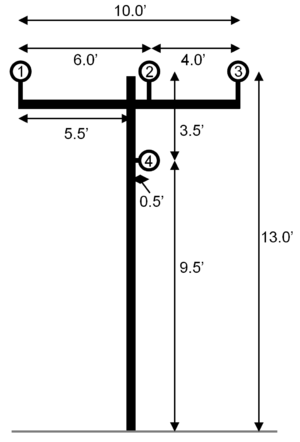
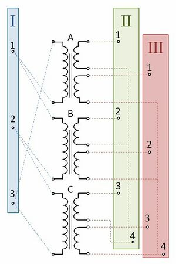

# Spec:NEVLink

**Source URL:** https://gridlab-d.shoutwiki.com/wiki/Spec:NEVLink
SPECIFICATION Approval item: 

## Contents

  * 1 Overview
    * 1.1 GLM Inputs
    * 1.2 General Link
      * 1.2.1 Programming Considerations
        * 1.2.1.1 Current & Power Calculations
    * 1.3 Overhead Lines
      * 1.3.1 Class:overhead_line
      * 1.3.2 Class: line_configuration
      * 1.3.3 Class: line_spacing
      * 1.3.4 Class: overhead_line_conductor
      * 1.3.5 Model Implementation
        * 1.3.5.1 Primitive Matrices
        * 1.3.5.2 Newton-Raphson Power Flow
    * 1.4 Underground Lines
      * 1.4.1 Class:underground_line
      * 1.4.2 Class: line_configuration
      * 1.4.3 Class: line_spacing
      * 1.4.4 Class: underground_line_conductor
      * 1.4.5 The Init, Presync, Sync, and Postsync Functions
        * 1.4.5.1 General
        * 1.4.5.2 Init
        * 1.4.5.3 Presync
        * 1.4.5.4 Sync
        * 1.4.5.5 Postsync
      * 1.4.6 Needed Equations
        * 1.4.6.1 Series Impedance
        * 1.4.6.2 Concentric Neutral
        * 1.4.6.3 Tape-Shielded
        * 1.4.6.4 Shunt Admittance
        * 1.4.6.5 Concentric Neutral
        * 1.4.6.6 Tape-Shield
        * 1.4.6.7 Solid Underground Conductors
    * 1.5 Transformers
      * 1.5.1 Class:transformer
      * 1.5.2 Class: transformer_configuration
      * 1.5.3 Model Implementation
        * 1.5.3.1 Newton-Raphson Power Flow
    * 1.6 Connector
      * 1.6.1 Switch devices
      * 1.6.2 Implementation
  * 2 See also
# Overview

`link` objects represent one of the two fundamental object types within the powerflow module. `link` objects are typically any object connecting two different nodes or buses on the system. This includes items like overhead lines, underground lines, triplex lines, transformers, switch devices, fuses, and regulators. Many of these items will include new functionality and updated calculations associated with the Neutral Earth Voltage (NEV) functionality. 

## GLM Inputs

To incorporate the NEV capabilities in a generic sense, a [Double_array]-like format for input data will be utilized for `link` objects. This style of input formatting will be utilized for double-precision inputs, complex inputs, and character-based inputs. A sample overhead line and underground line implementation could look like: 
    
    
     object line {	//OHL-type
     	from node1;
     	to node2;
     	from_terminal "1; 2; 3";	//Single cable connections
     	to_terminal "2; 3; 4";
     	configuration object line_config {
     		conductor "OHL1; OHL2; OHL3";	//Individual cables of conductor
     		spacing "OHL_Space; OHL_Space2";	//Spacing information - two indicates these are two circuits
     		length 1000;					//Length for this section
     	};
     };
    
    
    
     object line {	//UGL-type
     	from node1;
     	to node2;
     	from_terminal "1,4; 2,4; 3,4";	//Cable connections with implied neutral (concentric or tape-shielded)
     	to_terminal "2,5; 3,5; 4,5";
     	configuration object line_config {
     		conductor "UGL1; UGL2; UGL3";	//Individual cables of conductor
     		spacing "UGL_Space; UGL_Space2";	//Spacing information - two indicates these are two circuits
     		length 1000;					//Length for this section
     	};
     };
    

As with [node] objects, new [link] object properties are expected for the NEV implementation. They are outlined in Table 1. 

Table 1 - Link properties  Property | Definition   
---|---  
`from_terminal` | Terminal connection on the from side for each cable/connection. If an "implied neutral" is present (concentric neutral or tape shielded), this must be specified in pairs.   
`to_terminal` | Terminal connection on the to side for each cable/connection. If an "implied neutral" is present (concentric neutral or tape shielded), this must be specified in pairs.   
  
The `line_config` object will take the place of the specific [overhead_line_configuration] and [underground_line_configuration] objects that exist in GridLAB-D for the NEV implementation. Definitions are expected to match the existing configurations, but will be put into the array notation outlined earlier. The explicit property definitions are listed in Table 2. 

Table 2 - Line_config properties  Property | Definition   
---|---  
`conductor` | The physical connecting device between the appropriate elements of `from_terminal` and `to_terminal`.   
`spacing` | The physical position of different conductors between the two nodes. This can either be specified as a distance array (with diagonal elements ignored), or as a physical coordinate space for each conductor. See the example given following the table.   
`length` | Physical length of the connection between the two [node] objects. Only one length entry is permitted.   
  

Figure 1. Line Spacing Example

For the `spacing` field of `line_config`, the coordinates of the conductors can be specified as a Cartesian coordinate, or as a difference. Consider Figure 1 and the four conductor scenario presented. The `spacing` property can be specified for this case using distances in a full matrix format: 
    
    
     object line_spacing {
            name test_spacing_distances;
            conductor_distances "0,6.0,10.0,6.95,13.0; 6.0,0,4.0,3.5,13.0; 10.0,4.0,0,5.32,13.0; 6.95,3.5,5.32,0,9.5";
     } 
    

or using distances in a strictly upper triangular matrix format: 
    
    
     object line_spacing {
            name test_spacing_distances_upper;
            conductor_distances "6.0,10.0,6.95,13.0; 4.0,3.5,13.0; 5.32,13.0; 9.5";
     } 
    

or using Cartesian coordinates: 
    
    
     object line_spacing {
            name test_spacing_cartesian;
            conductor_distances "-5.5,13.0; 0.5,13.0; 4.5,13.0; 0.5,9.5";
     } 
    

Implementation `test_spacing_distances` defines the distances between each conductor in matrix format. Diagonal elements are ignored (representing "self distance") and are set to zero for this implementation. Under distance implementation, the last column is the distance above the ground. For underground lines, this column is ignored. A breakdown of row 1 (conductor 1 information) is: 
    
    
     [ N/A ,(distance 1 to 2), (distance(1 to 3), (distance 1 to 4), (distance 1 to E)]
    

The second implementation, `spacing_test_distances_upper` follows a similar format, but does only defines the distances once (e.g., the distance between 1 and 2 is the same as the distance between 2 and 1, so it is only defined once). The representation is strictly upper triangular, meaning the zero entry elements are removed. Therefore, the first row now represents: 
    
    
     [(distance 1 to 2), (distance(1 to 3), (distance 1 to 4), (distance 1 to E)]
     
    

The third implementation, `spacing_test_cartesian` defines the conductor positions as a set of Cartesian coordinate pairs. In this example, the origin (0,0) is set to the the base of the pole. The _x_ origin can vary, as long as all conductors in this spacing using the same reference. _y_ origins are assumed to be ground level at 0. 

## General Link

While individual calculations and specifications will be detailed below, each `link` object will have a common set of specifications for NEV solver functionality. Unless specifically mentioned, each of these items will occur or be present in every `link` object in the NEV solver. Note that the `from` and `to` fields are merely providing connection information. The NEV solver will not have any assumption on current direction and currents could flow from the `to` end to the `from` end of the `link`. 

### Programming Considerations

Each `link` object will need to populate and adjust values associated with four "blocks" of admittance matrices. For many common line types with line capacitance neglected (e.g., overhead lines), all four of these blocks will be an identical matrix. The four matrix locations that may need updating are: 

  * From bus self-admittance matrix -- Admittance associated with current injection calculations at the `from`-labelled bus.
  * To bus self-admittance matrix -- Admittance matrix associated with current injection calculations at the `to`-labelled bus.
  * From bus transfer admittance matrix -- Admittance associated with the relationship of electrically moving from the `from` bus to the `to` bus.
  * To bus transfer admittance matrix -- Admittance associated with the relationship of electrically moving from the `to` bus to the `from` bus.
Each of these matrices must be determined and updated prior to the NEV solver call. Note that the breakdown of these matrices is a recommendation for common line types. For items such as transformers, the whole admittance contribution is not as easily broken into the "four matrix partitions" definition, but will need to be parsed in that manner for posting to the overall NEV admittance matrices (e.g., fixed components versus components aggregated into other node contributions). Following the existing Newton-Raphson (NR) implementation, this call will likely be performed by objects high in the rank order list of the `sync` pass of the exec loop. Updates and "posting" of the various `link` admittance matrices are expected to occur in the object's `init` routine, as well as either the `presync` or lower-ranked `sync` routines. 

Transfer matrix components will be implemented into the `Y_NEV` structure format and posted to the overall admittance matrix locations using the transactional memory API. Information on those structures can be found in [NEV Data Format] and [NEV Solver]. Specific matrix locations will be determined using the information contained in the `NEVBUSDATA` structures associated with the from and to nodes (`matrix_index` and `matrix_size` fields). It is useful to note that this will be in the partitioned complex real and imaginary portions, as per [1]. 

Self admittance components will be accumulated directly into a self-admittance matrix associated with the corresponding from or to node. This will be a complex-valued matrix and will be accumulated directly into the node's exposed `Y_matrix_self` variable. This interaction will not need to be partitioned into real/imaginary componetns like the transfer admittance. Interactions with this matrix will be handled via pointers to the memory location and adjustments scheduled through the transactive memory API. Values within the `Y_matrix_self` will be translated into the appropriate `Y_NEV` format and location by the `node` object. 

#### Current & Power Calculations

Following the previous implementation, individual current and power flow calculation (on the link) can be calculated in the post-sync phase of each timestep by each link object itself. The transfer series admittance matrix can be used to calculate line current flows by: 

$$\displaystyle{}\mathbf{I}_{ij}=-\mathbf{I}_{ji}=\mathbf{Y}_{series}*\left (\mathbf{V}_i-\mathbf{V}_j\right )$$
The complex powers can then be calculated by: 

$$\displaystyle{}\mathbf{S}_{ij}=\mathbf{V}_i{I}_{ij}^*$$

$$\displaystyle{}\mathbf{S}_{ji}=\mathbf{V}_j{I}_{ji}^*$$
## Overhead Lines

There are four classes that contain all the information necessary to construct an overhead line model: overhead_line, line_configuration, line_spacing, and overhead_line_conductor. 

### Class:overhead_line

The class overhead_line provides connection information as well as the length and configuration for an overhead line. It must provide what nodes it is connected to as well as the specific terminals on each node that it ties in to. The terminal information needs to be provided in a list format. The overhead_line class will retain all of its previous functionality. Please see [Power Flow User Guide] for a reference of previous functionality. An example entry for the NEV implementation is shown below. 
    
    
        object overhead_line {
             name ohl_1;
             from node1;
             to node2;
             from_terminal "1; 2; 3; 4"; 
             to_terminal "1; 2; 3; 4";
             configuration ohl_config_1;
             length 2000ft;
        }
    

From the example above, it can be determined that there is a 2000 ft overhead line connected from node1 to node2 with 4 conductors. Conductors 1, 2, 3, and 4 (implied by the list format) respectively connect: terminal '1' of 'node1' and terminal '1' of 'node2', terminal '2' of 'node1' and terminal '2' of 'node2', terminal '3' of 'node1' and terminal '3' of 'node2', and lastly terminal '4' of 'node1' and terminal '4' of 'node2'. The remaining important information (including spacing and conductor types) is given in the line_configuration object 'ohl_config_1'. 

In the future, if varied earth resistivities are to be allowable, this seems like the most logical place to allow for user input. 

### Class: line_configuration

The class line_configuration is common to both overhead and underground lines, and gives the cable types for the line (in an array) as well as the spacing object. Overhead versus underground line types are not indicated in the line configuration, but conductors and spacings listed should be the appropriate type. The line_configuration class will retain all of its previous functionality. Please see [Power Flow User Guide] for a reference of previous functionality. An example entry for the NEV implementation is shown below. 
    
    
        object line_configuration {
             name ohl_config_1;
             conductor "ohc1;ohc1;ohc1;ohc2";
             spacing ohl_spacing_1;
        }
    

From the example above, it can be determined that the conductor types used for cables '1', '2', '3', and '4' (implied by the array) respectively are 'ohc1', 'ohc1', 'ohc1', and 'ohc2'. The spacing object describing the line configuration is 'ohl_spacing_1'. 

  

### Class: line_spacing

The line_spacing class is not specific to overhead or underground lines, but for overhead lines the distance from each conductor to the ground is required to calculated the conductor image distances. When the Cartesian format is used as in the example below, the y-coordinate reference is assumed to be earth. The line_spacing class will retain all of its previous functionality. Please see [Power Flow User Guide] for a reference of previous functionality. An example entry for the NEV implementation is shown below.implementation is shown below. 
    
    
        object line_spacing {
             name ohl_spacing_1;
             conductor_distances "-5.5,13.0; 0.5,13.0; 4.5,13.0; 0.5,9.5";     //The default unit is feet.
        }
    

If the absolute distances are being provided then there must be N(N-1)/2 entries specified in an upper triangular matrix format as shown below. Each 'row' or set of distances does not include the self distance for the conductor, but does include (as the last value) the conductor's earth distance. 
    
    
     object line_spacing {
            name test_spacing_distances;
            conductor_distances "6.0,10.0,6.95,13.0; 4.0,3.5,13.0; 5.32,13.0; 9.5";
     } 
    

### Class: overhead_line_conductor

The overhead_line_conductor class specifies all the physical and electrical parameters of the cable necessary to calculate the self and mutual impedances involving the conductor. The [Overhead Line Equations] page discusses these quantities and their use in Carson's equations. The overhead_line_conductor class will retain all of its previous functionality. Please see [Power Flow User Guide] for a reference of previous functionality. An example entry for the NEV implementation is shown below. 
    
    
        object overhead_line_conductor {
             name ohc1;
             diameter 1.2;
             geometric_mean_radius 0.01710;
             conductor_diameter 0.00446;
             resistance 1.12;
        }
    

Current ratings can also be included in this object as described in the [Power Flow User Guide]. 

### Model Implementation

#### Primitive Matrices

As in the current implementation, each of the described objects above will be rendered during runtime as a C++ object of the corresponding class. The overhead_line object's line_configuration variable will contain an address to the correct line-configuration object, which in turn will contain a pointer array with addresses of each conductor's conductor object, as well as the address of the correct spacing object. Since the NEV power flow implementation will solely support the Newton-Raphson method, the overhead lines are incorporated in the solver by constructing primitive series and shunt admittance matrices to be inserted in the larger system nodal admittance matrices. With all the data necessary data assembled in the aforementioned GridLAB-D objects, the primitive admittance matrices are constructed as described in detail on the [Overhead Line Equations] page. The primitive series impedance matrix is an $n\times n$ matrix where n is the number of phases present. For example, for a line with 6 phases (including one neutral denoted 'n'), the matrix will be of form: 

$$
\displaystyle
\begin{bmatrix}
\hat z_{1-2_{aa}} & \hat z_{1-2_{ab}} & \hat z_{1-2_{ac}} & \hat z_{1-2_{ad}} & \hat z_{1-2_{ae}} & \hat z_{1-2_{an}} \\
\hat z_{1-2_{ba}} & \hat z_{1-2_{bb}} & \hat z_{1-2_{bc}} & \hat z_{1-2_{bd}} & \hat z_{1-2_{be}} & \hat z_{1-2_{bn}} \\
\hat z_{1-2_{ca}} & \hat z_{1-2_{cb}} & \hat z_{1-2_{cc}} & \hat z_{1-2_{cd}} & \hat z_{1-2_{ce}} & \hat z_{1-2_{cn}} \\
\hat z_{1-2_{da}} & \hat z_{1-2_{db}} & \hat z_{1-2_{dc}} & \hat z_{1-2_{dd}} & \hat z_{1-2_{de}} & \hat z_{1-2_{dn}} \\
\hat z_{1-2_{ea}} & \hat z_{1-2_{eb}} & \hat z_{1-2_{ec}} & \hat z_{1-2_{ed}} & \hat z_{1-2_{ee}} & \hat z_{1-2_{en}} \\
\hat z_{1-2_{na}} & \hat z_{1-2_{nb}} & \hat z_{1-2_{nc}} & \hat z_{1-2_{nd}} & \hat z_{1-2_{ne}} & \hat z_{1-2_{nn}}
\end{bmatrix}
$$

The off-diagonal element $z_{m-n_{ij}}$ models the mutual coupling impedance between phases $i$ and $j$ for the line connecting buses $m$ and $n$, and is calculated by: 

$$\displaystyle{}\hat z_{1-2_{ij}}=4\omega P_{ii}G + j\left(2\omega G\ln{\frac{S_{ij}}{D_{ij}}} + 4\omega Q_{ij}G\right)\Omega /mi$$

The diagonal element $z_{m-n_{ii}}$ models the self impedance of phase $i$ for the line connecting buses $m$ and $n$, and is calculated by: 

$$\displaystyle{}\hat z_{1-2_{ii}}=r_i+4\omega P_{ii}G + j\left(X_i + 2\omega G\ln{\frac{S_{ii}}{RD_i}} + 4\omega Q_{ii}G\right)\Omega /mi$$

The primitive series impedance matrix is inverted to yield the primitive series admittance matrix. The primitive shunt admittance matrix for the overhead line which models shunt capacitance is of the same form as the series admittance matrix and is given by: 

$$\displaystyle{}Y_{shunt}=j\omega 10^{-6}P^{-1} Siemens/mi$$

$P$ is the primitive potential coefficient matrix with off-diagonal elements $P_{ij}$ calculated by: 

$$\displaystyle{}P_{ij}= \frac{1}{2\pi\epsilon_{air}}\ln{\frac{S_{ij}}{D_{ij}}}mile/\mu F$$
The primitive potential coefficient matrix diagonal elements $P_{ii}$ are calculated by: 

$$\displaystyle{}P_{ii}= \frac{1}{2\pi\epsilon_{air}}\ln{\frac{S_{ii}}{RD_{i}}}mile/\mu F$$

These matrices can be stored in array form. 

#### Newton-Raphson Power Flow

With the series and shunt primitive admittance matrices for the line constructed, they can be used to manipulate the larger system nodal admittance matrix. The series primitive admittance matrix is subtracted from the two off-diagonal blocks of the nodal admittance matrix corresponding to the connected buses. The series primitive admittance matrix is then added to the two diagonal blocks for the connected buses. The shunt primitive admittance matrix is divided by 2 and added to the two diagonal blocks of the nodal admittance matrix corresponding to the connected buses. 

Ordinarily, the primitive matrices for overhead lines need only be calculated and added to the nodal matrix once at the beginning of a simulation (e.g. during the 'init' phase of the powerflow). If a change is to be modeled on the line mid-simulation, the old primitive values can be subtracted (or added in the case of the off-diagonals) to the nodal admittance matrix. Then the matrices can be recalculated and inserted into the nodal admittance matrix. Assuming the core Newton-Raphson powerflow iterations are executed in a 'sync' pass, these matrix updates could be executed during a 'presync' pass. In this flexible implementation, special attention will be necessary for correctly inserting a primitive admittance matrix in the larger nodal matrix since a line may contain conductors connecting different subsets of terminals present at each node. Essentially, when an aforementioned 'block' is to have a primitive added to/subtracted from it, only the subset of rows/columns corresponding to the phases present in the line should be used. 

## Underground Lines

Due to the location of underground lines, the modified Carson's equations, should be used to calculate the self and mutual impedance between underground cables. There are three types of underground cables that will be supported: concentric neutral, tape-shield, and insulated. Each concentric neutral and tape-shield cable contains two conductors, a phase conductor and a neutral conductor and must be represented in impedance matrix. Because concentric neutral and tape-shield cables have two conductors, the terminal connections for the cable must contain connections for both the phase conductor and the neutral conductor. There are four classes that are required in order to fully obtain the impedance matrix for an underground line: underground_line, line_configuration, line_spacing, and underground_line_conductor. 

### Class:underground_line

The class underground_line provides connection information as well as the length and configuration for an underground line. It must provide what nodes it is connected to as well as the specific terminals on each node that it ties in to. The terminal information needs to be provided in a list format. The underground_line class will retain all of its previous functionality. Please see [Power Flow User Guide] for a reference of previous functionality. An example of the necessary information for NEV is shown below. 
    
    
        object underground_line {
             name ugl_1;
             from node1;
             to node2;
             from_terminal "1,4; 2,4; 3,4"; //Pairings are needed for concentric neutral or tape-shield cable types only.
             to_terminal "1,4; 2,4; 3,4";
             configuration underground_line_configuration;
             length 2000ft;
        }
    

From the example above, it can be determined that there is a 2000 ft underground line connected from node1 to node2 with 3 concentric neutral or tape-shield cables with the phase conductors connected from terminals 1, 2, and 3 of node1 to terminals 1, 2, and 3 of node2 and the neutral cables connected to terminal 4 of node1 to terminal 4 node2 whose configuration is described by underground_line_configuration. Please note that although the three neutral conductors are all attached to terminal 4 that does not mean that there is only one neutral conductor modeled internally. If we have an underground line with three concentric neutral or tape-shielded cables then there are 6 conductors that are modeled internally. 

### Class: line_configuration

The class line_configuration provides information on which cables are connected to terminals and provides a spacing object. The cables need to be provided in an array. The line_configuration class will retain all of its previous functionality. Please see [Power Flow User Guide] for a reference of previous functionality. An example of the necessary information for NEV is shown below. 
    
    
        object line_configuration {
             name underground_line_configuration;
             conductor "ulc1; ulc2; ulc1";
             spacing underground_line_spacing;
        }
    

From the example above along with the underground_line example, it can be determined that the underground line is made up of 3 cables. Two of the cables have the properties specified by underground_line_conductor, ulc1. The phase conductor of the first cable in the conductor property, ulc1, is connected to terminal 1 of node1 and terminal 1 of node2. The neutral conductor of the first cable in the conductor property, ulc1, is connected to terminal 4 of node1 and terminal 4 of node2. The phase conductor of the second cable in the conductor property, ulc2, is connected to terminal 2 of node1 and terminal 2 of node2. The neutral conductor of the first cable in the conductor property, ulc2, is connected to terminal 4 of node1 and terminal 4 of node2. The phase conductor of the first cable in the conductor property, ulc1, is connected to terminal 3 of node1 and terminal 3 of node2. The neutral conductor of the first cable in the conductor property, ulc1, is connected to terminal 4 of node1 and terminal 4 of node2. 

Take special note! GridLAB-D must be able to read in an array of strings as is indicated by the conductor property of line_configuration. 

### Class: line_spacing

The line_spacing class needs to be able to specify the absolute spacing between each physical cable contained in the conductor property of the line_configuration. The line_spacing class will retain all of its previous functionality. Please see [Power Flow User Guide] for a reference of previous functionality. An example of the necessary information for NEV is shown below. 
    
    
        object line_spacing {
             name underground_line_spacing;
             cable_spacing "cable1_x, cable1_y; cable2_x, cable2_y; ...; cableN_x, cableN_y";     //The default unit should be in feet.
        }
    

The cable_spacing property can be listed in a coordinate fashion or absolute distances between conductors can be specified. Then euclidean geometry can be used to determine the absolute distance between cables if the spacing is given with coordinates. If the absolute distances are being provided then there must be N(N-1)/2 entries specified. 

### Class: underground_line_conductor

The underground_line_conductor class specifies the type of cable, concentric neutral, tape-shielld, or unshielded (A cable made of a insulated single conductor). It also needs to provide all the physical and electrical parameters of the cable necessary for calculating the self and mutual impedances for each conductor present in the line. This link, [Underground Line Equations], provides a comprehensive list of all the physical and electrical parameters needed to determine the self and mutual impedances for all the conductors present in the underground line. The underground_line_conductor class will retain all of its previous functionality. Please see [Power Flow User Guide] for a reference of previous functionality. An example of the necessary information for NEV is shown below. 
    
    
        object underground_line_conductor {
             name ulc1;
             type CONCENTRIC_NEUTRAL;
             outer_diameter 1.29;
             conductor_gmr 0.01710;
             conductor_diameter 0.567;
             conductor_resistance 0.41;
             neutral_gmr 0.00208;
             neutral_diameter 0.0640837;
             neutral_resistance 14.872;
             neutral_strands 13;
        }
    
    
    
        object underground_line_conductor {
             name ulc2;
             type TAPE_SHIELD;
             outer_diameter 1.29;
             conductor_gmr 0.01710;
             conductor_diameter 0.567;
             conductor_resistance 0.41;
             insulation_relative_permittivity 2.3;
             shield_diameter 0.867;
             shield_resistivity 1.68e-8; // This must be in Ohm meters
             shield_thickness 0.08in;
        }
    
    
    
        object underground_line_conductor {
             name ulc3;
             type INSULATED;
             outer_diameter 1.29;
             conductor_gmr 0.01710;
             conductor_diameter 0.567;
             conductor_resistance 0.41;
        }
    

### The Init, Presync, Sync, and Postsync Functions

#### General

What needs to come out of the underground_line class is an [2][N][N] impedance, shunt admittance, [N] from_terminal, and [N] to_terminal array where N is the number of conductors present in the line. These arrays then get fed into the NEVbranchdata structure in order to solve the powerflow of the system. It will also be able to provide current and power flowing through each conductor. 

The number of conductors, N, present in the underground line is determined by number of entries in the conductor property of the line_configuration class along with the type property in the underground_line_conductor class. The impedance and shunt admittance arrays are split in the the real and imaginary parts of the calculated impedance and shunt admittance. The from_terminal and to_terminal arrays will be filled from the from_terminal and to_terminal property in such a way that each entry matches with the conductor row of the impedance and capacitance arrays. The from_terminal and to_terminal arrays grab their information from the the from_terminal and to_terminal properties of the underground_line class. 

In order to populate the impedance array, a [N][2] position, [N][N] distance, and [N] resistance array need to be populated.The position array is populated with the x and y coordinates given in the cable_spacing property of the line_spacing class. Euclidean geometry and equations in [Underground Line Equations] are used to determine the absolute distance between conductors. These distances get place in the off-diagonals of the [N][N] distance array. The diagonals of the [N][N] distance array are populated with the geometric mean radius of the conductors that can be found in the underground_line_conductor class properties or can be calculated from the underground_line_conductor class properties according the the equations specified in [Underground Line Equations]. 

The resistance array is populated with the resistance for each conductor either found in the underground_line_conductor class properties or calculated from the underground_line_conductor class properties according to the equations found in [Underground Line Equations]. 

With the distance and resistance arrays fully populated, the self and mutual impedance for each conductor can be calculated according to Kersting (2007) and placed in the impedance array. The Specific equations can be found in [Underground Line Equations]. 

When determining the shunt admittance array for an underground line, certain assumptions are made about the capacitance between conductors. Firstly, the electric field does not go beyond the cable insulation so that there is no capacitance between cables. Secondly, the only capacitance exists between the neutral conductor and phase conductor of an tape-shield cable or concentric neutral cable. The [N][N] shunt admittance array will only be populated with the admittance that exists between the neutral and phase conductors of the tape-shield and concentric neutral cables. The shunt admittance for underground concentric neutral and tape-shield cables will be calculated by using the information given in the underground_line_conductor class properties and the equations specified in [Underground Line Equations]. 

#### Init

During the Init of the underground_line class the following arrays must be populated 

  * [N][2] position array (If conductor_spacing specifies coordinates)
  * [N][N] distance array
  * [N] resistance array
  * [2][N][N] Series Impedance Array
  * [2][N][N] Shunt Impedance Array
  * The NEVBRANCHDATA structure must be updated with the series impedance array and shunt admittance array.
Pseudo code: 
    
    
        Find(line_configuration object);
        
        Find(line_spacing object from spacing property of line_configuration object);
        calculate([N][2] position array from spacing property of line_spacing object);
        update(the off-diagonals of the [N][N] distance array with the data from the [N][2] position array);
        
        Find(underground_line_conductor objects from conductors property of line_configuration object);
        for each underground_line_conductor object{
             if(type == 'CN'){
                  calculate(the gmr of the concentric nuetral conductor using the outer_diameter, neutral_gmr, neutral_diameter, and neutral_strands properties);
                  calculate(the resistance of the concentric neutral conductor using the neutral_resistance and neutral_strands properties);
                  update([N] resitance array with the conductor_resistance property and the calculated concentric neutral resistance);
                  update(the diagonals of the [N][N] distance array with the conductor_gmr property and the calculated gmr of the concentric neutral);
                  calculate(capacitance between the phase_conductor and concentric neutral using relative_permittivity, neutral_strands, neutral_diameter, conductor_diameter, and outer_diameter properties
                            along with the system frequency);
                  update([2][N][N] shunt admittance array with the calculated capacitance);
             } else if(type == 'TS'){
                  calculate(the gmr of the tape-shield conductor using the shield_thickness and shield_diameter properties);
                  calculate(the resistance of the tape-shield conductor using shield_thickness and shield_resistivity properties);
                  update([N] resitance array with the conductor_resistance property and the calculated tape-shield resistance);
                  update(the diagonals of the [N][N] distance array with the conductor_gmr property and the calculated gmr of the tape-shield);
                  calculate(capacitance between the phase_conductor and tape-shield using relative_permittivity, conductor_diameter, and outer_diameter properties
                            along with the system frequency);
                  update([2][N][N] shunt admittance array with the calculated capacitance);
             } else if(type == 'INSULATED'){
                  update([N] resitance array with the conductor_resistance);
                  update(the diagonals of the [N][N] distance array with the conductor_gmr property);
             }
        }
        for(a = 0, a < N, a++){
             for(b = 0, b < N, b++){
                  calculate(impedance between the two conductors using distance array[a][b] and if a == b restance array[a]);
                  update(the [2][N][N] impedance array with real and imaginary portions of the calculated impedance);
             }
        }
        update(NEVbranchdata with the series impedance, shunt admittance, from_terminal, and to_terminal arrays);
    

#### Presync

During the Presync of the underground_line class if there is a change in the configuration of the line flagged due to a reconfiguration action of some sort, a fault, or degredation of cable parameters due to stress and aging then the following arrays must be repopulated. 

  * [N][2] position array (IIF conductor_spacing specifies coordinates)
  * [N][N] distance array
  * [N] resistance array
  * [2][N][N] Series Impedance Array
  * [2][N][N] Shunt Impedance Array
  * The NEVBRANCHDATA structure must be updated with the series impedance array and shunt admittance array.
The following parameters of the link class must be cleared. 

  * Current through each conductor of the underground_line class.
The result of the link class's presync function will be returned. 

Pseudo code: 
    
    
        if(recalc){
             calculate([N][2] position array from spacing property of line_spacing object);
             update(the off-diagonals of the [N][N] distance array with the data from the [N][2] position array);
        
             for each underground_line_conductor object{
                  if(type == 'CN'){
                       calculate(the gmr of the concentric nuetral conductor using the outer_diameter, neutral_gmr, neutral_diameter, and neutral_strands properties);
                       calculate(the resistance of the concentric neutral conductor using the neutral_resistance and neutral_strands properties);
                       update([N] resitance array with the conductor_resistance property and the calculated concentric neutral resistance);
                       update(the diagonals of the [N][N] distance array with the conductor_gmr property and the calculated gmr of the concentric neutral);
                       calculate(capacitance between the phase_conductor and concentric neutral using relative_permittivity, neutral_strands, neutral_diameter, conductor_diameter, and outer_diameter properties
                                 along with the system frequency);
                       update([2][N][N] shunt admittance array with the calculated capacitance);
                  } else if(type == 'TS'){
                       calculate(the gmr of the tape-shield conductor using the shield_thickness and shield_diameter properties);
                       calculate(the resistance of the tape-shield conductor using shield_thickness and shield_resistivity properties);
                       update([N] resitance array with the conductor_resistance property and the calculated tape-shield resistance);
                       update(the diagonals of the [N][N] distance array with the conductor_gmr property and the calculated gmr of the tape-shield);
                       calculate(capacitance between the phase_conductor and tape-shield using relative_permittivity, conductor_diameter, and outer_diameter properties
                                 along with the system frequency);
                       update([2][N][N] shunt admittance array with the calculated capacitance);
                  } else if(type == 'INSULATED'){
                       update([N] resitance array with the conductor_resistance);
                       update(the diagonals of the [N][N] distance array with the conductor_gmr property);
                  }
             }
             for(a = 0, a < N, a++){
                  for(b = 0, b < N, b++){
                       calculate(impedance between the two conductors using distance array[a][b] and if a == b restance array[a]);
                       update(the [2][N][N] impedance array with real and imaginary portions of the calculated impedance);
                  }
             }
             update(NEVbranchdata with the series impedance, shunt admittance, from_terminal, and to_terminal arrays);
        }
    

#### Sync

During the sync function, the result of link class's sync function will be returned. 

#### Postsync

During the postsync function, the underground_line returns the result of it's link class's postsync. 

It is during this time that the link class will determine the following. 

  * Current through each conductor of the underground_line class.
  * Power through each conductor of the underground_line class.
### Needed Equations

#### Series Impedance

Table 1 - Equation Notation  Variable | Definition   
---|---  
$\displaystyle{}V_{i_{mg}}$ | Voltage at node i, phase m relative to true ground (V)   
$\displaystyle{}I_{i_{mg}}$ | Voltage at node i, phase m relative to true ground (A)   
$\displaystyle{}\hat z_{i-j_{nn}}$ | Element of series impedance matrix relating voltage/current relationship for line connecting nodes i and j, corresponding to self impedance of phase n. Return path (ground) impedance folded in ($\Omega /mile$)   
$\displaystyle{}\hat z_{i-j_{nm}}$ | Element of series impedance matrix relating voltage/current relationship for line connecting nodes i and j, corresponding to phases n and m. Return path (ground) impedance folded in ($\Omega /mile$)   
$\displaystyle{}r_{i,c}$ | Resistance of the phase conductor for cable i ($\Omega /mi$)   
$\displaystyle{}r_{i,cn}$ | The effective resistance of the concentric neutral ring for cable i ($\Omega /mi$)   
$\displaystyle{}r_{i,sh}$ | The effective resistance of the tape-shield for cable i ($\Omega /mi$)   
$\displaystyle{}\omega$ | System angular frequency ($rad/s$)   
$\displaystyle{}f$ | System frequency ($Hz$)   
$\displaystyle{}G=0.1609347\times 10^{-3}$ | Constant for converting from CGS units ($\Omega /mi$)   
$\displaystyle{}d_{i,c}$ | Diameter of the phase conductor for cable i ($in$)   
$\displaystyle{}d_{i,s}$ | Diameter of a neutral strand for cable i ($in$)   
$\displaystyle{}d_{i,sh}$ | Diameter of the tape-shield for cable i ($in$)   
$\displaystyle{}d_{i,od}$ | Outer diameter of cable i ($in$)   
$\displaystyle{}R_{i}$ | Radius of the circle passing through the concentric neutral strands for cable i ($in$)   
$\displaystyle{}T_{i}$ | Thickness of the tape-shield for cable i ($mil$)   
$\displaystyle{}k_{i}$ | The number of neutral strands for cable i ($unitless$)   
$\displaystyle{}GMR_{i,c}$ | Geometric mean radius of the phase conductor for cable i ($ft$)   
$\displaystyle{}GMR_{i,s}$ | Geometric mean radius of a neutral strand for cable i ($ft$)   
$\displaystyle{}GMR_{i,sh}$ | Geometric mean radius of the tape-shield for cable i ($ft$)   
$\displaystyle{}GMR_{i,cn}$ | The effective Geometric mean radius of the concentric neutral ring for cable i ($ft$)   
$\displaystyle{}D_{ij}$ | Distance between conductors i and j ($ft$)   
$\displaystyle{}S_{ij}$ | Distance between conductor i and conductor j's image ($ft$)   
$\displaystyle{}\theta_{ij}$ | Angle between a pair of lines drawn from conductor i to its own image and to the image of conductor j ($rad$)   
$\displaystyle{}\rho$ | Resistivity of earth ($\Omega -meters$)   
$\displaystyle{}\rho_{i,sh}$ | Resistivity of the tape-shield for cable i at a temperature of 50\Celsius ($\Omega -meters$)   
$\displaystyle{}\epsilon_{0}$ | The permittivity of free space = $1.4240\times 10^{-2} (\mu F/mi)$  
$\displaystyle{}\epsilon_{i,r}$ | The relative permittivity of the insulation medium for cable i ($unitless$)   
$\displaystyle{}C_{1}=\frac{1}{63360}$ | conversion factor for converting inches to miles for cable i ($mi/in$)   
$\displaystyle{}C_{2}=\frac{1}{63360000}$ | conversion factor for converting mils to miles for cable i ($mi/mil$)   
$\displaystyle{}C_{3}=\frac{1}{1609.344}$ | conversion factor for converting meters to miles for cable i ($mi/m$)   
  
Initially neglecting shunt admittances, the voltage/current relationship between two 'nodes' 1 and 2 (corresponding to physical terminal locations in the network) with $m$ phases can be expressed in matrix form: 

$$
\begin{bmatrix}
V_{1_{ag}} \\
\downarrow \\
V_{1_{mg}}
\end{bmatrix}
-
\begin{bmatrix}
V_{2_{ag}} \\
\downarrow \\
V_{2_{mg}}
\end{bmatrix}
=
\begin{bmatrix}
\hat z_{1-2_{aa}} & \rightarrow & \hat z_{1-2_{am}} \\
\downarrow & \searrow & \downarrow \\
\hat z_{1-2_{ma}} & \rightarrow & \hat z_{1-2_{mm}}
\end{bmatrix}
\begin{bmatrix}
I_{1-2_{ag}} \\
\downarrow \\
I_{1-2_{mg}}
\end{bmatrix}
$$

For example, consider a distribution line with two electrically isolated feeders sharing one neutral phase. One of the feeders has all three phases $(a, b, c)$ present, while the other has only two phases $(a, c)$ present. For clarity, the two phases on the second feeder are renamed $(d, e)$. Then, the voltage drop on the line can be expressed by: 

$$
\begin{bmatrix}
V_{1_{ag}} \\
V_{1_{bg}} \\
V_{1_{cg}} \\
V_{1_{dg}} \\
V_{1_{eg}} \\
V_{1_{ng}}
\end{bmatrix}
-
\begin{bmatrix}
V_{2_{ag}} \\
V_{2_{bg}} \\
V_{2_{cg}} \\
V_{2_{dg}} \\
V_{2_{eg}} \\
V_{2_{ng}}
\end{bmatrix}
=
\begin{bmatrix}
\hat z_{1-2_{aa}} & \hat z_{1-2_{ab}} & \hat z_{1-2_{ac}} & \hat z_{1-2_{ad}} & \hat z_{1-2_{ae}} & \hat z_{1-2_{an}} \\
\hat z_{1-2_{ba}} & \hat z_{1-2_{bb}} & \hat z_{1-2_{bc}} & \hat z_{1-2_{bd}} & \hat z_{1-2_{be}} & \hat z_{1-2_{bn}} \\
\hat z_{1-2_{ca}} & \hat z_{1-2_{cb}} & \hat z_{1-2_{cc}} & \hat z_{1-2_{cd}} & \hat z_{1-2_{ce}} & \hat z_{1-2_{cn}} \\
\hat z_{1-2_{da}} & \hat z_{1-2_{db}} & \hat z_{1-2_{dc}} & \hat z_{1-2_{dd}} & \hat z_{1-2_{de}} & \hat z_{1-2_{dn}} \\
\hat z_{1-2_{ea}} & \hat z_{1-2_{eb}} & \hat z_{1-2_{ec}} & \hat z_{1-2_{ed}} & \hat z_{1-2_{ee}} & \hat z_{1-2_{en}} \\
\hat z_{1-2_{na}} & \hat z_{1-2_{nb}} & \hat z_{1-2_{nc}} & \hat z_{1-2_{nd}} & \hat z_{1-2_{ne}} & \hat z_{1-2_{nn}}
\end{bmatrix}
\begin{bmatrix}
I_{1-2_{ag}} \\
I_{1-2_{bg}} \\
I_{1-2_{cg}} \\
I_{1-2_{dg}} \\
I_{1-2_{eg}} \\
I_{1-2_{ng}}
\end{bmatrix}
$$

The hat notation, taken from [Kersting], indicates that the return path, i.e. the ground impedance, has been folded into the other impedances. According to Carson's equations, the elements of the primitive impedance matrix can be calculated by: 

$$\displaystyle{}\hat z_{1-2_{ii}}=r_i+4\omega P_{ii}G + j\left(X_i + 2\omega G\ln{\frac{S_{ii}}{RD_i}} + 4\omega Q_{ii}G\right)\Omega /mi$$

$$\displaystyle{}\hat z_{1-2_{ij}}=4\omega P_{ii}G + j\left(2\omega G\ln{\frac{S_{ij}}{D_{ij}}} + 4\omega Q_{ij}G\right)\Omega /mi$$

Wherein: 

$$X_i = 2\omega{}G\ln{\frac{RD_i}{GMR_{i}}}\Omega /mi$$

$$P_{ij} = \frac{\pi}{8}-\frac{1}{3\sqrt{2}}k_{ij}\cos{\theta_{ij}}+\frac{k_{ij}^2}{16}\cos{2\theta_{ij}}\left(0.6728+\ln{2}{k_{ij}}\right)+\frac{k_{ij}^2}{16}\theta_{ij}\sin{2\theta_{ij}}$$

$$Q_{ij} = -0.0386 + \frac{1}{2}\ln{\frac{2}{k_{ij}}}+\frac{1}{3\sqrt{2}}k_{ij}\cos{\theta_{ij}}$$

$$k_{ij} = 8.565\times 10^{-4}S_{ij}\sqrt{\frac{f}{\rho}}$$

The modified Carson equations will be used for calculating the primitive series impedance matrix by making the following approximations 

$$P_{ij} = \frac{\pi}{8}$$

$$Q_{ij} = -0.0386 + \frac{1}{2}\ln{\frac{2}{k_{ij}}}$$

which result in the following equations for the self and mutual impedance for underground cables 

$$\displaystyle{}\hat z_{1-2_{ii}}=r_i+\pi^{2}fG + j4\pi fG\left(\ln{\frac{1}{GMR_i}} + \ln{\frac{2}{0.0008565\sqrt{\frac{f}{\rho}}}} - 2(0.0386)\right)\Omega /mi$$

$$\displaystyle{}\hat z_{1-2_{ij}}=\pi^{2}fG + j4\pi fG\left(\ln{\frac{1}{D_{ij}}} + \ln{\frac{2}{0.0008565\sqrt{\frac{f}{\rho}}}} - 2(0.0386)\right)\Omega /mi$$

The primitive series admittance matrix can be inverted to yield the primitive series admittance matrix for the line. For a more complete model of the line, the primitive shunt admittance matrix can then be added. 

The effective resistance and GMR of the tape-shield and concentric neutral ring need to be calculated in order to use the previously defined equations. 

#### Concentric Neutral

The effective geomentric mean of the concentric neutral ring can be found using the following equation. 

$$\displaystyle{}GMR_{i,cn}=(GMR_{i,s}k_{i}R_{i}^{k_{i}-1})^{\frac{1}{k_{i}}} ft$$

$R$ is the radius of the circle passing through the center of the concentric neutral strands in ft and can be found using the equation below. 

$$\displaystyle{}R_{i}=\frac{d_{i,od}-d_{i,s}}{24} ft$$

The effective resistance of the concentric neutral ring is calculated using the following equation. 

$$\displaystyle{}r_{i,cn}=\frac{r_{i,s}}{k_{i}} \Omega/mi$$

Because the distance between cables is much greater than $R_{i}$ it is a good approximation to treat the concentric neutral strands as a single conductor located a distance $R$ above the center of the cable when determining distances between adjacent conductor cables. 

#### Tape-Shielded

The GMR of the tape shield is given the equation below. 

$$\displaystyle{}GMR_{i,sh}=\frac{\frac{d_{i,sh}}{2}-\frac{T_{i}}{2000}}{12} ft$$

The resistance of the tape sheild is the given in the equation below. 

$$\displaystyle{}r_{i,sh}=\frac{C_{3}\rho_{i,sh}}{(C_{1}C_{2}d_{i,sh}T{i}+(C_{2}T_{i})^2)} \Omega/mi$$

The distance between the tape shield and it's own phase conductor is $GMR_{sh}$. 

#### Shunt Admittance

The equations presented below assume that the electric field created by the charge on the phase conductor is confined to the boundary of the insulation. Because of this assumption there is no cross coupling of the admittances between conductors. 

#### Concentric Neutral

The shunt admittance between a conductor and the concentric neutral ring for a single cable is defined by the equation below. 

$$\displaystyle{}y_{in}=0+j\frac{2\pi\omega\epsilon_{0}\epsilon_{i,r}}{10^{6}(ln(\frac{2R_{i}}{d_{i,c}})-\frac{1}{k_{i}}ln(k_{i}\frac{d_{i,s}}{2R_{i}}))} S/mi$$

#### Tape-Shield

The shunt admittance between a conductor and the tape-shield for a single cable is defined by the equation below. 

$$\displaystyle{}y_{in}=0+j\frac{2\pi\omega\epsilon_{0}\epsilon_{i,r}}{10^{6}ln(\frac{2R_{i}}{d_{i,c}})} S/mi$$

#### Solid Underground Conductors

There is no special treatment for single conductor cables in an underground line. They treated just like the phase conductor of a concentric neutral or tape-shield cable. And because there isn't any type of neutral ring there is no capacitance to model. All single conductor cables are assumed to be well insulated so that there is no capacitance between cables. As was stated before the only capacitance modeled is between the phase conductor and nuetral conductor of a concentric neutral or tape-shield cable. 

## Transformers

There are two classes that contain the information necessary to model a transformer: transformer, and transformer_configuration. 

### Class:transformer

The class transformer provides connection information as well as the configuration name for a transformer. It must provide what nodes it is connected to as well as the specific terminals on each node that it ties in to. The terminal information needs to be provided in a list format. Note that each transformer_configuration will have a single allowable specified number of high-side and low-side terminal connections. These connections will also have an implied order. For example, for a three-phase wye-wye transformer, four terminal connections should be specified for each side of the transformer, corresponding to the conventional 'ABCN' phase designations. For a single phase center-tapped transformer, the high side of the transformer should have two terminal connections specified corresponding to the primary phase and neutral connection. The low side should have three terminal connections specified, corresponding to the conventional '1,2,N' phase designation. The transformer class will retain all of its previous functionality. Please see [Power Flow User Guide] for a reference of previous functionality. An example entry for the NEV implementation is shown below. 
    
    
        object transformer {
             name three_ph_YY_xfmr_1;
             from node10;
             to node11;
             from_terminal "1; 2; 3; 4"; 
             to_terminal "1; 2; 3; 4";
             configuration xfmr_config_1;
        }
    
    
    
        object transformer {
             name split_phase_xfmr_1;
             from node12;
             to node13;
             from_terminal "2; 4"; 
             to_terminal "1; 2; 3";
             configuration xfmr_config_2;
        }
    
    
    
        object transformer {
             name three_winding_1;
             from node14;
             to "node15; node16"; 
             primary_terminal "1; 2; 3"; 
             secondary_terminal "1; 2; 3; 4";
             tertiary_terminal "1; 2; 3; 4";
             configuration xfmr_config_3;
        }
    

From the first example above, it can be determined that the primary and secondary sides of the transformer each connect to four terminals at their corresponding nodes. The second example indicates two terminal connections at the high side and three terminal connections at the low side. The third example illustrates a case with a three winding transformer which (unlike a split-phase center-tapped setup) has two separate secondary buses. For this reason, the 'to' field should be allowed to accept a list format as shown above. The third example also illustrates the optional use of 'primary_terminal', 'secondary_terminal' and 'tertiary_terminal' fields (in place of 'from_terminal' and 'to_terminal') where three buses are present. Based on the transformer object declaration alone, it is not immediately evident how these terminals relate to the transformer terminals/winding coupling, but the order given will be passed to the transformer_configuration object, whose 'connect_type' field implies a specified ordering. 

### Class: transformer_configuration

The transformer_configuration class specifies the connection type for the transformer, which implies the number of windings and their coupling polarities, as well as number of terminals on each side of the transformer. Also given here are primary and secondary voltage ratings which imply the turns ratio. Power rating along with series and shunt impedances can be used to derive the equivalent impedance model of the transformer. As with the previous implementation, impedance values can be specified in conventional per unit (%) or absolute values. Moreover, values can be specified for entire transformer or for each winding individually. Where the value specified for 'connect_type' is one of the preconfigured types, the transformer winding coupling and winding-to-terminal connection scheme is included automatically. If a user-defined transformer configuration is desired, 'connect_type' is given a value of 'CUSTOM'. This requires the user to include the fields 'winding_coupling' and 'winding_connection' in the specification. These fields accept double arrays and string arrays, respectively. The 'winding_coupling' list elements are comprised of a list of winding pairings. The 'winding_connection_top' and 'winding_connection_bottom' fields indicate which bus-terminal the 'top' and 'bottom' ends of each winding-phase are connected to. Each of the two fields contain a group of pairs for each winding, with groups being separated by semicolon. The pairs within each group correspond to bus-terminal numbers. Thus, the first pair listed in the first group for the winding_connection_top field indicates the bus and terminal to which the first winding's first phase top end is connected. The first three list elements in the example each contain two winding terminals, in an configuration corresponding to a delta connection. The remaining list elements describe grounded wye connections for both the secondary and tertiary windings. The transformer_configuration class will retain all of its previous functionality. Please see [Power Flow User Guide] for a reference of previous functionality. An example entry for the NEV implementation is shown below. 
    
    
        transformer_configuration {
             name xfmr_config_1;
             connect_type WYE_WYE;
             V_primary 4160;
             V_secondary 480;
             kVA_rating 500;
             resistance 0.011;
             reactance 0.02;
             shunt_impedance j100;
        }
    
    
    
        transformer_configuration {
             name xfmr_config_2;
             connect_type SINGLE_PHASE_CENTER_TAPPED;
             V_primary 4160;
             V_secondary 240;
             kVA_rating 50;
             impedance1 0.05 + j0.08;
             impedance2 0.1 + j0.04;
             impedance3 0.1 + j0.04;
        }
    
    
    
        transformer_configuration {
             name xfmr_config_3;
             connect_type CUSTOM;
             V_rating 4160; 480; 207;
             kVA_rating 500;
             impedance 0.05 + j0.08; 0.1 + j0.04; 0.1 + j0.04;
             winding_coupling "1,2;1,3";
             winding_connection_top "1,3; 1,1; 1,2 
                                     2,1; 2,2; 2,3
                                     3,1; 3,2; 3,3";
             winding_connection_bottom "1,1; 1,2; 1,3
                                        2,4; 2,4; 2,4
                                        3,4; 3,4; 3,4";
        }
    

Figure 2. CUSTOM transformer configuration

In the first two examples above, included connect_type models are used, which internally contain all of the transformer winding coupling/connection information. If a user wishes to model a transformer not included in the set, they can denote 'CUSTOM' under the 'connect-type' field and include the additional fields shown in the third example. Figure 2 illustrates the connections for this example, wherein there are three three-phase winding sets. Figure 2 illustrates that for each of the three phase sets A, B, and C, Winding 1 (on the left) links Windings 2 and 3 (on the right). The shaded terminal sets denoted I, II, and III denote the external primary, secondary and tertiary terminal sets which correspond to the sets in the transformer object. The field 'winding_coupling' should include pairs of winding numbers (separated by semicolons) which are magnetically coupled. In the example above, Winding 1 is magnetically coupled to both Winding 2 and Winding 3. The fields 'winding_connection_top' and 'winding_connection_bottom' describe how the winding terminals are connected to the external transformer terminals. For both fields, each group delineated by a line return corresponds to a winding set. Within a winding set group, each pair (delineated by semicolons) represents a single phase for the winding. The number of pairs in a set implies the number of phases for the winding. For the example above, each field includes three sets of three pairs, indicating three winding sets each with three phases. The values within the pairs give the external terminal address to which the winding terminal is connected. The first pair for the 'winding_connection_top' field, '1,3', indicates that the top of the first winding's first phase is connected to terminal set '1', phase '3' of the external terminals. Note also that in this example, an alternate array entry format has been used for both the winding voltage rating ('V_rating') and the winding per unit impedances ('impedance'). Note that, for unusual cases, kVA rating can also be specified in [M] double array format rather than a single double, where [M] is the number of windings. 

  
### Model Implementation

The formation of the set of transformer primitive admittance matrices is a lengthy process, described in detail at the [NEV Transformer] page. In short, four matrices are assembled as follows. $\mathbf{A}$ is constructed to model the terminal connections (information described in the 'winding_connection' field for the transformer_configuration object). $\mathbf{N}$ is constructed to model the turns ratio(s), which are derived from the 'V_primary', 'V_secondary', and sometimes 'V_tertiary' fields. $\mathbf{B}$ is constructed to model the winding couplings as described in 'winding_coupling'. Finally, $\mathbf{Z_B}$ is constructed to model the short circuit impedances between windings. With these matrices assembled, the primitive series admittance matrix for the transformer is calculated by: 

$$\displaystyle{}\mathbf{Y}_{series}=\mathbf{A}\mathbf{N}\mathbf{B}\mathbf{Z_B}^{-1}\mathbf{B}^T\mathbf{N}^T\mathbf{A}^T$$

Note that the resulting matrix is a complete set of all four primitive matrices (the two diagonal self matrices as well as the two off-diagonal transfer matrices). 

Any shunt admittances can be lumped on the primary side and assembled in a diagonal primitive matrix with dimension equal to the number of terminals at the primary bus. 

#### Newton-Raphson Power Flow

In the same way as overhead/underground lines, the diagonal primitives are added to the corresponding diagonal blocks of the system nodal admittance matrix. The off diagonal blocks should also be added (rather than subtracted) to the corresponding off-diagonal blocks of the system nodal admittance matrix as the above equation already incorporates the negative sign. If used, the shunt primitive admittance matrix can also be added to the diagonal block corresponding to the primary side bus. 

## Connector

The `connector` object is a generic `link` object that will enable a zero-length and zero-impedance connection between two `node` objects. The connector object will only utilize the terminal and node information from the `link` example above. A sample `connector` would look like: 
    
    
     object connector {
     	from nodeA;
     	to nodeB;
     	from_terminal "1; 2; 3; 4";
     	to_terminal "5; 6; 7; 8";
     }
    

In this example, the `connector` is linking terminals 1, 2, 3, and 4 of nodeA to terminals 5, 6, 7, and 8 of nodeB. Though not defined as an explicit cable, the number of entries in the `from_terminal` and `to_terminal` fields must be the same, and are mapped in the order of the array (e.g., terminal 2 on nodeA gets mapped to terminal 6 on nodeB). No length information is included and `connector` objects are zero-impedance devices. 

### Switch devices

Given the zero-impedance, linking nature of the `connector` object, it will become an option under `switch` devices in the NEV solver implementation. A new `impedance` field will be added to all `switch`-based objects. When this field is set to 0, the `connector`-object functionality will be utilized. If the value is non-zero, the `switch` object will behave in a normal "link with an impedance" fashion. 

### Implementation

In order to avoid singularities in the actual impedance matrix and numerical stability issues associated with a very large admittance value, the `connector` object will not actually exist as a `link` object within the system. Rather, connections will be done in a manner identical to the parent-child connections between `node` objects described in [Spec:NEVNode]. Whenever a `connector` object is invoked and "closed" (in regards to `switch` object implementations), the lower ranked node (typically the `to`-referenced node) will be parented to the `from`-referenced node. 

Unlike parent-child connections, only the existence of terminal connections on both ends is required (as opposed to parent-child connections, where the child terminals must be a subset of the parent terminals). Similar to the parent-child connection implementation, the `connector` object will utilize the `NEVbusdata` and `NEVbranchdata` fields outlined on the [Spec:NEVDataFormat] page. Utilizing these structures, remapping the terminals will be handled internally so any `link` objects connected to the `to` end of the `connector` device are properly connected to the `from` node. 

# See also

  * [Overview Page]
  * [Requirements]
  * [Specifications]
  * [Implementation]
  * [Keeler (Version 4.0)]

