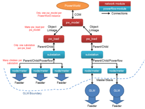

# Spec:Transmission

**Source URL:** https://gridlab-d.shoutwiki.com/wiki/Spec:Transmission
## Contents

  * 1 Module Overview
    * 1.1 Operation Sequence
      * 1.1.1 Init
      * 1.1.2 Precommit
      * 1.1.3 Presync
      * 1.1.4 Sync
      * 1.1.5 Postsync
      * 1.1.6 Commit
      * 1.1.7 Finalize
  * 2 Inputs and Outputs
    * 2.1 GridLAB-D
      * 2.1.1 pw_model class
      * 2.1.2 pw_load class
      * 2.1.3 Substation Property Hooks
      * 2.1.4 pw_recorder class
    * 2.2 PowerWorld Interface
      * 2.2.1 COM Interface
  * 3 Testing
    * 3.1 Unit Tests
  * 4 Future Functionality
    * 4.1 Networked Gobo
    * 4.2 See also
# Module Overview

The network module shall include three classes: pw_model, pw_load, and pw_recorder. These are all base GridLAB-D and C++ classes, without any additional inheritance. 

The pw_model shall specify which model file to use for the simulation. At init time, the pw_model shall connect to PowerWorld, load the model, and cross-populate values between GridLAB-D and PowerWorld. The pw_load objects store mirror copies of the data in specified PowerWorld loads, and voltage information on the bus objects those loads connect to within PowerWorld. The load information is copied from GridLAB-D to PowerWorld as GridLAB-D iterates. Once the model is in sync, the pw_model object shall trigger PowerWorld to recalculate each time the GridLAB-D inputs vary by more than a certain threshold from PowerWorld's power load values. 

As the pw_model signals that objects have requested an update, the pw_recorder object shall observe and recorder the state of the network module. 

When GridLAB-D stops and exits, the pw_model shall close the PowerWorld model. 

Figure 1. Basic structure of PowerWorld/GridLAB-D Interactions

A basic structure for the interactions of the network `pw_` objects, PowerWorld, and the [powerflow] module are shown in Figure 1. 

## Operation Sequence

The following describes the order in which operations are to occur for the network module's objects as GridLAB-D loads, runs, and stops gracefully. 

### Init

The pw_model object checks its inputs, then connects to the specified PowerWorld model via SIMAuto or an appropriate proxy connector. The pw_load and pw_recorder objects defer initialization until after the pw_model. Once the pw_model is initialized, the pw_load and pw_recorder objects check the inputs. The pw_model additionally verifies that the PowerWorld model contains the load objects as specified in the GLM file, and the pw_recorder attempts to open an output file, and to connect to the object specified in the GLM. 

### Precommit

No actions occur during precommit. 

### Presync

The first action of each pass is to check if the PowerWorld model is within convergence limits. If the pw_model has flagged the transmission solver needs to run, it will send a message to PowerWorld to run the 'Run Simulation' script. 

If the pw_model is in a valid state, or if the pw_load object have not yet read a voltage, the voltage values are retrieved by the individual pw_load objects in presync. These voltage values are then read by any connected substation object, and converted into a form that is usable to the powerflow module. Details of the substation update timing are given below. 

### Sync

At the end of sync, powerflow will have accumulated the power load values up to the top of the system. The substation object will pass the load values up to the pw_load object before the pw_load object syncs. Details for the condition of the substation update to pw_load are noted below. If a given pw_load's power load changes between iterations by more than a certain threshold, it shall set a flag in pw_model that indicates the transmission solver solution needs to be updated. 

### Postsync

Each pw_load shall check its pw_model object has been flagged to recalculate the transmission solver. If it has, each pw_load shall post its load to PowerWorld via the SIMAuto module, or through a proxy connector. 

### Commit

Any active pw_recorder objects shall check if the write timer has ticked, and will write values to an output stream accordingly. 

### Finalize

The pw_model closes the PowerWorld model, and severs the connection to SIMAuto or the proxy connector. Any open pw_recorder files write a footer, flush pending write operations, and close the file. 

# Inputs and Outputs

## GridLAB-D

### pw_model class

The pw_model class opens a model, provides a mechanism for triggering a PowerWorld recalculation, and cleans the system up at the end of the simulation. 

Input Name  | Quantity type  | Description   
---|---|---  
model_name  | string  | The file path for the PowerWorld model to run. If the path is blank, or the file cannot be opened by PowerWorld, the run will stop.   
update_flag  | bool  | A flag set by the pw_load objects that are attached to the specific pw_model, and reset by the model when it calls for a PowerWorld update.   
valid_flag  | bool  | A flag set by the pw_model if the underlying PowerWorld model is in an unsolvable state. Should this flag be set, the GridLAB-D powerflow solution will use the last good voltage value and will abort should GridLAB-D converge while PowerWorld remains divergent.   
load_list_file  | string  | The optional file path to use for writing a list of loads in the PowerWorld model. The file will contain rows of comma-separated values with the BusNum and LoadID of each load object in PowerFlow. If this file name is present, the pw_model will write the load list file, then abort processing, on the assumption that the file is not used during production runs. The file will be generated using a 'list of devices' function that looks for 'Load' objects.   
  
  
Published Outputs: 

Output Name  | Quantity type  | Description   
---|---|---  
exchange_count  | int32  | The number of times PowerWorld and GridLAB-D have exchanged voltage and load information.   
  
### pw_load class

The pw_load class sits between GridLAB-D powerflow objects and PowerWorld objects, passing voltage information down from PowerWorld to the associated GridLAB-D substation, and passing power load information up to PowerWorld. It is not to perform any calculation, instead only acting as a mirror for the load object within PowerWorld. Any conversions of the voltage information, such as between three-phase and positive sequence, are to be performed in the GridLAB-D substation object. 

The GridLAB-D model must only have one substation attached to the pw_load object, or the model may not run correctly. 

The pw_load class shall defer its initialization until after its pw_model has initialized. 

The bus and load IDs specified in the GridLAB-D object must exist in PowerWorld, or the model will fail to initialize. 

Published Inputs: 

Input Name  | Quantity type  | Description   
---|---|---  
model  | pw_model object  | The model that the associated PowerWorld object can be found in. If the model object does not exist, this object cannot run. The pw_model shall not be located implicitly.   
powerworld_bus_num  | int  | The bus number within PowerWorld associated with the Bus object to read voltages from in PowerWorld. A bus must be associated with that number, or this object cannot run.   
powerworld_load_id  | string  | The ID within PowerWorld of the load to post current loads to. A load must be associated with the ID, and be attached to the bus numbered in powerworld_bus_num, or this object cannot run.   
power_threshold  | double MVA  | The magnitude of power change that the pw_load object will tolerate before signaling an intent to post its new current load to the PowerWorld model. An aggregation of the magnitude difference for each ZIP faction will be compared against this value to determine if a reiteration is necessary.   
load_power  | complex MegaVolt-Amperes  | The power load as dictated by the substation underneath the pw_load.   
load_impedance  | complex MegaVolt-Amperes  | The impedance load as dictated by the substation underneath the pw_load.   
load_current  | complex MegaVolt-Amperes  | The constant current load as dictated by the substation underneath the pw_load.   
  
The published voltage outputs are read by the substation object that uses the pw_load as a parent. 

Published Outputs: 

Output Name  | Quantity type  | Description   
---|---|---  
load_voltage  | complex Volts  | The voltage as dictated by the PowerWorld bus in the model.   
  
### Substation Property Hooks

The substation object in the GridLAB-D powerflow module will perform two objectives. The substation will read the load_voltage property from the pw_load parent, if present, and convert this positive sequence value to a three-phase balanced voltage matrix to act as the swing bus voltages for the powerflow solution. The substation will take the three phase unbalanced power solution seen at the substation node, calculate the average power on the phases, and write this the average to the load_power property in the pw_load parent, if present. The substation node will also convert three-phase unbalanced load contributions, explicitly set at the substation, to the format pw_load expects (e.g., not the feeder's load, but additional components specified directly at the substation). In addition, there will be a property that allows the user to specify which phase at the substation is the reference phase for the GridLAB-D powerflow solution. The substation object will be updated to keep track of the three phase power solution. 

The substation will keep all of it's previous functionality and properties with the exception of the hooks to the old network module. Substation will continue to be a child class of the [node] object inside the [powerflow] module. Listed below are the additional properties that will interact with the pw_load object. 

Timing: 

Substation will extract the positive sequence value from its pw_load connection (load_voltage) in the presync pass. If the solver is Newton-Raphson (NR), this will occur only when the `NR_cycle` is false. Forward-Back Sweep (FBS) will extract this value at the beginning of every presync pass. Since the substation should be higher ranked than the "SWING" node of the powerflow (or equivalent top node in FBS), current and power values can be available at the end of the sync pass. However, to maintain compatibility with current powerflow implementations, the values will only be posted to pw_load on the `NR_cycle` true pass. This will be true for both the FBS and the NR solvers. In addition, the NR solver should only post changes when the `NR_admit_change` is false (under current functionality). With the FBS solver, only the `NR_cycle` flag must be considered. 

Equations: 

Substation will use the following equation to convert the positive sequence value from its pw_load connection (load_voltage) to the three phase balanced voltages used as the swing bus voltage solution. 

$$\begin{bmatrix} \displaystyle V_{A}\\\ & \\\ \displaystyle V_{B}\\\ & \\\ \displaystyle V_{C} \end{bmatrix} = \begin{bmatrix} \displaystyle 1 & \displaystyle 1 & \displaystyle 1 \\\ & \\\ \displaystyle 1 & \displaystyle a^2 & \displaystyle a \\\ & \\\ \displaystyle 1 & \displaystyle a & \displaystyle a^2 \end{bmatrix}*\begin{bmatrix} \displaystyle 0\\\ & \\\ \displaystyle V_{positive sequence}\\\ & \\\ \displaystyle 0 \end{bmatrix}*b $. 

Where $b$ is conditional upon which phase is chosen as the reference phase, $a$ is the complex number $1\angle120^\circ$, and all other variables are complex. The values of $b$ for each of the possible reference phases are shown below. 

Reference Phase  | b   
---|---  
Phase A  | 1   
Phase B  | $a$  
Phase C  | $a^2$  
  
The average phase load is determined by the below equation. All variables are complex values not the real power loads. 

$$P_{load} = \frac{P_{A}+P_{B}+P_{C}}{3}$$

Published Inputs: 

Input Name  | Quantity type  | Description   
---|---|---  
positive_sequence_voltage  | complex Volts  | The positive sequence voltage given from the PowerWorld bus model.   
reference_phase  | enumeration  | The phase that will be used as the reference angle for the powerflow solution. 

  * PHASE_A(Default)
  * PHASE_B
  * PHASE_C

  
transmission_level_constant_power_load  | complex Volt-Amperes  | the positive-sequence constant power load to be posted directly to the pw_load object ([powerflow] solver does not handle this, it is explicitly converted and posted to PowerWorld's solver).   
transmission_level_constant_impedance_load  | complex Ohms  | the positive-sequence constant impedance load to be posted directly to the pw_load object ([powerflow] solver does not handle this, it is explicitly converted and posted to PowerWorld's solver).   
transmission_level_constant_current_load  | complex Amperes  | the positive-sequence constant current load to be posted directly to the pw_load object ([powerflow] solver does not handle this, it is explicitly converted and posted to PowerWorld's solver).   
  
Published Outputs: 

Output Name  | Quantity type  | Description   
---|---|---  
average_distribution_load  | complex Volt-Amperes  | The average of the loads on all three phases at the substation object.   
distribution_power_A  | complex Volt-Amperes  | The measured power of the attached powerflow on phase A.   
distribution_power_B  | complex Volt-Amperes  | The measured power of the attached powerflow on phase B.   
distribution_power_C  | complex Volt-Amperes  | The measured power of the attached powerflow on phase C.   
  
Please note that the transmission current and impedance loads will be converted to complex power values first and then posted to the proper properties(load_current and load_impedance) in the pw_load object. The average_transmission_power_load value must be added to the average_distribution_load before posting to pw_load(load_power). 

Substation's three phase voltages are determined differently dependent upon three scenarios. If there is a pw_load object attached to the substation object, then the three phase voltages are determined by the sequence voltage value read from the pw_load object. The three phase voltages are determined by the positive_sequence_voltage property if there is a player object populating that property in the absence of a pw_load object. In the absence of a player object and a pw_load object, the three phase voltages are determined by user input or the substation object's powerflow parent just like any node object. If there is no pw_load connected to the substation then the substation doesn't post the average_distribution_load, average_transmission_current_load, average_transmission_impedance_load, and average_transmission_power_load properties. 

### pw_recorder class

The pw_recorder accesses and records published values from specified fields in one specified PowerWorld object. Data is read from PowerWorld whenever the model updates. Data is written only to an output file, and writes occur on specified intervals. 

Input Name  | Quantity type  | Description   
---|---|---  
model  | pw_model object  | The PowerWorld model object to monitor. If no model is specified, the pw_recorder will check if there's only one pw_model, and will use it as the implicit model. If a specific model is not selected by sync time, the pw_recorder will remain inactive.   
outfile_name  | string  | The file path to use for the output file. If blank, a name will be automatically generated from the pw_recorder's model and GridLAB-D ID number.   
obj_class  | string  | The name of the class of the object that will be recorded.   
key_strings  | string  | A comma-delimited list of key fields required to identify the PowerWorld target object.   
key_values  | string  | A comma-delimited list of key field values that uniquely identify the PowerWorld target object.   
properties  | string  | A comma-delimited list of fields to record from the target object.   
interval  | integer  | The number of seconds to wait between writing lines to the recorder.   
limit  | integer  | The maximum number of lines to write to a file.   
  
The pw_recorder will defer initialization until after the specified pw_model object has initialized. The pw_recorder's initialization includes verifying that an object of the specified type with the given key fields exists, and that the specified properties can be read from that object. If the pw_recorder cannot find and read data from the target object, the pw_recorder will set an error state and will put itself out of service. 

During commit, the pw_recorder writes a line into a file on fixed intervals. This line will include the values observed from the specified object, from the properties enumerated in the "properties" field. When a number of lines have been written to the file equal to the "limit" field, the output file will close and the pw_recorder will go out of service. If limit is 1, the only output will be at the beginning of the simulation. If the limit is less than 1, there will be no limit to the number of lines written. 

## PowerWorld Interface

### COM Interface

The primary method for GridLAB-D to communicate with PowerWorld shall be through the PowerWorld SIMAuto COM interface, making direct C/C++ function calls. The SIMAuto interface is described in the PowerWorld online help files. 

  

# Testing

## Unit Tests

The basic unit tests will include, in order: 

  * opening and closing a PowerWorld model via SimAuto
  * connecting GridLAB-D pw_load objects to the corresponding targets in a PowerWorld model
  * exchanging values between pw_load and PowerWorld bus/node objects
  * updating the PowerWorld powerflow solution via SimAuto
# Future Functionality

## Networked Gobo

A proposed idea is to use a lightweight client (a "go-between") that exchanges data and commands with GridLAB-D over a network interface, converting the messages for use in PowerWorld. This would allow GridLAB-D to run on a Linux computer while using the network module. 

## See also

  * [Requirements]
  * Specifications
  * [Implementation]
  * [User's manual]
  * [Navajo (trunk)]
