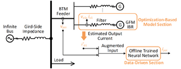

# Spec:ibr grayboxmodels

**Source URL:** https://gridlab-d.shoutwiki.com/wiki/Spec:ibr_grayboxmodels
## Contents

  * 1 Overview
  * 2 Background
  * 3 Gray-Box Modeling
    * 3.1 Introduction
    * 3.2 Gray-Box Modeling Algorithm
    * 3.3 GridLAB-D Model Example
  * 4 Optimization-Based Model Section
    * 4.1 Droop Control
    * 4.2 Definition of Parameters
  * 5 Data-Driven Section
    * 5.1 Normalization and Reverse Normalization for the Neural Network
    * 5.2 Neural Network
    * 5.3 Parameters
  * 6 References
  * 7 See also
## Overview

As part of the DistribuDyn project funded by the U.S. Department of Energy Solar Energy Technology Office (SETO), advanced inverter-based-resource models were created to represent devices being deployed on the modern power system. The model in [inverter_dyn] represents a generalized inverter. This page represents graybox models generalized from hardware tests and measurements of commercial hardware. The ``ibr_graybox`` model is produced by Purdue University as part of the DistribuDyn. project. 

## Background

In real-world scenarios, the full-spectrum dynamics of distribution systems with inverter-based resources (IBRs) are often too complex or inaccessible to model accurately using traditional white-box approaches. At the same time, the intricate input-output relationships can render black-box models either computationally intensive or insufficiently accurate. These challenges motivate the development of hybrid modeling strategies that combine physics-based and data-driven techniques. Inspired by physics-informed machine learning, we propose a gray-box modeling framework for distribution systems with IBRs to enhance estimation accuracy. This gray-box modeling framework leverages the strengths of both white-box and black-box approaches: physics-based white-box models provide structural insight and guide the learning process, while black-box models compensate for unmodeled dynamics, resulting in improved overall performance. 

## Gray-Box Modeling

### Introduction

Figure 1 shows the structure of the IBR gray-box model. It is used to represent the behind-the-meter (BTM) dynamics, and it consists of two sections: an optimization-based model and a data-driven section. The optimization-based model section is used to estimate the parameters for a given control IBR control structure and generate the estimated output of a selected IBR. The estimated output current from the first section and the voltage at the point of the interconnection (POI) serve as an augmented input for the data-driven section, which includes an offline-trained neural network. Finally, the gray-box model of the IBR is represented as a Norton equivalent circuit, with the current output from the data-driven section fed back into the external power network. 

Figure 1. The structure of the IBR gray-box model

### Gray-Box Modeling Algorithm

The framework of the gray-box modeling algorithm is implemented as 

  * Collect the input and output data for the distribution system with IBRs and divide them into a training dataset and a validation dataset
  * Complement prior knowledge with equivalence network model
  * Determine mathematical equations with unknown parameters for the white-box model
  * Estimate parameters in the optimization-based model using the training dataset
  * Embed the output of the optimization-based model as an additional input of the data-driven model (represented using a neural network) and train the neural network with the training dataset
  * Test performance of the gray-box model using the validation dataset
### GridLAB-D Model Example

Below is an example for a graybox IBR model in GridLAB-D
    
    
    object ibr_graybox {
    	name GrayIBR;
    	parent Node2;
    	flags DELTAMODE;
    	rated_power 100 kVA;
    	P_set 0.133333333333333;
    	Q_set 0.066666666666667;
    	m_p 0.0501;
    	n_q 0.0501;
    	object recorder {
    		property phaseA_I_Out.real,phaseA_I_Out.imag,phaseB_I_Out.real,phaseB_I_Out.imag,phaseC_I_Out.real,phaseC_I_Out.imag,VA_Out.real,VA_Out.imag;
    		flags DELTAMODE;
    		file IBR.csv;
    	};
    	object recorder {
    		property "P_out_pu,P_out_pu_Filtered,Q_out_pu,Q_out_pu_Filtered";
    		flags DELTAMODE;
    		file IBR_PQ.csv;
    	};
    };
    

## Optimization-Based Model Section

### Droop Control

The droop control is implemented for the optimization-based model section. The droop gains are selected as the unknown parameters. Furthermore, the values of the droop gains are estimated by using an optimization algorithm to minimize the error between the training data and the estimated data. The corresponding values will be updated in the GridLAB-D model file. 

### Definition of Parameters

Parameter | Defintion   
---|---  
value_Circuit_V | Voltage at the point of interconnection   
power_val | Apparent power of the IBR in phase a, b, and c   
VA_Out | Total apparent power of the IBR   
P_out_pu | IBR output active power   
Q_out_pu | IBR output reactive power   
P_out_pu_Filtered | IBR output active power after the low-pass filter   
Q_out_pu_Filtered | IBR output reactive power after the low-pass filter   
m_p | Droop gain in the frequency droop control   
n_q | Droop gain in the voltage droop control   
P_set | Active power setpoint   
Q_set | Reactive power setpoint   
delta_w | Frequency deviation due to the frequency droop control   
dV_ref | Voltage deviation due to the voltage droop control   
Angle | Phase angle of the IBR voltage   
Vs | Magnitude of the IBR voltage   
value_IGenerated_Nortan | Equivalent current of the current source in the Norton equivalent circuit   
physical_output | Output current from the optimization-based model section   
  
## Data-Driven Section

### Normalization and Reverse Normalization for the Neural Network

The input data should be normalized before being sent to the neural network’s input layer. The following formula is used for normalization: 

$$\displaystyle{}y=2\dfrac{x-x_{min}}{x_{max}-x_{min}}-1$$

where x represents the input before normalization, and y represents the normalized input used in the neural network’s input layer. 

Similarly, a reverse normalization is required before the neural network process is complete. The conversion is shown below: 

$$\displaystyle{}x^{'}=\dfrac{y^{'}+1}{2}(x_{max}^{'}-x_{min}^{'})+x_{min}^{'}$$

where x’ is the value after the reverse normalization, and y’ is the normalized output from the neural network’s output layer. 

### Neural Network

The neural network is trained offline, after which the weight and bias matrices are extracted and incorporated into the gray-box model. Furthermore, the neural network process is converted into C++ code. An example of a neural network with two neurons and one hidden layer is shown below:
    
    
    double w1[2][4] = {{0.000133,-0.000040,0.080195,0.059271},{-0.000643,-0.000111,-0.101510,0.002551}};
    double w2[2][2] = {{0.366041,-9.635184},{16.403933,13.011528}};
    double b1[2][1] = {{0.025082},{-0.000051}};
    double b2[2][1] = {{-0.007582},{-0.411838}};
    // From input layer to hidden layer 1
    for (i = 0; i < 2; i++) {
    	for (j = 0; j < 3; j++) {
    		for (k = 0; k < 4; k++) {
    			z11[i][j] += w1[i][k] * u[k][j];
    		}
    	}
    }
    for (i = 0; i < 2; i++) {
    	for (j = 0; j < 3; j++) {
    		z1[i][j]=z11[i][j]+b1[i][0];
    	}
    }
    for (i = 0; i < 2; i++) {
    	for (j = 0; j < 3; j++) {
    		z1[i][j]= tanh(z1[i][j]);
    	}
    }
    // From hidden layer 1 to output layer
    for (i = 0; i < 2; i++) {
    	for (j = 0; j < 3; j++) {
    		for (k = 0; k < 2; k++) {
    			z21[i][j] += w2[i][k] * z1[k][j];
    		}
    	}
    }
    for (i = 0; i < 2; i++) {
    	for (j = 0; j < 3; j++) {
    		z2[i][j]=z21[i][j]+b2[i][0];
    	}
    }
    

  

### Parameters

Parameter | Definition   
---|---  
u | Normalized input for the neural network   
w1 | Weight matrix between the input layer and hidden layer   
w2 | Weight matrix between the hidden layer and output layer   
b1 | Bias matrix between the input layer and hidden layer   
b2 | Bias matrix between the hidden layer and output layer   
z1 | Input matrix of the hidden layer   
z2 | Output of the output layer   
yout | Output after the reverse normalization   
v_A_mag_max | Maximum magnitude of phase A voltage   
v_A_arg_max | Maximum phase angle of phase A voltage   
v_A_mag_min | Minimum magnitude of phase A voltage   
v_A_arg_min | Minimum phase angle of phase A voltage   
physical_output_i_A_mag_max | Maximum magnitude of phase A current from the optimization-based model section   
physical_output_i_A_arg_max | Maximum phase angle of phase A current from the optimization-based model section   
physical_output_i_A_mag_min | Minimum magnitude of phase A current from the optimization-based model section   
physical_output_i_A_arg_min | Minimum phase angle of phase A current from the optimization-based model section   
y_i_A_mag_max | Maximum magnitude of phase A output gray-box current   
y_i_A_arg_max | Maximum phase angle of phase A output gray-box current   
y_i_A_mag_min | Minimum magnitude of phase A output gray-box current   
y_i_A_arg_min | Minimum phase angle of phase A output gray-box current   
physical_output_i_A_mag | Magnitude of phase A current from the optimization-based model section   
physical_output_i_A_arg | Phase angle of phase A current from the optimization-based model section   
physical_output_i_B_mag | Magnitude of phase B current from the optimization-based model section   
physical_output_i_B_arg | Phase angle of phase B current from the optimization-based model section   
physical_output_i_C_mag | Magnitude of phase C current from the optimization-based model section   
physical_output_i_C_arg | Phase angle of phase C current from the optimization-based model section   
  
## References

  1. [J. Zhang, Y. Men, L. Ding, X. Lu and W. Du, "Gray-Box Modeling for Distribution Systems With Inverter-Based Resources: Integrating Physics-Based and Data-Driven Approaches," in IEEE Transactions on Industry Applications, vol. 60, no. 4, pp. 5490-5498, July-Aug. 2024.](https://ieeexplore.ieee.org/document/10507020)
  2. [J. Zhang, Y. Men, L. Ding, X. Lu and W. Du, "Gray-Box Modeling for Distribution Systems with Inverter-Based Resources," 2023 IEEE Energy Conversion Congress and Exposition (ECCE), Nashville, TN, USA, 2023, pp. 3124-3130.](https://ieeexplore.ieee.org/abstract/document/10362847)
## See also

  * [Inverter_dyn Main Page]
  * [Inverter_dyn Requirements]
  * [Inverter_dyn Specifications]

