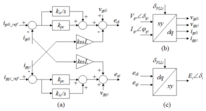

# Spec:inverter dyn

**Source URL:** https://gridlab-d.shoutwiki.com/wiki/Spec:inverter_dyn
## Contents

  * 1 Overview
  * 2 Grid-Forming Inverter
    * 2.1 Equivalent Circuit of a Grid-Forming Inverter and Its Interface to the Network
    * 2.2 CERTS Droop Control
    * 2.3 Transition between Quasi-Steady State Time Series Simulation and Delta Mode Simulation
      * 2.3.1 Transition from QSTS to delta mode
      * 2.3.2 Transition from delta mode to QSTS
    * 2.4 Initialization
    * 2.5 Definition of Parameters
    * 2.6 GridLAB-D Model Example
  * 3 Grid-Following Inverter
    * 3.1 Equivalent Circuit of a Detailed Grid-Following Inverter
    * 3.2 Detailed Grid-Following Controller
    * 3.3 Transition between QSTS and Delta Mode Simulation
      * 3.3.1 Transition from QSSTS to deltamode
      * 3.3.2 Transition from deltamode to QSTS
    * 3.4 Initialization
      * 3.4.1 deltamode start
      * 3.4.2 QSTS start
    * 3.5 External Controls
    * 3.6 Definition of Parameters
    * 3.7 GridLAB-D Model Example
  * 4 Current Source Representation of Grid-Following Inverter
    * 4.1 Current Source Representation of Grid-Following
    * 4.2 Simplification of Grid-Following Controller
    * 4.3 GridLAB-D Example Model
  * 5 Grid-Forming with Updated DC Bus Model
    * 5.1 PV Inverter Interface Modeling
    * 5.2 Controller Modelling
    * 5.3 GridLAB-D Example Model
  * 6 Virtual Synchronous Machine (VSM) Control Model
    * 6.1 Virtual Synchronous Machine Mode
    * 6.2 GridLAB-D Model Example
  * 7 References
  * 8 See also
## Overview

These represent the specifications and some examples for the [inverter_dyn] object, which is to represent grid-forming and grid-following inverters. 

## Grid-Forming Inverter

### Equivalent Circuit of a Grid-Forming Inverter and Its Interface to the Network

The equivalent circuits of three-phased and single-phased grid-forming inverters are shown in Figure 1 (a) and (b). The grid-forming controller can be a CERTS droop controller or isochronous controller[1]. When implemented in GridLAB-D, these voltage sources behind coupling reactance are converted to the Norton equivalent circuits for power flow calculation. The following assumptions are made when implementing the grid-forming inverters: 

  * When the inverter is three-phased, the internal voltages should be three-phase balanced.
  * The dynamics of the dc bus voltage of inverters are not considered. The dc bus voltage is assumed to be constant during any load changes. In future work the dynamics of the dc side such as the PV panels, energy storage, and dc capacitors will be studied. The internal voltage E will be decided by both the Q-V droop control and the dc bus voltage.

Figure 1 - Grid-Forming Inverter model and the interface to the distribution system. (a) Three-phase (b) Single-phase

### CERTS Droop Control

Figure 2 shows the Q-V droop control, Figure 3 shows the P-f droop control and overload mitigation control. When $m_q$ and $m_p$ are set zero, the CERTS droop control becomes isochronous control. 

Figure 2 - Q-V Droop Control

Figure 3 - P-f Droop Control and Overload Mitigation Control

If the inverter is three-phased, the active power, reactive power, and voltage magnitude can be calculated according to (1) to (3). The phase angles of the internal three-phase voltages can be obtained from (4) to (6), where $\delta_{0i}$ ($i=a,b,c$) is the initial phase angle obtained from power flow calculation. It should be noted that the internal voltages are always three-phase balanced. 

$$\displaystyle{}P_{INV}=\frac{1}{1+T_{s}}\frac{\left(P_a+P_b+P_c\right)}{S_B}\tag{1}$$    
---|---  
$$\displaystyle{}Q_{INV}=\frac{1}{1+T_s}\frac{\left(Q_a+Q_b+Q_c\right)}{S_B}\tag{2}$$ 

$$\displaystyle{}V_{INV}=\frac{1}{3\left(1+T_s\right)}\frac{\left(V_{ga}+V_{gb}+V_{gc}\right)}{V_B}\tag{3}$$ 

$$\displaystyle{}\delta_a=\delta{}+\delta_{0a}\tag{4}$$ 

$$\displaystyle{}\delta_b=\delta{}+\delta_{0b}\tag{5}$$ 

$$\displaystyle{}\delta_c=\delta{}+\delta_{0c}\tag{6}$$    
  
If the inverter is single-phased, the active power, reactive power, and voltage magnitude can be calculated according to (7) to (9). 

$$\displaystyle{}P_{INV}=\frac{\frac{P_i}{1+T_s}}{S_B}\tag{7}$$ 
---|---  
$$\displaystyle{}Q_{INV}=\frac{\frac{Q_i}{1+T_s}}{S_B}\tag{8}$$ 

$$\displaystyle{}V_{INV}=\frac{\frac{V_{gi}}{1+T_s}}{S_B}\tag{9}$$ 
  
### Transition between Quasi-Steady State Time Series Simulation and Delta Mode Simulation

#### Transition from QSTS to delta mode

  * Calculate present output power/current at the terminals.
  * Adjust current for any Norton-equivalence issues
  * Update internal voltage by using terminal voltages and current flows
  * Populate appropriate “final value” state variables from the terminal and internal voltages (e.g., dq transitions)
  * Back-populate any intermediate state variables (reference angle, current frequency, etc.)
  * No iterations should be required, since it should start at a “last know good state”
#### Transition from delta mode to QSTS

  * No updates on the transition, but updates to maintain voltage and/or power output (power may be tied to voltage) should be formulated. This may be as simple as updating the internal voltage source, so long as any inverter limits are not exceeded.
### Initialization

  * Start power flow iterations with connected bus as SWING bus – let powerflow stabilize a few iterations with this “infinite source”
  * While under SWING conditions, use the terminal voltage and computed power output to populate state variables with final values
  * While under SWING conditions, back-calculate any intermediate states (reference angle, current frequency, etc.)
  * While under SWING conditions, update on each powerflow solution, potentially through a direct call.
  * Once powerflow stabilizes, release the SWING constraints and convert the bus to a normal PQ
  * After SWING release, iterate through predictor/corrector differential equations with the powerflow until things stabilize (or limit reached).
  * If starting in QSTS mode, the “deltamode to QSTS start” transition steps probably need to occur.
### Definition of Parameters

$\displaystyle{}S_B$ | The rated capacity of inverter. If the inverter is three-phased, $S_B$ refers to the summation of rated power of three phases. If the inverter is single-phased, $S_B$ refers to the rated power of one phase.   
---|---  
$\displaystyle{}V_B$ | The rated line to ground RMS voltage of an inverter.   
$\displaystyle{}X_L$ | The coupling reactance. The per unit value of $X_L$ usually belongs to 0.05 pu to 0.2 pu.   
$\displaystyle{}\delta_i$ ($i=a,b,c$) | The phase angle of internal voltage for each phase. The phase angle is obtained from the P-f droop control.   
$\displaystyle{}\delta_{0i}$ ($i=a,b,c$) | The initial values of phase angle of internal voltage for each phase.   
$\displaystyle{}I_{0i}$ ($i=a,b,c$) | The magnitude of current that the inverter injects to the grid.   
$\displaystyle{}\psi_{0i}$ ($i=a,b,c$) | The phase angle of current that hte inverter injects to the grid.   
$\displaystyle{}P_{INV}$ | The real power injected by the inverter to the grid. $P_{INV}$ is per-unit value, which base quantity is the NAMEPLATE rated capacity of inverter, $S_B$.   
$\displaystyle{}Q_{INV}$ | The reactive power injected by the inverter to the grid. $Q_{INV}$ is per-unit value, which base quantity is the NAMEPLATE rated capacity of inverter, $S_B$.   
$\displaystyle{}V_{INV}$ | The output voltage of the inverter. $V_{INV}$ is per-unit value, which base quantity is the NAMEPLATE rated voltage of inverter, $V_B$.   
$\displaystyle{}E$ | The internal voltage of inverter. $E$ is per-unit value, which base quantity is the NAMEPLATE rated voltage of inverter, $V_B$.   
$\displaystyle{}E_{0i}$ ($i=a,b,c$) | The initial value of the magnitude of the internal voltage, which base quantity is the NAMEPLATE rated voltage of inverter, $V_B$.   
$\displaystyle{}E_{max}$ | The upper limit of the internal voltage.   
$\displaystyle{}E_{min}$ | The lower limit of the internal voltage.   
$\displaystyle{}\omega{}$ | The output angular frequency of inverter, which unit is rad/s.   
$\displaystyle{}T_s$ | The time constant of low-pass filter.   
$\displaystyle{}m_q$ | The Q-V droop coefficient. The slope is usually set as 0.05pu.   
$\displaystyle{}V_{set}$ | The voltage set point. $V_{set}$ is usually set as 1 pu.   
$\displaystyle{}k_{pv}$ | The proportional gain of voltage control loop. $k_{pv}$ is usually set as 0 pu.   
$\displaystyle{}k_{iv}$ | The integral gain of voltage control loop. $k_{iv}$ is usually set as 5.86 pu/s.   
$\displaystyle{}m_p$ | The P-f droop coefficient. The slope is usually set as 3.77 rad/s, which means the frequency drops 1% as the real power spans from 0 pu to 1 pu.   
$\displaystyle{}k_{ppmax}$ | The proportional gain for $P_{max}$ and $P_{min}$ controller. $k_{ppmax}$ is usually set as 3 rad/s.   
$\displaystyle{}k_{ipmax}$ | The integral gain of $P_{max}$ and $P_{min}$ controller. $k_{ipmax}$ is usually set as 30 rad/s2. It should be noted that the **anti-wind-up integrator** should be used for $P_{max}$ and $P_{min}$ controller. For $P_{max}$ controller, there is a 0 upper limiter. For $P_{min}$ controller, there is a 0 lower limiter.   
$\displaystyle{}P_{set}$ | The power set point of the inverter. If we assume the inverter is a normal inverter without energy storage, the $P_{set}$ should be between 0 pu to 1 pu. If we assume the inverter is an energy storage, the $P_{set}$ should be between -1 pu to 1 pu.   
$\displaystyle{}P_{max}$ | The maximum power limit that the inverter is allowed to output.   
$\displaystyle{}P_{min}$ | The minimum power limit that the inverter is allowed to output.   
$\displaystyle{}\omega_{0}$ | The rated grid angular frequency, usually 376.99 rad/s.   
Table 1 - V-Q Droop Controller Parameters  $V_{set}$ [pu] | $m_q$ [pu] | $k_{pv}$ [pu] | $k_{iv}$ [pu/s]   
---|---|---|---  
1.0 | 0.05 | 0 | 5.86   
Table 2 - P-f Droop Controller Parameters  $m_p$ [rad/s] | $k_{ppmax}$ [rad/s] | $k_{ipmax}$ [rad/s] | $P_{set}$ [pu] | $P_{max}$ [pu] | $P_{min}$ [pu]   
---|---|---|---|---|---  
3.77 | 3.0 | 30.0 | Normal inverter: 1, Energy storage: -1 to 1 | 1.0 | Nomral inverter: 0, Energy storage: -1   
  
### GridLAB-D Model Example

This is an example that effectively has an infinite DC bus 
    
    
    object inverter_dyn {
    	name simple_DC_model_grid_forming_inverter;
    	parent grid_form_simple_DC;
    	rated_power 100 kW;	 // full rated power (not per-phase)
    	flags DELTAMODE;
    	control_mode GRID_FORMING;
    											//Criterion to exit deltamode
    	frequency_convergence_criterion 1e-9;  //Convergence criterion (rad/s)
    	voltage_convergence_criterion 1e-3;	   //Convergence criterion (V)
    
    				//Pref and Qref only initialize non-SWING-connected
    				//(if SWING, powerflow initializes)
    	Pref 1.0 kW;    //Real power reference for initialization
    	Qref 200 W;	    //Reactive power reference for initialization
    	
    	E_max 1.2;		//Maximum internal voltage output
    	Rfilter 0.005;  //Real portion of inverter filter (pu)
    	Xfilter 0.05;	//Reactive portion of inverter filter (pu)
    	mp 3.77;  		//P-f droop in rad/s/pu - 3.77 represents 1% droop
    	kppmax 3;		//Proportional gain for P_Max controller
    	kipmax 60;		//Integral gain fo P_Max controller
    	Pmax 1.5;		//Maximum power controller can deliver (pu)
    	Pmin 0;		//Minimum power controller can deliver (pu)
    	mq 0.05; 		//Q-V droop -  0.05 represents 5% droop
    }
    

## Grid-Following Inverter

For a practical grid-following inverter, it also uses a voltage source converter as the grid-forming inverter uses, the only difference is that the control strategy makes the voltage source converter behave as a current source. 

### Equivalent Circuit of a Detailed Grid-Following Inverter

Figure 4 (a) and (b) show the equivalent circuits of three-phased and single-phased grid-following inverters respectively. It can be seen that the main circuit of a grid-following inverter is fundamentally either a three-phased or single-phased voltage source. This is because the inverter itself is a voltage source converter. The grid-following controller makes the inverter behaves as a current source. When implemented in GridLAB-D, these voltage sources behind coupling reactance are converted to the Norton equivalent circuits for power flow calculation. The following assumptions are made when implementing grid-following inverter in GridLAB-D: 

  * For simplicity, the grid-following controller is modeled per phase. This means each phase has its own PLL and current control loop.
  * We assume each phase injects the same amount of P and Q into the grid.
  * For a split phase connection, we assume the inverter is connected between two phases, Phase 1 and Phase 2.

Figure 4 - Detailed model of a grid-following inverter and its interface to the distribution system. (a) Three-phase (b) Single-phase

### Detailed Grid-Following Controller

The grid-following controller includes two key components, the Phase-Lock-Loop (PLL) and the Current Control Loop. The PLL is used to estimate the phase angle $\angle{\delta_g}$ of the grid side voltage. With $\angle{\delta_g}$ obtained, the controller can inject the specified P and Q into the grid. The Current Control Loop quickly regulates the current $I_g\angle{\psi_g}$ injected into the grid, so the grid-following inverter can behave as a current source. 

For simplicity, the grid-following controller is modeled per phase. This means each phase has its own PLL and current control loop. We assume each phase injects the same amount of P into the grid. 

Figure 5 shows the control block of a PLL. For each phase, the grid side voltage $U_{gi}\angle{\delta_{gi}}$ ($i=a,b,c$) is transformed from $xy$ frame into $dq$ frame. The controllers tries to control $u_{gqi}=0$. The output $\angle{\delta_{PLLi}}$ should equal to the phase angle of the grid side voltage $\angle{\delta_{gi}}\left(\angle{\delta_{PLLi}}=\angle{\delta_{gi}}\right)$, and $f_{PLLi}$ should equal to the system frequency. 

Figure 5 - Control block of a PLL

Figure 6 and equations (10) to (13) show how the grid side voltage $U_{gi}\angle{\delta_{gi}}$ and current $I_{gi}\angle{\delta_{gi}}$ ($i=a,b,c$) are transformed from $xy$ frame into $dq$ frame individually. In steady state $u_{gqi}=0$. It should be noted that in equation (13) there is a negative sign in current calculation. This is because the phase angle of voltage is assumed to be lead the phase angle of current, so positive direction of $iq$ should be negative. 

Figure 6 - Coordinate Transformation: $ xy$ to $dq$

$$\displaystyle{}u_{gdi}=\frac{\left[\textrm{Re}\left(U_{gi}\angle{\delta_{gi}}\right)\cos{\delta_{PLLi}}+\textrm{Im}\left(U_{gi}\angle{\delta_{gi}}\right)\sin{\delta_{PLLi}}\right]}{U_B}\tag{10}$$  
---|---  
$$\displaystyle{}u_{gqi}=\frac{-\left[\textrm{Re}\left(U_{gi}\angle{\delta_{gi}}\right)\sin{\delta_{PLLi}}+\textrm{Im}\left(U_{gi}\angle{\delta_{gi}}\right)\cos{\delta_{PLLi}}\right]}{U_B}\tag{11}$$

$$\displaystyle{}i_{gdi}=\frac{\left[\textrm{Re}\left(I_{gi}\angle{\psi_{gi}}\right)\cos{\delta_{PLLi}}+\textrm{Im}\left(I_{gi}\angle{\psi_{gi}}\right)\sin{\delta_{PLLi}}\right]}{I_B}\tag{12}$$ 

$$\displaystyle{}i_{gqi}=\frac{-\left[\textrm{Re}\left(I_{gi}\angle{\psi_{gi}}\right)\sin{\delta_{PLLi}}+\textrm{Im}\left(I_{gi}\angle{\psi_{gi}}\right)\cos{\delta_{PLLi}}\right]}{I_B}\tag{13}$$ 

  
It should be noted that according to (11) we can also have (14). (14) helps to explain how the PLL controller works. In steady state, $\angle{\delta_{PLLi}}=\angle{\delta_{qi}}$. 

$$\displaystyle{}u_{gqi}=\sin{\delta_{gi}-\delta{PLLi}}\frac{U_{gi}}{U_B}\tag{14}$$   
---|---  
  
Figure 7 shows the current control loop. The outputs of the current control loop are the internal voltages $e_{di}$ and $e_{qi}$ for each phase. 

Figure 7 - Current Control Loop

Equation (15) and (16) show that how the current references $i_{gdi\_ref}$ and $i_{gqi\_ref}$ ($i=a,b,c$) are obtained according to the references $P_{refi}$ and $Q_{refi}$. $P_{refi}$ and $Q_{refi}$ are per unit values for each phase. 

$$\displaystyle{}i_{gdi\_ref}=\frac{P_{refi}}{u_{gdi}}\tag{115}$$   
---|---  
$$\displaystyle{}i_{gqi\_ref}=\frac{-Q_{refi}}{u_{gdi}}\tag{16}$$   
  
Figure 8, Equation (17) and (18) show how the internal voltages $e_{di}$ and $e_{qi}$ are transformed from $dq$ frame back into $xy$ frame. With $E_i\angle{\delta_i}$ obtained, power flow analysis can be conducted. $E_i\angle{\delta_i}$ should be converted to their Norton equivalence when conducting power flow analysis. 

Figure 8 - Coordinate Transformation: $ dq$ to $xy$

$$\displaystyle{}\textrm{Re}\left(E_i\angle{\delta_i}\right)=\left(e_{di}\cos{\delta_{PLLi}}-e_{qi}\sin{\delta_{PLLi}}\right)U_B\tag{17}$$  
---|---  
$$\displaystyle{}\textrm{Im}\left(E_i\angle{\delta_i}\right)=\left(e_{di}\sin{\delta_{PLLi}}+e_{qi}\cos{\delta_{PLLi}}\right)U_B\tag{18}$$   
  
### Transition between QSTS and Delta Mode Simulation

#### Transition from QSSTS to deltamode

  * Calculate present output power/current at the terminals
  * Adjust the terminal currents, if necessary, for Norton-equivalent impedance/admittance
  * Compute the internal voltage values
  * Force populate state variables with final values (PLL angle, PLL frequency)
  * Back-calculate any intermediate variables (frequency deviation, angle difference)
  * Should be starting from a “known good” state, so just proceed with differential equations.
#### Transition from deltamode to QSTS

  * Theoretically, nothing should need to be done (just keep using same terminal currents) – system should be in a “known good state”
### Initialization

#### deltamode start

  * Determine terminal currents based on ($P_{ref}$,$Q_{ref}$) and current terminal voltages
  * Adjust terminal currents, if necessary, for Norton-equivalent impedance/admittance
  * Use power/current and terminal voltage values to populate internal voltage source values
  * Compute $dq$ equivalents of voltages and currents
  * Force-populate the state variables with the final values
  * Back-calculate any intermediate states (frequency deviation, angle difference) from the "final states" obtained from the powerflow.
  * Update on each powerflow solution, potentially through a direct update call (to cut down on iterations).
#### QSTS start

  * Determine terminal currents based on ($P_{ref}$,$Q_{ref}$) and current terminal voltages
  * Adjust terminal currents, if necessary, for Norton-equivalent impedance/admittance
  * Update on each powerflow solution, potentially through a direct update call (to cut down iterations)
### External Controls

The external controls include frequency-watt control and volt-var control. These functions can be enabled or disabled. 

Figure 9 shows the control block of the frequency-watt control. It measures the variation of frequency and changes the reference of output power $P$. The frequency is measured by a PLL. 

Figure 9 - Frequency-watt control

Figure 10 shows the control block of the Volt-Var control. It measures the variation of voltage and changes the reference of reactive power $Q$. 

Figure 10 - Volt-Var control

### Definition of Parameters

$\displaystyle{}k_{pPLL}$ | The proportional gain of the PLL control block.   
---|---  
$\displaystyle{}k_{iPLL}$ | The integral gain of the PLL control block   
$\displaystyle{}k_{pc}$ | The proportional gain of the current control loop   
$\displaystyle{}k_{ic}$ | The integral gain of the current control loop   
$\displaystyle{}i_{gi}\left(i=a,b,c\right)$ | the magnitude of the grid side current that the inverter injects into the grid   
$\displaystyle{}\psi_{gi}\left(i=a,b,c\right)$ | the phase angle of the grid side current that the inverter injects into the grid   
$\displaystyle{}U_{gi}\left(i=a,b,c\right)$ | The magnitude of the grid side voltage   
$\displaystyle{}\delta_{gi}\left(i=a,b,c\right)$ | The phase angle of the grid side voltage   
$\displaystyle{}E_i\left(i=a,b,c\right)$ | The magnitude of the internal voltage   
$\displaystyle{}\delta_i\left(i=a,b,c\right)$ | The phase angle of the internal voltage   
$\displaystyle{}\delta_{PLLi}\left(i=a,b,c\right)$ | The phase angle measured by the PLL. It should equals to $\delta_{gi}$ in steady state if the PLL works well.   
$\displaystyle{}f_{PLLi}\left(i=a,b,c\right)$ | The frequency of each phase measured by the PLL   
$\displaystyle{}u_{gdi},u_{gqi}\left(i=a,b,c\right)$ | The grid side voltage in $dq$ frame for each phase   
$\displaystyle{}i_{gdi},i_{gqi}\left(i=a,b,c\right)$ | The grid side current in $dq$ frame for each phase   
$\displaystyle{}i_{gdi\_ref},u_{gqi\_ref}\left(i=a,b,c\right)$ | The grid side current references for each phase   
$\displaystyle{}e_{di},e_{qi}\left(i=a,b,c\right)$ | The internal voltages of an inverter in $dq$ frame   
$\displaystyle{}P_{refi},Q_{refi}\left(i=a,b,c\right)$ | The references of P and Q specified by the user. $P_{refi}$ and $Q_{refi}$ should be per unit values. $Q_{refi}$ usually is zero, if the volt-var control is enabled, $Q_{refi}$ is decided by the volt-var control. If frequency-watt control is enabled, $P_{refi}$ is decided by the frequency-watt control. $P_{refi}$ usually belongs to 0 pu to 1 pu. $Q_{refi}$ usually belongs to -1 pu to 1 pu.   
$\displaystyle{}P_{max},P_{min}$ | The maximum and minimum active power of an inverter.   
$\displaystyle{}Q_{max},Q_{min}$ | The maximum and minimum reactive power of an inverter.   
$\displaystyle{}P_{ref0}\left(i=a,b,c\right)$ | The active power set point in frequency-watt control. It usually belongs to 0 pu to 1 pu.   
$\displaystyle{}U_{0i}\left(i=a,b,c\right)$ | The voltage set point for each phase in volt-var control. The value is usually 1 pu.   
$\displaystyle{}T_1$ | Time constant of the low pass filter, usually 0.01 s.   
$\displaystyle{}S_B$ | The rated capacity of inverter. If the inverter is three-phased, $S_B$ refers to the summation of rated power of three phases. If the inverter is single-phased, $S_B$ refers to the rated power of one phase.   
$\displaystyle{}U_B$ | The rated line to ground RMS voltage of an inverter.   
$\displaystyle{}X_L$ | The coupling reactance. The per unit value of $X_L$ usually belongs to 0.05 pu to 0.2 pu.   
$\displaystyle{}\omega_0$ | The rated grid angular frequency, usually 376.99 rad/s.   
$\displaystyle{}m_p$ | The P-f droop coefficient. The slope is usually set as 3.77 rad/s, which means the frequency drops 1% as the real power spans from 0 pu to 1 pu.   
$\displaystyle{}m_q$ | The Q-V droop coefficient. The slope is usually set as 0.05pu.   
  
### GridLAB-D Model Example
    
    
    object inverter_dyn {
    	name Grid_Following_Inverter;
    	rated_power 100 kW;	 // full rated power (not per-phase)
    	flags DELTAMODE;
    	control_mode GRID_FOLLOWING;
    	//grid_following_mode BALANCED_POWER;  // Inject balanced power
    	grid_following_mode POSITIVE_SEQUENCE; // Inject balanced currents
    	frequency_watt true;
    	volt_var true;
    	Pref_max  1;     // Active power limit
    	Pref 100 kW;     // Active power reference
    	Qref 0.0 kvar;   // Reactive power reference
    	Rfilter 0.005;   // Real portion of inverter filter (pu)
    	Xfilter 0.05;	 // Reactive portion of inverter filter (pu)
    	kpPLL  50;       // Proportional gain of PLL
    	kiPLL  900;      // Integral gain of PLL
    	kpc  0.05;       // proportional gain of current loop
    	kic  5;          // Integral gain of current loop
    	F_current 0.5;   // Feedforward term
    
    	Rp 0.05;         // Frequency-watt droop 5%	
    	Tpf 0.25;        // Time constant for frequency-watt
    	Tff 0.02;        // Delay for frequency measurement in Frequency-watt
    	
    	Rq 0.05; 		 // Volt-var droop 5%
    	Tqf 0.2;         // Time constant for volt-var
    	Tvf 0.05;        // Delay for voltage measurement in volt-var
    
    }
    

## Current Source Representation of Grid-Following Inverter

In Grid-Following Inverter section above, the grid-following inverter is represented as a voltage source behind impedance, and the detailed inner current control loop is modeled. However, one drawback of this method is the low simulation efficiency. As the simulation step has to be set less than 2 ms, and sometimes there will be numerical stability issues. Therefore, in this section the grid-following inverter is modeled as a current source, and the detailed inner current control loop is ignored. Although the dynamic response of the current loop is ignored, the simulation efficiency can be improved. 

### Current Source Representation of Grid-Following

The voltage source representation (Figure 11) is changed to current source representation (Figure 12). It can be seen that the shunt admittance is ignored in the current source representation model. 

Figure 11 - Voltage source representation of a grid-following inverter. (a) Thevenin equivalent circuit and (b) Norton equivalent circuit.

Figure 12 - Current source representation of a grid-following inverter.

### Simplification of Grid-Following Controller

The detailed inner current loops are ignored. Instead, a first-order low-pass filter is used to represent the dynamic response of current loop. Figure 13 shows the standard modeling approach (detailed in the earlier grid-following description). Figure 14 shows the first-order low-pass filter approximation noted here. The PLL is still kept in the simplified model and is represented in Figure 15, which is identical to the earlier grid-following implementation mentioned. 

Figure 13 - Detailed control block of the current control loop: (a) current loop, (b) and (c) coordinate transformation.

Figure 14 - Simplified control block of the current control loop: (a) current loop, (b) and (c) coordinate transformation.

Figure 15 - Phase Lock Loop: (a) control block and (b) xy and dq frame coordinate systems.

### GridLAB-D Example Model

The following is a current-source representation of the grid-following inverter: 
    
    
    object inverter_dyn {
    	name Grid_Following_Inverter;
    	rated_power 100 kW;	 // full rated power (not per-phase)
    	flags DELTAMODE;
    	control_mode GFL_CURRENT_SOURCE;
    	//grid_following_mode BALANCED_POWER;  // Inject balanced power
    	grid_following_mode POSITIVE_SEQUENCE; // Inject balanced currents
    	frequency_watt true;
    	volt_var true;
    	Pref_max  1;     // Active power limit
    	Pref 100 kW;     // Active power reference
    	Qref 0.0 kvar;   // Reactive power reference
    	Rfilter 0.005;   // Real portion of inverter filter (pu)
    	Xfilter 0.05;	 // Reactive portion of inverter filter (pu)
    	kpPLL  50;       // Proportional gain of PLL
    	kiPLL  900;      // Integral gain of PLL
    	kpc  0.05;       // proportional gain of current loop
    	kic  5;          // Integral gain of current loop
    	F_current 0.5;   // Feedforward term
    
    	Rp 0.05;         // Frequency-watt droop 5%	
    	Tpf 0.25;        // Time constant for frequency-watt
    	Tff 0.02;        // Delay for frequency measurement in Frequency-watt
    	
    	Rq 0.05; 		 // Volt-var droop 5%
    	Tqf 0.2;         // Time constant for volt-var
    	Tvf 0.05;        // Delay for voltage measurement in volt-var
    
    }
    

## Grid-Forming with Updated DC Bus Model

Typically, the grid-forming inverter described earlier is assumed to have a stiff DC bus - dynamics do not affect it, and it is treated mostly as a limitation on the power available. The following sections outline the inverter-side-modeling of considering DC bus effects -- a complimentary section is available in the [solar] model for the photovoltaic (PV) side of the model. 

### PV Inverter Interface Modeling

The equivalences of the inverter at AC side and overall model are shown in Figure 16 and Figure 17, respectively. 

Figure 16 - AC Side Equivalence of the Inverter

Figure 17 - Overall Model of the Inverter

At the AC side, the inverter behaves like a 3-Phase controlled voltage source. The instant voltages of the 3-phase controlled voltage source can be written as. It can be seen that the inverter ac voltage is actually partially decided by the dc bus voltage, as shown by equations (19)-(21). 

$$\displaystyle{}E_a=m\cdot{}u_{dc}\angle{\left(\theta{}(t)\right)}\tag{19}$$ 

---|---  

$$\displaystyle{}E_b=m\cdot{}u_{dc}\angle{\left(\theta{}(t)-\frac{2\pi{}}{3}\right)}\tag{20}$$

$$\displaystyle{}E_c=m\cdot{}u_{dc}\angle{\left(\theta{}(t)+\frac{2\pi{}}{3}\right)}\tag{21}$$
  
At the DC side, the inverter can be seen as a controlled current source, if the power loss in the inverter is neglected, the instant power flow at the DC side and AC side should be equal, so equations (22) and (23) could be obtained: 

$$\displaystyle{}P_{insDC}=P_{insAC}\tag{22}$$  
---|---  
$$\displaystyle{}V_{dc}i_{dc} = v_{a}i_{a}+v_{b}i_{b}+v_{c}i_{c}\tag{23}$$  
  
So $i_{dc}$ could be obtained: 

$$\displaystyle{}i_{dc} = \frac{v_{a}i_{a}+v_{b}i_{b}+v_{c}i_{c}}{V_{dc}}\tag{24}$$   
---|---  
  
The differential equation of the dc side circuit can be described as: 

$$\displaystyle{}C\frac{dV_{dc}}{dt}=I_{PV}-I_{DC}\tag{25}$$   
---|---  
  
### Controller Modelling

To model the dc bus of PV inverter, the controller also needs to be appropriately modified. Specifically, the voltage controller should be modified to mitigate the impact of dc bus voltage, and the overload mitigation controller should be modified to prevent the dc bus voltage from collapsing. The modified PV grid-forming controller is shown in Figure 18, with Figure 18(a) representing the modified Q-V droop control and Figure 18(b) representing the modified P-f droop control. 

Figure 18 - Modified controller for PV grid-forming inverters

### GridLAB-D Example Model

Example GridLAB-D model for a PV-DC bus grid forming inverter 
    
    
    object inverter_dyn {
    	flags DELTAMODE;
    	name PVDC_GFM_Inverter;
    	parent grid_form_PV_connect;
    	control_mode GRID_FORMING;
    	grid_forming_mode PV_DC_BUS;
    	rated_DC_Voltage 850 V;
    	rated_power 100 kW;	 // full rated power (not per-phase)
    	frequency_convergence_criterion 1e-9; //Deltamode Convergence criterion (rad/s)
    	voltage_convergence_criterion 1e-3;   //Deltamode Convergence criterion (V)
    
    	Pref 1.0 kW;    //Real power reference for initialization
    	Qref 200 W;	    //Reactive power reference for initialization
    	
    	E_max 1.2;		//Maximum internal voltage output
    	Rfilter 0.005;  //Real portion of inverter filter (pu)
    	Xfilter 0.05;	//Reactive portion of inverter filter (pu)
    	mp 3.77;  		//P-f droop in rad/s/pu - 3.77 represents 1% droop
    	mq 0.05; 		//Q-V droop gain -  0.05 represents 5% droop
    	C_pu 0.1;  		//Capacitor on DC bus - e.g., 100mf
    	kpVdc 35;		//DC voltage controller proportional gain
    	kiVdc 350;		//DC voltage controller integral gain
    }
    
    //PV-DC bus solar object
    object solar {
    	name PV_Bus_DC_Solar;
    	parent PVDC_GFM_Inverter;
    	flags DELTAMODE;
    	panel_type SINGLE_CRYSTAL_SILICON;
    	SOLAR_POWER_MODEL PV_CURVE;
    	rated_power 100 kW;	//Ideally larger than U_oc * I_sc, though simulation/
    				//calculation are not impacted by this setting
    
    	//Parameters for 100 kW array (update for others)
    	pvc_U_oc_V 1155;	//Open-circuit voltage
    	pvc_I_sc_A 90;	//short-circuit current
    	pvc_U_m_V 850;  	//Thermal? voltage of the PV panel
    	pvc_I_m_A 70.59;	//Thermal? current of the PV panel
    
    	//Solar panel configuration - standard and player driven (GLM-driven)
    	SOLAR_POWER_MODEL FLATPLATE;
    	SOLAR_TILT_MODEL PLAYERVALUE;
    	ambient_temperature 77 degF;
    	Insolation 92.9031 W/ft^2;
    }
    

## Virtual Synchronous Machine (VSM) Control Model

The Virtual Synchronous Machine control mode allows the grid-forming inverter to approximate the behavior of a traditional rotational-mass synchronous machine. 

### Virtual Synchronous Machine Mode

For the reactive power ($Q$) and voltage ($V$) control in the VSM mode Q-V droop controller is used. The Q-V droop control in the VSM and CERTS droop mode is identical. However, in the VSM mode the active power ($P$) and frequency control is different than the CERTS droop mode, which is shown in Figure 19. In Figure 19, $H$ and $D$ respective represent the inertia and damping constant of the VSM mode. 

Figure 19 - Active power ($P$) - frequency ($f$) control in VSM mode

### GridLAB-D Model Example
    
    
    object inverter_dyn {
    	name MG_1_INV;
    	parent node_250;
    	flags DELTAMODE;
    	rated_power 400 kW;	
    	control_mode GRID_FORMING;//FL_CURRENT_SOURCE;
    
    	frequency_droop_mode false; // If False certs droop_mode is deactivated
    	VSM_mode true; // While True VSM mode is activated
    	H 0.553286;  // Inertia Constant in VSM mode
    	D 0; // Damping Constant in VSM mode
    
    	Pref 55 kW;
    	
    	Qref 0.0;
    
    	Rfilter 0.0025;
    	Xfilter 0.05;
    
    	mp 3.77;  // 3.77 represents 1% droop.
    	kppmax 10;
    	kipmax 20;
    	Pmax 1.2;
    	Pmin 0;
    
    	mq 0.05; // 0.05 represents 5% droop
    }
    

## References

  1. ↑ W. Du, R. H. Lasseter, and A. S. Khalsa, "Survivability of Autonomous Microgrid during Overload Events," IEEE Transactions on Smart Grid, pp. 1-1, 2018.
## See also

  * [Inverter_dyn Main Page]
  * [Inverter_dyn Requirements]
  * [Navajo (Version 4.3)]

