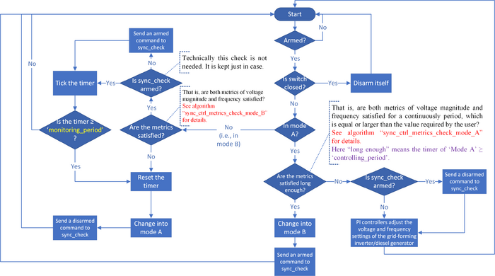

# Spec:sync ctrl

**Source URL:** https://gridlab-d.shoutwiki.com/wiki/Spec:sync_ctrl
# Spec:sync ctrl

Approval item:  When approved remove this tag. 

## Contents

  * 1 Overview
  * 2 Inputs and outputs of related objects
  * 3 Published properties
    * 3.1 Sample
    * 3.2 Public properties
    * 3.3 Hidden properties
  * 4 Member variable definitions
  * 5 Methodology of quasi-steady state time series (QSTS)
  * 6 Methodology of deltamode
    * 6.1 Flowchart
    * 6.2 Pseudocode of modes
      * 6.2.1 Mode A
      * 6.2.2 Mode B
    * 6.3 PI Controllers
  * 7 Validation
  * 8 See also
# 

Overview

The synchronization control capability in GridLAB-D is implemented to adjust the frequency and voltage differences via a controlled generation unit for the synchronization check capability of the [sync_ctrl] object, which performs paralleling for two independent power grids. The controlled generation unit is either a [diesel generator] or a [grid-forming inverter]. This could be used to help with paralleling two separate power systems, or reconnecting a microgrid to the bulk power system. In the simulation, the frequency and voltage magnitude differences are checked. When conditions are satisfied, the [sync_check] object will be armed by the [sync_ctrl] object. Otherwise, the generation unit is controlled for achieving these conditions. 

# 

Inputs and outputs of related objects

The inputs and outputs of the [switch], [sync_check], [sync_ctrl], and controlled generation unit (i.e., [diesel_dg]/[inverter_dyn]) objects are shown in the following figure, together with the dataflow. 

 

# Published properties

The published public and hidden properties are listed in Table 1 and 2, respectively, together with the mapped member variables. The [sync_ctrl] object inherits all standard [Object_(directive)] values as well. The definitions of other member variables, which are not published as properties, are presented in Table 3 of the next section ["Member variable definitions"]. 

## Sample

One sample [sync_ctrl] object defined in the glm file is show as follows. 
    
    
    **object** [sync_ctrl]
    {
        **name** sct_f01f02;
        **flags** DELTAMODE;
    
        **armed** false; //starting as disarmed
    
        **sync_check_object** grid_resyncer; //the [sync_check] object linked to this [sync_ctrl] object
    		
        **controlled_generation_unit** Diesel_1; //the controlled genration unit can be either a DG or INV
        // **controlled_generation_unit** Inverter_1;
    
        //About the modes: 1) 'Mode A' is the controlling mode, in which the PI controllers of the [sync_ctrl] object send commands to the controlled generation unit. 2) In 'Mode B', the [sync_ctrl] object monitors the voltage magnitude and frequency differences, but its PI controllers are not used and there is no signal sent to the controlled generation unit.
        //Details of the modes and control flow are shown in this figure: <http://gridlab-d.shoutwiki.com/wiki/File:Sync_ctrl_flowchart.png>
        **controlling_period** 2; //the user-defined period when both metrics are satisfied and this sync_ctrl object works in mode A
        **monitoring_period** 15; //the user-defined period when this sync_ctrl object keeps on monitoring in mode B, if both metrics are not violated and the switch object is not closed
    
        **frequency_tolerance_ub_hz** -0.7; //the control target is set as (frequency_tolerance_ub_hz + frequency_tolerance_lb_hz)/2
        **frequency_tolerance_lb_hz** -0.1; //the values of frequency_tolerance_ub_hz and frequency_tolerance_lb_hz can be swapped freely, the results will be the same
    
        **pi_freq_kp** -2; //the user-defined proportional gain constant of the PI controller for adjusting the frequency setting
        **pi_freq_ki** -0.2; //the user-defined integral gain constant of the PI controller for adjusting the frequency setting
    
        //Note that the control target of the voltage magnitude difference is set as 0, regardless of the setting of voltage_magnitude_tolerance_pu
        **voltage_magnitude_tolerance_pu** 0.02; //the user-specified tolerance in per unit for the difference in voltage magnitudes for checking the voltage metric
        **pi_volt_mag_kp** -2; //the user-defined proportional gain constant of the PI controller for adjusting the voltage magnitude setting
        **pi_volt_mag_ki** -0.2; //the user-defined integral gain constant of the PI controller for adjusting the voltage magnitude setting
    
        **sct_volt_cv_arm_flag** true; //if set as false, the PI controller for voltage magnitude difference control will be disabled
        **pi_volt_mag_ub_pu** 1.65; //the upper bound of the output signal (e.g., vset) of the voltage controller
        **pi_volt_mag_lb_pu** 0.35; //the lower bound of the output signal (e.g., vset) of the voltage controller
    
        **sct_freq_cv_arm_flag** true; //if set as false, the PI controller for frequency difference control will be disabled
        **pi_freq_ub_pu** 1.0; //the upper bound of the output signal (e.g., Pset) of the frequency controller
        **pi_freq_lb_pu** 0; //the lower bound of the output signal (e.g., Pset) of the frequency controller
    }
    

## Public properties

Table 1 - Published Public Properties and Mapped Member Variables  Property  | Mapped Member Variable  | Data Type  | Unit  | Descriptions   
---|---|---|---|---  
Flag   
armed  | sct_armed_flag  | Boolean  | N/A  | Turns on/off the action functionality: (- `True` \- This object is armed/functional - `False` \- This object is disarmed/disabled)

  
Object   
sync_check_object  | sck_obj_ptr  | Object  | N/A  | The object reference/name of the [sync_check] object, which works with this [sync_ctrl] object   
controlled_generation_unit  | cgu_obj_ptr  | Object  | N/A  | The object reference/name of the controlled generation unit (i.e., a [diesel_dg]/[inverter_dyn] object), which serves as the actuator of the PI controllers of this [sync_ctrl] object   
Tolerance   
frequency_tolerance_ub_Hz  | sct_freq_tol_ub_hz  | Double  | Hz  | The user-specified tolerance in Hz for checking the upper bound of the frequency metric   
frequency_tolerance_lb_Hz  | sct_freq_tol_lb_hz  | Double  | Hz  | The user-specified tolerance in Hz for checking the lower bound of the frequency metric   
voltage_magnitude_tolerance_pu  | sct_volt_mag_tol_pu  | Double  | pu  | The user-specified tolerance in per unit for the difference in voltage magnitudes for checking the voltage metric   
Time   
controlling_period  | pp_t_ctrl_sec  | Double  | sec  | The "controlling_period" is the setting for 'Mode A'. In 'Mode A', the PI controllers adjust the frequency and voltage magnitude. Once the voltage magnitude and frequency differences are small enough for a period, which is equal or longer than the "controlling_period", the [sync_ctrl] object transits to 'Mode B' and its PI controllers are stopped. This is used to ensure the PI controller has reached a stable condition where the [sync_check] could close, and was not just a transient condition of the system that was within range.   
monitoring_period  | pp_t_mon_sec  | Double  | sec  | The "monitoring_period" is the setting for 'Mode B'. In 'Mode B', the [sync_ctrl] checks the voltage magnitude and frequency differences. If they are in the tolerance ranges, [sync_ctrl] does not nothing but keeps waiting for the [switch] object to be closed by the [sync_check]. If they become out of the range, the [sync_ctrl] transits back to 'Mode A', and its PI controllers are reinitialized and start to bring the frequency and voltage magnitude back to the tolerance ranges. This is used to ensure the [sync_check] object executes the switch closure, but serves as a fail safe in case the object encounters any difficulties.   
PI Controller   
pi_freq_kp  | pi_freq_kp  | Double  | pu  | The user-defined proportional gain constant of the PI controller for adjusting the frequency setting   
pi_freq_ki  | pi_freq_ki  | Double  | pu  | The user-defined integral gain constant of the PI controller for adjusting the frequency setting   
pi_freq_ub_pu  | pi_freq_ub_pu  | Double  | pu  | The upper bound of the output (i.e., the control variable 'Pset'/'fset') of the PI controller that adjusts the frequency difference in per unit   
pi_freq_lb_pu  | pi_freq_lb_pu  | Double  | pu  | The lower bound of the output (i.e., the control variable 'Pset'/'fset') of the PI controller that adjusts the frequency difference in per unit   
pi_volt_mag_kp  | pi_volt_mag_kp  | Double  | pu  | The user-defined proportional gain constant of the PI controller for adjusting the voltage magnitude setting   
pi_volt_mag_ki  | pi_volt_mag_ki  | Double  | pu  | The user-defined integral gain constant of the PI controller for adjusting the voltage magnitude setting   
pi_volt_mag_ub_pu  | pi_volt_mag_ub_pu  | Double  | pu  | The upper bound of the output (i.e., the control variable 'Vset') of the PI controller that adjusts the voltage magnitude difference in per unit   
pi_volt_mag_lb_pu  | pi_volt_mag_lb_pu  | Double  | pu  | The lower bound of the output (i.e., the control variable 'Vset') of the PI controller that adjusts the voltage magnitude difference in per unit   
  
## Hidden properties

Table 1 - Published Hidden Properties and Mapped Member Variables  Property  | Mapped Member Variable  | Data Type  | Unit  | Descriptions   
---|---|---|---|---  
Flag & Status   
sct_volt_cv_arm_flag  | sct_volt_cv_arm_flag  | Boolean  | N/A  | Turns on/off the output of the PI controller that adjusts the voltage magnitude difference: 

  * `True` \- The 'Vset' property of the controlled generation unit is set as the output of the PI controller that adjusts the voltage magnitude difference in 'Mode A'
  * `False` \- The 'Vset' property of the controlled generation unit is NOT set as the output of the PI controller that adjusts the voltage magnitude difference in 'Mode A'

  
sct_freq_cv_arm_flag  | sct_freq_cv_arm_flag  | Boolean  | N/A  | Turns on/off the output of the PI controller that adjusts the frequency difference: 

  * `True` \- The 'Pset'/'fset' property of the controlled generation unit is set as the output of the PI controller that adjusts the frequency difference in 'Mode A'
  * `False` \- The 'Pset'/'fset' property of the controlled generation unit is NOT set as the output of the PI controller that adjusts the frequency difference in 'Mode A'

  
mode_status  | mode_status  | Enumeration  | N/A  | Indicates the current working mode status: 

  * `MODE_A` \- This object is working in mode A (i.e., the controlling mode)
  * `MODE_B` \- This object is working in mode B (i.e., the monitoring mode)

  
Signals   
cgu_volt_set_mpv  | cgu_volt_set_mpv  | Double  | pu  | The measured process variable (i.e., the feedback signal) of the PI controller that adjusts the voltage magnitude difference   
cgu_volt_set_cv  | cgu_volt_set_cv  | Double  | pu  | The output of the PI controller that adjusts the voltage magnitude difference (i.e., the control variable, which is denoted as u(t) in usual)   
cgu_freq_set_mpv  | cgu_freq_set_mpv  | Double  | pu  | The measured process variable (i.e., the feedback signal) of the PI controller that adjusts the frequency difference   
cgu_freq_set_cv  | cgu_freq_set_cv  | Double  | pu  | The output of the PI controller that adjusts the frequency difference (i.e., the control variable, which is denoted as u(t) in usual)   
  
# 

Member variable definitions

Some member variables, which are not published as properties, of the [sync_ctrl] class are listed in Table 3. For other member variables, which are not included in Table 3, please look at the source code and related comments. 

Table 3 - Definitions of Some Member Variable  Member variable  | Data Type  | Unit  | Definition   
---|---|---|---  
Flag & Status   
swt_status  | Enumeration  | N/A  | Status of the switch object, which is the parent object of the specified [sync_check] object of this [sync_ctrl] object. Valid states are: 

  * `OPEN` \- The `switch object` is open and no current can flow
  * `CLOSED` \- The `switch object` is closed and conducting

  
sck_armed_status  | Boolean  | N/A  | Action functionality status of the specified [sync_check] object of this [sync_ctrl] object. Valid states are: 

  * `True` \- This [sync_check] object is functional
  * `False` \- This [sync_check] object is disabled

  
Time   
timer_mode_A_sec  | Double  | sec  | The total period (initialized as 0) during which both metrics have been satisfied continuously when this [sync_ctrl] object is in mode A and PI controllers are working   
timer_mode_B_sec  | Double  | sec  | The total period (initialized as 0) during which the both metrics have been satisfied continuously when this [sync_ctrl] object is in mode B and monitoring   
System Info   
sys_nom_freq_hz  | Double  | Hz  | The power system nominal frequency   
  
# 

Methodology of quasi-steady state time series (QSTS)

No explicit functions are performed in the QSTS mode. The [sync_ctrl] will perform all behavior in deltamode, under the assumption the call to deltamode was triggered by either the device arming the [sync_ctrl] object, or by something elsewhere in the system making the adjustments for synchronization to occur. 

# Methodology of deltamode

## Flowchart

The flowchart for [sync_ctrl] in deltamode is shown as follows. In mode A, the [sync_ctrl] adjusts the voltage and frequency settings of the controlled generation unit actively. In mode B, it monitors the voltage magnitudes and frequency and counts a timer, determining to switch to mode A if needed. 

 

## Pseudocode of modes

The pseudocode of two functions that check the metrics in mode A and B, respectively, are shown as follows. 

### Mode A
    
    
    **algorithm** sync_ctrl_metrics_check_mode_A **is**
       **inputs:** _swt_fm_nd_freq_hz_ , _swt_to_nd_freq_hz_ ,
               _swt_fm_nd_volt_ph_a_v_ , _swt_to_nd_volt_ph_a_v_ ,
               _swt_fm_nd_volt_ph_b_v_ , _swt_to_nd_volt_ph_b_v_ ,
               _swt_fm_nd_volt_ph_c_v_ , _swt_to_nd_volt_ph_c_v_ ,
               _norm_volt_v_ , _sct_freq_tol_ub_hz_ , _sct_freq_tol_lb_hz_ , _sct_volt_mag_tol_pu_
       **output:** Flag _metrics_check_flag_ such that _metrics_check_flag_ is true if both metrics are satisfied for an enough period, false otherwise
       
       **//== Frequency**
       _freq_diff_hz_ ← abs(_swt_fm_nd_freq_hz_ - _swt_to_nd_freq_hz_)
       
       **//== Voltage (Phase A)**
       _volt_mag_diff_ph_a_v_ ← abs(abs(_swt_fm_nd_volt_ph_a_v_) - abs(_swt_to_nd_volt_ph_a_v_))
       _volt_mag_diff_ph_a_pu_ ← _volt_mag_diff_ph_a_v_ / _norm_volt_v_
       
       **//== Voltage (Phase B)**
       _volt_mag_diff_ph_b_v_ ← abs(abs(_swt_fm_nd_volt_ph_b_v_) - abs(_swt_to_nd_volt_ph_b_v_))
       _volt_mag_diff_ph_b_pu_ ← _volt_mag_diff_ph_b_v_ / _norm_volt_v_
       
       **//== Voltage (Phase C)**
       _volt_mag_diff_ph_c_v_ ← abs(abs(_swt_fm_nd_volt_ph_c_v_) - abs(_swt_to_nd_volt_ph_c_v_))
       _volt_mag_diff_ph_c_pu_ ← _volt_mag_diff_ph_c_v_ / _norm_volt_v_
       
       **//== Check**
       **if** (_freq_diff_hz_ <= _sct_freq_tol_ub_hz_) **and** (_freq_diff_hz_ >= _sct_freq_tol_lb_hz_) **and** 
                (_volt_mag_diff_ph_a_pu_ <= _sct_volt_mag_tol_pu_) **and**
                (_volt_mag_diff_ph_b_pu_ <= _sct_volt_mag_tol_pu_) **and**
                (_volt_mag_diff_ph_c_pu_ <= _sct_volt_mag_tol_pu_) **do**
           _timer_mode_A_sec_ ← _timer_mode_A_sec_ + _dt_dm_sec_ //dt_dm_sec is a local variable that indicates the current deltamode timestep
       **else do**
           _timer_mode_A_sec_ ← 0
       
       **if** (_timer_mode_A_sec_ >= _pp_t_ctrl_sec_) **do**
           _metrics_check_flag_ ← true
       **else do**
           _metrics_check_flag_ ← false
       
       **return** _metrics_check_flag_
    

### Mode B
    
    
    **algorithm** sync_ctrl_metrics_check_mode_B **is**
       **inputs:** _swt_fm_nd_freq_hz_ , _swt_to_nd_freq_hz_ ,
               _swt_fm_nd_volt_ph_a_v_ , _swt_to_nd_volt_ph_a_v_ ,
               _swt_fm_nd_volt_ph_b_v_ , _swt_to_nd_volt_ph_b_v_ ,
               _swt_fm_nd_volt_ph_c_v_ , _swt_to_nd_volt_ph_c_v_ ,
               _norm_volt_v_ , _sct_freq_tol_ub_hz_ , _sct_freq_tol_lb_hz_ , _sct_volt_mag_tol_pu_
       **output:** Flag _metrics_check_flag_ such that _metrics_check_flag_ is true if both metrics are satisfied within this timestep, false otherwise
       
       **//== Frequency**
       _freq_diff_hz_ ← abs(_swt_fm_nd_freq_hz_ - _swt_to_nd_freq_hz_)
       
       **//== Voltage (Phase A)**
       _volt_mag_diff_ph_a_v_ ← abs(abs(_swt_fm_nd_volt_ph_a_v_) - abs(_swt_to_nd_volt_ph_a_v_))
       _volt_mag_diff_ph_a_pu_ ← _volt_mag_diff_ph_a_v_ / _norm_volt_v_
       
       **//== Voltage (Phase B)**
       _volt_mag_diff_ph_b_v_ ← abs(abs(_swt_fm_nd_volt_ph_b_v_) - abs(_swt_to_nd_volt_ph_b_v_))
       _volt_mag_diff_ph_b_pu_ ← _volt_mag_diff_ph_b_v_ / _norm_volt_v_
       
       **//== Voltage (Phase C)**
       _volt_mag_diff_ph_c_v_ ← abs(abs(_swt_fm_nd_volt_ph_c_v_) - abs(_swt_to_nd_volt_ph_c_v_))
       _volt_mag_diff_ph_c_pu_ ← _volt_mag_diff_ph_c_v_ / _norm_volt_v_
       
       **//== Check**
       **if** (_freq_diff_hz_ <= _sct_freq_tol_ub_hz_) **and** (_freq_diff_hz_ >= _sct_freq_tol_lb_hz_) **and** 
                (_volt_mag_diff_ph_a_pu_ <= _sct_volt_mag_tol_pu_) **and**
                (_volt_mag_diff_ph_b_pu_ <= _sct_volt_mag_tol_pu_) **and**
                (_volt_mag_diff_ph_c_pu_ <= _sct_volt_mag_tol_pu_) **do**
           _metrics_check_flag_ ← true
       **else do**
           _metrics_check_flag_ ← false
       
       **return** _metrics_check_flag_
    

## PI Controllers

There are two PI controllers that adjust the respective voltage magnitude and frequency settings of the controlled generation unit. The desired set-point of that frequency PI controller is calculated by _(frequency_tolerance_ub_Hz + frequency_tolerance_lb_Hz)/2_. The other PI controller that adjusts the voltage magnitude difference uses the set-point of 0, which cannot be modified by the user at this stage. 

# Validation

This subsection provides an outline on how the [sync_ctrl] object will be tested to ensure its functionality. The current plan is to use two 4-node test systems interconnected through a [switch] object, which is the parent of a [sync_check] object. The switch object is initially open and disarmed. The [sync_check] object is specified as a property of the [sync_ctrl] object, which is initially disarmed as well. 

The frequency and voltage values measured at the 'from' and 'to' nodes of the [switch] object are initialized in different values. The deviations must be larger than the user defined tolerances. The frequency and voltage of the 'from'/'to' node of the parent [switch] object of the [sync_check] object are manipulated by the [sync_ctrl] object via the controlled generation unit (i.e., a diesel generator or a grid-forming inverter) towards the measurements of the 'from'/'to' node. The controlled generation unit is specified as a property of the [sync_ctrl] object. It is physically in the same island with the 'from'/'to' node. Once the deviations are both within the tolerance longer than the user defined period, the [sync_ctrl] object transits from 'Mode A' to 'Mode B' and sends an 'armed' command to the [sync_check] object. This sample use case will be included in the autotest for the [sync_ctrl] object. 

# See also

  * [Requirements of sync_ctrl]
  * [Implementation of sync_ctrl]
  * [Implementation of sync_check]
